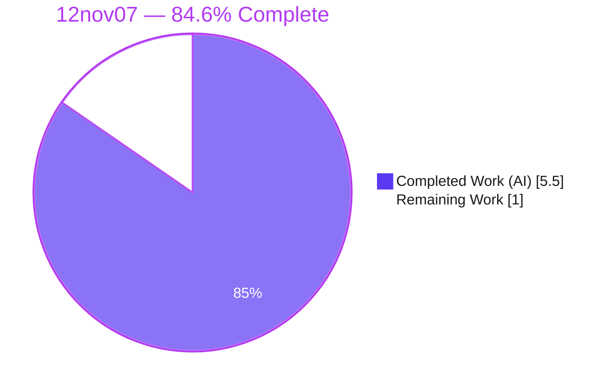
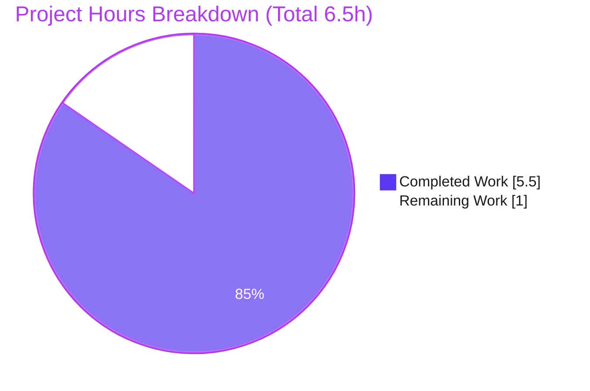
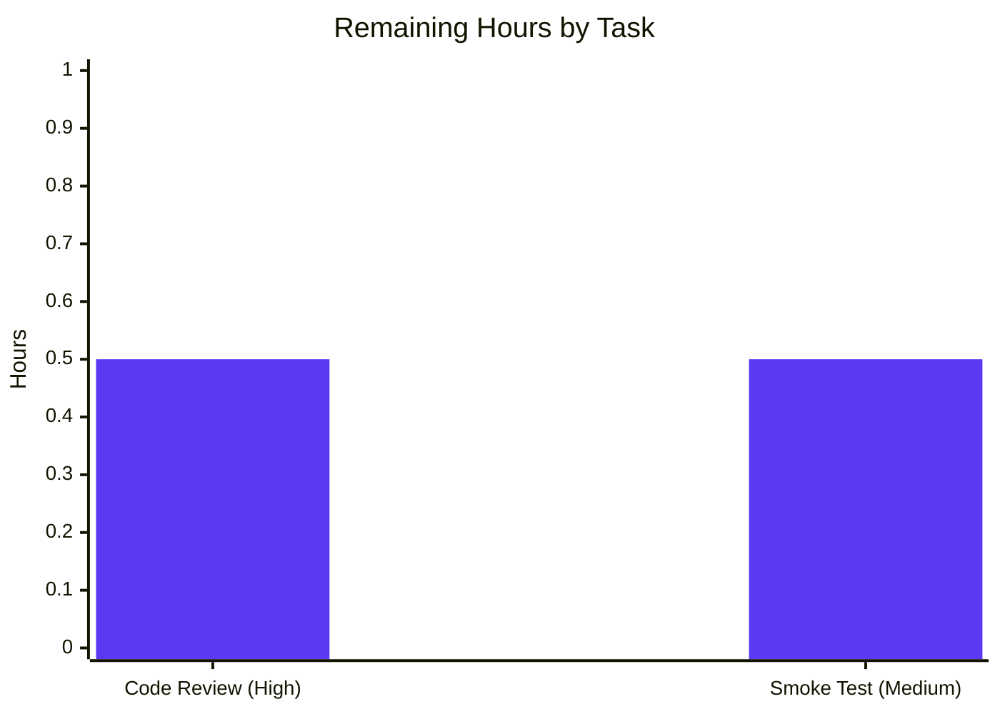

# Blitzy Project Guide — `12nov07` Node.js + Express Tutorial Service

---

## 1. Executive Summary

### 1.1 Project Overview

The `12nov07` project bootstraps a greenfield repository (previously containing only `README.md`) into a minimal **Node.js + Express.js** HTTP service. The objective was to add Express to the tutorial and expose two `GET` endpoints: `/hello` returning the literal `Hello world` (the documented baseline, created here) and `/good-evening` returning the literal `Good evening` (the requested new feature). Target users are developers learning Express fundamentals. Technical scope is intentionally tiny: a `package.json` declaring `express ^5.2.1`, a 24-line `server.js`, a `.gitignore`, and a committed lockfile for reproducible installs. The service is a headless, plain-text HTTP application — no UI, database, authentication, or persistence — running on CommonJS and Node.js ≥ 18.

### 1.2 Completion Status



| Metric | Value |
|--------|-------|
| **Total Hours** | 6.5 |
| **Completed Hours (AI + Manual)** | 5.5 (5.5 AI + 0.0 Manual) |
| **Remaining Hours** | 1.0 |
| **Percent Complete** | **84.6%** |

> Completion % = Completed Hours ÷ Total Hours = 5.5 ÷ 6.5 = **84.6%** (AAP-scoped, PA1 methodology).

### 1.3 Key Accomplishments

- ✅ **Express 5.2.1** declared as the project's first production dependency in a new `package.json`.
- ✅ **`GET /hello`** implemented — returns `Hello world` with HTTP `200` (11 bytes, byte-exact).
- ✅ **`GET /good-evening`** implemented — returns `Good evening` with HTTP `200` (12 bytes, byte-exact) — *the requested new feature*.
- ✅ **Configurable listener** — binds `PORT` (default `3000`), verified with `PORT=4000` override.
- ✅ **Reproducible installs** — committed `package-lock.json` (lockfileVersion 3); `npm ci` adds 67 packages with **0 vulnerabilities**.
- ✅ **Standard hygiene** — `.gitignore` excludes `node_modules/`.
- ✅ **All 5 validation gates passed** — dependency, static/compilation, unit (vacuous by design), runtime, and in-scope file validation; 10/10 runtime checks green.
- ✅ **Scope discipline** — `README.md` left unchanged; no out-of-scope code (no tests/auth/TLS/persistence) introduced.

### 1.4 Critical Unresolved Issues

| Issue | Impact | Owner | ETA |
|-------|--------|-------|-----|
| None — all AAP deliverables are implemented, committed, and validated end-to-end | None | — | — |

> There are **no critical unresolved issues**. The implementation compiles, runs, and passes every functional acceptance check defined by the AAP.

### 1.5 Access Issues

| System/Resource | Type of Access | Issue Description | Resolution Status | Owner |
|-----------------|----------------|-------------------|-------------------|-------|
| — | — | No access issues identified | N/A | — |

> **No access issues identified.** The project is self-contained, requires no external services, credentials, or third-party API keys, and the public npm registry resolves `express` cleanly.

### 1.6 Recommended Next Steps

1. **[High]** Review and approve the pull request — inspect `server.js` and `package.json` against the AAP, then merge. *(~0.5h)*
2. **[Medium]** Run a clean-environment smoke test — fresh clone → `npm ci` → `npm start` → `curl` both endpoints. *(~0.5h)*
3. **[Medium]** Tag a baseline release for the tutorial (folded into sign-off; no additional hours).
4. **[Low]** *(Optional — out of AAP scope)* Consider future enhancements only if evolving beyond a tutorial: automated tests, a `/health` endpoint, structured logging, TLS termination, or CI/CD. These are explicitly **not** required by this AAP and are **not** counted in the completion figure.

---

## 2. Project Hours Breakdown

### 2.1 Completed Work Detail

| Component | Hours | Description |
|-----------|-------|-------------|
| `package.json` manifest *(GAP-1)* | 0.5 | Project identity, `main`, `start` script, `type: commonjs`, license, description. |
| Express dependency + install + lockfile *(GAP-2)* | 1.0 | Declared `express ^5.2.1`; `npm install` resolved 67 packages; committed `package-lock.json` (lockfileVersion 3) for reproducible installs. |
| `server.js` bootstrap *(GAP-3)* | 1.0 | `require('express')`, app instantiation, configurable `PORT` (default 3000), `app.listen` with startup log line. |
| `GET /hello` handler *(GAP-4)* | 0.5 | Baseline greeting returning the literal `Hello world`. |
| `GET /good-evening` handler *(GAP-4)* | 0.5 | New endpoint returning the literal `Good evening` — the requested feature. |
| `.gitignore` | 0.5 | Excludes `node_modules/` from version control (Node hygiene). |
| Runtime validation & verification *(§0.6)* | 1.5 | `npm ci`/`npm start`, both endpoints, negative paths (404), `PORT` override, byte-for-byte body checks; 10/10 consolidated checks. |
| **Total Completed** | **5.5** | |

### 2.2 Remaining Work Detail

| Category | Hours | Priority |
|----------|-------|----------|
| Code review & PR sign-off (review against AAP, approve, merge, tag) | 0.5 | High |
| Clean-environment smoke verification (fresh clone, `npm ci`, `npm start`, `curl`) | 0.5 | Medium |
| **Total Remaining** | **1.0** | |

> Every remaining item is **path-to-production human sign-off**. No AAP-out-of-scope work (tests, CI/CD, auth, TLS, persistence) is included, per AAP §0.5.2.

### 2.3 Hours Reconciliation & Completion Formula

| Quantity | Hours | Source |
|----------|-------|--------|
| Completed (Section 2.1 total) | 5.5 | Sum of completed components |
| Remaining (Section 2.2 total) | 1.0 | Sum of path-to-production tasks |
| **Total Project Hours** | **6.5** | 5.5 + 1.0 |

**Completion % = 5.5 ÷ 6.5 = 84.6%.**

Cross-section integrity: Remaining = **1.0h** is identical in Sections 1.2, 2.2, and 7. Section 2.1 (5.5h) + Section 2.2 (1.0h) = **6.5h** Total (Section 1.2).

---

## 3. Test Results

All entries below originate exclusively from Blitzy's autonomous validation logs for this project and were independently reproduced during this assessment. The totals reconcile to the validator's headline **"10/10 checks PASS, 0 FAIL"** (6 functional + 3 static + 1 dependency).

| Test Category | Framework | Total Tests | Passed | Failed | Coverage % | Notes |
|---------------|-----------|-------------|--------|--------|------------|-------|
| Functional / Runtime Acceptance | `curl` + manual (Blitzy validation) | 6 | 6 | 0 | 100% (2/2 endpoints + negatives) | Startup log; `/hello`→`Hello world` 200/11B; `/good-evening`→`Good evening` 200/12B; `/unknown`→404; `POST /hello`→404; `PORT=4000` override |
| Static / Compilation | `node --check`, JSON parse | 3 | 3 | 0 | N/A | `server.js` syntax OK; `package.json` & `package-lock.json` valid JSON |
| Dependency / Security Audit | `npm ci` / `npm audit` | 1 | 1 | 0 | N/A | 67 packages added, 68 audited, **0 vulnerabilities** |
| Unit / Integration (automated) | None — excluded by AAP §0.5.2 | 0 | 0 | 0 | N/A | No test framework by design; functional acceptance is the defined criterion |
| **Totals** | | **10** | **10** | **0** | — | Matches validator "10/10 PASS" |

> **Integrity note:** No automated unit/integration suite exists because the AAP explicitly forbids adding test frameworks (§0.5.2) and confirms none exists (§0.6.2). The designated acceptance criterion is the functional `curl` check set, which passes 100%.

---

## 4. Runtime Validation & UI Verification

**Runtime health** (independently reproduced on Node v22.22.2):

- ✅ **Operational** — Server starts cleanly: logs exactly `Server listening on http://localhost:3000` (single line, no errors).
- ✅ **Operational** — `GET /hello` → body `Hello world`, HTTP `200`, Content-Length 11.
- ✅ **Operational** — `GET /good-evening` → body `Good evening`, HTTP `200`, Content-Length 12.
- ✅ **Operational** — `GET /unknown` → HTTP `404` (Express default handler; routes correctly scoped).
- ✅ **Operational** — `POST /hello` → HTTP `404` (method correctly scoped to `GET`).
- ✅ **Operational** — `PORT=4000 npm start` → listens on 4000; both endpoints respond correctly (port configurability confirmed).
- ✅ **Operational** — Clean shutdown via PID termination; no lingering processes; no working-tree drift.

**API integration:** No external service integrations exist — the service is fully self-contained, so there are no upstream/downstream dependencies to validate.

**UI verification:** ⚠ **Not applicable.** The deliverable is a headless plain-text HTTP service with no graphical interface, rendered views, or front-end assets (AAP §0.4.4; Tech Spec §7.1). No UI verification is required or possible.

---

## 5. Compliance & Quality Review

Cross-mapping of AAP deliverables and governing principles to validation status. **Fixes applied during autonomous validation: none** — the implementation was already complete and correct; validation confirmed rather than repaired it.

| AAP Requirement / Principle | Benchmark | Status | Progress | Notes |
|------------------------------|-----------|--------|----------|-------|
| GAP-1 — Dependency manifest | `package.json` created, valid | ✅ Pass | 100% | `name`, `main`, `start`, `type: commonjs` |
| GAP-2 — Express dependency | `express ^5.2.1` resolved & installed | ✅ Pass | 100% | 67 pkgs, **0 vulnerabilities** |
| GAP-3 — HTTP listener | Binds configurable port | ✅ Pass | 100% | `PORT` default 3000; override verified |
| GAP-4 — `GET /hello` | Returns `Hello world`, 200 | ✅ Pass | 100% | Byte-exact (11B) |
| GAP-4 — `GET /good-evening` | Returns `Good evening`, 200 | ✅ Pass | 100% | Byte-exact (12B) |
| `.gitignore` hygiene | `node_modules/` ignored | ✅ Pass | 100% | Confirmed |
| Reproducible install | Committed lockfile | ✅ Pass | 100% | lockfileVersion 3; `npm ci` deterministic |
| `README.md` untouched | Constraint honored | ✅ Pass | 100% | Still `# 12nov07` |
| Idiomatic Express 5 | No deprecated APIs | ✅ Pass | 100% | `app.get` + `res.send`; no `res.send(status, body)` |
| Scope discipline | No out-of-scope additions | ✅ Pass | 100% | No tests/auth/TLS/persistence/logging beyond startup line |
| Additive-only changes | No edits/deletes to existing files | ✅ Pass | 100% | 4 files created, 0 modified/deleted |

**Outstanding compliance items:** Human code review and clean-environment sign-off (Section 2.2) — procedural, non-blocking.

---

## 6. Risk Assessment

All identified risks are **Low** severity. The majority are explicit AAP scope exclusions (accepted-by-design tutorial decisions), not defects. Security posture is clean: `npm audit` reports **0 vulnerabilities**, no hardcoded secrets (only `process.env.PORT`), and an exact-pinned lockfile.

| Risk | Category | Severity | Probability | Mitigation | Status |
|------|----------|----------|-------------|------------|--------|
| No automated test suite → future regressions undetected | Technical | Low | Low | AAP forbids tests; `curl` acceptance is the criterion; add Jest+Supertest if project grows | Accepted (by design) |
| Express 5 (recent major) ecosystem maturity | Technical | Low | Low | Pinned 5.2.1 via lockfile; 0 vulns; validated on Node 22 | Mitigated |
| No custom error-handling middleware | Technical | Low | Low | Static-string endpoints have no failure modes; default 404 verified | Accepted (by design) |
| No authentication/authorization | Security | Low | Low | AAP excludes auth; public static greetings, no sensitive data | Accepted (by design) |
| No HTTPS/TLS | Security | Low | Low | AAP excludes TLS; local tutorial; terminate TLS at proxy if deployed | Accepted (by design) |
| Supply chain (67 transitive packages) | Security | Low | Low | `npm audit` 0 vulns; lockfile pins exact versions; `npm ci` reproducible | Mitigated |
| Listener binds all interfaces (default) | Security | Low | Low | Fine for local tutorial; bind `127.0.0.1`/firewall if exposed | Accepted (tutorial scope) |
| No health-check endpoint | Operational | Low | Low | `/hello` usable as liveness probe; add `/health` if orchestrated | Accepted (by design) |
| Logging limited to startup line | Operational | Low | Low | AAP excludes logging/metrics beyond startup line | Accepted (by design) |
| No process manager / restart-on-crash | Operational | Low | Low | Use pm2/systemd/container restart policy if deployed | Accepted (tutorial scope) |
| No external integrations | Integration | Low (info) | N/A | Self-contained; no DB/API/credentials | N/A (none) |
| Port 3000 conflict in shared env | Integration | Low | Low | `PORT` override verified (`PORT=4000` tested) | Mitigated |

---

## 7. Visual Project Status

**Project hours breakdown** (Completed = Dark Blue `#5B39F3`, Remaining = White `#FFFFFF`):



**Remaining hours by task** (from Section 2.2):



> **Integrity check:** "Remaining Work" = **1.0h** equals Section 1.2 Remaining Hours and the Section 2.2 "Hours" total (0.5 + 0.5).

---

## 8. Summary & Recommendations

**Achievements.** The `12nov07` tutorial has been delivered exactly to the AAP: a greenfield repository now hosts a working Express 5 service exposing `GET /hello` (`Hello world`) and the newly requested `GET /good-evening` (`Good evening`). Both endpoints return byte-exact bodies with HTTP `200`, negative paths correctly return `404`, the listener is port-configurable, and installs are reproducible from a committed lockfile with **0 vulnerabilities**. All five autonomous validation gates passed, and the work was independently reproduced during this assessment.

**Completion.** The project is **84.6% complete** (5.5 of 6.5 hours). All autonomous, AAP-scoped engineering and verification work is finished and validated. The remaining **1.0 hour** is entirely **path-to-production human sign-off**: code review/approval and a clean-environment smoke test.

**Remaining gaps & critical path.** There are no blocking defects. The critical path to production is short: (1) human code review and PR approval, (2) clean-environment smoke verification, (3) merge and tag. Optional enhancements (tests, `/health`, logging, TLS, CI/CD) are intentionally out of scope and should be undertaken only if the project evolves beyond a tutorial.

**Success metrics.** Functional acceptance is the sole defined criterion (AAP §0.6.2) and is met 100%: both endpoints return the exact required strings and status codes; negative paths behave correctly; the server starts cleanly on a configurable port.

**Production readiness assessment.** For its stated purpose — a runnable Node.js + Express tutorial — the implementation is **production-ready pending human sign-off**. Confidence is **High**: the scope is small, fully specified, and every requirement is backed by reproduced evidence.

---

## 9. Development Guide

> All commands below were executed and verified in this environment (Node v22.22.2, npm 10.9.7). Run them from the repository root.

### 9.1 System Prerequisites

- **Node.js ≥ 18** (Express 5 requirement). Validated on **v22.22.2**.
- **npm** (bundled with Node). Validated on **10.9.7**.
- **curl** (or a browser) for endpoint verification.
- Any OS (Linux/macOS/Windows). No database, cache, or external service required.

```bash
node --version   # expect v18+ (validated v22.22.2)
npm --version    # validated 10.9.7
```

### 9.2 Environment Setup

No `.env` file is required. The only configuration is the optional `PORT` variable (defaults to `3000`):

```bash
# Optional — override the listen port (default 3000)
export PORT=3000
```

### 9.3 Dependency Installation

```bash
# Reproducible install from the committed lockfile (recommended)
npm ci
# → added 67 packages, and audited 68 packages
# → found 0 vulnerabilities

# Alternative (updates lockfile if needed)
npm install
```

`node_modules/` is git-ignored and regenerated by the install step.

### 9.4 Application Startup

```bash
# Start on the default port (3000)
npm start
# → Server listening on http://localhost:3000

# Equivalent direct invocation
node server.js

# Start on a custom port
PORT=4000 npm start
# → Server listening on http://localhost:4000
```

### 9.5 Verification Steps

With the server running:

```bash
curl -s -w "\n%{http_code}\n" http://localhost:3000/hello
# → Hello world
# → 200

curl -s -w "\n%{http_code}\n" http://localhost:3000/good-evening
# → Good evening
# → 200

# Negative paths (both expected to be 404)
curl -s -o /dev/null -w "%{http_code}\n" http://localhost:3000/unknown   # → 404
curl -s -o /dev/null -w "%{http_code}\n" -X POST http://localhost:3000/hello   # → 404
```

### 9.6 Example Usage

```bash
$ curl http://localhost:3000/hello
Hello world
$ curl http://localhost:3000/good-evening
Good evening
```

### 9.7 Stopping the Server

```bash
# Foreground: press Ctrl+C
# Background / by port:
lsof -ti :3000 | xargs kill
```

### 9.8 Troubleshooting

| Symptom | Cause | Resolution |
|---------|-------|------------|
| `EADDRINUSE: address already in use :::3000` | Port 3000 occupied | Start on another port: `PORT=4000 npm start` |
| `Error: Cannot find module 'express'` | Dependencies not installed | Run `npm ci` (or `npm install`) first |
| `SyntaxError` / unexpected token on start | Node version too old | Install Node.js ≥ 18 |
| Endpoint returns 404 unexpectedly | Wrong path/method | Use `GET /hello` or `GET /good-evening` exactly (case-sensitive) |
| No startup log appears | Server failed to bind | Check the terminal for errors; confirm the port is free |

---

## 10. Appendices

### A. Command Reference

| Command | Purpose |
|---------|---------|
| `npm ci` | Reproducible install from `package-lock.json` (67 packages, 0 vulnerabilities) |
| `npm install` | Install dependencies (may update lockfile) |
| `npm start` | Start the server (`node server.js`) |
| `node server.js` | Start the server directly |
| `PORT=<n> npm start` | Start on a custom port |
| `node --check server.js` | Syntax-check without executing |
| `npm ls --depth=0` | Show the direct dependency (`express@5.2.1`) |
| `npm audit` | Security audit (0 vulnerabilities) |
| `curl http://localhost:3000/hello` | Exercise the baseline endpoint |
| `curl http://localhost:3000/good-evening` | Exercise the new endpoint |

### B. Port Reference

| Port | Service | Configurable | Default |
|------|---------|--------------|---------|
| 3000 | Express HTTP listener | Yes — via `PORT` env var | Yes |

### C. Key File Locations

| File | Role |
|------|------|
| `server.js` | Express application entry point (24 lines): require @L3, app @L6, `PORT` @L9, `GET /hello` @L12–14, `GET /good-evening` @L17–19, `app.listen` @L22–24 |
| `package.json` | Manifest — `express ^5.2.1`, `type: commonjs`, `start` script |
| `package-lock.json` | Pinned dependency tree (lockfileVersion 3); committed |
| `.gitignore` | Excludes `node_modules/` |
| `README.md` | Project title marker (`# 12nov07`); unchanged per AAP |

### D. Technology Versions

| Technology | Version | Notes |
|------------|---------|-------|
| Node.js | v22.22.2 | Any ≥ 18 supported (Express 5 requirement); no `engines` pin |
| npm | 10.9.7 | Bundled with Node |
| Express | 5.2.1 | Resolved from `^5.2.1`; first production dependency |
| Module system | CommonJS | `"type": "commonjs"` |
| Lockfile | lockfileVersion 3 | Reproducible installs |

### E. Environment Variable Reference

| Variable | Required | Default | Purpose |
|----------|----------|---------|---------|
| `PORT` | No | `3000` | TCP port for the HTTP listener |

### F. Developer Tools Guide

- **Run / debug locally:** `npm start`, then exercise endpoints with `curl` or a browser at `http://localhost:3000`.
- **Static check:** `node --check server.js` (no build/transpile step — plain CommonJS).
- **Dependency inspection:** `npm ls --depth=0`, `npm audit`.
- **Version control:** standard Git; only the 5 in-scope files are tracked. `node_modules/` and the agent `blitzy/` evidence directory are untracked/ignored.
- **No build pipeline, bundler, linter, or test runner is configured** (out of scope per the AAP).

### G. Glossary

| Term | Definition |
|------|------------|
| **AAP** | Agent Action Plan — the authoritative specification of project scope and deliverables |
| **Greenfield** | A project started from scratch with no pre-existing application code |
| **GAP-1…4** | The four capability gaps the AAP closes: manifest, Express dependency, HTTP listener, route handlers |
| **CommonJS** | Node.js module system using `require()` / `module.exports` |
| **Lockfile** | `package-lock.json` pinning exact dependency versions for reproducible installs |
| **Path-to-production** | Standard activities (review, smoke test, merge) required to ship validated deliverables |
| **Byte-exact** | Response body matches the required literal string exactly, including case and spacing |

---

*Generated by the Blitzy Platform. Completion percentage (84.6%) reflects AAP-scoped and path-to-production work only.*