# Technical Specification

# 1. Introduction

## 1.1 EXECUTIVE SUMMARY

### 1.1.1 Project Overview

The `12nov07` project is a greenfield Node.js tutorial application designed to demonstrate the minimum viable pattern for delivering an HTTP service on the Node.js runtime. The repository, identified by the canonical name declared in its `README.md` file, is being created from an entirely empty state with no pre-existing source code, configuration, or scaffolding. The single deliverable is one HTTP endpoint, served at the path `/hello`, which returns the literal string `Hello world` to any calling HTTP client.

### 1.1.2 Core Business Problem

The project addresses an educational and instructional need rather than a commercial or operational one. It serves as a teaching artifact that establishes the foundational pattern for Node.js HTTP services, providing learners with a verifiable, runnable reference point from which more sophisticated applications can be progressively constructed. By isolating a single concern—responding to one HTTP request with one fixed payload—the project removes incidental complexity and exposes only the essential mechanics of a Node.js HTTP server.

### 1.1.3 Key Stakeholders and Users

| Stakeholder | Role | Interaction Mode |
|---|---|---|
| HTTP Client | Primary consumer | Issues `GET /hello` request and receives the response |
| Developer / Learner | Tutorial reader | Reads, runs, and extends the project locally |
| Instructor / Author | Content producer | Maintains the tutorial as a teaching reference |

### 1.1.4 Expected Business Impact and Value Proposition

The value delivered by `12nov07` is pedagogical clarity. By providing a complete yet minimal working example, the project lowers the cognitive barrier for newcomers to Node.js HTTP development and serves as a stable foundation for incremental learning exercises. The project does not claim, and is not intended to deliver, commercial, operational, or production business value. Its impact is measured solely in instructional utility.

---

## 1.2 SYSTEM OVERVIEW

### 1.2.1 Project Context

#### Business Context and Market Positioning

The project occupies the introductory tier of Node.js learning content. It is not positioned as a competitor to any production framework, hosted service, or commercial offering. Its scope is intentionally narrow: a single endpoint, a single response, and no configuration ceremony beyond what is strictly required to start the server.

#### Current System Limitations

There is no predecessor system. The repository in its initial state contains only a `README.md` file holding the single line `# 12nov07`, with no implementation files, configuration files, dependency manifests, or directory structure present. Accordingly, "current system limitations" do not apply to this engagement—the work begins from a clean slate, and no migration, refactoring, or backward-compatibility concerns are in play.

#### Integration with Existing Enterprise Landscape

No integrations with external systems, internal enterprise services, identity providers, message brokers, or data stores are required or contemplated. The application will run as a standalone Node.js process. No declared dependencies on enterprise infrastructure exist in the repository or in the user-specified requirements.

### 1.2.2 High-Level Description

#### Primary System Capabilities

The system exposes exactly one capability:

| Capability | HTTP Method | Path | Response Body |
|---|---|---|---|
| Greeting endpoint | GET | `/hello` | `Hello world` |

No additional capabilities are in scope for this specification.

#### Major System Components

Once implemented, the system will consist of two logical components:

| Component | Responsibility | Provided By |
|---|---|---|
| HTTP Listener | Bind to a port and accept incoming HTTP requests | Node.js runtime or selected HTTP framework |
| Route Handler | Map `GET /hello` to the `Hello world` response | Single application-level handler function |

#### Core Technical Approach

The application will run on the Node.js JavaScript runtime and will expose its functionality via the HTTP protocol. The specific HTTP layer—whether the native `http` module, Express, Fastify, Koa, or another framework—is a design decision intentionally deferred to subsequent sections of this specification. The Introduction makes no presumption about that choice, as the user requirements specify only "Node.js" without naming a framework.

### 1.2.3 Success Criteria

#### Measurable Objectives

| Objective | Measurement Method | Acceptance Threshold |
|---|---|---|
| Endpoint reachability | HTTP request issued against `/hello` | Response received from the server |
| Response correctness | Inspection of response body | Body equals the exact string `Hello world` |
| Runtime compatibility | Application start on Node.js | Process starts without error |

#### Critical Success Factors

The success of the project hinges on its simplicity. The critical success factors are: (a) the application can be started with minimal setup; (b) the `/hello` endpoint responds correctly on first invocation; and (c) the resulting code is sufficiently readable to serve as an instructional reference.

#### Key Performance Indicators

The user-specified requirements do not declare any KPIs, service-level objectives, latency targets, or throughput thresholds. In keeping with the tutorial nature of the project, performance characteristics beyond functional correctness are explicitly not measured at this stage and are deferred to any future, production-oriented derivative work.

---

## 1.3 SCOPE

### 1.3.1 In-Scope Elements

#### Core Features and Functionalities

The following items are explicitly included in the scope of this project. Each item is traceable to the user-specified requirement.

| Feature | Description | Source of Requirement |
|---|---|---|
| Single HTTP endpoint | `GET /hello` route is implemented | User specification |
| Static response payload | Endpoint returns the literal string `Hello world` | User specification |
| Node.js runtime | Application runs on the Node.js platform | User specification |
| HTTP transport | Service is exposed over the HTTP protocol | User specification |

#### Primary User Workflow

The system supports exactly one workflow, illustrated below.

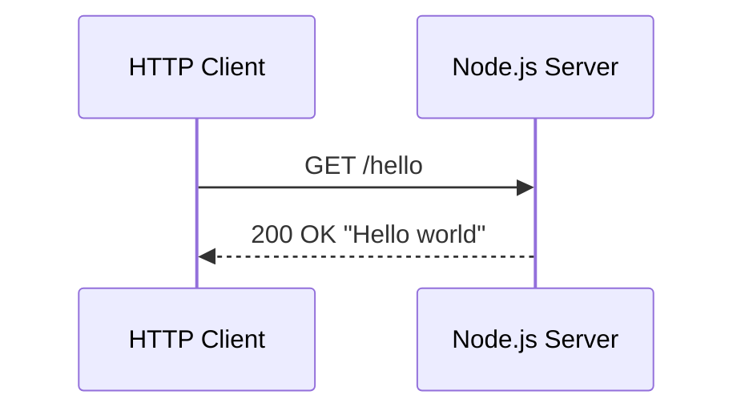

#### Essential Integrations

No third-party integrations are essential to the scope. The endpoint produces its response from a hard-coded string literal and requires no upstream data source, downstream callback, or external service contract.

#### Key Technical Requirements

| Requirement | Value |
|---|---|
| Runtime platform | Node.js |
| Application protocol | HTTP |
| Endpoint count | One (1) |
| Endpoint path | `/hello` |
| Response body | `Hello world` |

### 1.3.2 Implementation Boundaries

#### System Boundaries

The system boundary is a single Node.js process that owns a single HTTP route. Nothing outside that process—operating-system services, network infrastructure, browser front-ends, or third-party APIs—falls within the implementation boundary.

#### User Groups Covered

The application serves any HTTP client capable of issuing a GET request. No user groups are differentiated, no authentication is performed, and no role-based access controls are defined. The endpoint is intended to be reachable by an unauthenticated, anonymous caller.

#### Geographic and Market Coverage

No geographic restrictions, regional deployments, or market segmentations are specified. The default expectation, given the tutorial nature of the project, is local execution on the developer's own machine.

#### Data Domains Included

The project includes no data domains in the conventional sense. The response is a fixed literal string with no persistent state, no database tables, no user records, and no business entities.

### 1.3.3 Out-of-Scope Elements

The following items are explicitly excluded from the project. They are enumerated here to prevent scope creep and to make explicit the boundary of work undertaken.

#### Excluded Features and Capabilities

| Category | Excluded Item |
|---|---|
| API surface | Any endpoint other than `GET /hello` |
| Security | Authentication, authorization, HTTPS/TLS |
| Persistence | Databases, file storage, in-memory caches |
| Observability | Logging, metrics, distributed tracing |
| Operations | Containerization, CI/CD pipelines, deployment automation |
| Front-end | UI, static asset serving, templating engines |
| Reliability | Rate limiting, retries, circuit breakers |
| Internationalization | Multi-language responses; response is fixed English |
| Validation | Request validation, schema enforcement |
| Testing | Automated test suites or test frameworks |

#### Future Phase Considerations

Any extension of the application—additional endpoints, dynamic data, persistence, authentication, or production deployment—constitutes a future phase and is not part of the current specification. Such extensions are anticipated as natural learning exercises that build upon the foundation established here, but are explicitly outside the present scope.

#### Integration Points Not Covered

No external system integrations are addressed by this specification. This includes, but is not limited to, identity providers, payment systems, message queues, third-party APIs, and enterprise service buses. The application will not communicate with any process other than the HTTP client that calls it.

#### Unsupported Use Cases

The following use cases are explicitly unsupported by the project as scoped:

| Unsupported Use Case | Reason for Exclusion |
|---|---|
| Production traffic | Project is a tutorial, not a production-grade service |
| Multi-tenant access | No user model or tenant isolation is defined |
| Dynamic content generation | Response is a hard-coded literal |
| Cross-origin client scenarios | CORS handling is not specified |
| High-availability deployment | No clustering or load balancing is in scope |

---

## 1.4 REFERENCES

### 1.4.1 Files Examined

- `README.md` — The sole file in the repository at the time of specification authoring. It contains a single line, `# 12nov07`, which establishes the canonical project name and confirms the greenfield state of the codebase.

### 1.4.2 Folders Explored

- `/` (repository root) — Contains only `README.md` and the `.git/` version-control directory. No source, configuration, or dependency files exist at any depth, confirming that no Node.js scaffolding is yet present.

### 1.4.3 Cross-Referenced Specification Sections

- None. The list of potentially relevant sections supplied at authoring time was empty. The Introduction therefore stands as the foundational reference for this specification and is consumed by, rather than dependent upon, subsequent sections.

### 1.4.4 User Context Incorporated

- User request: *"Can you create a nodejs tutorial project that features one end point '/hello' that returns 'Hello world' to the calling HTTP client?"* — This statement defined the entirety of the in-scope requirements documented in §1.3.1 and constrained all scope, capability, and success-criteria determinations throughout this section.

# 2. Product Requirements

## 2.1 FEATURE CATALOG

The `12nov07` project decomposes into three discrete, testable features. The decomposition aligns with the component model articulated in §1.2.2 — which distinguishes an **HTTP Listener** from a **Route Handler** — and with §1.3.1, which separates the routing concern (single endpoint) from the payload concern (static literal). No additional features are derivable from the user requirement or the existing specification; introducing further features would violate the in-scope determination of §1.3.1 and the out-of-scope catalog of §1.3.3.

### 2.1.1 Feature F-001: HTTP Server Bootstrap and Listener

#### Feature Metadata

| Attribute | Value |
|---|---|
| Unique ID | F-001 |
| Feature Name | HTTP Server Bootstrap and Listener |
| Feature Category | Runtime / Infrastructure |
| Priority Level | Critical |
| Status | Proposed |

#### Description

| Aspect | Content |
|---|---|
| Overview | The Node.js process instantiates an HTTP server, binds to a port, and accepts inbound HTTP connections (per §1.2.2 "Major System Components"). |
| Business Value | Pedagogical — establishes the minimum viable runtime substrate on which the `/hello` endpoint can be served (per §1.1.4). |
| User Benefits | Enables the Developer/Learner stakeholder (§1.1.3) to start the application with minimal setup, satisfying critical success factor (a) of §1.2.3. |
| Technical Context | The specific HTTP layer (native `http` module, Express, Fastify, Koa, etc.) is intentionally deferred per §1.2.2 "Core Technical Approach". |

#### Dependencies

| Dependency Type | Detail |
|---|---|
| Prerequisite Features | None — F-001 is the root feature of the dependency graph. |
| System Dependencies | Node.js JavaScript runtime (§1.2.2, §1.3.1). |
| External Dependencies | None. Per §1.2.1, "no integrations with external systems… are required or contemplated." |
| Integration Requirements | None. The system boundary is a single Node.js process (§1.3.2). |

### 2.1.2 Feature F-002: `/hello` Greeting Endpoint (Route Handler)

#### Feature Metadata

| Attribute | Value |
|---|---|
| Unique ID | F-002 |
| Feature Name | `/hello` Greeting Endpoint (Route Handler) |
| Feature Category | API / Application Logic |
| Priority Level | Critical |
| Status | Proposed |

#### Description

| Aspect | Content |
|---|---|
| Overview | Maps HTTP `GET /hello` to a single application-level handler function that returns HTTP 200 OK, as illustrated in the §1.3.1 sequence diagram. |
| Business Value | Pedagogical — fulfills the sole capability declared in §1.2.2's "Primary System Capabilities" table. |
| User Benefits | Provides the HTTP Client stakeholder (§1.1.3) with a verifiable, reachable endpoint that produces deterministic output on first invocation (§1.2.3). |
| Technical Context | The handler is the only application-level logic in the system (§1.2.2 "Major System Components" — "Single application-level handler function"). |

#### Dependencies

| Dependency Type | Detail |
|---|---|
| Prerequisite Features | F-001 (HTTP Server Bootstrap and Listener) — without a bound, listening server, no route can be served. |
| System Dependencies | Node.js runtime; HTTP transport (§1.3.1). |
| External Dependencies | None. Per §1.3.1, "no third-party integrations are essential to the scope." |
| Integration Requirements | Single integration point: the HTTP boundary between Client and Server depicted in §1.3.1. |

### 2.1.3 Feature F-003: Static Response Payload

#### Feature Metadata

| Attribute | Value |
|---|---|
| Unique ID | F-003 |
| Feature Name | Static Response Payload |
| Feature Category | Application Logic |
| Priority Level | Critical |
| Status | Proposed |

#### Description

| Aspect | Content |
|---|---|
| Overview | Generates a hard-coded literal string `Hello world` as the response body for every successful invocation of `/hello` (per §1.3.1 "Core Features and Functionalities"). |
| Business Value | Pedagogical — by isolating the payload as a static literal, the tutorial removes incidental complexity and exposes only the essential mechanics of an HTTP server, per §1.1.2. |
| User Benefits | Guarantees deterministic, byte-for-byte reproducible output that the Developer/Learner can verify by inspection (§1.2.3 "Response correctness"). |
| Technical Context | Negative scope per §1.3.3: "Dynamic content generation" is explicitly unsupported because the response is a hard-coded literal. |

#### Dependencies

| Dependency Type | Detail |
|---|---|
| Prerequisite Features | F-002 (Route Handler) — the handler is the invocation site that produces the payload. |
| System Dependencies | None beyond what F-001 and F-002 require. |
| External Dependencies | None. No upstream data source, downstream callback, or external service contract exists (§1.3.1 "Essential Integrations"). |
| Integration Requirements | None internal, none external. |

---

## 2.2 FUNCTIONAL REQUIREMENTS TABLE

Each functional requirement below is testable against the acceptance thresholds declared in §1.2.3 "Measurable Objectives" and the technical-requirement values declared in §1.3.1 "Key Technical Requirements".

### 2.2.1 F-001 Functional Requirements (HTTP Server Bootstrap)

#### Requirement Details

| Requirement ID | Description | Priority | Complexity |
|---|---|---|---|
| F-001-RQ-001 | The application MUST start successfully on the Node.js runtime without error. | Must-Have | Low |
| F-001-RQ-002 | The server MUST bind to an HTTP-accessible port and begin listening for inbound connections. | Must-Have | Low |
| F-001-RQ-003 | The server MUST accept inbound HTTP requests issued by any HTTP-capable client. | Must-Have | Low |

#### Acceptance Criteria

| Requirement ID | Acceptance Criterion |
|---|---|
| F-001-RQ-001 | Process initialization completes without raising an unhandled exception (§1.2.3 acceptance threshold: "Process starts without error"). |
| F-001-RQ-002 | A subsequent HTTP request issued against the bound port reaches the application (§1.2.3 acceptance threshold: "Response received from the server"). |
| F-001-RQ-003 | The server processes the request and produces a response within the same process lifetime. |

#### Technical Specifications

| Aspect | Specification |
|---|---|
| Input Parameters | None at application startup. Runtime environment provides the Node.js interpreter. |
| Output/Response | A running HTTP server process accepting connections. |
| Performance Criteria | None declared. Per §1.2.3, "performance characteristics beyond functional correctness are explicitly not measured at this stage." |
| Data Requirements | None. The system has "no persistent state, no database tables, no user records, and no business entities" (§1.3.2). |

#### Validation Rules

| Rule Type | Specification |
|---|---|
| Business Rules | Single Node.js process per §1.3.2 "System Boundaries". |
| Data Validation | Not applicable — no input data is consumed at bootstrap. |
| Security Requirements | None. HTTPS/TLS is explicitly excluded per §1.3.3. |
| Compliance Requirements | None declared. |

### 2.2.2 F-002 Functional Requirements (`/hello` Route Handler)

#### Requirement Details

| Requirement ID | Description | Priority | Complexity |
|---|---|---|---|
| F-002-RQ-001 | The system MUST expose exactly one HTTP route at the path `/hello`. | Must-Have | Low |
| F-002-RQ-002 | The route MUST accept the HTTP `GET` method (per §1.2.2 capability table). | Must-Have | Low |
| F-002-RQ-003 | The route MUST respond with HTTP status `200 OK` on success (per §1.3.1 sequence diagram). | Must-Have | Low |
| F-002-RQ-004 | The route MUST be reachable by an unauthenticated, anonymous caller (§1.3.2). | Must-Have | Low |

#### Acceptance Criteria

| Requirement ID | Acceptance Criterion |
|---|---|
| F-002-RQ-001 | Endpoint count equals one (1) per §1.3.1 "Key Technical Requirements"; no second route is registered. |
| F-002-RQ-002 | A `GET /hello` request invokes the handler; other methods on the same path are not within scope of correctness. |
| F-002-RQ-003 | The HTTP response status line reports `200 OK` exactly as depicted in §1.3.1's sequence diagram. |
| F-002-RQ-004 | No credentials, tokens, headers, or session state are required of the caller. |

#### Technical Specifications

| Aspect | Specification |
|---|---|
| Input Parameters | HTTP request line of the form `GET /hello`. No request body, headers, or query parameters are consumed. |
| Output/Response | HTTP `200 OK` response (status code 200) — body specified by F-003. |
| Performance Criteria | None declared (§1.2.3). |
| Data Requirements | None. The endpoint requires "no upstream data source" per §1.3.1. |

#### Validation Rules

| Rule Type | Specification |
|---|---|
| Business Rules | One endpoint only; no additional endpoints are permitted within this scope (§1.3.1, §1.3.3 — "Any endpoint other than `GET /hello`" is excluded). |
| Data Validation | Not applicable. Per §1.3.3, "Request validation, schema enforcement" is explicitly excluded. |
| Security Requirements | Anonymous access by design (§1.3.2). Authentication, authorization, and TLS are out of scope (§1.3.3). |
| Compliance Requirements | None declared. Per §1.3.3, the project does not support production traffic. |

### 2.2.3 F-003 Functional Requirements (Static Response Payload)

#### Requirement Details

| Requirement ID | Description | Priority | Complexity |
|---|---|---|---|
| F-003-RQ-001 | The response body MUST equal the exact literal string `Hello world`. | Must-Have | Low |
| F-003-RQ-002 | The payload MUST be a hard-coded string literal (no templating, no lookup, no computation). | Must-Have | Low |
| F-003-RQ-003 | The response MUST be fixed English; no internationalization is provided. | Must-Have | Low |

#### Acceptance Criteria

| Requirement ID | Acceptance Criterion |
|---|---|
| F-003-RQ-001 | Inspection of the response body yields the exact byte sequence corresponding to `Hello world` — case-sensitive and spelling-sensitive per the §1.2.3 acceptance threshold. |
| F-003-RQ-002 | Source review confirms the absence of dynamic content generation logic; per §1.3.3, dynamic content is unsupported because "Response is a hard-coded literal." |
| F-003-RQ-003 | The body is the same string for every caller, every locale, and every request — consistent with §1.3.3's exclusion of "Multi-language responses." |

#### Technical Specifications

| Aspect | Specification |
|---|---|
| Input Parameters | None. The payload is independent of request content. |
| Output/Response | Body: `Hello world` (literal, 11 characters, US-ASCII). |
| Performance Criteria | None declared (§1.2.3). |
| Data Requirements | None. No persistent state or data domain (§1.3.2). |

#### Validation Rules

| Rule Type | Specification |
|---|---|
| Business Rules | Payload is a constant; no business logic mutates it (§1.3.1). |
| Data Validation | Not applicable — no inputs are consumed. |
| Security Requirements | None. The payload is non-sensitive, public information. |
| Compliance Requirements | None declared. |

---

## 2.3 FEATURE RELATIONSHIPS

This subsection documents only those relationships that are directly evidenced by the existing specification (§1.2.2 component decomposition and §1.3.1 workflow diagram). No speculative relationships are introduced.

### 2.3.1 Feature Dependency Map

The dependency graph is strictly linear and acyclic. F-001 establishes the runtime substrate; F-002 registers the route within that substrate; F-003 supplies the body that F-002 returns.

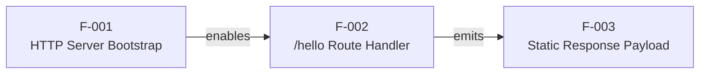

### 2.3.2 Integration Points

| Integration Point | Type | Participants | Evidence |
|---|---|---|---|
| HTTP boundary | External (process-to-client) | HTTP Client ↔ Node.js Server | §1.3.1 sequence diagram; §1.1.3 stakeholder table |
| Internal function invocation | In-process | F-001 listener → F-002 handler → F-003 payload | §1.2.2 component decomposition |

No external system integrations exist. Per §1.3.3, "No external system integrations are addressed by this specification… The application will not communicate with any process other than the HTTP client that calls it."

### 2.3.3 Shared Components and Common Services

| Shared Element | Scope | Source |
|---|---|---|
| Single Node.js process | All three features (F-001, F-002, F-003) execute within one process | §1.3.2 "System Boundaries" |
| Single application-level handler function | F-002 and F-003 are realized by the same handler invocation | §1.2.2 "Major System Components" |
| HTTP protocol stack | F-001 and F-002 both depend on the HTTP transport | §1.3.1 "Key Technical Requirements" |

No shared persistence layer, no shared configuration store, no shared identity provider, and no shared logging or telemetry surface exist — all such concerns are explicitly excluded by §1.3.3.

### 2.3.4 End-to-End Request Flow Cross-Reference

The end-to-end interaction is documented in §1.3.1 "Primary User Workflow" as a Mermaid sequence diagram showing `Client → Server: GET /hello` followed by `Server → Client: 200 OK "Hello world"`. That diagram is the canonical illustration of how F-001, F-002, and F-003 cooperate at runtime and is the natural cross-link for any reader navigating from this section.

---

## 2.4 IMPLEMENTATION CONSIDERATIONS

### 2.4.1 Technical Constraints

| Constraint | Source |
|---|---|
| Application MUST run on the Node.js runtime. | §1.3.1 |
| System boundary MUST be a single Node.js process. | §1.3.2 |
| Exactly one HTTP route MUST be exposed. | §1.3.1, §1.3.3 |
| Service MUST be exposed over the HTTP protocol. | §1.3.1 |
| Default execution context is local (developer's own machine). | §1.3.2 "Geographic and Market Coverage" |
| Repository name `12nov07` is preserved verbatim from `README.md`. | §1.4.1 |

### 2.4.2 Performance Requirements

No performance KPIs, service-level objectives, latency targets, or throughput thresholds are declared. Per §1.2.3, "performance characteristics beyond functional correctness are explicitly not measured at this stage and are deferred to any future, production-oriented derivative work." Consequently, F-001, F-002, and F-003 each have a Performance Criteria field of "None declared" in §2.2.

### 2.4.3 Scalability Considerations

Scalability is explicitly out of scope. The following non-goals are recorded for clarity:

| Non-Goal | Source |
|---|---|
| Production traffic handling | §1.3.3 "Unsupported Use Cases" |
| Multi-tenant access | §1.3.3 |
| High-availability deployment (clustering, load balancing) | §1.3.3 |
| Rate limiting, retries, circuit breakers | §1.3.3 "Excluded Features and Capabilities" |
| Containerization, CI/CD, deployment automation | §1.3.3 |

### 2.4.4 Security Implications

Security is explicitly out of scope, and the system is designed for anonymous, unauthenticated access. The following decisions are deliberate and documented:

| Security Concern | Disposition | Source |
|---|---|---|
| Authentication | Excluded | §1.3.3 |
| Authorization | Excluded | §1.3.3 |
| HTTPS / TLS | Excluded | §1.3.3 |
| CORS handling | Not specified | §1.3.3 "Unsupported Use Cases" |
| Anonymous caller posture | Required (by design) | §1.3.2 |

Because the response is a fixed, non-sensitive English literal, the absence of these controls does not, within the tutorial scope, expose confidential data or privileged operations. Any future extension that introduces protected resources, dynamic content, or persistent data MUST revisit each row of this table.

### 2.4.5 Maintenance Requirements

| Maintenance Concern | Specification |
|---|---|
| Code readability | The resulting code MUST be "sufficiently readable to serve as an instructional reference" (§1.2.3, §1.1.4). |
| Minimum-complexity principle | Per §1.1.2, the project must isolate a single concern to "remove incidental complexity and expose only the essential mechanics." |
| Test infrastructure | Out of scope. Per §1.3.3, "Automated test suites or test frameworks" are excluded. |
| Observability infrastructure | Out of scope. Per §1.3.3, "Logging, metrics, distributed tracing" are excluded. |
| Future extension posture | Per §1.3.3 "Future Phase Considerations", extensions are anticipated as natural learning exercises but are outside present scope. |

---

## 2.5 TRACEABILITY MATRIX

### 2.5.1 Requirement-to-Source Traceability

Every functional requirement enumerated in §2.2 traces back to a primary source — either the user-specified requirement or a clause in §1.1–§1.3 of this specification.

| Requirement ID | Primary Source Clause | Secondary Reinforcement |
|---|---|---|
| F-001-RQ-001 | §1.2.3 — "Application start on Node.js… Process starts without error" | §1.3.1 "Runtime platform: Node.js" |
| F-001-RQ-002 | §1.2.2 — "HTTP Listener… Bind to a port" | §1.3.1 "Application protocol: HTTP" |
| F-001-RQ-003 | §1.2.2 — "accept incoming HTTP requests" | §1.3.1 sequence diagram |
| F-002-RQ-001 | §1.3.1 — "Endpoint count: One (1); Endpoint path: `/hello`" | User requirement |
| F-002-RQ-002 | §1.2.2 — capability table: HTTP method = GET | User requirement |
| F-002-RQ-003 | §1.3.1 sequence diagram — "200 OK" | §1.2.3 "Endpoint reachability" |
| F-002-RQ-004 | §1.3.2 — "unauthenticated, anonymous caller" | §1.3.3 (auth excluded) |
| F-003-RQ-001 | §1.2.3 — "Body equals the exact string `Hello world`" | User requirement; §1.3.1 |
| F-003-RQ-002 | §1.3.1 — "hard-coded string literal" | §1.3.3 — "Response is a hard-coded literal" |
| F-003-RQ-003 | §1.3.3 — "Multi-language responses" excluded | §1.3.3 "Internationalization" |

### 2.5.2 Feature-to-Stakeholder Traceability

| Feature | HTTP Client (§1.1.3) | Developer / Learner (§1.1.3) | Instructor / Author (§1.1.3) |
|---|---|---|---|
| F-001 | Indirect (enables reachability) | Direct (starts the server) | Direct (maintains bootstrap example) |
| F-002 | Direct (issues the request) | Direct (studies routing pattern) | Direct (maintains routing example) |
| F-003 | Direct (consumes the body) | Direct (studies payload pattern) | Direct (maintains payload example) |

### 2.5.3 Cross-Section Reference Map

| Topic in §2 | Related Section(s) |
|---|---|
| Feature decomposition | §1.2.2 "Major System Components" |
| Acceptance thresholds | §1.2.3 "Measurable Objectives" |
| In-scope feature catalog | §1.3.1 "Core Features and Functionalities" |
| System boundaries | §1.3.2 "Implementation Boundaries" |
| Out-of-scope catalog (referenced throughout §2.4) | §1.3.3 "Out-of-Scope Elements" |
| Request/response sequence diagram | §1.3.1 "Primary User Workflow" |
| Greenfield repository state | §1.2.1, §1.4.1, §1.4.2 |
| Stakeholder roles | §1.1.3 |
| Value proposition (pedagogical) | §1.1.4 |

---

## 2.6 ASSUMPTIONS AND CONSTRAINTS

### 2.6.1 Documented Assumptions

| ID | Assumption | Basis |
|---|---|---|
| A-001 | A single Node.js process is sufficient for the tutorial's instructional purpose. | §1.3.2 "System Boundaries" |
| A-002 | The choice of HTTP framework (native `http`, Express, Fastify, Koa, etc.) is acceptable to defer to subsequent specification sections. | §1.2.2 "Core Technical Approach" |
| A-003 | The Developer/Learner has a working Node.js installation on the local machine. | §1.3.2 "Geographic and Market Coverage" — "local execution on the developer's own machine" |
| A-004 | Any HTTP client capable of issuing a GET request is sufficient to exercise the endpoint. | §1.3.2 "User Groups Covered" |

### 2.6.2 Documented Constraints

| ID | Constraint | Basis |
|---|---|---|
| C-001 | Response body MUST equal the exact string `Hello world` (case- and spelling-sensitive). | §1.2.3 acceptance threshold |
| C-002 | Exactly one (1) endpoint may be exposed; the path MUST be `/hello`. | §1.3.1 "Key Technical Requirements"; §1.3.3 excludes other endpoints |
| C-003 | Repository name `12nov07` is preserved verbatim from `README.md`. | §1.4.1 |
| C-004 | No external integrations, persistence, or identity providers may be introduced within this scope. | §1.2.1; §1.3.1 "Essential Integrations"; §1.3.3 |
| C-005 | No automated tests, observability, or deployment automation are part of this scope. | §1.3.3 |

### 2.6.3 Requirement Versioning

This section reflects version **1.0** of the Product Requirements, authored from the greenfield state of the repository (only `README.md` present, per §1.4.1). Subsequent revisions MUST be tracked alongside any change in scope per §1.3.3 "Future Phase Considerations". The repository name `12nov07` is treated as the version anchor for the present requirements baseline.

---

## 2.7 REFERENCES

### 2.7.1 Files Examined

- `README.md` — Sole repository file at authoring time; contains the single line `# 12nov07`. Establishes the canonical project name and confirms the greenfield state that necessitates deriving all requirements from the user statement and §1.1–§1.4.

### 2.7.2 Folders Explored

- `/` (repository root, depth 0) — Contains only `README.md` (plus the `.git/` version-control directory per §1.4.2). No source folders, configuration folders, or dependency manifests exist. Explored at depth 0 because no deeper structure is present.

### 2.7.3 Technical Specification Sections Cross-Referenced

- **§1.1 Executive Summary** — Project overview, business problem (educational), stakeholder taxonomy (§1.1.3), pedagogical value proposition (§1.1.4).
- **§1.2 System Overview** — Greenfield project context (§1.2.1), high-level capability table and component decomposition (§1.2.2), measurable objectives and absence of KPIs (§1.2.3).
- **§1.3 Scope** — In-scope features and key technical requirements (§1.3.1), implementation and system boundaries (§1.3.2), out-of-scope catalog and unsupported use cases (§1.3.3).
- **§1.4 References** — Authoritative confirmation that only `README.md` exists in the repository and that the introduction stands as the foundational reference (§1.4.1–§1.4.4).

### 2.7.4 User Context Incorporated

- User request (verbatim): *"Can you create a nodejs tutorial project that features one end point '/hello' that returns 'Hello world' to the calling HTTP client?"* — Source of all in-scope features (F-001, F-002, F-003) and the literal response constant captured in C-001.

# 3. Technology Stack

## 3.1 STACK SUMMARY AND DESIGN PHILOSOPHY

### 3.1.1 Stack-at-a-Glance

The technology stack for repository `12nov07` is deliberately minimal. It comprises exactly one programming language, one runtime, one HTTP layer (provided by the runtime itself), and zero third-party libraries. This minimalism is not an aesthetic preference — it is a direct consequence of the project's tutorial scope (§1.1, §1.2.3) and the explicit out-of-scope catalog enumerated in §1.3.3.

| Layer | Selection | Version | Source of Decision |
|---|---|---|---|
| Programming Language | JavaScript (ECMAScript) | ES2022+ (whatever the chosen Node.js line supports) | User specification ("nodejs"); §1.3.1 |
| Runtime | Node.js | `>= 22.x` (Maintenance LTS) recommended target: `24.x` (Active LTS) | §1.3.1; §2.4.1; A-003 |
| HTTP Layer | Node.js native `http` module | Bundled with the runtime | §1.2.2; A-002; resolved in this section |
| Open-Source Dependencies | None | n/a | §1.1.2; §1.3.3; C-004 |
| Third-Party Services | None | n/a | §1.2.1; §1.3.1; C-004 |
| Persistence | None | n/a | §1.3.2; §1.3.3; F-003 |
| Build System | None | n/a | §1.1.2; pure JavaScript |
| Containerization | None | n/a | §1.3.3; §2.4.3 |
| CI/CD | None | n/a | §1.3.3; §2.4.3; C-005 |

### 3.1.2 Guiding Principles

Every selection in this section is governed by four constraints lifted from earlier sections of the specification:

1. **Minimum-complexity principle.** §1.1.2 directs the project to "remove incidental complexity and expose only the essential mechanics." This is reinforced by §2.4.5, which mandates the minimum-complexity principle as a maintenance requirement.
2. **Instructional readability.** §1.2.3 establishes that the resulting code must be "sufficiently readable to serve as an instructional reference." Any selection that adds unfamiliar abstractions, transpilation steps, or framework-specific idioms must be weighed against this criterion.
3. **Greenfield, local-only execution context.** §1.3.2 specifies "local execution on the developer's own machine" as the default deployment context. There is no production target, no shared hosting environment, and no operational SLO (§2.4.2).
4. **Verbatim conformance to documented constraints C-001 through C-005.** Per §2.6.2, the stack must not introduce external integrations (C-004), persistence (C-004), authentication (C-004), automated tests (C-005), observability (C-005), or deployment automation (C-005).

### 3.1.3 Default Stack Reconciliation

The project's organizational default technology stack prescribes a wide array of components for full-stack systems (AWS, Docker, Terraform, GitHub Actions, Python/Flask, MongoDB, Auth0, React, etc.). The vast majority of these are explicitly excluded from the present scope by §1.3.3 and §2.4. The reconciliation below makes the disposition of each default-stack item explicit, satisfying the traceability obligation of §2.5.

| Default Stack Category | Default Selection | Disposition for `12nov07` | Authoritative Source |
|---|---|---|---|
| Cloud Platform | AWS | **Not adopted** — local execution only | §1.3.2 |
| Containerization | Docker | **Not adopted** — explicitly excluded | §1.3.3 "Operations" |
| Infrastructure as Code | Terraform | **Not adopted** — no infrastructure to provision | §1.3.2; §2.4.3 |
| CI/CD | GitHub Actions | **Not adopted** — explicitly excluded | §1.3.3; C-005 |
| Backend Primary Language | Python | **Replaced by JavaScript** (user override) | User specification ("nodejs") |
| Backend Framework | Flask | **Replaced by Node.js native `http`** (see §3.3.2) | User specification; resolution of A-002 |
| Authentication | Auth0 | **Not adopted** — explicitly excluded | §1.3.3 "Security"; §2.4.4 |
| Database | MongoDB | **Not adopted** — explicitly excluded | §1.3.3 "Persistence" |
| AI Framework | Langchain | **Not adopted** — not referenced in scope | §1.3.1 |
| Web Frontend | React + TypeScript | **Not adopted** — explicitly excluded | §1.3.3 "Front-end" |
| CSS Framework | TailwindCSS | **Not adopted** — no front-end exists | §1.3.3 "Front-end" |
| Cross-Platform Mobile | React-Native + TypeScript | **Not adopted** — no client-side application | §1.3.3 |
| Native iOS | Swift | **Not adopted** — no native applications | §1.3.3 |
| Native Android | Kotlin | **Not adopted** — no native applications | §1.3.3 |
| Native macOS | Objective-C | **Not adopted** — no native applications | §1.3.3 |
| Cross-Platform Desktop | ElectronJS | **Not adopted** — no desktop application | §1.3.3 |

This reconciliation captures one explicit user override (Python → JavaScript) and fifteen "not adopted" determinations grounded in the exclusion catalogs of §1.3.3 and §2.4.

---

## 3.2 PROGRAMMING LANGUAGES

### 3.2.1 JavaScript (ECMAScript) — Server-Side Runtime Language

JavaScript is the sole programming language in scope. This is determined transitively from the user requirement: the user specified "nodejs" as the runtime, and Node.js is, by definition, a JavaScript runtime — specifically, one built on Google's V8 engine. Node.js is an open-source, cross-platform JavaScript runtime built on Google's V8 engine.

| Attribute | Value |
|---|---|
| Language | JavaScript |
| Standard | ECMAScript (ES2022 baseline; ES2023/ES2024 features available on supported Node.js lines) |
| Source Files | A single `.js` source file is sufficient to satisfy F-001, F-002, and F-003 |
| Module System | CommonJS or ECMAScript Modules (ESM) — both are supported by all in-scope Node.js LTS lines; the author may choose either |
| Type Annotations | Not used (TypeScript not in scope; see §3.2.3) |

### 3.2.2 Selection Criteria and Justification

JavaScript satisfies every operative selection criterion for this project:

| Criterion | Source | How JavaScript Satisfies It |
|---|---|---|
| Native to the mandated runtime | §1.3.1, A-003 | JavaScript is the only language Node.js natively executes without an intermediate compilation step |
| Zero transpilation requirement | §1.1.2 minimum-complexity | Source files can be executed directly by `node <file>.js` with no build pipeline |
| Pedagogical recognizability | §1.2.3, §1.1.4 | JavaScript is the most widely taught language in introductory web/server tutorials |
| No persistent state, no schemas | §1.3.2, §1.3.3 | A dynamic, untyped language is appropriate when there are no entities to model |

### 3.2.3 Languages Considered and Excluded

The default technology stack enumerates multiple languages (Python, TypeScript, Swift, Kotlin, Objective-C). Each is excluded for an explicit, traceable reason:

| Language | Default Stack Context | Reason for Exclusion |
|---|---|---|
| Python | Backend default | Superseded by user override specifying Node.js (§1.2.2) |
| TypeScript | Web/Mobile frontend default | (a) No front-end is in scope per §1.3.3; (b) Introducing TypeScript on the backend would require a build step, violating §1.1.2's minimum-complexity principle |
| Swift | iOS default | No native applications in scope (§1.3.3) |
| Kotlin | Android default | No native applications in scope (§1.3.3) |
| Objective-C | macOS default | No native applications in scope (§1.3.3) |

---

## 3.3 FRAMEWORKS AND LIBRARIES

### 3.3.1 Node.js Runtime

Node.js is the runtime substrate for the project, mandated by §1.3.1 ("Runtime platform: Node.js") and the user specification. As of June 2026, the Node.js project maintains multiple concurrent release lines, each in a defined support phase.

#### 3.3.1.1 Recommended Version

The recommended target is **Node.js 24.x (Active LTS)**, with **Node.js 22.x (Maintenance LTS)** acceptable for learners already on that line.

| Release Line | Phase | Suitability for `12nov07` |
|---|---|---|
| Node.js 24.x | Active LTS | **Recommended.** For production applications that require stability, Node.js 24 is the current Active LTS release and Node.js 22 is in Maintenance LTS. |
| Node.js 22.x | Maintenance LTS | **Acceptable** for existing installations |
| Node.js 26.x | Current (not LTS) | **Acceptable for experimentation only**; Node.js 26 launched as a Current release, not a Long-Term Support (LTS) release. Even-numbered Node.js versions follow a standard schedule: after roughly six months as Current, they transition to Active LTS status. The official release post states that Node.js 26 will enter LTS in October 2026. |

The rationale for targeting Active LTS lines is consistent with general Node.js project guidance: Production applications should only use Active LTS or Maintenance LTS releases. Although `12nov07` is not a production application, this same principle aligns with the §1.2.3 "instructional reference" objective — pinning a tutorial to an LTS line ensures the example remains executable for the longest possible window. LTS release status is "long-term support", which typically guarantees that critical bugs will be fixed for a total of 30 months.

#### 3.3.1.2 Version Pinning Strategy

No `engines` field pinning is required by the specification. The selected source-code constructs (HTTP listener, route handler, static string response) are stable across every supported Node.js LTS line going back several years. The learner is free to use any locally installed Node.js LTS distribution that satisfies A-003.

#### 3.3.1.3 Forward Compatibility Note

The Node.js release model is itself evolving. Node.js, the open-source JavaScript runtime maintained by the OpenJS Foundation, has announced a fundamental change to its release schedule. Starting with Node.js 27, the project will shift from two major releases per year to one, eliminating the long-standing odd/even versioning model that has defined its release strategy for over a decade. Under the new schedule, which takes effect in October 2026, a single major release will land each April, with LTS promotion following in October. Every release will now become LTS, removing the distinction where odd-numbered versions served as short-lived experimental lines and only even-numbered versions received long-term support. This change does not affect the `12nov07` tutorial's source code — the constructs used (the native `http` module, the `GET /hello` handler, the literal string response) are stable across the schedule transition.

### 3.3.2 HTTP Layer Selection: Native `http` Module

§1.2.2 explicitly defers the HTTP-framework decision: "The specific HTTP layer — whether the native `http` module, Express, Fastify, Koa, or another framework — is a design decision intentionally deferred to subsequent sections of this specification." This subsection resolves that deferral, satisfying assumption A-002 from §2.6.1.

#### 3.3.2.1 Selected Option

**The Node.js core `http` module** is selected as the HTTP layer for `12nov07`.

| Attribute | Value |
|---|---|
| Module | `http` (Node.js core; `require('http')` or `import http from 'node:http'`) |
| Version | Bundled with the runtime — no independent version |
| Package Manifest Entry | None — the module is built into Node.js |
| External Dependencies Introduced | Zero |

#### 3.3.2.2 Justification

The selection of the core `http` module over Express, Fastify, or Koa rests on five mutually reinforcing arguments, each grounded in a previously documented section of this specification:

| # | Argument | Anchored In |
|---|---|---|
| 1 | **Lowest incidental complexity.** The `http` module exposes a single function call (`createServer`) that maps directly to the F-001 capability. No middleware abstraction, request-pipeline model, or routing engine is interposed. | §1.1.2; §2.4.5 |
| 2 | **Zero added dependencies.** Selecting `http` keeps the open-source dependency count at zero, eliminating supply-chain risk surface and removing the install step entirely. | C-004; §3.4.1 |
| 3 | **Most direct mapping to the F-001/F-002/F-003 chain.** The three features described in §2.1 — server bootstrap, route handler, static payload — map one-for-one to (`http.createServer` → callback dispatch by URL → `res.end('Hello world')`). No framework features are unused or shadowed. | §2.1, §2.3 |
| 4 | **Instructional transparency.** Learners see exactly how an HTTP request is received, dispatched, and answered, without delegating these mechanics to a framework abstraction. This best serves the §1.2.3 "instructional reference" criterion. | §1.1.4; §1.2.3 |
| 5 | **No version-coordination burden.** With no external library in play, there is no compatibility matrix to maintain between framework version and runtime version. | §2.4.5 |

#### 3.3.2.3 Trade-offs Accepted

This selection accepts one minor trade-off: registering a single route requires a conditional check on `req.url` and `req.method` inside the `createServer` callback, rather than the more idiomatic `app.get('/hello', ...)` of Express. For a single-route project, this trade-off is negligible — the resulting handler is on the order of five to seven lines of JavaScript — and is outweighed by every argument enumerated in §3.3.2.2.

### 3.3.3 Alternative HTTP Frameworks Considered

The four alternatives explicitly enumerated in §1.2.2 were each evaluated and not selected. The justifications below complete the deferral chain established in A-002.

| Framework | Latest Stable (June 2026) | Reason Not Selected for `12nov07` |
|---|---|---|
| Express | 5.2.x | Most pedagogically familiar, but introduces a third-party dependency, violating the zero-dependency posture preferred by §1.1.2 and C-004. May be a natural exercise for the §1.3.3 "Future Phase Considerations" path. |
| Fastify | n/a | Optimized for performance throughput, but §2.4.2 declares "no performance KPIs"; performance is not a selection criterion. Adds a dependency without conferring an in-scope benefit. |
| Koa | n/a | Uses an async/await middleware pipeline that adds conceptual surface area beyond what a single endpoint requires. Conflicts with §1.1.2. |
| Other (Hapi, NestJS, etc.) | n/a | Out of scope; not enumerated in §1.2.2 and adds substantial abstraction for no in-scope benefit. |

For completeness, if a future learning exercise (per §1.3.3 "Future Phase Considerations") chooses to introduce Express, the following version posture would apply at the time of writing: Express 5.x is the current major line (with 5.2 the technical committee's endorsed line for new projects), Express 5 requires Node.js 18 or later, and Express 4.x continues to receive maintenance updates. Such an introduction is **not** part of the present specification.

### 3.3.4 Compatibility Matrix

Because the selection is the core `http` module, the compatibility matrix is reduced to a single row:

| Component | Required Version | Provided By | Compatibility Notes |
|---|---|---|---|
| Node.js `http` module | Bundled (no independent version) | Node.js 22.x or later (Active LTS preferred) | API surface used (`createServer`, `req.url`, `req.method`, `res.statusCode`, `res.setHeader`, `res.end`) has been stable since Node.js 0.10; no version-specific behaviors are relied upon |

---

## 3.4 OPEN SOURCE DEPENDENCIES

### 3.4.1 Direct Production Dependencies

**None.**

In keeping with the §3.3.2 selection, the project has zero direct production dependencies. The only artifact that interacts with a package registry is an optional `package.json` file, which may be created for project identity (`name`, `version`) but will declare an empty `dependencies` object and an empty `devDependencies` object.

| Concern | Disposition |
|---|---|
| Production `dependencies` | Empty |
| `devDependencies` | Empty (no tests per §1.3.3; no linters per §1.1.2's minimum-complexity principle) |
| Transitive dependency closure | Empty |
| Lockfile (`package-lock.json`) | Not required; will be empty or absent |

### 3.4.2 Package Registry

| Attribute | Value |
|---|---|
| Primary Registry | npm public registry (`https://registry.npmjs.org`) |
| Registry Usage | None at runtime; `npm install` is not required to start the application |
| Authentication | Not applicable (no private packages) |

The npm CLI itself is bundled with every supported Node.js LTS distribution and is therefore present on the learner's machine by virtue of A-003, but it is not invoked by the `12nov07` build or run process.

### 3.4.3 Supply-Chain Posture

The zero-dependency posture confers a series of security and operational benefits that are particularly appropriate for a tutorial:

| Benefit | Mechanism |
|---|---|
| Zero supply-chain attack surface | No third-party code is fetched, resolved, or executed |
| Reproducible setup | The only setup step is the Node.js installation itself (A-003) |
| No deprecation drift | The codebase cannot be invalidated by abandonment of an upstream package |
| No CVE bookkeeping | There are no dependency CVEs to monitor (§2.4.4) |

This posture aligns with both C-004 ("No external integrations… may be introduced") and the broader minimum-complexity principle of §1.1.2.

---

## 3.5 THIRD-PARTY SERVICES

### 3.5.1 Applicability Assessment

**This subsection is intentionally empty.** The project has no third-party service integrations of any kind.

The basis for this determination is a chain of three independent specification statements:

| Source | Statement |
|---|---|
| §1.2.1 | "No integrations with external systems, internal enterprise services, identity providers, message brokers, or data stores are required or contemplated." |
| §1.3.1 "Essential Integrations" | "No third-party integrations are essential to the scope." |
| C-004 (§2.6.2) | "No external integrations, persistence, or identity providers may be introduced within this scope." |

### 3.5.2 Excluded Service Categories

For traceability under §2.5, the following service categories — all of which would otherwise be candidates for inclusion in the default stack — are explicitly **not adopted**:

| Category | Default Stack Candidate | Disposition |
|---|---|---|
| External APIs | None contemplated | Not adopted (§1.2.1) |
| Authentication / IDaaS | Auth0 | Not adopted (§1.3.3 "Security"; §2.4.4) |
| Monitoring / APM | (Default stack has no specified service) | Not adopted (§1.3.3 "Observability") |
| Logging aggregation | (None specified) | Not adopted (§1.3.3 "Observability"; C-005) |
| Error tracking | (None specified) | Not adopted (§1.3.3 "Observability") |
| Cloud platform | AWS | Not adopted (§1.3.2 "Geographic and Market Coverage") |
| Message queue / broker | (None specified) | Not adopted (§1.2.1) |
| Email / SMS gateway | (None specified) | Not adopted (§1.2.1) |
| Payment processor | (None specified) | Not adopted (§1.2.1) |

---

## 3.6 DATABASES AND STORAGE

### 3.6.1 Applicability Assessment

**This subsection is intentionally empty.** The project has no databases, no persistent storage, no in-memory caches, and no file-based state.

The basis is a chain of four independent specification statements:

| Source | Statement |
|---|---|
| §1.3.2 "Data Domains Included" | "The project includes no data domains in the conventional sense. The response is a fixed literal string with no persistent state, no database tables, no user records, and no business entities." |
| §1.3.3 "Excluded Features and Capabilities" | Persistence: "Databases, file storage, in-memory caches" |
| F-003 (§2.1) | "Static Payload" — the response body is a hard-coded English literal |
| C-004 (§2.6.2) | "No external integrations, persistence, or identity providers may be introduced within this scope." |

### 3.6.2 Excluded Storage Mechanisms

For traceability under §2.5, the following storage mechanisms — each of which would otherwise be a candidate for inclusion in the default stack — are explicitly **not adopted**:

| Category | Default Stack Candidate | Disposition |
|---|---|---|
| Primary database | MongoDB | Not adopted (§1.3.3 "Persistence") |
| Secondary database (relational) | (None specified) | Not adopted (§1.3.3) |
| In-memory cache | (None specified) | Not adopted (§1.3.3 "Persistence") |
| Object storage | (None specified) | Not adopted (§1.3.3) |
| Local file storage | (None specified) | Not adopted (§1.3.3); the response literal is in source code, not on disk |
| Session store | (None specified) | Not adopted (no sessions; anonymous caller per §1.3.2) |

The hard-coded string `Hello world` (C-001) exists exclusively in the JavaScript source. It is not a stored value in any meaningful sense; the storage medium is the source file itself.

---

## 3.7 DEVELOPMENT AND DEPLOYMENT

### 3.7.1 Required Development Tools

The development toolchain is reduced to the absolute minimum implied by A-003 ("The Developer/Learner has a working Node.js installation on the local machine").

| Tool | Purpose | Version | Source |
|---|---|---|---|
| Node.js runtime | Execute the source file via `node <file>.js` | `>= 22.x` LTS; `24.x` recommended | A-003; §3.3.1 |
| Text editor or IDE | Author and read the source file | Any; not constrained | §1.2.3 readability criterion |
| HTTP client (verification only) | Exercise `GET /hello` to validate the response | Any (browser, `curl`, Postman, etc.) | A-004 |

No additional development tools are required. Specifically excluded are: bundlers (Webpack, esbuild, Rollup, Vite), transpilers (Babel, tsc, swc), task runners (Gulp, Grunt), code formatters (Prettier), linters (ESLint), and test runners (Jest, Mocha, Vitest, Node test runner). Each of these would add incidental complexity that §1.1.2 expressly directs the project to avoid.

### 3.7.2 Build System

**No build system is required or used.**

| Concern | Disposition | Justification |
|---|---|---|
| Source compilation | Not required | JavaScript is interpreted by Node.js directly |
| Asset bundling | Not required | No assets exist; no front-end exists (§1.3.3) |
| Transpilation | Not required | TypeScript not in scope (§3.2.3); ES2022 features run natively on supported LTS lines |
| Minification | Not required | No client-side delivery; readability is paramount (§1.2.3) |
| Pre-deployment build | Not required | No deployment automation (§1.3.3; C-005) |

The application is started with a single command: `node <file>.js`. There is no `npm run build`, no `npm run start` script that delegates to a build step, and no compiled artifact.

### 3.7.3 Package Manager

| Attribute | Value |
|---|---|
| Package Manager | npm (bundled with Node.js) |
| Required Usage | None — no dependencies are installed (§3.4.1) |
| Optional Usage | An optional `npm init -y` may be used to create a `package.json` for project identity |
| Alternative Package Managers | Yarn, pnpm, Bun — none required; choice is left to the learner without specification |

Because there are no `dependencies` or `devDependencies` (§3.4.1), the choice of package manager is functionally moot. npm is named here only because it is the default that ships with every supported Node.js distribution.

### 3.7.4 Containerization and Orchestration

**Not adopted.**

| Default Stack Item | Disposition | Source |
|---|---|---|
| Docker | Not adopted | §1.3.3 "Operations: Containerization, CI/CD pipelines" |
| Docker Compose | Not adopted | §1.3.3 |
| Kubernetes | Not adopted | §1.3.3; §2.4.3 (scalability non-goals) |
| Container registry | Not adopted | No images are built |

A `Dockerfile` is not part of the deliverables and should not be created. The execution model is a single `node` process launched directly on the developer's machine (§1.3.2; A-001; A-003).

### 3.7.5 CI/CD Pipeline

**Not adopted.**

| Default Stack Item | Disposition | Source |
|---|---|---|
| GitHub Actions | Not adopted | §1.3.3 "Operations"; C-005 |
| Other CI providers (CircleCI, GitLab CI, Jenkins) | Not adopted | §1.3.3 |
| Automated test stage | Not adopted | §1.3.3 "Testing"; §2.4.5 |
| Automated lint/format stage | Not adopted | §1.1.2 minimum-complexity |
| Automated security scan stage | Not adopted | §1.3.3; §2.4.4 |
| Automated deployment stage | Not adopted | §1.3.3 "deployment automation"; C-005 |

No workflow YAML, no pipeline configuration, and no pre-commit hooks are part of this specification.

### 3.7.6 Infrastructure as Code

**Not adopted.**

| Default Stack Item | Disposition | Source |
|---|---|---|
| Terraform | Not adopted | §1.3.2 (no infrastructure to provision); §2.4.3 |
| CloudFormation / CDK | Not adopted | §1.3.2; no AWS adoption |
| Pulumi, Ansible, Chef, Puppet | Not adopted | §1.3.2 |

There is no infrastructure to declare. The execution context is the developer's local machine (A-003), and no provisioning, configuration management, or remote state is required.

---

## 3.8 TECHNOLOGY STACK DIAGRAM

The diagram below renders the entire technology stack of `12nov07` in a single view. Note the deliberate sparsity: every node either is the runtime, lives inside the runtime, or is the external caller.

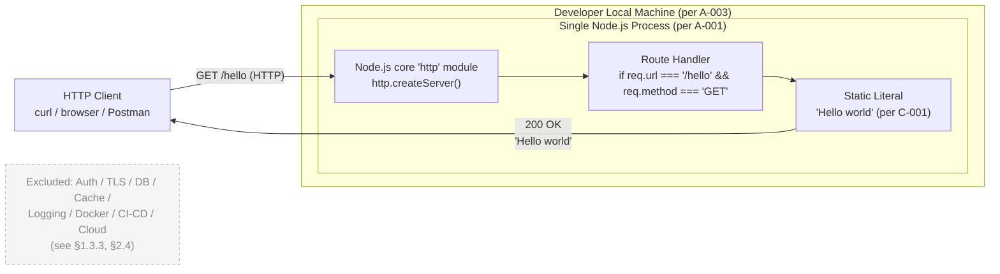

Reading the diagram:

- The **HTTP Client** is external to the system boundary (§1.3.2). It is any user agent the learner chooses; A-004 confirms that "any HTTP client capable of issuing a GET request is sufficient."
- The **Developer Local Machine** is the deployment substrate (§1.3.2 "Geographic and Market Coverage").
- The **Single Node.js Process** is the entire server (§1.3.2 "System Boundaries"; A-001).
- The **`http` module → Route Handler → Static Literal** chain corresponds one-to-one to features F-001, F-002, and F-003 from §2.1 and the linear dependency described in §2.3.
- The dashed-outline node enumerates the categories explicitly **out of scope** under §1.3.3 and §2.4 to make the absence intentional and traceable.

---

## 3.9 REFERENCES

### 3.9.1 Files Examined

- `README.md` (repository root) — Confirmed the repository's greenfield state: the only existing artifact contains the literal `# 12nov07`. This established the canonical project name (preserved verbatim per C-003) and the absence of any pre-existing source code, dependency manifest, configuration, or build tooling against which version data could be extracted.

### 3.9.2 Folders Examined

- Repository root (`/`) — Confirmed to contain only `README.md`; no source directories, no `package.json`, no lockfile, no configuration files, no CI workflows, no container manifests at any depth.

### 3.9.3 Technical Specification Sections Referenced

- §1.1 EXECUTIVE SUMMARY — Project identity, pedagogical posture, instructional-reference mandate (§1.1.2, §1.1.4).
- §1.2 SYSTEM OVERVIEW — Major components (HTTP Listener + Route Handler); explicit deferral of the HTTP-framework decision (§1.2.2); success criteria including instructional readability (§1.2.3).
- §1.3 SCOPE — In-scope key technical requirements (§1.3.1); single-process system boundary and local-execution context (§1.3.2); the out-of-scope catalog driving every "not adopted" determination in this section (§1.3.3).
- §1.4 REFERENCES — Confirmation of greenfield repository state.
- §2.1 FEATURE CATALOG — Feature triplet F-001 (HTTP Server Bootstrap), F-002 (Route Handler), F-003 (Static Payload) that maps one-for-one to the selected `http` module call chain.
- §2.3 FEATURE RELATIONSHIPS — Linear dependency F-001 → F-002 → F-003 reflected in §3.8 diagram.
- §2.4 IMPLEMENTATION CONSIDERATIONS — Technical constraints (§2.4.1); performance non-requirements (§2.4.2); scalability non-goals (§2.4.3); security exclusions (§2.4.4); maintenance principles including minimum complexity and instructional readability (§2.4.5).
- §2.5 TRACEABILITY MATRIX — Cross-section traceability obligation, satisfied by §3.1.3 and the disposition tables in §3.5.2, §3.6.2, §3.7.4–§3.7.6.
- §2.6 ASSUMPTIONS AND CONSTRAINTS — Assumption A-001 (single process), A-002 (deferred framework choice — resolved in §3.3.2), A-003 (working local Node.js install), A-004 (any HTTP client). Constraints C-001 (verbatim "Hello world"), C-002 (single `/hello` endpoint), C-003 (verbatim repository name), C-004 (no external integrations or persistence), C-005 (no tests, observability, or deployment automation).
- §2.7 REFERENCES — Confirmation of the repository's empty state, reinforcing the greenfield basis for all stack decisions.

### 3.9.4 External Sources Consulted

- Node.js Release Working Group release schedule (`github.com/nodejs/Release`) — Cited for the canonical definition of "Current," "Active LTS," and "Maintenance" phases used in §3.3.1.
- Node.js v26.0.0 official release announcement (`nodejs.org/en/blog/release/v26.0.0`) — Cited for the May 5, 2026 release date of Node.js 26 and its planned October 2026 LTS promotion (§3.3.1.1).
- `endoflife.date/nodejs` — Cited for the 30-month LTS support window guarantee and the "Production applications should only use Active LTS or Maintenance LTS releases" guidance (§3.3.1.1).
- Node.js Release Schedule announcement, "Evolving the Node.js Release Schedule" (`nodejs.org/en/blog/announcements/evolving-the-nodejs-release-schedule`) — Cited for the upcoming annual-release model effective with Node.js 27 in October 2026 (§3.3.1.3).
- InfoQ, "Node.js Moves to One Major Release Per Year" — Cited for the Node.js platform context and the release-schedule transition (§3.3.1.3).
- InMotion Hosting Node.js 26 release notes — Cited for the current LTS-phase status of Node.js 24 (Active LTS) and Node.js 22 (Maintenance LTS) as of June 2026 (§3.3.1.1).

# 4. Process Flowchart

## 4.1 OVERVIEW OF PROCESS FLOWS

### 4.1.1 Scope of This Section

This section translates the architecture established in §1 (System Overview), §2 (Requirements), and §3 (Technology Stack) into executable process flows. Because the `12nov07` project supports exactly one capability — `GET /hello` returning the literal string `Hello world` (per §1.3.1 and constraint C-001) — the process landscape is deliberately compact. Every flowchart in this section is a faithful expansion of the canonical sequence diagram presented in §1.3.1, with no speculative process steps, no invented decision branches, and no extrapolated SLAs.

The diagrams in this section serve three audiences:

1. **Implementers** writing the single JavaScript source file that realizes F-001, F-002, and F-003 (per §2.1).
2. **Reviewers** verifying that the runtime behavior matches the acceptance criteria of §1.2.3 and §2.2.
3. **Maintainers** who, in a hypothetical future phase (§1.3.3 "Future Phase Considerations"), need a starting point for adding endpoints, persistence, or observability.

### 4.1.2 Diagrammatic Conventions

All diagrams in §4 are authored in Mermaid.js and use the following conventions consistently:

| Symbol | Meaning |
|---|---|
| Stadium-shaped node `([…])` | Start or end state of a workflow |
| Rectangle `[…]` | Process step (executes synchronous logic) |
| Rhombus `{…}` | Decision point (boolean branch) |
| Subhexagon `[[…]]` | Reference to an in-scope artifact defined elsewhere in the spec |
| Dashed edge `-.->` | Reference link (not an execution path) |
| Dashed node (gray fill) | Explicitly out-of-scope element retained for traceability |
| Subgraph | Swim lane representing an actor or sub-system boundary |

### 4.1.3 Cross-Reference to Earlier Diagrams

Three diagrams already exist in the specification and are the foundation upon which §4 builds:

| Source Section | Diagram | Purpose Served |
|---|---|---|
| §1.3.1 | Sequence diagram (Client → Server, `GET /hello`, `200 OK`) | Canonical end-to-end user workflow |
| §2.3.1 | Feature dependency map (F-001 → F-002 → F-003) | Static feature relationships |
| §3.8 | Technology stack diagram (Client → `http` module → Handler → Static Literal) | Runtime topology |

All diagrams in §4 are strictly consistent with these three references and elaborate them rather than contradicting them.

---

## 4.2 SYSTEM WORKFLOWS

### 4.2.1 Core Business Process: High-Level System Workflow

The single business process supported by the system is the issuance of a greeting in response to an HTTP request. The high-level workflow places each step into a swim lane corresponding to its owning actor: the external HTTP client, the Node.js core `http` module, and the application-level route handler callback registered with `http.createServer()` (per §3.3.2).

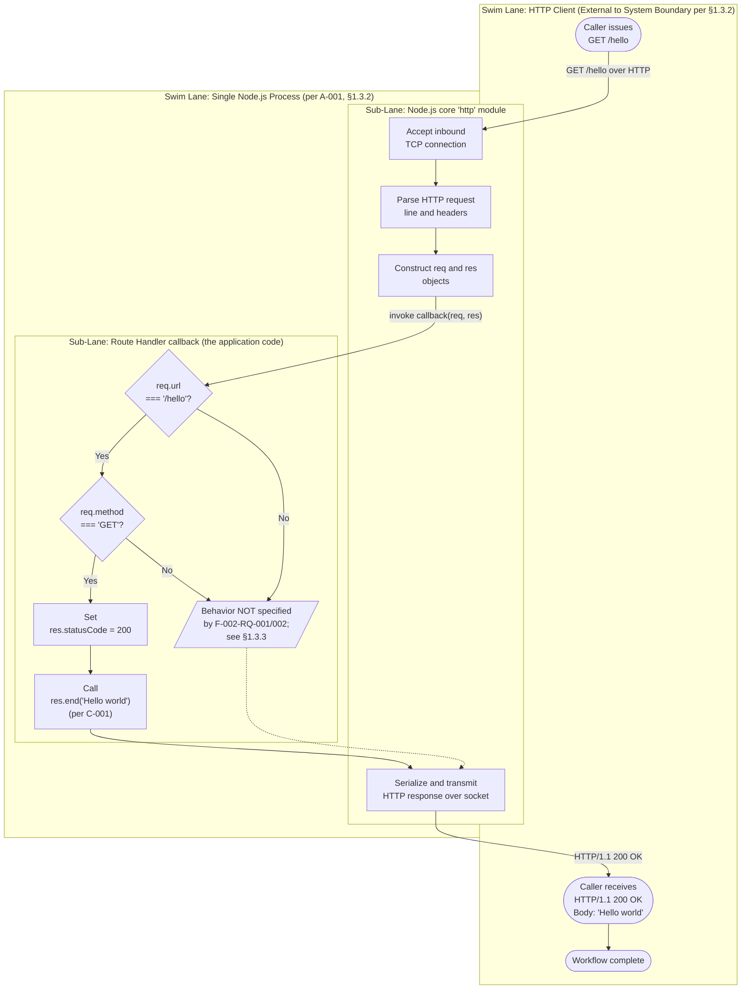

**Reading this flowchart:**

- The **HTTP Client** swim lane is intentionally minimal because §1.3.2 makes the client external to the system boundary; the project does not own client-side code.
- The **`http` module** sub-lane represents work performed by Node.js itself when `http.createServer()` is used (per §3.3.2.3); the application does not implement this logic.
- The **Route Handler** sub-lane is the only place application code executes; it consists of two decision points and one assignment-plus-`res.end()` sequence.
- The dotted edge from `UnscopedPath` to `TransmitResp` indicates that even when the requirements do not mandate a particular response for non-matching requests, the `http` module will still eventually transmit *some* response (typically a default `200 OK` with an empty body if the handler simply returns) — but per §1.3.3 the exact behavior is outside the requirements set.

### 4.2.2 Server Bootstrap Workflow (F-001)

Feature F-001 (HTTP Server Bootstrap) is invoked once per process lifetime, before any request can be served. The acceptance criterion of F-001-RQ-001 (per §2.2.1) is that this entire sequence completes without raising an unhandled exception.

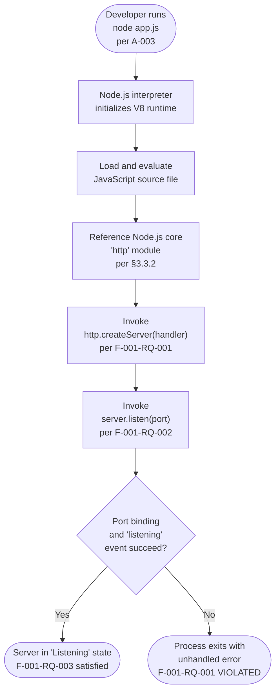

**Bootstrap notes:**

- The startup workflow has only **one observable decision point**: whether port binding and the `'listening'` event succeed. This is the only failure mode whose absence is required by F-001-RQ-001 (per §2.2.1).
- Per §3.4, **no `require()`/`import` of any external npm package occurs** — the `http` module is part of Node.js core and is always available.
- Per §2.2.1 "Performance Criteria: None declared", no startup-time SLA is in effect. The author of an implementation must NOT add timeout logic to the bootstrap sequence.
- The end state `Ready` is steady-state: the process remains in this state indefinitely until a signal (SIGINT/SIGTERM) terminates it; per §1.3.3 ("High-availability deployment… not in scope"), there is no clustering, restart supervisor, or process manager involved.

### 4.2.3 Request-Response Workflow (F-002 and F-003)

This workflow is invoked once per inbound HTTP request after the server has reached the `Listening` state. It implements the combined behavior of F-002 (`/hello` Route Handler) and F-003 (Static Response Payload).

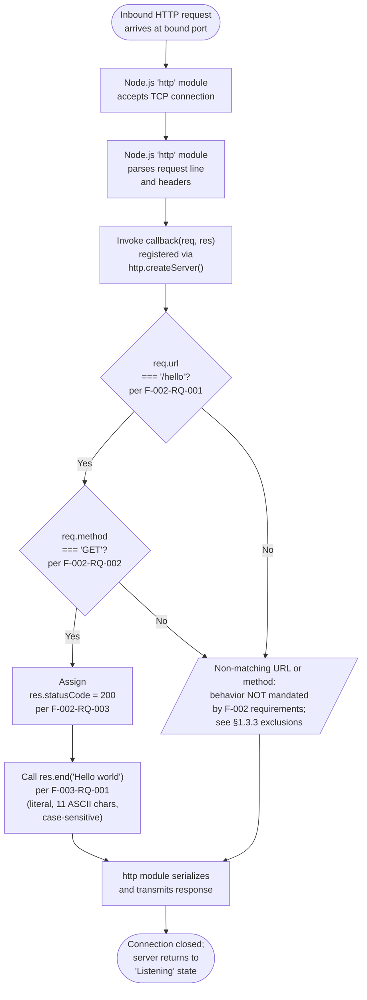

**Request-response notes:**

- Both decision diamonds reflect requirements that are **directly enumerated** in §2.2.2: F-002-RQ-001 (path must be `/hello`) and F-002-RQ-002 (method must be `GET`).
- The "Unscoped" outcome honestly represents the specification's silence on non-matching requests. Per §1.3.3, the only endpoint in scope is `GET /hello`; the spec does not mandate a `404 Not Found`, `405 Method Not Allowed`, or any other particular behavior. An implementer may add such handling at their discretion, but it is **not a requirement**.
- Per F-003-RQ-002 (§2.2.3), the body is a **hard-coded string literal**; there is no templating step, no upstream data lookup, and no computation between the route match and the response body.
- Per §1.3.2, no caller is authenticated — F-002-RQ-004 mandates anonymous access — so no authorization checkpoint appears in this flow.

### 4.2.4 Integration Workflows

#### 4.2.4.1 Internal Integration Sequence (Expanded)

The following sequence diagram expands the canonical illustration from §1.3.1 to show every internal hop, including the boundary between the Node.js `http` module and the application-level callback. This is the most detailed view of the request-response interaction and is the primary reference for implementers.

```mermaid
sequenceDiagram
    autonumber
    participant Client as HTTP Client<br/>(curl / browser / Postman)
    participant HTTP as Node.js core<br/>'http' module
    participant Handler as Route Handler<br/>callback

    Note over Client,Handler: Pre-condition: F-001 bootstrap complete;<br/>server is in 'Listening' state.

    Client->>HTTP: TCP connect + GET /hello HTTP/1.1
    activate HTTP
    HTTP->>HTTP: Parse request line and headers
    HTTP->>HTTP: Construct req (IncomingMessage)<br/>and res (ServerResponse)
    HTTP->>Handler: invoke callback(req, res)
    activate Handler

    alt req.url === '/hello' AND req.method === 'GET'
        Handler->>Handler: Evaluate URL match (F-002-RQ-001)
        Handler->>Handler: Evaluate method match (F-002-RQ-002)
        Handler->>HTTP: res.statusCode = 200 (F-002-RQ-003)
        Handler->>HTTP: res.end('Hello world') (F-003-RQ-001)
    else Non-matching URL or method
        Handler-->>HTTP: Behavior unspecified by §2.2;<br/>defaults to whatever the handler<br/>does in that branch (§1.3.3)
    end

    deactivate Handler
    HTTP-->>Client: HTTP/1.1 200 OK<br/>Body: 'Hello world'
    deactivate HTTP

    Note over Client,Handler: Post-condition: connection closed;<br/>server returns to 'Listening'.
```

**Sequence notes:**

- The numbered steps map one-to-one to API calls in the Node.js `http` module's runtime contract (per the compatibility matrix in §3.3.4): `http.createServer`, `req.url`, `req.method`, `res.statusCode`, `res.end`.
- There are exactly **two participants inside the system boundary** — the `http` module and the route handler — and **one external participant** — the HTTP client. No further participants appear in any in-scope workflow because §2.3.2 enumerates only one integration point (the HTTP boundary) and one in-process function-invocation point.
- The `Note` annotations frame the diagram with the pre- and post-conditions that bind it to the state machine documented in §4.4.1.

#### 4.2.4.2 Absence of External Integrations

Per §2.3.2 and §1.3.3, the system has **no external integrations** other than the HTTP boundary already documented above. The Process Flowchart section therefore contains **no diagrams** for the following workflow categories that would normally appear in an enterprise specification:

| Workflow Category | Status in This Project | Authoritative Source |
|---|---|---|
| API call to upstream services | Not applicable — no upstream calls exist | §1.3.1 "no upstream data source"; §2.3.2 |
| Event processing flows | Not applicable — no message broker or event bus | §1.3.3 "Integration Points Not Covered" |
| Batch processing sequences | Not applicable — no scheduled work, no jobs | §1.3.3 |
| Database read/write flows | Not applicable — no persistence layer | §3.6 "Intentionally empty" |
| Third-party identity provider flow | Not applicable — anonymous access by design | §1.3.2; §3.5 "Intentionally empty" |
| Inter-service messaging | Not applicable — single process, no services | §1.3.2 "System Boundaries"; A-001 |

The omission of these diagrams is **intentional, traceable, and required by the specification**. Inventing such flows would violate constraints C-004 and C-005 (per §2.6.2) and would contradict the explicit out-of-scope catalog of §1.3.3.

---

## 4.3 FLOWCHART REQUIREMENTS DETAIL

### 4.3.1 Decision Points Summary

The system as specified contains exactly **three decision points** across the entire process landscape — two in the request-response flow (§4.2.3) and one in the bootstrap flow (§4.2.2). No other decision points exist because no other branching requirements appear in §2.2.

| Decision Point | Flow | Source Requirement | In-Scope Outcome |
|---|---|---|---|
| Port binding succeeds? | Bootstrap (§4.2.2) | F-001-RQ-001 (§2.2.1) | Must succeed for the application to be usable; failure violates the acceptance criterion |
| `req.url === '/hello'`? | Request (§4.2.3) | F-002-RQ-001 (§2.2.2) | Only this URL is in scope |
| `req.method === 'GET'`? | Request (§4.2.3) | F-002-RQ-002 (§2.2.2) | Only this method is in scope |

### 4.3.2 Validation Rules at Each Step

The "Validation Rules" required by the section prompt are reproduced below using the formal definitions from §2.2. Every rule is traceable to a numbered requirement or constraint; no validations are introduced that are not already in the specification.

| Step in Flow | Business Rule | Data Validation | Authorization | Compliance |
|---|---|---|---|---|
| Bootstrap (F-001) | Single Node.js process per §1.3.2 | N/A — no input data consumed at bootstrap (§2.2.1) | N/A — anonymous, no credentials anywhere in the system | None declared (§2.2.1) |
| URL match decision | One endpoint only; the path MUST be `/hello` (C-002, §2.2.2) | Per §1.3.3, "Request validation, schema enforcement" is **explicitly excluded** | N/A — F-002-RQ-004 mandates anonymous access | None declared |
| Method match decision | Only `GET` is in scope (F-002-RQ-002) | N/A — no body, headers, or query parameters are consumed (§2.2.2) | N/A | None declared |
| Status assignment | Status MUST be `200` (F-002-RQ-003) | N/A | N/A | None declared |
| Body write | Body MUST equal `Hello world` byte-for-byte (C-001, F-003-RQ-001) — case- and spelling-sensitive | N/A — payload is independent of request content (§2.2.3) | N/A | None declared |

**Key findings:**

- **No data validation** appears in any flowchart because §1.3.3 explicitly excludes "Request validation, schema enforcement."
- **No authorization checkpoints** appear in any flowchart because §1.3.2 mandates anonymous access and §1.3.3 explicitly excludes authentication and authorization.
- **No regulatory compliance checks** appear in any flowchart because no compliance requirements are declared anywhere in §2.2 or §2.4.

### 4.3.3 Timing and SLA Considerations

The specification is explicit that **no performance or timing SLAs exist for this project**. The following statements from earlier sections govern this section's treatment of timing:

| Statement | Source |
|---|---|
| "performance characteristics beyond functional correctness are explicitly not measured at this stage" | §1.2.3 |
| "No performance KPIs, service-level objectives, latency targets, or throughput thresholds are declared" | §2.4.2 |
| "Performance Criteria: None declared" (repeated for F-001, F-002, F-003) | §2.2.1, §2.2.2, §2.2.3 |

Consequently, **none of the flowcharts in §4 carry timing annotations, SLA badges, or latency budgets**. The "timing constraints where applicable" bullet of the section prompt resolves to "not applicable to this tutorial scope" with full traceability to §2.4.2. Any implementer or operator who later wishes to introduce SLAs must first amend §2.4.2 to define them; doing so would constitute a future-phase activity per §1.3.3.

### 4.3.4 Authorization and Compliance Checkpoints

Per the disposition recorded in §4.3.2, **the diagrams in §4 contain no authorization gates and no compliance gates**. This is not an oversight but a direct consequence of:

- F-002-RQ-004 (anonymous, unauthenticated caller — §2.2.2),
- §1.3.3 exclusions (authentication, authorization, HTTPS/TLS),
- §2.4.4 (no security requirements declared),
- the absence of any data domain that would trigger regulatory obligations (§1.3.2).

---

## 4.4 TECHNICAL IMPLEMENTATION OF PROCESS FLOWS

### 4.4.1 State Management

#### 4.4.1.1 State Transition Diagram

The only state machine of any substance in the system is the Node.js process itself. Application-level state, persistent state, session state, and cache state are all absent (per §3.6, §1.3.2, and §3.6.2 respectively). The diagram below documents the entire state space of the running system.

```mermaid
stateDiagram-v2
    [*] --> Uninitialized
    Uninitialized --> Initializing : node app.js<br/>(per A-003)
    Initializing --> Listening : http.createServer() returns<br/>AND server.listen() emits 'listening'<br/>(F-001-RQ-001/002/003)
    Initializing --> Terminated : startup error<br/>(violates F-001-RQ-001)
    Listening --> Handling : inbound request arrives;<br/>callback(req, res) invoked
    Handling --> Listening : res.end() returns;<br/>connection closed
    Listening --> Terminated : SIGINT / SIGTERM
    Handling --> Terminated : SIGINT / SIGTERM<br/>(implementation-defined)
    Terminated --> [*]
```

**State machine notes:**

- The `Handling` state is **transient by design** — the handler is a pure function of `(req, res)` and produces a constant response (§2.2.3); it never blocks on I/O, never awaits a downstream call, and never queues work.
- There is **no `Recovering` state**, **no `Degraded` state**, and **no `CircuitOpen` state**, because §1.3.3 excludes retries, circuit breakers, and fallback mechanisms.
- The transition from `Handling` back to `Listening` is unconditional in scope: there is no error branch out of `Handling` because the handler does no work that can fail under the spec's acceptance criteria.

#### 4.4.1.2 Data Persistence Points

There are **zero data persistence points** in any flow documented in §4. This finding is grounded in:

| Concern | Disposition | Source |
|---|---|---|
| Database write | None — no database adopted | §3.6.1, §3.6.2 |
| File write | None — no file storage adopted | §3.6 |
| Configuration persistence | None — no configuration store | §2.3.3 |
| Audit log emission | None — observability excluded | §1.3.3 |
| Session storage | None — anonymous, sessionless | §3.6.2 |

Consequently, the flowcharts contain no "persist" or "store" steps, and the state diagram contains no states that persist beyond process lifetime.

#### 4.4.1.3 Caching and Transaction Boundaries

| Concern | Disposition | Source |
|---|---|---|
| In-memory cache | Not adopted | §3.6.2 |
| Distributed cache | Not adopted | §3.6.2 |
| Transaction boundaries | Not applicable — no transactional resources exist | §1.3.2 (no data domains); §3.6 |
| Idempotency mechanisms | Not specified — the operation is trivially idempotent (constant response) | §2.2.3 |

The handler is **idempotent by construction** because F-003-RQ-001 mandates a constant body and F-003-RQ-002 forbids dynamic computation. No transaction boundary or compensating-action workflow is therefore meaningful at this scope.

### 4.4.2 Error Handling

#### 4.4.2.1 Startup Error Path

The only error path explicitly recognized by the specification is the bootstrap failure shown in §4.2.2: if `server.listen()` fails to bind a port, the process exits with an unhandled error and the F-001-RQ-001 acceptance criterion is violated. The diagram below isolates this single error flow.

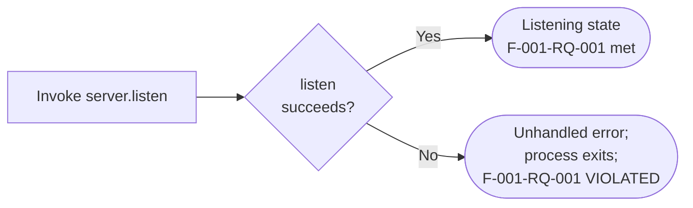

The specification does **not** mandate any specific error-handling code beyond the implicit requirement that bootstrap not throw. A tutorial author may choose to attach an `'error'` event listener on the server (`server.on('error', …)`) for didactic purposes, but this is an implementation decision, not a requirement.

#### 4.4.2.2 Retry, Fallback, and Circuit Breakers

| Mechanism | Disposition | Source |
|---|---|---|
| Retry loops | **Out of scope** — no retries in any flow | §1.3.3 "Rate limiting, retries, circuit breakers" |
| Exponential backoff | **Out of scope** | §1.3.3 |
| Circuit breakers | **Out of scope** | §1.3.3 |
| Fallback responses | **Not specified** — no upstream or downstream exists to fall back from | §1.3.1 ("no upstream data source"); §2.3.2 |
| Bulkheads / timeouts | **Not specified** | §1.3.3 |

No flowchart in §4 contains a retry arrow, a backoff timer, a fallback path, or a circuit-breaker state. The absence of these elements is **intentional and traceable**.

#### 4.4.2.3 Error Notification and Recovery

| Concern | Disposition | Source |
|---|---|---|
| Error notification (alerts, paging) | Out of scope | §1.3.3 "Observability: Logging, metrics, distributed tracing" |
| Structured error logs | Out of scope | §1.3.3 |
| Dead-letter queues | Not applicable — no asynchronous work exists | §1.3.2; §2.3.2 |
| Automated recovery procedures | Not specified — no high-availability deployment is in scope | §1.3.3 "Unsupported Use Cases: High-availability deployment" |
| Manual recovery procedure | Implicit: developer restarts the process with `node app.js` | §4.2.2 (re-entry into Bootstrap workflow) |

The only "recovery" workflow recognized by the project is the developer's manual re-invocation of the bootstrap sequence after a termination event. This is consistent with A-003 (local execution on the developer's machine).

---

## 4.5 OUT-OF-SCOPE WORKFLOW CATEGORIES

### 4.5.1 Excluded Process Categories

For completeness and to make the absence of complex flows explicit and auditable, the following diagram enumerates the workflow categories that an enterprise reader might expect to find in a Process Flowchart section but that are **not part of this specification**. Each excluded category is traced to the authoritative section in §1, §2, or §3.

```mermaid
flowchart TB
    InScope[["IN SCOPE:<br/>GET /hello returns 'Hello world'<br/>(per §1.3.1, C-001)"]]
    Marker[/"All items below are EXPLICITLY EXCLUDED<br/>per §1.3.3 and §2.6.2"/]
    InScope --- Marker

    AuthN[Authentication flow]
    AuthZ[Authorization flow]
    TLS[TLS handshake flow]
    DBRW[Database read/write flow]
    Cache[Cache populate/invalidate flow]
    Log[Log emission flow]
    Metric[Metric emission flow]
    Trace[Distributed trace flow]
    Retry[Retry / backoff flow]
    Circuit[Circuit-breaker state flow]
    RateLimit[Rate-limiting flow]
    Validate[Request validation flow]
    Schema[Schema enforcement flow]
    Test[Test execution flow]
    CICD[CI/CD pipeline flow]
    Docker[Containerization flow]
    Cloud[Cloud deployment flow]
    i18n[Internationalization flow]
    OtherEP[Routing for endpoints<br/>other than GET /hello]

    Marker -.-> AuthN
    Marker -.-> AuthZ
    Marker -.-> TLS
    Marker -.-> DBRW
    Marker -.-> Cache
    Marker -.-> Log
    Marker -.-> Metric
    Marker -.-> Trace
    Marker -.-> Retry
    Marker -.-> Circuit
    Marker -.-> RateLimit
    Marker -.-> Validate
    Marker -.-> Schema
    Marker -.-> Test
    Marker -.-> CICD
    Marker -.-> Docker
    Marker -.-> Cloud
    Marker -.-> i18n
    Marker -.-> OtherEP

    classDef excluded fill:#f5f5f5,stroke:#bbb,stroke-dasharray: 4 4,color:#666;
    class AuthN,AuthZ,TLS,DBRW,Cache,Log,Metric,Trace,Retry,Circuit,RateLimit,Validate,Schema,Test,CICD,Docker,Cloud,i18n,OtherEP excluded;
```

### 4.5.2 Implications for Maintenance and Extension

The compactness of the in-scope process landscape has direct implications for any future maintainer:

1. **Adding a new endpoint** would require expanding the request-routing decision flow (§4.2.3) with additional URL/method matches and updating the constraint C-002 in §2.6.2; this is explicitly named as a "future phase" activity in §1.3.3.
2. **Adding persistence** would introduce data persistence points to §4.4.1.2, populate §3.6, and require new validation flows in §4.3.2 — all currently empty.
3. **Adding authentication** would introduce authorization checkpoints (currently absent — see §4.3.4), require population of §2.4.4, and amend F-002-RQ-004.
4. **Adding observability** would introduce error-notification flows (currently absent — see §4.4.2.3) and require population of the §1.3.3 "Observability" exclusion as a now-included category.

Each such extension is a deliberate scope expansion and must be authorized by an amendment to §1.3 before any new diagrams are added to §4.

---

## 4.6 REFERENCES

### 4.6.1 Specification Sections Cross-Referenced by Section 4

- **§1.2 SYSTEM OVERVIEW** — Capability table and component decomposition that ground the high-level workflow.
- **§1.3 SCOPE** — Canonical sequence diagram (§1.3.1), system boundary (§1.3.2), and out-of-scope catalog (§1.3.3) that define what may and may not appear in the flowcharts.
- **§2.1 FEATURE CATALOG** — Identification of F-001, F-002, F-003 referenced throughout the diagrams.
- **§2.2 FUNCTIONAL REQUIREMENTS TABLE** — Source of every decision point, validation rule, and acceptance criterion shown in the flowcharts (§2.2.1 for F-001; §2.2.2 for F-002; §2.2.3 for F-003).
- **§2.3 FEATURE RELATIONSHIPS** — Feature dependency map (§2.3.1) and integration points (§2.3.2) that define internal sequence hops.
- **§2.4 IMPLEMENTATION CONSIDERATIONS** — §2.4.2 explicit no-KPI declaration that governs §4.3.3.
- **§2.6 ASSUMPTIONS AND CONSTRAINTS** — Constraints C-001 through C-005 honored in every diagram.
- **§3.3 FRAMEWORKS AND LIBRARIES** — Resolution that the HTTP layer is the Node.js core `http` module (§3.3.2) and the compatibility matrix (§3.3.4) listing the API surface used in the diagrams.
- **§3.4 OPEN SOURCE DEPENDENCIES** — Zero-dependency posture that justifies the absence of dependency-injection or library-initialization steps in the bootstrap flow.
- **§3.5 THIRD-PARTY SERVICES** — Empty by design; justifies the absence of external integration flows in §4.2.4.2.
- **§3.6 DATABASES AND STORAGE** — Empty by design; justifies the absence of persistence points in §4.4.1.2.
- **§3.8 TECHNOLOGY STACK DIAGRAM** — Existing Mermaid stack diagram that §4.2.1 elaborates into a swim-lane workflow.

### 4.6.2 Repository Artifacts Examined

- `README.md` (repository root) — Confirms the greenfield state: contains only the H1 title `# 12nov07` with no source code, no `package.json`, no configuration, no build tooling, and no test scaffolding. This empty state mandates that all process flows in §4 be derived from the technical specification rather than from existing source artifacts.
- `/` (repository root, depth 0) — Sole child is `README.md`; no source directories exist. Deeper traversal is not possible because no additional structure is present.

### 4.6.3 External References

No external (web) references were consulted in the authoring of this section. All process flows are derived from the technical specification sections enumerated in §4.6.1 and the repository state recorded in §4.6.2.

# 5. System Architecture

## 5.1 HIGH-LEVEL ARCHITECTURE

### 5.1.1 System Overview

The `12nov07` project implements a **single-process, monolithic, synchronous HTTP request-response service** executing on the Node.js runtime. The architectural style is deliberately the minimum viable configuration for delivering an HTTP endpoint on Node.js: one operating-system process, one source file, one HTTP route, and zero third-party dependencies. This minimalism is not an aesthetic preference but a direct consequence of the project's pedagogical scope (§1.1, §1.2.3) and the explicit out-of-scope catalog enumerated in §1.3.3.

The system operates under a **stateless, anonymous, synchronous** posture. Every invocation of the sole endpoint (`GET /hello`) returns the same byte-for-byte identical response (`Hello world`), with no application state, no session state, no persistent state, and no caller identification. The architecture style chosen is the simplest one that satisfies the functional contract while maximizing instructional transparency.

#### 5.1.1.1 Architectural Style and Rationale

| Architectural Attribute | Selection | Rationale |
|---|---|---|
| Process topology | Single Node.js process (monolith) | A-001 mandates a single process; §1.3.2 anchors local execution |
| Communication style | Synchronous HTTP/1.1 request-response | §1.3.1 specifies HTTP as the only transport |
| Dependency posture | Zero third-party dependencies | C-004 forbids external integrations; §1.1.2 mandates minimum complexity |
| State management | Stateless across requests | §3.6 excludes all persistence; §3.6.2 excludes session storage |
| Concurrency model | Single-threaded event loop (Node.js native) | Provided by the Node.js runtime; no clustering in scope (§1.3.3) |

#### 5.1.1.2 Key Architectural Principles

The architecture is governed by four guiding principles, each lifted directly from earlier specification sections:

- **Minimum-complexity principle (§1.1.2, §2.4.5)**: Every architectural element must be removable from the system only at the cost of violating an explicit functional requirement. Components that add incidental complexity without satisfying an in-scope requirement are excluded.
- **Instructional readability (§1.2.3)**: The resulting code must be sufficiently readable to serve as an instructional reference. Architectural choices that introduce framework-specific idioms or transpilation steps are rejected unless required for correctness.
- **Greenfield, local-only execution context (§1.3.2)**: The deployment target is the developer's own machine. No production hosting, shared environment, cloud platform, or operational SLO is in scope.
- **Verbatim conformance to documented constraints C-001 through C-005 (§2.6.2)**: All architectural decisions must traceably honor these five constraints; no architectural element may violate them.

#### 5.1.1.3 System Boundaries and Major Interfaces

The system boundary is a **single Node.js process** that owns a single HTTP route. Nothing outside that process—operating-system services, network infrastructure, browser front-ends, or third-party APIs—falls within the implementation boundary. The architecture exposes exactly two interfaces:

| Interface | Type | Boundary Crossed | Participants |
|---|---|---|---|
| HTTP boundary | External (process-to-client) | Process ↔ Network | HTTP Client ↔ Node.js Server |
| Internal function invocation | In-process | Module ↔ Callback | `http` module → handler → static literal |

The HTTP boundary is the only point at which data crosses the process boundary. The internal function invocation interface is purely in-memory: the Node.js core `http` module dispatches an incoming request to a registered callback function, which inspects the request and synchronously calls back into the `http` module's response API.

### 5.1.2 Core Components

The system consists of exactly **three logical components**, mapped one-to-one to the three features documented in §2.1 (F-001, F-002, F-003). The dependency graph is strictly linear and acyclic.

| Component Name | Primary Responsibility | Key Dependencies | Critical Considerations |
|---|---|---|---|
| HTTP Server Bootstrap (F-001) | Instantiate HTTP server, bind to port, accept inbound connections | Node.js runtime; core `http` module | Bootstrap must not throw; failure violates F-001-RQ-001 |
| `/hello` Route Handler (F-002) | Match `GET /hello` and dispatch to response generation | F-001 (provides invocation context); `req`/`res` from `http` module | Conditional check on `req.url` and `req.method`; no routing framework |
| Static Response Payload (F-003) | Emit the literal `Hello world` as the response body with HTTP 200 | F-002 (provides the response context) | Byte-for-byte equality with C-001; case-sensitive, no templating |

The integration relationships among these three components are documented in §2.3.1 as a strictly linear chain: F-001 (HTTP Server Bootstrap) → F-002 (Route Handler) → F-003 (Static Payload). The F-001 component enables F-002; F-002 emits F-003.

### 5.1.3 Data Flow Description

The architecture supports exactly one data flow: an inbound HTTP request travels from an external HTTP client to the Node.js server, is parsed by the `http` module, dispatched to the registered callback, evaluated against URL and method predicates, and answered with a hard-coded literal response. The flow is **purely synchronous, in-memory, and stateless**.

#### 5.1.3.1 Primary Data Flow

The primary data flow proceeds through the following stages:

1. **Reception**: The Node.js core `http` module accepts the TCP connection at its bound port and parses the incoming HTTP request line and headers into an `IncomingMessage` (`req`) object and a paired `ServerResponse` (`res`) object.
2. **Dispatch**: The `http` module synchronously invokes the application-registered callback (registered via `http.createServer(callback)`) with the `req` and `res` pair.
3. **Predicate Evaluation**: The handler inspects `req.url` (matching against `/hello` per F-002-RQ-001) and `req.method` (matching against `GET` per F-002-RQ-002).
4. **Status Assignment**: On a positive match, the handler assigns `res.statusCode = 200` per F-002-RQ-003.
5. **Payload Emission**: The handler invokes `res.end('Hello world')`, transmitting the literal payload per F-003-RQ-001.
6. **Connection Closure**: The `http` module serializes and transmits the response, then closes the connection, returning the server to its `Listening` state.

#### 5.1.3.2 Integration Patterns and Protocols

The system uses a single integration pattern: **synchronous HTTP/1.1 request-response over TCP**. No asynchronous messaging, no callback chains beyond the single handler invocation, no streaming, no chunked transfer encoding, and no WebSocket or long-polling patterns are in scope. The handler is a pure function of `(req, res)` and produces a constant response (§2.2.3); it never blocks on I/O, never awaits a downstream call, and never queues work.

#### 5.1.3.3 Data Transformation Points

There are **zero data transformation points** in the architecture:

- **Inbound transformations**: None. Per §1.3.3, request validation and schema enforcement are explicitly excluded. Request headers, query strings, and bodies are not parsed beyond what the `http` module itself does for protocol conformance.
- **Outbound transformations**: None. The response body is a hard-coded string literal with no templating, no lookup, no computation, no serialization, and no internationalization.

#### 5.1.3.4 Data Stores and Caches

The project has **no databases, no persistent storage, no in-memory caches, and no file-based state**. The hard-coded string `Hello world` (per constraint C-001) exists exclusively in the JavaScript source file. It is not a stored value in any meaningful sense; the storage medium is the source file itself, which is read once at process startup by the Node.js interpreter and never re-read during runtime.

| Data Store Type | Adoption Status | Source of Decision |
|---|---|---|
| Relational database | Not adopted | §3.6.1, §3.6.2 |
| Document/NoSQL store | Not adopted | §3.6.1, §3.6.2 |
| File-based persistence | Not adopted | §3.6 |
| In-memory cache | Not adopted | §3.6.2 |
| Distributed cache | Not adopted | §3.6.2 |
| Session store | Not adopted | §3.6.2 |

### 5.1.4 External Integration Points

**The system has zero external integrations.** This finding is established by three independent specification statements:

| Source | Determination |
|---|---|
| §1.2.1 | "No integrations with external systems, internal enterprise services, identity providers, message brokers, or data stores are required or contemplated." |
| §1.3.1 "Essential Integrations" | "No third-party integrations are essential to the scope." |
| C-004 (§2.6.2) | "No external integrations, persistence, or identity providers may be introduced within this scope." |

The **only** boundary-crossing data flow is the HTTP transport between an arbitrary HTTP client (`curl`, browser, Postman, etc.) and the Node.js server. The table below documents this single integration boundary explicitly for traceability:

| System Name | Integration Type | Data Exchange Pattern | Protocol/Format |
|---|---|---|---|
| HTTP Client (curl, browser, Postman, any HTTP/1.1 capable client) | External, client-initiated | Synchronous request-response | HTTP/1.1 over TCP; response body is plain ASCII text |

**SLA requirements**: None declared. Per §1.2.3 and §2.4.2, the specification explicitly defers all performance KPIs, latency targets, throughput thresholds, and service-level objectives to any future production-oriented derivative work. No SLA is in force for the tutorial scope.

---

## 5.2 COMPONENT DETAILS

This subsection elaborates each of the three logical components in turn, addressing purpose, technologies used, key interfaces, persistence requirements, and scaling considerations.

### 5.2.1 HTTP Server Bootstrap and Listener (F-001)

#### 5.2.1.1 Purpose and Responsibilities

The HTTP Server Bootstrap component establishes the runtime substrate on which the `/hello` endpoint is served. Its responsibilities are:

- Instantiate an HTTP server via `http.createServer(callback)` per F-001-RQ-001
- Register the route handler callback with the server instance
- Bind the server to a TCP port via `server.listen(port)` per F-001-RQ-002
- Transition the process from `Initializing` to `Listening` state per F-001-RQ-003
- Continue accepting inbound connections until the process receives SIGINT or SIGTERM

#### 5.2.1.2 Technologies and Frameworks Used

| Element | Selection |
|---|---|
| Runtime | Node.js (`>= 22.x` Maintenance LTS; `24.x` Active LTS recommended) |
| HTTP layer | Node.js core `http` module (no third-party framework) |
| Module system | CommonJS or ECMAScript Modules (author's discretion) |
| External dependencies | None |

#### 5.2.1.3 Key Interfaces and APIs

The component consumes the following stable Node.js core API surface:

- `http.createServer(requestListener)` — factory that returns a `Server` instance
- `server.listen(port)` — binds the server to a TCP port and begins accepting connections
- `server.on('listening', ...)` (optional) — event signaling successful port binding
- `server.on('error', ...)` (optional, for didactic purposes) — event for binding failures

The component exposes **no application-level API**. The only interface it exposes externally is the bound TCP port for HTTP traffic.

#### 5.2.1.4 Data Persistence Requirements

**None**. The bootstrap component reads no configuration from persistent storage, writes no state to persistent storage, and maintains no transactional resources.

#### 5.2.1.5 Scaling Considerations

**Explicitly out of scope**. Per §1.3.3, multi-process scaling (clustering), horizontal scaling (load balancing), and vertical scaling (resource tuning) are not in scope for the tutorial. The component is designed to run a single instance on a developer's local machine (A-003). Any future production derivative would need to revisit clustering via the Node.js `cluster` module or process managers such as PM2.

### 5.2.2 `/hello` Route Handler (F-002)

#### 5.2.2.1 Purpose and Responsibilities

The Route Handler component is the single application-level callback function invoked by the `http` module on each inbound request. Its responsibilities are:

- Evaluate `req.url === '/hello'` per F-002-RQ-001
- Evaluate `req.method === 'GET'` per F-002-RQ-002
- On positive match: assign `res.statusCode = 200` per F-002-RQ-003 and delegate to F-003 for body emission
- On negative match: behavior is intentionally unspecified by §2.2; the handler's behavior in that branch is an implementation decision, not a requirement

#### 5.2.2.2 Technologies and Frameworks Used

The handler is **plain JavaScript** invoked synchronously by the Node.js `http` module. No routing framework, no middleware pipeline, no decorator system, and no dependency injection container is used. The handler exists as a single callback function passed to `http.createServer()`.

#### 5.2.2.3 Key Interfaces and APIs

The component consumes the following `http` module objects:

- `req` (an `IncomingMessage` instance): provides `req.url` (string) and `req.method` (string)
- `res` (a `ServerResponse` instance): provides `res.statusCode` (assignable), `res.setHeader(name, value)`, and `res.end(body)`

The component emits no events and exposes no other interfaces.

#### 5.2.2.4 Data Persistence Requirements

**None**. The handler is a pure function of `(req, res)`; it has no observable side effects beyond writing to the `res` object and produces no log, metric, or trace output.

#### 5.2.2.5 Scaling Considerations

The handler is **idempotent by construction** (per F-003-RQ-001 mandating a constant body and F-003-RQ-002 forbidding dynamic computation) and **stateless across invocations**. These properties mean that, in any hypothetical future scaling scenario, the handler could be replicated freely without coordination. However, no such replication is in scope for the present specification.

### 5.2.3 Static Response Payload (F-003)

#### 5.2.3.1 Purpose and Responsibilities

The Static Response Payload component produces the response body that the `/hello` endpoint returns. Its sole responsibility is to emit the literal string `Hello world` (case-sensitive, exactly 11 ASCII characters) per F-003-RQ-001, in conformance with constraint C-001.

#### 5.2.3.2 Technologies and Frameworks Used

The payload is a **string literal embedded in the JavaScript source file**. No templating engine, no resource bundle, no configuration file, and no internationalization framework is involved.

#### 5.2.3.3 Key Interfaces and APIs

The component is realized as the argument to `res.end('Hello world')`. It exposes no programmatic interface; it is a constant value within the handler's lexical scope.

#### 5.2.3.4 Data Persistence Requirements

**None**. The string literal is part of the source code, not a stored value.

#### 5.2.3.5 Scaling Considerations

Not applicable. A string literal has no scaling dimension.

### 5.2.4 Component Interaction Diagram

The following diagram shows the three components arranged within the Node.js process, the inbound and outbound flows, and the explicitly excluded architectural concerns:

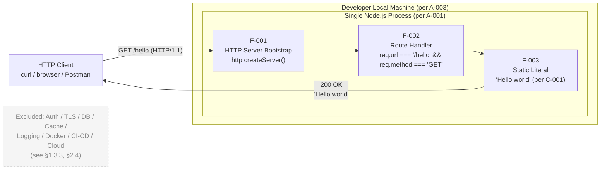

### 5.2.5 Process State Transition Diagram

The only state machine of substance in the system is the Node.js process itself. Application-level state, persistent state, session state, and cache state are all absent. The diagram below documents the entire state space:


**State machine properties**:

- The `Handling` state is **transient by design**; the handler is a pure function of `(req, res)` and produces a constant response (§2.2.3); it never blocks on I/O, never awaits a downstream call, and never queues work.
- There is **no `Recovering` state, no `Degraded` state, and no `CircuitOpen` state**, because §1.3.3 excludes retries, circuit breakers, and fallback mechanisms.
- The transition from `Handling` back to `Listening` is unconditional in scope: there is no error branch out of `Handling` because the handler does no work that can fail under the spec's acceptance criteria.

### 5.2.6 Sequence Diagram for the Canonical Request Flow

The following sequence diagram details the internal call chain across all three components for a successful `GET /hello` request:

```mermaid
sequenceDiagram
    autonumber
    participant Client as HTTP Client<br/>(curl / browser / Postman)
    participant HTTP as Node.js core<br/>'http' module
    participant Handler as Route Handler<br/>callback

    Note over Client,Handler: Pre-condition: F-001 bootstrap complete;<br/>server is in 'Listening' state.

    Client->>HTTP: TCP connect + GET /hello HTTP/1.1
    activate HTTP
    HTTP->>HTTP: Parse request line and headers
    HTTP->>HTTP: Construct req (IncomingMessage)<br/>and res (ServerResponse)
    HTTP->>Handler: invoke callback(req, res)
    activate Handler

    alt req.url === '/hello' AND req.method === 'GET'
        Handler->>Handler: Evaluate URL match (F-002-RQ-001)
        Handler->>Handler: Evaluate method match (F-002-RQ-002)
        Handler->>HTTP: res.statusCode = 200 (F-002-RQ-003)
        Handler->>HTTP: res.end('Hello world') (F-003-RQ-001)
    else Non-matching URL or method
        Handler-->>HTTP: Behavior unspecified by §2.2;<br/>defaults to whatever the handler<br/>does in that branch (§1.3.3)
    end

    deactivate Handler
    HTTP-->>Client: HTTP/1.1 200 OK<br/>Body: 'Hello world'
    deactivate HTTP

    Note over Client,Handler: Post-condition: connection closed;<br/>server returns to 'Listening'.
```

---

## 5.3 TECHNICAL DECISIONS

This subsection documents the key architecture decisions made during specification, providing rationale, trade-offs accepted, and traceability to upstream constraints. Each decision is captured as an Architecture Decision Record (ADR).

### 5.3.1 Architecture Style Decisions and Trade-offs

#### 5.3.1.1 Decision: Single-Process Monolithic Architecture

| Aspect | Detail |
|---|---|
| Decision | One Node.js process running a single JavaScript source file |
| Rationale | Minimum-complexity principle (§1.1.2); pedagogical clarity (§1.2.3); local execution context (§1.3.2) |
| Alternatives Considered | Multi-process clustering, microservice split, serverless function |
| Trade-off Accepted | No horizontal scaling capability; not suitable for production traffic |
| Source Authority | A-001 (§2.6.1); §1.3.2 |

The decision to run as a single process is direct: the user requirement specifies a tutorial Node.js application, and assumption A-001 explicitly mandates that "a single Node.js process is sufficient for the tutorial's instructional purpose." Multi-process patterns add operational complexity (process supervision, inter-process communication) without conferring any in-scope benefit.

#### 5.3.1.2 Decision: Communication Pattern — Synchronous Request-Response

| Aspect | Detail |
|---|---|
| Decision | Synchronous HTTP/1.1 request-response over TCP |
| Rationale | F-002 requires only a single GET request → 200 OK response; no asynchronous semantics needed |
| Alternatives Considered | Asynchronous messaging, event-driven choreography, WebSocket, server-sent events |
| Trade-off Accepted | No support for streaming, push notifications, or long-lived connections |
| Source Authority | §1.3.1 "Key Technical Requirements"; F-002-RQ-001/002/003 (§2.2.2) |

### 5.3.2 HTTP Layer Selection

This decision was deferred by §1.2.2 ("the specific HTTP layer—whether the native `http` module, Express, Fastify, Koa, or another framework—is a design decision intentionally deferred to subsequent sections") and resolved in §3.3.2, satisfying assumption A-002.

#### 5.3.2.1 Decision Tree

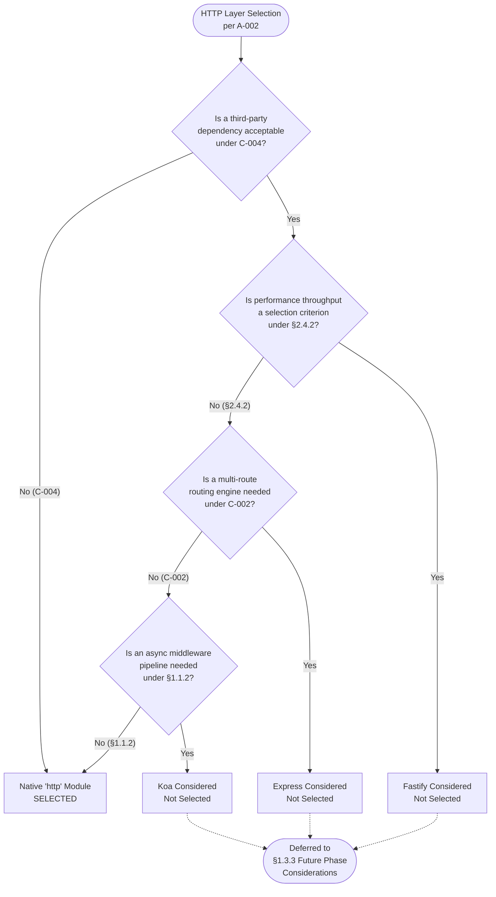

#### 5.3.2.2 Justification Summary

The selection of the core `http` module over Express, Fastify, or Koa rests on five mutually reinforcing arguments:

| # | Argument | Anchored In |
|---|---|---|
| 1 | **Lowest incidental complexity.** The `http` module exposes a single function call (`createServer`) that maps directly to the F-001 capability. | §1.1.2; §2.4.5 |
| 2 | **Zero added dependencies.** Selecting `http` keeps the open-source dependency count at zero, eliminating supply-chain risk. | C-004; §3.4.1 |
| 3 | **Most direct F-001/F-002/F-003 mapping.** The three features map one-for-one to `http.createServer` → callback dispatch → `res.end('Hello world')`. | §2.1, §2.3 |
| 4 | **Instructional transparency.** Learners see exactly how an HTTP request is received, dispatched, and answered. | §1.1.4; §1.2.3 |
| 5 | **No version-coordination burden.** No compatibility matrix between framework version and runtime version. | §2.4.5 |

#### 5.3.2.3 Trade-off Accepted

Registering a single route requires a conditional check on `req.url` and `req.method` inside the `createServer` callback, rather than the more idiomatic `app.get('/hello', ...)` of Express. For a single-route project, this trade-off is negligible — the resulting handler is on the order of five to seven lines of JavaScript — and is outweighed by every argument in the table above.

### 5.3.3 Data Storage Solution Rationale

**No data storage solution is adopted.** The decision is grounded as follows:

| Storage Concern | Disposition | Source |
|---|---|---|
| Relational database | Not adopted | §3.6.1, §3.6.2 |
| Document store | Not adopted | §3.6.1, §3.6.2 |
| Key-value store | Not adopted | §3.6.2 |
| File-based persistence | Not adopted | §3.6 |
| Configuration store | Not adopted | §2.3.3 |

The system has no data domains, no entities with identity or lifecycle, and no state that survives a process restart. The single static response payload (`Hello world`) is part of the source code and therefore requires no external storage substrate. Any future extension that introduces dynamic content, persistent user data, or audit history MUST re-open this decision.

### 5.3.4 Caching Strategy Justification

**No caching layer is adopted.** The rationale is twofold:

1. **Caching presupposes a source of computational cost or latency to amortize.** Per F-003, the response is a hard-coded literal with O(1) production cost; there is nothing to cache.
2. **Caching adds infrastructure surface area** (cache invalidation, consistency, eviction policy) that violates the §1.1.2 minimum-complexity principle.

| Cache Type | Adoption | Rationale |
|---|---|---|
| In-process memory cache | Not adopted | No computational cost to amortize (§3.6.2) |
| Distributed cache (Redis, Memcached) | Not adopted | No shared state across instances; only one instance (§3.6.2) |
| HTTP caching (Cache-Control headers) | Not specified | Not mandated by F-002; tutorial author may add if desired |
| Browser cache | Not specified | Outside system boundary |

The handler is **idempotent by construction** because F-003-RQ-001 mandates a constant body and F-003-RQ-002 forbids dynamic computation. Idempotency without state mutation eliminates the consistency concerns that typically motivate caching.

### 5.3.5 Security Mechanism Selection

The system operates under an **anonymous-access-by-design** posture. The rationale is that the sole response is a fixed, non-sensitive English literal; no confidential data, no privileged operation, and no protected resource exists within the system boundary that would require authentication or authorization controls.

| Security Concern | Disposition | Source |
|---|---|---|
| Authentication | Excluded | §1.3.3 |
| Authorization | Excluded | §1.3.3 |
| HTTPS / TLS termination | Excluded | §1.3.3 |
| CORS handling | Not specified | §1.3.3 "Unsupported Use Cases" |
| Anonymous caller posture | Required (by design) | §1.3.2 |
| Input validation / schema enforcement | Excluded | §1.3.3 |
| Rate limiting | Excluded | §1.3.3 |

**Forward-compatibility note**: Any future extension that introduces protected resources, dynamic content, mutable state, or persistent user data MUST revisit every row of this table. The current absence of security controls is a function of the tutorial scope and is **not** a recommendation for any production derivative.

### 5.3.6 Architecture Decision Records (ADRs)

The following ADRs capture the architectural decisions described above in the standard ADR format. Each is presented in tabular form for quick reference.

#### 5.3.6.1 ADR-001: Adopt Single-Process Monolithic Architecture

| Field | Content |
|---|---|
| Status | Accepted |
| Context | The user-specified deliverable is a Node.js tutorial with one HTTP endpoint. The execution context is local (A-003) and the scope precludes operational complexity (§1.3.3). |
| Decision | The system shall run as a single Node.js process with no clustering, sharding, or multi-process coordination. |
| Consequences | (+) Minimum operational footprint; trivially understandable. (−) No horizontal scaling within the tutorial scope (acceptable: §1.3.3 explicitly excludes scaling). |
| Traceability | A-001; §1.3.2; §1.1.2 |

#### 5.3.6.2 ADR-002: Select Node.js Core `http` Module Over Framework Alternatives

| Field | Content |
|---|---|
| Status | Accepted |
| Context | §1.2.2 deferred the HTTP-framework choice to a later section. The candidate set was native `http`, Express, Fastify, and Koa. |
| Decision | The Node.js core `http` module is selected as the HTTP layer for `12nov07`. |
| Consequences | (+) Zero third-party dependencies; transparent to learners; no version-coordination burden. (−) Single-route registration requires a conditional check inside the callback (accepted trade-off). |
| Traceability | A-002; C-004; §3.3.2 |

#### 5.3.6.3 ADR-003: Zero Persistence and No Caching Layer

| Field | Content |
|---|---|
| Status | Accepted |
| Context | The sole capability returns a hard-coded literal. There is no source of computational cost or persistent state to manage. |
| Decision | No database, file store, in-memory cache, or distributed cache shall be adopted. |
| Consequences | (+) Eliminates infrastructure complexity, schema evolution, and consistency concerns. (−) Any future stateful feature must re-open this decision. |
| Traceability | §3.6; F-003-RQ-001; §1.3.3 |

#### 5.3.6.4 ADR-004: Anonymous Access by Design

| Field | Content |
|---|---|
| Status | Accepted |
| Context | The response is a fixed, non-sensitive English literal. No confidential resource or privileged operation exists in scope. |
| Decision | No authentication, authorization, HTTPS, CORS, or input validation shall be implemented. |
| Consequences | (+) Trivial caller ergonomics; minimal code surface. (−) The system is not suitable for any production exposure; the tutorial scope must not be extended without re-opening this ADR. |
| Traceability | §1.3.2; §1.3.3 |

#### 5.3.6.5 ADR-005: Target Node.js Active LTS (24.x) with Maintenance LTS (22.x) Accepted

| Field | Content |
|---|---|
| Status | Accepted |
| Context | The user specification mandates Node.js. The Node.js project maintains multiple concurrent release lines as of June 2026. |
| Decision | Recommend Node.js 24.x (Active LTS); accept Node.js 22.x (Maintenance LTS) for existing installations. |
| Consequences | (+) Long support window aligned with the §1.2.3 instructional reference criterion. (−) Learners on Current (non-LTS) releases may receive less stable behavior. |
| Traceability | §3.3.1; A-003 |

---

## 5.4 CROSS-CUTTING CONCERNS

This subsection documents how the architecture addresses concerns that span multiple components. In keeping with the project's tutorial scope, most cross-cutting concerns are **intentionally absent with traceable justification** rather than implemented; each absence is documented with its source authority.

### 5.4.1 Monitoring and Observability Approach

**No observability infrastructure is in scope.** The decision is grounded in §1.3.3, which explicitly excludes "Observability: Logging, metrics, distributed tracing" from the project scope.

| Observability Surface | Adoption | Source |
|---|---|---|
| Application metrics (counters, gauges, histograms) | Not adopted | §1.3.3 |
| Distributed tracing (OpenTelemetry, Jaeger) | Not adopted | §1.3.3 |
| Health-check endpoints (e.g., `/health`, `/ready`) | Not adopted | C-002 limits the system to exactly one endpoint (`/hello`) |
| Process-level metrics (CPU, memory, event-loop lag) | Not adopted | §1.3.3 |
| External dashboards (Grafana, Datadog, CloudWatch) | Not adopted | §1.3.3; C-004 |

The only "monitoring" available to the developer is direct observation: running `node app.js` in a terminal and verifying that the process does not exit unexpectedly, then issuing `curl http://localhost:<port>/hello` and inspecting the response body. This satisfies the §1.2.3 critical success factors (a) and (b) without infrastructure.

### 5.4.2 Logging and Tracing Strategy

**No structured logging or tracing strategy is implemented.** Per §1.3.3, logging, metrics, and distributed tracing are explicitly excluded.

| Logging Concern | Disposition | Source |
|---|---|---|
| Structured log emission (JSON to stdout) | Not adopted | §1.3.3 |
| Log aggregation (ELK, Splunk, Loki) | Not adopted | §1.3.3; C-004 |
| Trace propagation (W3C Trace Context, B3) | Not adopted | §1.3.3 |
| Correlation IDs | Not adopted | §1.3.3 |
| Audit log emission | Not adopted | §1.3.3 |

A tutorial author may, at their discretion, insert a `console.log` statement at server-start time to print a "listening on port N" message; this is an implementation convenience and **is not** a required architectural element.

### 5.4.3 Error Handling Patterns

The only error path explicitly recognized by the specification is the **bootstrap failure** shown in the diagram below. If `server.listen()` fails to bind a port (e.g., port already in use, insufficient privileges), the process exits with an unhandled error and the F-001-RQ-001 acceptance criterion is violated.

#### 5.4.3.1 Error Handling Flow Diagram

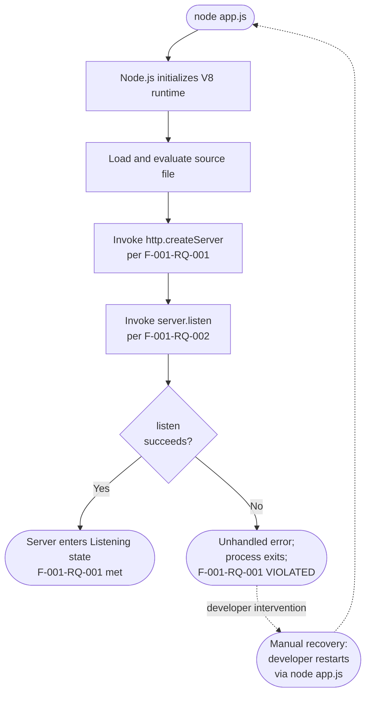

#### 5.4.3.2 Runtime Error Handling

| Mechanism | Disposition | Source |
|---|---|---|
| Retry loops | Out of scope — no retries in any flow | §1.3.3 "Rate limiting, retries, circuit breakers" |
| Exponential backoff | Out of scope | §1.3.3 |
| Circuit breakers | Out of scope | §1.3.3 |
| Fallback responses | Not specified — no upstream or downstream exists | §1.3.1; §2.3.2 |
| Bulkheads / timeouts | Not specified | §1.3.3 |
| Global `uncaughtException` handler | Not specified — tutorial author may add for didactic purposes | §1.3.3 (not required) |
| Per-request error handling | Not required — handler has no failure modes under spec acceptance criteria | §4.4.1.1 |

The specification does **not** mandate any specific error-handling code beyond the implicit requirement that bootstrap not throw. A tutorial author may choose to attach an `'error'` event listener on the server (`server.on('error', …)`) for didactic purposes, but this is an implementation decision, not a requirement. The handler itself has **no failure modes within scope** because the operations it performs (constant assignments, constant string emission) cannot fail under the acceptance criteria.

### 5.4.4 Authentication and Authorization Framework

**No authentication or authorization framework is in scope.** The system operates under anonymous access by design (ADR-004).

| Concern | Disposition | Source |
|---|---|---|
| Caller identification (API keys, JWTs, sessions) | Not adopted | §1.3.3 |
| Identity provider integration (OAuth, SAML, OIDC) | Not adopted | §1.2.1; C-004 |
| Role-based access control (RBAC) | Not adopted | §1.3.3 |
| Attribute-based access control (ABAC) | Not adopted | §1.3.3 |
| Per-route authorization checks | Not adopted | §1.3.3 |
| HTTPS / TLS termination | Not adopted | §1.3.3 |

The architectural absence of caller identification is consistent with the absence of protected resources: there is no privileged operation to gate and no user data to scope. The only response (`Hello world`) is public by definition.

### 5.4.5 Performance Requirements and SLAs

**No performance KPIs, SLOs, or SLAs are declared.** This is anchored in three independent specification statements:

| Statement | Source |
|---|---|
| "performance characteristics beyond functional correctness are explicitly not measured at this stage and are deferred to any future, production-oriented derivative work" | §1.2.3 |
| "No performance KPIs, service-level objectives, latency targets, or throughput thresholds are declared" | §2.4.2 |
| "Performance Criteria: None declared" (repeated for F-001, F-002, F-003) | §2.2.1, §2.2.2, §2.2.3 |

| Performance Dimension | Target | Source |
|---|---|---|
| Request latency (p50, p95, p99) | None declared | §2.4.2 |
| Throughput (requests per second) | None declared | §2.4.2 |
| Concurrent connections | None declared | §2.4.2 |
| Memory footprint | None declared | §2.4.2 |
| Startup time | None declared | §2.4.2 |
| Availability percentage (uptime SLA) | None declared | §1.3.3 (no HA in scope) |

The architecture's single-process, synchronous, in-memory design is comfortably sufficient for the developer-local workload contemplated by the specification. No performance instrumentation is therefore required, and no performance test is part of the deliverable.

### 5.4.6 Disaster Recovery Procedures

The disaster-recovery posture is **manual restart by the developer**. There is no automated recovery, no high-availability deployment, no failover infrastructure, and no backup/restore procedure.

| DR Concern | Disposition | Source |
|---|---|---|
| Error notification (alerts, paging) | Out of scope | §1.3.3 |
| Structured error logs | Out of scope | §1.3.3 |
| Dead-letter queues | Not applicable — no asynchronous work | §1.3.2; §2.3.2 |
| Automated recovery procedures | Not specified — no HA deployment in scope | §1.3.3 |
| Backup of persistent data | Not applicable — no persistent data | §3.6 |
| Replication / failover | Not applicable — single instance | §1.3.3 |
| Manual recovery procedure | Implicit: developer restarts the process with `node app.js` | §4.2.2 (re-entry into Bootstrap workflow) |

The recovery workflow recognized by the project is the developer's manual re-invocation of the bootstrap sequence (`node app.js`) after any termination event. This is consistent with assumption A-003 (local execution on the developer's machine) and represents the entirety of the disaster-recovery story within scope.

### 5.4.7 Supply-Chain and Operational Posture

The zero-dependency posture confers a series of security and operational benefits that are particularly appropriate for a tutorial. While not a traditional "cross-cutting concern" in the production sense, these properties are byproducts of the architectural choices and worth surfacing here:

| Property | Mechanism |
|---|---|
| Zero supply-chain attack surface | No third-party code is fetched, resolved, or executed |
| Reproducible setup | The only setup step is the Node.js installation itself (A-003) |
| No deprecation drift | The codebase cannot be invalidated by abandonment of an upstream package |
| No CVE bookkeeping | There are no dependency CVEs to monitor (§2.4.4) |

### 5.4.8 Cross-Cutting Concerns Summary Matrix

The following summary matrix consolidates the disposition of every cross-cutting concern enumerated above, providing a single reference for architectural reviewers:

| Concern Category | Disposition | Future-Phase Trigger |
|---|---|---|
| Monitoring & metrics | Not in scope | Production exposure or multi-instance deployment |
| Logging & tracing | Not in scope | Multi-component evolution or operational debugging needs |
| Error handling (runtime) | Implicit only (handler has no failure modes) | Introduction of I/O, downstream calls, or stateful logic |
| Authentication | Not in scope | Introduction of protected resources or user data |
| Authorization | Not in scope | Multi-role or multi-tenant capability |
| Performance SLAs | Not declared | Production deployment or commercial use |
| Disaster recovery | Manual restart only | Production deployment or availability commitments |
| Persistence | Not in scope | Introduction of stateful capability |
| Caching | Not in scope | Introduction of computationally expensive responses |
| Configuration management | Not in scope | Multi-environment deployment |

Each "Not in scope" entry is **deliberate and traceable** to a specific upstream specification source. Future extensions of the project must, before adding the corresponding capability, re-open the architectural review and update both the relevant ADR and this summary matrix.

---

## 5.5 REFERENCES

### 5.5.1 Repository Files Examined

- `README.md` — Confirmed greenfield state of repository; contains only the single line `# 12nov07`. This file is the sole authoritative source for the canonical repository name preserved verbatim by constraint C-003.
- `/` (repository root) — Inspected at depth 0; contains only `README.md` and the `.git/` metadata directory. No source files, configuration files, dependency manifests, or directory structure exist in the initial state.

### 5.5.2 Technical Specification Sections Referenced

- **§1.1 Executive Summary** — Project overview, stakeholder taxonomy, value proposition, minimum-complexity principle (§1.1.2), instructional reference objective (§1.1.4)
- **§1.2 System Overview** — Project context, primary capability table (§1.2.2), major component decomposition, success criteria (§1.2.3)
- **§1.3 Scope** — In-scope features (§1.3.1), system boundaries (§1.3.2), comprehensive out-of-scope catalog (§1.3.3)
- **§1.4 References** — Confirmation of greenfield repository state
- **§2.1 Feature Catalog** — F-001, F-002, F-003 feature definitions and technical context
- **§2.2 Functional Requirements Table** — F-001-RQ-001/002/003 (§2.2.1), F-002-RQ-001/002/003 (§2.2.2), F-003-RQ-001/002 (§2.2.3) with acceptance criteria
- **§2.3 Feature Relationships** — Feature dependency map (§2.3.1), integration points (§2.3.2), shared components (§2.3.3)
- **§2.4 Implementation Considerations** — Performance requirements posture (§2.4.2), maintenance requirements and minimum-complexity reaffirmation (§2.4.5)
- **§2.5 Traceability Matrix** — Requirement-to-source traceability
- **§2.6 Assumptions and Constraints** — A-001 through A-004 (§2.6.1), C-001 through C-005 (§2.6.2)
- **§3.1 Stack Summary and Design Philosophy** — Complete technology stack table and guiding principles
- **§3.2 Programming Languages** — JavaScript/ECMAScript selection rationale
- **§3.3 Frameworks and Libraries** — Node.js runtime versioning strategy (§3.3.1), native `http` module selection (§3.3.2) with five-point justification (§3.3.2.2), framework alternatives evaluation (§3.3.3), compatibility matrix (§3.3.4)
- **§3.4 Open-Source Dependencies** — Zero-dependency posture documentation
- **§3.5 Third-Party Services** — Empty by design (explicitly documented)
- **§3.6 Databases and Storage** — Empty by design (explicitly documented)
- **§3.7 Development and Deployment** — Required tools, no build system, no CI/CD, no IaC
- **§3.8 Technology Stack Diagram** — Source for the component interaction diagram in §5.2.4
- **§4.1 Overview of Process Flows** — Section scope and diagrammatic conventions
- **§4.2 System Workflows** — Bootstrap workflow (§4.2.2), request-response workflow (§4.2.3), internal integration sequence (§4.2.4)
- **§4.3 Flowchart Requirements Detail** — Three decision points enumerated; no validation rules; no authorization
- **§4.4 Technical Implementation of Process Flows** — State transition diagram (§4.4.1.1), persistence points (§4.4.1.2), caching/transaction boundaries (§4.4.1.3), error handling (§4.4.2)
- **§4.5 Out-of-Scope Workflow Categories** — Comprehensive negative coverage
- **§4.6 References** — Cross-references to upstream sections

# 6. SYSTEM COMPONENTS DESIGN

## 6.1 Core Services Architecture

### 6.1.1 APPLICABILITY DETERMINATION

#### 6.1.1.1 Summary Finding

**Core Services Architecture is not applicable for this system.**

The `12nov07` project is, by deliberate design and by every authoritative upstream specification source, a **single-process, monolithic, synchronous HTTP request-response service** executing on the Node.js runtime. It has exactly one HTTP route, zero third-party dependencies, zero external integrations, no persistent state, and no operational concerns whatsoever within its declared scope. Microservices boundaries, distributed-service communication, service discovery, load balancing, auto-scaling, circuit breakers, retries, fallbacks, failover, replication, and degradation policies — every concern enumerated in the Core Services Architecture template — are either explicitly **out of scope** (per §1.3.3, §2.4.3, §5.2.1.5, §5.4.3.2, §5.4.6) or **not applicable** (because there is exactly one service, one process, one instance, and one route in the entire system).

This determination is **not** a deferral or a TODO; it is a fully traced architectural decision recorded in ADR-001 (§5.3.6.1, status: Accepted) and reinforced by ADR-003 (zero persistence/caching) and ADR-004 (anonymous access by design).

#### 6.1.1.2 Architectural Context Justifying Non-Applicability

The system's architectural posture, lifted verbatim from §5.1.1, is the minimum viable configuration for delivering an HTTP endpoint on Node.js: one operating-system process, one source file, one HTTP route, and zero third-party dependencies. The architecture operates under a stateless, anonymous, synchronous posture with no application state, no session state, no persistent state, and no caller identification. Every invocation of `GET /hello` returns the same byte-for-byte identical response (`Hello world`), produced from a string literal embedded in the JavaScript source.

The architectural attributes that disqualify "Core Services Architecture" as a meaningful concern are summarised below, each row carrying a citation to the upstream source authority.

| Attribute | Selection | Source Authority |
|---|---|---|
| Process topology | Single Node.js process (monolith) | A-001 (§2.6.1); ADR-001 (§5.3.6.1) |
| Communication style | Synchronous HTTP/1.1 request-response | §5.3.1.2; §1.3.1 |
| Dependency posture | Zero third-party dependencies | C-004 (§2.6.2); §3.4.1 |
| State management | Stateless; no persistence; no cache | §3.6; ADR-003 (§5.3.6.3) |

#### 6.1.1.3 Authoritative Source Anchors

The non-applicability determination is anchored in six independent specification statements that converge on the same conclusion. Reviewers should treat any of these as sufficient justification on its own; collectively they are dispositive.

| Anchor | Statement | Source |
|---|---|---|
| A-001 | "A single Node.js process is sufficient for the tutorial's instructional purpose." | §2.6.1 |
| C-002 | Exactly one (1) endpoint may be exposed; the path MUST be `/hello`. | §2.6.2 |
| C-004 | No external integrations, persistence, or identity providers may be introduced. | §2.6.2 |
| ADR-001 | "The system shall run as a single Node.js process with no clustering, sharding, or multi-process coordination." (Status: Accepted) | §5.3.6.1 |
| §1.3.3 | Reliability, scaling, HA, observability, and persistence are all explicitly excluded. | §1.3.3 |
| §5.1.4 | "The system has zero external integrations." | §5.1.4 |

---

### 6.1.2 SERVICE COMPONENTS — DISPOSITION

This subsection addresses each "Service Components" concern enumerated in the section template. Every concern is recorded with its disposition (Not Applicable, Out of Scope, or Not Specified) and a traceable source.

#### 6.1.2.1 Service Components Disposition Matrix

| Concern | Disposition | Source Authority |
|---|---|---|
| Service boundaries and responsibilities | Not applicable — single process, no inter-service boundary | A-001; §5.1.1.3 |
| Inter-service communication patterns | Not applicable — only one service exists | §5.1.4; §5.3.1.2 |
| Service discovery mechanisms | Not applicable — no discoverable peers | §1.3.3; §5.1.4 |
| Load balancing strategy | Out of scope — single instance | §1.3.3; §2.4.3 |
| Circuit breaker patterns | Out of scope | §1.3.3; §5.4.3.2 |
| Retry and fallback mechanisms | Out of scope | §1.3.3; §5.4.3.2 |

#### 6.1.2.2 Logical Components Are Not Services

The system contains exactly **three logical components within a single Node.js process** (per §5.1.2), which must not be conflated with "services" in the distributed-systems sense. They share an address space, a thread of execution, and a call stack; they communicate only via in-process function invocation. The dependency graph is strictly linear and acyclic (F-001 → F-002 → F-003).

| Component | Role | Communication |
|---|---|---|
| HTTP Server Bootstrap (F-001) | Instantiate `http.createServer`, bind port | In-process callback registration |
| `/hello` Route Handler (F-002) | Evaluate `req.url`/`req.method`; assign status | Synchronous callback invocation by `http` module |
| Static Response Payload (F-003) | Emit `Hello world` literal | Argument to `res.end()` (in-process) |

The system boundary, per §5.1.1.3, is a single Node.js process that owns a single HTTP route; nothing outside that process falls within the implementation boundary. There is therefore no second component anywhere in the architecture that could constitute the *other* endpoint of an "inter-service" communication path.

#### 6.1.2.3 Communication, Discovery, and Load Balancing — Why Each Is Moot

- **Inter-service communication**: §5.1.3.2 documents a single integration pattern: synchronous HTTP/1.1 request-response over TCP between an external HTTP client and the Node.js process. No asynchronous messaging, no callback chains, no streaming, no WebSocket, and no message broker exists in the architecture. The handler is a pure function of `(req, res)` and produces a constant response; it never blocks on I/O, never awaits a downstream call, and never queues work.
- **Service discovery**: There are no peer services to discover. The HTTP client targets `http://localhost:<port>/hello` (per A-003's local execution context); no service registry, DNS-SD, Consul, etcd, or Kubernetes service object is in scope. The exclusion is reinforced by §1.3.3's prohibition on high-availability deployment.
- **Load balancing**: §2.4.3 explicitly records "High-availability deployment (clustering, load balancing)" as a non-goal, citing §1.3.3. §5.2.1.5 reinforces this: "multi-process scaling (clustering), horizontal scaling (load balancing), and vertical scaling (resource tuning) are not in scope." There is exactly one process binding exactly one port; no upstream balancer is anticipated.

#### 6.1.2.4 Circuit Breakers, Retries, and Fallbacks — Explicit Exclusions

Per the Runtime Error Handling matrix in §5.4.3.2, **every** resilience mechanism the section template asks about is recorded as out of scope or not specified:

| Mechanism | Disposition (per §5.4.3.2) |
|---|---|
| Retry loops | Out of scope (§1.3.3) |
| Exponential backoff | Out of scope (§1.3.3) |
| Circuit breakers | Out of scope (§1.3.3) |
| Fallback responses | Not specified — no upstream or downstream exists |

Two structural facts make these patterns vacuous even if one were to attempt to introduce them:

1. **There is no downstream call to retry, break, or fall back from.** The handler emits a string literal; it has no I/O, no database, and no third-party API call (§5.1.3.3 "zero data transformation points"; ADR-003 "no database, file store, in-memory cache").
2. **The handler has no failure modes within scope.** §5.4.3.2 states that "the handler itself has no failure modes within scope because the operations it performs (constant assignments, constant string emission) cannot fail under the acceptance criteria."

---

### 6.1.3 SCALABILITY DESIGN — DISPOSITION

This subsection addresses each "Scalability Design" concern enumerated in the section template. Every concern is recorded with its disposition and a traceable source.

#### 6.1.3.1 Scalability Design Disposition Matrix

| Concern | Disposition | Source Authority |
|---|---|---|
| Horizontal/vertical scaling approach | Out of scope — single process by mandate | A-001; §2.4.3; §5.2.1.5 |
| Auto-scaling triggers and rules | Not applicable — no orchestrator, no instance count | §1.3.3; §5.2.1.5 |
| Resource allocation strategy | Implicit — developer's local Node.js process | A-003; §5.2.1.5 |
| Performance optimization techniques | Out of scope — no KPIs declared | §1.2.3; §2.4.2; §5.4.5 |
| Capacity planning guidelines | Not applicable — sized for single developer | §5.4.5 |

#### 6.1.3.2 Performance Posture

The system **declares no performance KPIs, SLOs, or SLAs**. This is anchored in three independent specification statements, recorded verbatim in §5.4.5:

| Statement | Source |
|---|---|
| "performance characteristics beyond functional correctness are explicitly not measured at this stage and are deferred to any future, production-oriented derivative work" | §1.2.3 |
| "No performance KPIs, service-level objectives, latency targets, or throughput thresholds are declared" | §2.4.2 |
| "Performance Criteria: None declared" (repeated for F-001, F-002, F-003) | §2.2.1, §2.2.2, §2.2.3 |

Every performance dimension that would normally inform a scalability discussion is recorded as undeclared:

| Performance Dimension | Target |
|---|---|
| Request latency (p50, p95, p99) | None declared |
| Throughput (requests per second) | None declared |
| Concurrent connections | None declared |
| Memory footprint | None declared |
| Startup time | None declared |
| Availability percentage (uptime SLA) | None declared |

§5.4.5 closes with the architectural assessment that "the architecture's single-process, synchronous, in-memory design is comfortably sufficient for the developer-local workload contemplated by the specification." No performance instrumentation is therefore required, and no performance test is part of the deliverable.

#### 6.1.3.3 Resource Footprint and Capacity Posture

- **Resource allocation strategy**: The system is sized for and bound to a developer's local Node.js process (per A-003). There is no cluster, no container, no orchestrator, and no resource-quota mechanism in scope. The Node.js runtime's default single-threaded event loop is the totality of the resource model.
- **Capacity planning**: Not applicable. The workload is one developer issuing `curl` requests against `http://localhost:<port>/hello`. No multi-tenant traffic, no production load, and no concurrency envelope is specified or anticipated.
- **Auto-scaling**: Not applicable. There is no instance count to vary, no scheduler to consult, no metric to scale on, and no scaling action to take.

#### 6.1.3.4 Performance Optimization Techniques

The minimum-complexity principle (§5.1.1.2, §2.4.5) actively rejects performance optimizations that are not required to satisfy an explicit functional requirement. The handler is **idempotent by construction** (per F-003-RQ-001 mandating a constant body and F-003-RQ-002 forbidding dynamic computation) and **stateless across invocations** (§5.2.2.5). These properties mean that, in any hypothetical future scaling scenario, the handler could be replicated freely without coordination — but no such replication is in scope for the present specification.

---

### 6.1.4 RESILIENCE PATTERNS — DISPOSITION

This subsection addresses each "Resilience Patterns" concern enumerated in the section template. Every concern is recorded with its disposition and a traceable source.

#### 6.1.4.1 Resilience Patterns Disposition Matrix

| Concern | Disposition | Source Authority |
|---|---|---|
| Fault tolerance mechanisms | Implicit only — handler has no failure modes | §5.4.3.2; §5.4.8 |
| Disaster recovery procedures | Manual restart by developer | §5.4.6 |
| Data redundancy approach | Not applicable — no persistent data | §3.6; ADR-003 (§5.3.6.3) |
| Failover configurations | Not applicable — single instance | §1.3.3; §5.4.6 |
| Service degradation policies | Not applicable — no degradation state exists | §5.2.5 |

#### 6.1.4.2 Fault Tolerance Posture

§5.4.3.2 enumerates every fault-tolerance mechanism that the section template might expect and records each as out of scope or not specified. The architecture recognises exactly **one** error path: the bootstrap failure shown in the diagram in §5.4.3.1 (if `server.listen()` fails to bind a port, the process exits with an unhandled error and the F-001-RQ-001 acceptance criterion is violated). No other error path exists in scope.

Critically, the process state machine documented in §5.2.5 contains **no `Recovering` state, no `Degraded` state, and no `CircuitOpen` state**, because §1.3.3 excludes retries, circuit breakers, and fallback mechanisms. The state space of the entire system is `Uninitialized → Initializing → Listening ↔ Handling → Terminated`; no resilience state is reachable.

#### 6.1.4.3 Disaster Recovery Posture

The disaster-recovery story is documented verbatim in §5.4.6: **manual restart by the developer**. There is no automated recovery, no high-availability deployment, no failover infrastructure, and no backup/restore procedure. The DR Concerns matrix from §5.4.6 is reproduced in summary form below.

| DR Concern | Disposition |
|---|---|
| Error notification (alerts, paging) | Out of scope (§1.3.3) |
| Structured error logs | Out of scope (§1.3.3) |
| Dead-letter queues | Not applicable — no asynchronous work |
| Automated recovery procedures | Not specified — no HA deployment in scope |
| Backup of persistent data | Not applicable — no persistent data (§3.6) |
| Replication / failover | Not applicable — single instance |
| Manual recovery procedure | Implicit: developer restarts via `node app.js` |

#### 6.1.4.4 Data Redundancy and Failover

- **Data redundancy**: ADR-003 (§5.3.6.3) records: "No database, file store, in-memory cache, or distributed cache shall be adopted." §3.6 confirms: the project has no databases, no persistent storage, no in-memory caches, and no file-based state. The hard-coded string `Hello world` is part of the source file itself and not a stored value in any meaningful sense (per §5.1.3.4). There is therefore no data to replicate, snapshot, or back up.
- **Failover configurations**: Not applicable. There is exactly one instance of the process, on the developer's local machine. No standby, warm spare, or active-active partner exists in the architecture.

#### 6.1.4.5 Service Degradation Policies

No service degradation concept applies. The architecture provides exactly one response on the success path and one — unspecified — branch in the negative-match case (per §5.2.2.1's note that "behavior is intentionally unspecified by §2.2"). There is no graduated quality-of-service, no shed-load policy, no degraded mode, and no priority tier. The §5.4.8 cross-cutting summary records "Error handling (runtime) — Implicit only (handler has no failure modes)".

---

### 6.1.5 ARCHITECTURAL DIAGRAMS JUSTIFYING NON-APPLICABILITY

The diagrams below visualise the architectural reality that disqualifies Core Services Architecture as a meaningful concern. Each diagram is annotated with the upstream source authority.

#### 6.1.5.1 Monolithic Single-Process Topology

This diagram shows the actual deployable topology: a single Node.js process on a developer's local machine, containing all three logical components. The shaded annotation lists the distributed-architecture concerns that are explicitly excluded.

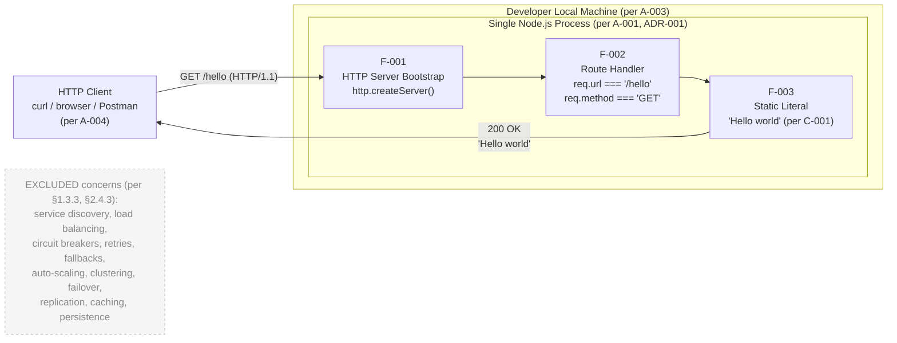

**Reading the diagram**: There is exactly one process boundary, one network ingress, and one in-process call chain. No second service, no orchestrator, no service mesh, and no broker is present anywhere in the architecture. The "EXCLUDED" annotation is non-load-bearing — it has no edges connecting it to the live components, because none of those concepts have a place in this architecture.

#### 6.1.5.2 Process State Space — Absence of Resilience States

The diagram below, sourced from §5.2.5, documents the **entire** state space of the system. The absence of `Recovering`, `Degraded`, and `CircuitOpen` states is itself the evidence that resilience patterns are not applicable.

```mermaid
stateDiagram-v2
    [*] --> Uninitialized
    Uninitialized --> Initializing : node app.js<br/>(per A-003)
    Initializing --> Listening : http.createServer() returns<br/>AND server.listen() emits 'listening'<br/>(F-001-RQ-001/002/003)
    Initializing --> Terminated : startup error<br/>(violates F-001-RQ-001)
    Listening --> Handling : inbound request arrives;<br/>callback(req, res) invoked
    Handling --> Listening : res.end() returns;<br/>connection closed
    Listening --> Terminated : SIGINT / SIGTERM
    Handling --> Terminated : SIGINT / SIGTERM<br/>(implementation-defined)
    Terminated --> [*]

    note right of Handling
        No 'Recovering', 'Degraded',
        or 'CircuitOpen' state exists.
        Per §5.2.5 and §5.4.3.2,
        retries, circuit breakers, and
        fallback mechanisms are
        out of scope.
    end note
```

**Reading the diagram**: The only failure transition is `Initializing → Terminated` (bootstrap error). There is no error transition out of `Handling`, because the handler does no work that can fail under the spec's acceptance criteria (per §5.4.3.2). Manual recovery (per §5.4.6) re-enters the diagram at `Uninitialized` via the developer issuing `node app.js`.

#### 6.1.5.3 Resilience Pattern Inventory — All Excluded

The diagram below visualises the relationship between the in-scope architecture (left) and the resilience/scalability patterns that are explicitly **out of scope** (right). Each excluded pattern carries its source authority for traceability.

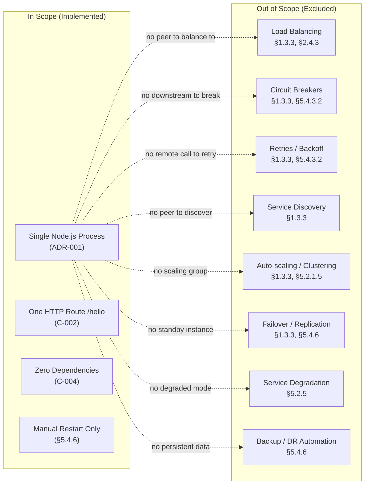

**Reading the diagram**: The dashed arrows are *justifications*, not interactions. Each rationale on a dashed edge explains why the in-scope monolith makes the corresponding distributed-architecture concern structurally vacuous.

---

### 6.1.6 FORWARD-COMPATIBILITY TRIGGERS

The non-applicability finding documented in this section is **scope-bound to the present tutorial specification (version 1.0)**, not a permanent assertion. §5.4.8 enumerates the future-phase triggers that would require re-opening this determination, along with the corresponding ADRs that would need revision.

| Future Trigger | Section 6.1 Concerns Re-Opened |
|---|---|
| Production exposure or multi-instance deployment | Load balancing; failover; auto-scaling; observability |
| Multi-component evolution or operational debugging needs | Logging & tracing; inter-service communication |
| Introduction of I/O, downstream calls, or stateful logic | Circuit breakers; retries; fallbacks; data redundancy |
| Multi-role or multi-tenant capability | Service boundaries; service discovery |

Per §1.3.3 "Future Phase Considerations", any extension of the application — additional endpoints, dynamic data, persistence, authentication, or production deployment — constitutes a future phase and is not part of the current specification. Such extensions are anticipated as natural learning exercises that build upon the foundation established here, but are explicitly outside the present scope. Any of these triggers would obligate the author to:

1. Re-open the relevant ADR(s) in §5.3.6 (notably ADR-001 for monolithic posture; ADR-003 for persistence; ADR-004 for anonymous access).
2. Re-author this Section 6.1 with substantive content for each then-applicable concern.
3. Update the §5.4.8 Cross-Cutting Concerns Summary Matrix to reflect the new dispositions.

Until such a trigger materialises, the disposition matrices in §6.1.2.1, §6.1.3.1, and §6.1.4.1 are dispositive and the section's headline finding ("Core Services Architecture is not applicable for this system") stands.

---

### 6.1.7 SECTION CROSS-REFERENCES

Reviewers seeking deeper detail on any of the non-applicability claims above should consult the following upstream sections, each of which contains the primary evidence for one or more rows in the disposition matrices.

| Topic | Primary Reference |
|---|---|
| Single-process mandate | §2.6.1 (A-001); §5.3.6.1 (ADR-001) |
| One-endpoint constraint | §2.6.2 (C-002); §1.3.1 |
| No external integrations | §2.6.2 (C-004); §5.1.4 |
| No persistence/caching | §3.6; §5.3.6.3 (ADR-003) |
| No scaling/HA | §1.3.3; §2.4.3; §5.2.1.5 |
| No circuit breakers/retries/fallbacks | §1.3.3; §5.4.3.2 |
| No performance KPIs | §1.2.3; §2.4.2; §5.4.5 |
| Manual DR posture | §5.4.6 |
| Component model (in-process, not services) | §5.1.2; §5.2.1 – §5.2.3 |
| State space (no degradation states) | §5.2.5 |
| Cross-cutting summary matrix | §5.4.8 |

---

### 6.1.8 REFERENCES

#### Files Examined

- `README.md` — Confirmed to contain only a single H1 heading (`# 12nov07`); no implementation files exist in the repository (greenfield state per §1.4.1). Establishes the baseline that no service infrastructure of any kind has been authored.
- Repository root (depth 0) — Contains only `README.md`; no source code, no configuration, no subfolders, no `package.json`, no lockfile. Reinforces the zero-dependency, single-process posture documented in C-004 and §3.4.1.

#### Technical Specification Sections Consulted

- **§1.2 SYSTEM OVERVIEW** — Established single-endpoint capability, two logical components per §1.2.1, and absence of declared performance KPIs.
- **§1.3 SCOPE** — Primary source for explicit exclusions of reliability mechanisms (rate limiting, retries, circuit breakers), HA deployment (clustering, load balancing), observability, persistence, and operational automation.
- **§2.4 IMPLEMENTATION CONSIDERATIONS** — Direct source for §2.4.3 "Scalability is explicitly out of scope" and §2.4.2 "No performance KPIs… are declared".
- **§2.6 ASSUMPTIONS AND CONSTRAINTS** — Source for A-001 (single process sufficient), A-003 (local execution), C-002 (one endpoint), C-004 (no external integrations), C-005 (no observability/deployment).
- **§3.6 DATABASES AND STORAGE** — Confirms zero persistence; underpins the "data redundancy not applicable" finding.
- **§5.1 HIGH-LEVEL ARCHITECTURE** — Defines the monolithic single-process architecture in §5.1.1, the system boundary in §5.1.1.3, and the "zero external integrations" finding in §5.1.4.
- **§5.2 COMPONENT DETAILS** — Source for the three-component logical decomposition (F-001, F-002, F-003); the §5.2.1.5 "scaling explicitly out of scope" statement; the §5.2.5 state diagram documenting absence of `Recovering`/`Degraded`/`CircuitOpen` states.
- **§5.3 TECHNICAL DECISIONS** — Source for ADR-001 (single-process monolithic, status: Accepted), ADR-003 (zero persistence/caching), and ADR-004 (anonymous access by design).
- **§5.4 CROSS-CUTTING CONCERNS** — Direct source for §5.4.3.2 (circuit breakers, retries, fallbacks all out of scope), §5.4.5 (no performance SLAs), §5.4.6 (manual restart DR posture), and §5.4.8 (future-phase triggers matrix).

## 6.2 Database Design

### 6.2.1 APPLICABILITY DETERMINATION

#### 6.2.1.1 Summary Finding

**Database Design is not applicable to this system.**

The `12nov07` tutorial project — whose sole functional deliverable is the `GET /hello` endpoint returning the static literal string `Hello world` — has, by deliberate architectural design and by every authoritative upstream specification source, no database, no persistent storage, no in-memory cache, no distributed cache, no file-based state, and no data entities of any kind. Section §3.6 records this finding directly: "The project has no databases, no persistent storage, no in-memory caches, and no file-based state." Every concern enumerated in the Database Design template — schema design (entity relationships, data models, indexing, partitioning, replication, backup), data management (migrations, versioning, archival, retrieval, caching), compliance (retention, privacy, audit, access control), and performance optimization (query tuning, caching, connection pooling, read/write splitting, batch processing) — is either **structurally vacuous** (because there is no data substrate to govern) or **explicitly out of scope** per a documented Architecture Decision Record.

This determination is **not** a deferral, a TODO, or an oversight. It is a fully traced architectural decision recorded in **ADR-003** (§5.3.6.3, status: *Accepted*) titled *"Zero Persistence and No Caching Layer"*, and it is reinforced by constraint **C-004** (§2.6.2), the §3.6 storage exclusion matrix, §1.3.3 scope exclusions, and the §5.4.8 Cross-Cutting Concerns Summary Matrix. The hard-coded string `Hello world` exists exclusively in the JavaScript source file; per §3.6.2, "It is not a stored value in any meaningful sense; the storage medium is the source file itself."

#### 6.2.1.2 Architectural Context Justifying Non-Applicability

The architectural posture that disqualifies Database Design as a meaningful concern is the **stateless, anonymous, synchronous, in-memory monolith** documented in §5.1 and §6.1. The system contains exactly one Node.js process, one HTTP route, one response literal, and zero third-party dependencies. Every invocation of `GET /hello` returns the same byte-for-byte identical response (`Hello world`), produced from a string literal embedded directly in the JavaScript source. No data is read, written, queried, indexed, cached, replicated, or persisted across the request lifecycle. The handler is a pure function of `(req, res)` that, per §6.1.2.3, "produces a constant response; it never blocks on I/O, never awaits a downstream call, and never queues work."

| Attribute | Selection | Source Authority |
|---|---|---|
| Persistence layer | None — zero databases, files, or external stores | §3.6; ADR-003 (§5.3.6.3) |
| Caching layer | None — zero in-process or distributed caches | §5.3.4; ADR-003 |
| Data entities | None — no records, tables, documents, or domain objects | §1.3.2; §5.3.3 |
| Response payload provenance | Source-embedded string literal | C-001 (§2.6.2); F-003 (§2.1) |
| Process state across invocations | Stateless; no session, no working set, no transaction | §5.3.3; §6.1.2.3 |

#### 6.2.1.3 Authoritative Source Anchors

The non-applicability determination is anchored in six **independent specification statements** that converge on the same conclusion. Reviewers should treat any of these as sufficient justification on its own; collectively they are dispositive.

| Anchor | Statement | Source |
|---|---|---|
| §3.6.1 | "The project has no databases, no persistent storage, no in-memory caches, and no file-based state." | §3.6.1 |
| §1.3.2 | "The project includes no data domains in the conventional sense… no persistent state, no database tables, no user records, and no business entities." | §1.3.2 |
| §1.3.3 | "Persistence: Databases, file storage, in-memory caches" listed under Excluded Features. | §1.3.3 |
| C-004 | "No external integrations, persistence, or identity providers may be introduced within this scope." | §2.6.2 |
| ADR-003 | "No database, file store, in-memory cache, or distributed cache shall be adopted." (Status: Accepted) | §5.3.6.3 |
| §5.3.3 | "The system has no data domains, no entities with identity or lifecycle, and no state that survives a process restart." | §5.3.3 |

---

### 6.2.2 SCHEMA DESIGN — DISPOSITION

This subsection addresses each schema-design concern enumerated in the section template. Every concern is recorded with its disposition (Not Applicable, Out of Scope, or Vacuous-by-Construction) and a traceable source.

#### 6.2.2.1 Schema Design Disposition Matrix

| Concern | Disposition | Source Authority |
|---|---|---|
| Entity relationships | Not applicable — no entities exist | §1.3.2; §5.3.3 |
| Data models and structures | Not applicable — no persistent structures | §3.6.1; ADR-003 |
| Indexing strategy | Not applicable — no data to index | §3.6.2; §5.3.3 |
| Partitioning approach | Not applicable — no dataset to partition | §3.6.2; §5.3.3 |
| Replication configuration | Not applicable — no data to replicate | §6.1.4.4; ADR-003 |
| Backup architecture | Not applicable — no persistent data to back up | §5.4.6; §6.1.4.4 |

#### 6.2.2.2 Entity Relationships and Data Models

The system recognises **zero domain entities**. Per §1.3.2: "The project includes no data domains in the conventional sense. The response is a fixed literal string with no persistent state, no database tables, no user records, and no business entities." Consequently:

- There are no tables, no documents, no collections, no key-value pairs, and no object graphs.
- There is no concept of identity, lifecycle, primary key, foreign key, or referential integrity.
- There is no normalization concern (1NF / 2NF / 3NF / BCNF), no denormalization strategy, and no aggregate-root design.
- There is no schema-on-read versus schema-on-write decision because there is no schema in either sense.

The only "data" in the system — the literal `Hello world` — is part of the source file (per C-001) and therefore part of the **code artifact**, not the data artifact. Its lifecycle is governed by source-control versioning (git history of the source file), not by database administration.

#### 6.2.2.3 Indexing, Partitioning, Replication, and Backup

Each of these concerns presupposes the existence of a data substrate. Since the system has none, the disposition for each is documented below with its traceable source.

| Concern | Why Vacuous | Source |
|---|---|---|
| Indexes (B-tree, hash, full-text, geospatial) | No data rows or documents to index | §3.6.2 |
| Partitioning (range, list, hash, composite) | No dataset to partition; no scale dimension | §5.3.3; §6.1.3.1 |
| Replication (primary/secondary, multi-master) | "no data to replicate, snapshot, or back up" | §6.1.4.4 |
| Backup architecture (full/incremental/differential, RPO/RTO targets) | "Backup of persistent data — Not applicable — no persistent data" | §5.4.6 |

ADR-003 (§5.3.6.3) records the binding decision: *"No database, file store, in-memory cache, or distributed cache shall be adopted. Consequences: (+) Eliminates infrastructure complexity, schema evolution, and consistency concerns. (−) Any future stateful feature must re-open this decision."*

---

### 6.2.3 DATA MANAGEMENT — DISPOSITION

#### 6.2.3.1 Data Management Disposition Matrix

| Concern | Disposition | Source Authority |
|---|---|---|
| Migration procedures | Not applicable — no schema to migrate | §3.6.2; ADR-003 |
| Versioning strategy (data artifacts) | Not applicable — only source code is versioned, via git | C-003 (§2.6.2); §1.4.1 |
| Archival policies | Not applicable — no data to archive | §3.6.1; §5.4.6 |
| Data storage and retrieval mechanisms | In-process literal emission via `res.end()` | §6.1.2.3; F-003 (§2.1) |
| Caching policies | Not adopted — no computational cost to amortize | §5.3.4; ADR-003 |

#### 6.2.3.2 Migration Procedures and Versioning Strategy

Database migrations (schema evolution scripts, forward/backward DDL transformations, versioned migration toolchains such as Flyway, Liquibase, Knex, or Sequelize-CLI) presuppose a schema that evolves over time. Because the system has no schema (§6.2.2.2), there is no migration concept that applies. Per ADR-003: *"Any future stateful feature must re-open this decision."* — at which point a migration toolchain would be selected as part of that re-architecture.

The only versioning artifact in the present scope is **source-code versioning**. The repository name `12nov07` (preserved verbatim per C-003) serves as the version anchor for the present requirements baseline (per §2.6.3): *"This section reflects version 1.0 of the Product Requirements, authored from the greenfield state of the repository."* No data versioning, no record-level audit trail, no temporal table, no event-sourced log, and no change-data-capture stream exists or is anticipated within scope.

#### 6.2.3.3 Storage, Retrieval, Archival, and Caching Policies

**Data storage and retrieval mechanisms.** The handler's "retrieval" path is a single in-process operation: the JavaScript runtime resolves the string literal embedded in the source and passes it as an argument to `res.end()`. Per §6.1.2.3: *"The handler is a pure function of `(req, res)` and produces a constant response; it never blocks on I/O, never awaits a downstream call, and never queues work."* No I/O occurs against any storage medium other than the network socket carrying the HTTP response.

**Archival policies.** Not applicable. Archival presupposes records that age out of an active store and are moved to cold storage with retention rules. The system has no records and no active store.

**Caching policies.** §5.3.4 records the explicit decision: *"No caching layer is adopted."* The rationale is twofold and verbatim from §5.3.4:

1. *"Caching presupposes a source of computational cost or latency to amortize. Per F-003, the response is a hard-coded literal with O(1) production cost; there is nothing to cache."*
2. *"Caching adds infrastructure surface area (cache invalidation, consistency, eviction policy) that violates the §1.1.2 minimum-complexity principle."*

The §5.3.4 cache-type matrix is reproduced in summary below for completeness:

| Cache Type | Adoption | Rationale |
|---|---|---|
| In-process memory cache | Not adopted | No computational cost to amortize |
| Distributed cache (Redis, Memcached) | Not adopted | Single instance; no shared state |
| HTTP caching (Cache-Control) | Not specified | Not mandated by F-002 |
| Browser cache | Not specified | Outside system boundary |

The handler is **idempotent by construction** because F-003-RQ-001 mandates a constant body and F-003-RQ-002 forbids dynamic computation. Idempotency without state mutation eliminates the consistency concerns that typically motivate caching.

---

### 6.2.4 COMPLIANCE CONSIDERATIONS — DISPOSITION

#### 6.2.4.1 Compliance Disposition Matrix

| Concern | Disposition | Source Authority |
|---|---|---|
| Data retention rules | Not applicable — no data is retained | §1.3.2; §3.6.1 |
| Backup and fault tolerance | Not applicable — manual restart only | §5.4.6; §6.1.4.3 |
| Privacy controls (PII handling, GDPR/CCPA) | Not applicable — no PII processed | §1.3.2; §5.3.5 |
| Audit mechanisms (audit logs, immutable history) | Not adopted — "Audit log emission — Not adopted" | §5.4.2 |
| Access controls (authn, authz, RBAC, ABAC) | Anonymous access by design | ADR-004 (§5.3.6.4); §5.3.5 |

#### 6.2.4.2 Data Retention and Privacy Controls

**Data retention.** Because the system stores no data of any kind, no retention rules apply. There is no mandatory minimum retention period, no maximum retention ceiling, no tiered hot/warm/cold lifecycle, and no purge cadence to define. The literal `Hello world` is governed by source-control retention rules (git history), not data-retention rules.

**Privacy controls.** Per §1.3.2: *"no user records, and no business entities."* The system processes no personally identifiable information (PII), no protected health information (PHI), no payment card data, and no other regulated information class. Consequently:

- No data subject access requests (DSARs) can apply to a system holding no data subjects.
- No data minimisation, purpose limitation, or storage limitation principle has a target to constrain.
- No data processing agreement (DPA) is needed with a non-existent data processor.
- No data residency, localisation, or sovereignty rule binds a system that holds no data.

Per the §5.3.5 security disposition: *"The system operates under an anonymous-access-by-design posture. The rationale is that the sole response is a fixed, non-sensitive English literal; no confidential data, no privileged operation, and no protected resource exists within the system boundary."*

#### 6.2.4.3 Audit Mechanisms and Access Controls

**Audit mechanisms.** §5.4.2 records: *"Audit log emission — Not adopted."* Audit trails presuppose data-modification events worth recording for forensic, regulatory, or operational-debugging purposes. Because the system performs no data modifications (no INSERT, UPDATE, DELETE, MERGE, UPSERT, or analogous operation in any data substrate), there is nothing to audit. The §5.4.2 disposition is reproduced below for the audit-adjacent concerns:

| Logging/Audit Concern | Disposition |
|---|---|
| Structured log emission (JSON to stdout) | Not adopted |
| Log aggregation (ELK, Splunk, Loki) | Not adopted |
| Trace propagation (W3C Trace Context, B3) | Not adopted |
| Correlation IDs | Not adopted |
| Audit log emission | Not adopted |

**Access controls.** ADR-004 (§5.3.6.4) records the binding decision: *"No authentication, authorization, HTTPS, CORS, or input validation shall be implemented."* The §5.3.5 access-control matrix is reproduced below:

| Access-Control Concern | Disposition |
|---|---|
| Caller identification (API keys, JWTs, sessions) | Excluded |
| Identity provider integration (OAuth, SAML, OIDC) | Excluded |
| Role-based access control (RBAC) | Excluded |
| Attribute-based access control (ABAC) | Excluded |
| Per-route authorization checks | Excluded |
| Per-database-object access controls (row-level security, column-level security) | Not applicable — no database |

Because there is no protected resource, no data subject, no role hierarchy, no tenant boundary, and no privilege escalation path within scope, the absence of access controls is consistent with the absence of anything to protect. As §5.3.5 cautions: *"The current absence of security controls is a function of the tutorial scope and is **not** a recommendation for any production derivative."*

---

### 6.2.5 PERFORMANCE OPTIMIZATION — DISPOSITION

#### 6.2.5.1 Performance Optimization Disposition Matrix

| Concern | Disposition | Source Authority |
|---|---|---|
| Query optimization patterns | Not applicable — no queries are issued | §3.6.1; §6.1.2.3 |
| Caching strategy | Not adopted — "No caching layer is adopted" | §5.3.4 |
| Connection pooling | Not applicable — no database driver, no connections | §3.4.1 (zero deps); ADR-003 |
| Read/write splitting | Not applicable — no reads or writes occur | §6.1.2.3; ADR-003 |
| Batch processing | Not applicable — "no asynchronous work" | §6.1.2.3; §5.4.6 |

#### 6.2.5.2 Query Optimization, Caching, and Connection Pooling

**Query optimization.** No SQL or NoSQL queries are issued against any store. There are no execution plans to analyse, no `EXPLAIN ANALYZE` outputs to interpret, no missing-index recommendations to act on, no slow-query logs to surface, and no query-rewrite opportunities to exploit. The handler emits a string literal in O(1) time per F-003-RQ-002 (which forbids dynamic computation).

**Caching strategy.** As enumerated in §6.2.3.3 and §5.3.4, no cache exists. There is no cache key design, no TTL policy, no eviction policy (LRU/LFU/ARC), no cache-aside / write-through / write-back pattern, and no warming strategy. Per §5.3.4: *"the response is a hard-coded literal with O(1) production cost; there is nothing to cache."*

**Connection pooling.** The §3.4.1 zero-dependency posture ensures that no database driver, ORM, or connection-management library is loaded. There is no pool size to tune (`min`, `max`, `idleTimeoutMillis`), no acquisition timeout to configure, no leak detection to enable, no health-check query to schedule, and no statement cache to size. The only network resource the process manages is the inbound HTTP listener socket (per F-001), which is not a "connection pool" in the data-tier sense.

#### 6.2.5.3 Read/Write Splitting and Batch Processing

**Read/write splitting.** Read replicas, primary/standby topologies, and routing of read versus write traffic to different endpoints all presuppose a database tier. Because no database exists, there is no read traffic to route to a replica and no write traffic to direct at a primary. §6.1.4.4 confirms: *"There is no data to replicate, snapshot, or back up."*

**Batch processing.** §6.1.2.3 records: *"The handler is a pure function of `(req, res)` and produces a constant response; it never blocks on I/O, never awaits a downstream call, and never queues work."* There is no batch window, no batch size, no batch trigger (cron, event-driven, threshold-based), no batch error-handling policy, no idempotency key for batch replay, and no batch reconciliation procedure. The §5.4.6 disposition reinforces: *"Dead-letter queues — Not applicable — no asynchronous work."*

The minimum-complexity principle (§1.1.2) actively rejects performance optimisations that are not required to satisfy an explicit functional requirement. The system's request path — receive `GET /hello` → emit string literal → close response — is already optimal in the algorithmic sense (O(1) work per request); there is no optimisation surface to exploit.

---

### 6.2.6 DIAGRAMS VISUALIZING NON-APPLICABILITY

The diagrams below visualise the architectural reality that disqualifies Database Design as a meaningful concern. Following the §6.1.5 precedent, each diagram is annotated with its upstream source authority and is intended to make the absence of a data tier visually self-evident.

#### 6.2.6.1 Data Flow Diagram — In-Process Source-Embedded Literal

This diagram shows the complete data path for the `GET /hello` request lifecycle. There is no edge that crosses a database, cache, file system, or any other persistence boundary. The "source-embedded literal" node is part of the source file itself (per §3.6.2: *"the storage medium is the source file itself"*), not a stored value.

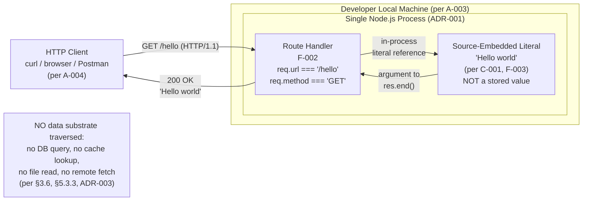

**Reading the diagram**: There is exactly one process boundary, one ingress edge, and one in-process call. No edge crosses any storage tier because no storage tier exists. The `NoStore` annotation is non-load-bearing — it carries no edges to live components because none of those storage concepts have a place in this architecture.

#### 6.2.6.2 Entity-Relationship Diagram — Empty Entity Inventory

The diagram below depicts the **entity inventory of the system**. Per §1.3.2, the inventory is empty: *"no database tables, no user records, and no business entities."* A conventional ERD with boxes-and-lines is therefore replaced with a structural inventory showing the candidate entity classes considered and explicitly rejected by ADR-003 and §5.3.3.

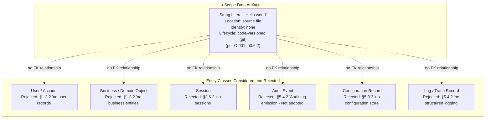

**Reading the diagram**: Each dashed arrow is a *justification*, not a relationship. The `Implemented` subgraph contains the only data artifact in the system (the source-embedded literal). The `Considered` subgraph enumerates the entity classes that a conventional database design would model and records, for each, the upstream specification authority that excludes it. No primary keys, foreign keys, cardinality constraints, or referential integrity rules are present because no entities exist to bear them.

#### 6.2.6.3 Replication Architecture — Structurally Vacuous

§6.1.4.4 records the dispositive finding: *"There is no data to replicate, snapshot, or back up."* The diagram below visualises why every standard replication topology — primary/secondary, multi-master, leaderless quorum, log shipping, and cross-region disaster-recovery — is structurally inapplicable.

```mermaid
flowchart LR
    subgraph Reality["Architectural Reality (per ADR-001, ADR-003)"]
        SingleProcess["Single Node.js Process<br/>on developer's local machine<br/>(per A-003)"]
        SourceFile["JavaScript source file<br/>contains 'Hello world' literal<br/>(versioned via git only)"]
        SingleProcess --> SourceFile
    end

    subgraph Vacuous["Replication Concepts (All Not Applicable)"]
        Primary["Primary Replica<br/>§6.1.4.4"]
        Secondary["Secondary Replica(s)<br/>§6.1.4.4"]
        WAL["Write-Ahead Log<br/>§3.6.2"]
        Snapshot["Snapshot / Backup<br/>§5.4.6"]
        Quorum["Quorum / Consensus<br/>§1.3.3"]
        CrossRegion["Cross-Region DR<br/>§5.4.6"]
    end

    SingleProcess -. "no data to replicate" .-> Primary
    SingleProcess -. "no peer instance" .-> Secondary
    SingleProcess -. "no write events" .-> WAL
    SingleProcess -. "no persistent state" .-> Snapshot
    SingleProcess -. "no distributed nodes" .-> Quorum
    SingleProcess -. "single instance only" .-> CrossRegion
```

**Reading the diagram**: The dashed arrows are *justifications*, not data-flow edges. There are no inbound replication streams to consume, no outbound replication streams to emit, no consistency model (strong, eventual, causal, bounded-staleness) to declare, and no replication lag, conflict-resolution, or split-brain concern to manage.

---

### 6.2.7 FORWARD-COMPATIBILITY TRIGGERS

The non-applicability finding documented in this section is **scope-bound to the present tutorial specification (version 1.0)**, not a permanent assertion. Per §2.6.3, *"This section reflects version 1.0 of the Product Requirements."* §5.4.8 enumerates the future-phase triggers that would require re-opening this determination.

#### 6.2.7.1 Future-Phase Triggers Matrix

| Future Trigger | Section 6.2 Concerns Re-Opened |
|---|---|
| Introduction of stateful capability | Schema design; storage selection; backup; audit |
| Introduction of computationally expensive responses | Caching strategy; cache topology |
| Production exposure or multi-instance deployment | Replication; read/write splitting; connection pooling |
| Multi-role or multi-tenant capability | Access controls; row/column-level security; tenant isolation |
| Regulated data processing (PII/PHI/PCI) | Privacy controls; retention rules; audit mechanisms |

Per §1.3.3 *"Future Phase Considerations"*, any extension of the application — additional endpoints, dynamic data, persistence, authentication, or production deployment — constitutes a future phase and is not part of the current specification. Such extensions are anticipated as natural learning exercises that build upon the foundation established here, but are explicitly outside the present scope.

#### 6.2.7.2 Required Re-Authorship Steps

Any of the above triggers would obligate the author to perform **all three** of the following steps in order:

1. **Re-open ADR-003** (§5.3.6.3) by superseding it with a successor ADR that selects a specific data-storage substrate and records the trade-offs accepted.
2. **Re-author this Section 6.2** with substantive content for each then-applicable concern (replacing the disposition matrices in §6.2.2.1, §6.2.3.1, §6.2.4.1, and §6.2.5.1 with concrete schema, migration, compliance, and performance designs).
3. **Update the §5.4.8 Cross-Cutting Concerns Summary Matrix** to reflect the new dispositions for the Persistence and Caching rows (currently both *"Not in scope"*).

Until such a trigger materialises, the disposition matrices in §6.2.2.1, §6.2.3.1, §6.2.4.1, and §6.2.5.1 are dispositive and the section's headline finding (*"Database Design is not applicable to this system"*) stands.

---

### 6.2.8 SECTION CROSS-REFERENCES

Reviewers seeking deeper detail on any of the non-applicability claims above should consult the following upstream sections, each of which contains the primary evidence for one or more rows in the disposition matrices.

#### 6.2.8.1 Primary Evidence Map

| Topic | Primary Reference |
|---|---|
| Storage exclusion matrix (six candidate stores rejected) | §3.6.2 |
| Zero persistence ADR (Accepted) | §5.3.6.3 (ADR-003) |
| Caching strategy justification | §5.3.4 |
| Data storage solution rationale | §5.3.3 |
| Anonymous access ADR (Accepted) | §5.3.6.4 (ADR-004) |
| No data domains finding | §1.3.2 |
| Persistence exclusion in scope | §1.3.3 |
| Constraint C-004 (no persistence) | §2.6.2 |
| Audit log non-adoption | §5.4.2 |
| Backup / DR posture (manual restart only) | §5.4.6 |
| Cross-cutting summary (Persistence/Caching = Not in scope) | §5.4.8 |
| Data redundancy and failover non-applicability | §6.1.4.4 |
| Handler purity (no I/O, no queue) | §6.1.2.3 |

#### 6.2.8.2 Related Architecture Decision Records

| ADR | Title | Status | Bearing on §6.2 |
|---|---|---|---|
| ADR-001 | Adopt Single-Process Monolithic Architecture | Accepted | Eliminates inter-instance replication concerns |
| ADR-003 | Zero Persistence and No Caching Layer | Accepted | Direct authority for the entire §6.2 non-applicability finding |
| ADR-004 | Anonymous Access by Design | Accepted | Eliminates per-user data and access-control concerns |

---

### 6.2.9 REFERENCES

#### 6.2.9.1 Files Examined

- `README.md` — Confirmed to contain only a single H1 heading (`# 12nov07`); no implementation files, no database scripts, no migration files, no schema definitions, no `package.json`, and no subdirectories exist in the repository. Establishes the empirical greenfield baseline that no data infrastructure of any kind has been authored.
- Repository root (depth 0) — Contains only `README.md`; no source code, no configuration, no subfolders. Reinforces the zero-persistence, zero-dependency posture documented in C-004 and ADR-003.

#### 6.2.9.2 Folders Explored

- `` (repository root) — Single child: `README.md`. No `db/`, `migrations/`, `models/`, `schemas/`, `data/`, or analogous data-tier subdirectory exists. Empirically confirms the absence of any data infrastructure.

#### 6.2.9.3 Technical Specification Sections Consulted

- **§1.2 SYSTEM OVERVIEW** — Established two-component logical model (HTTP listener + route handler) with no persistence component.
- **§1.3 SCOPE** — Primary source for §1.3.2 *"no data domains in the conventional sense"* and §1.3.3 explicit exclusion of *"Databases, file storage, in-memory caches"* under Persistence.
- **§2.6 ASSUMPTIONS AND CONSTRAINTS** — Source for C-004 (*"No external integrations, persistence, or identity providers may be introduced within this scope"*) and §2.6.3 (version 1.0 anchor).
- **§3.6 DATABASES AND STORAGE** — Direct authoritative statement that *"the project has no databases, no persistent storage, no in-memory caches, and no file-based state"*; provides the §3.6.2 exclusion matrix covering primary database, secondary database, in-memory cache, object storage, local file storage, and session store.
- **§5.3 TECHNICAL DECISIONS** — Source for ADR-003 *Zero Persistence and No Caching Layer* (status: Accepted), §5.3.3 *Data Storage Solution Rationale*, §5.3.4 *Caching Strategy Justification*, §5.3.5 *Security Mechanism Selection*, and ADR-004 *Anonymous Access by Design* (status: Accepted).
- **§5.4 CROSS-CUTTING CONCERNS** — Source for §5.4.2 *"Audit log emission — Not adopted"*, §5.4.6 *"Backup of persistent data — Not applicable — no persistent data"*, and §5.4.8 Cross-Cutting Concerns Summary Matrix listing Persistence and Caching as *"Not in scope"* with future-phase triggers.
- **§6.1 CORE SERVICES ARCHITECTURE** — Provides the template pattern for non-applicability authoring and supplies §6.1.2.3 (handler purity), §6.1.4.3 (DR posture), and §6.1.4.4 (data redundancy and failover not applicable).

## 6.3 Integration Architecture

### 6.3.1 APPLICABILITY DETERMINATION

#### 6.3.1.1 Summary Finding

**Integration Architecture is not applicable for this system.**

The `12nov07` project is, by deliberate architectural design and by every authoritative upstream specification source, a **single-process Node.js application exposing exactly one HTTP endpoint that returns a hard-coded string literal**. It has zero third-party service integrations, zero external system contracts, zero message queues, zero event streams, zero batch jobs, and zero API-management infrastructure of any kind. Every concern enumerated in the Integration Architecture template — API design (protocol, authentication, authorization, rate limiting, versioning, documentation), message processing (events, queues, streams, batches, asynchronous error handling), and external systems (third-party integrations, legacy interfaces, API gateway, service contracts) — is either **explicitly out of scope** per a documented constraint (notably C-004 in §2.6.2) or **structurally vacuous** (because there are no peers, intermediaries, brokers, or external dependencies present in the architecture).

This determination is **not** a deferral or a TODO. It is a fully traced architectural decision recorded across four Accepted Architecture Decision Records — ADR-001 (single-process monolith), ADR-002 (Node.js core `http` module over framework alternatives), ADR-003 (zero persistence and no caching layer), and ADR-004 (anonymous access by design) — and is reinforced by constraint C-004, the §3.5 third-party-services exclusion, the §1.3.3 scope exclusions, and the §5.4.8 Cross-Cutting Concerns Summary Matrix. The only boundary-crossing data flow in the entire system is the **client-initiated HTTP/1.1 request-response between an arbitrary HTTP client and the Node.js process itself** — and that boundary is the system's public-facing surface, not an "integration" with any external system the application calls or relies on.

#### 6.3.1.2 Architectural Context Justifying Non-Applicability

The architectural posture that disqualifies Integration Architecture as a meaningful concern is the **stateless, anonymous, synchronous, dependency-free monolith** documented in §5.1.1. The system contains exactly one Node.js process, one HTTP route (`GET /hello`), one response literal (`Hello world`), zero third-party dependencies (production and development both empty), and zero data substrates. Every invocation of the sole endpoint returns the same byte-for-byte identical response, produced from a string literal embedded directly in the JavaScript source. No data is fetched from any upstream system, no event is emitted to any downstream system, no message is enqueued, no batch is triggered, and no external service is contacted at any point in the request lifecycle.

| Attribute | Selection | Source Authority |
|---|---|---|
| Process topology | Single Node.js process; one local instance | A-001 (§2.6.1); ADR-001 (§5.3.6.1) |
| External integrations | Zero — no upstream, no downstream, no broker | C-004 (§2.6.2); §5.1.4 |
| Caller identification | Anonymous by design — no AuthN, no AuthZ | ADR-004 (§5.3.6.4); §5.3.5 |
| Communication style | Synchronous HTTP/1.1 request-response only | §5.1.3.2; §5.3.1.2 |

Per §5.1.1.3, the system boundary is "a single Node.js process that owns a single HTTP route. Nothing outside that process—operating-system services, network infrastructure, browser front-ends, or third-party APIs—falls within the implementation boundary." The architecture exposes exactly two interfaces: a single HTTP boundary (external; process-to-client) and a single internal function-invocation boundary (in-process; `http` module dispatching to the handler callback). There is no second integration boundary anywhere in the system that could host an "API gateway," "service contract," "message bus," or "third-party integration."

#### 6.3.1.3 Authoritative Source Anchors

The non-applicability determination is anchored in six **independent specification statements** that converge on the same conclusion. Reviewers should treat any of these as sufficient justification on its own; collectively they are dispositive.

| Anchor | Statement | Source |
|---|---|---|
| §1.2.1 | "No integrations with external systems, internal enterprise services, identity providers, message brokers, or data stores are required or contemplated. The application will run as a standalone Node.js process." | §1.2.1 |
| §1.3.1 | "No third-party integrations are essential to the scope. The endpoint produces its response from a hard-coded string literal and requires no upstream data source, downstream callback, or external service contract." | §1.3.1 |
| §1.3.3 | "No external system integrations are addressed by this specification. This includes, but is not limited to, identity providers, payment systems, message queues, third-party APIs, and enterprise service buses." | §1.3.3 |
| C-004 | "No external integrations, persistence, or identity providers may be introduced within this scope." | §2.6.2 |
| §3.5.1 | "This subsection is intentionally empty. The project has no third-party service integrations of any kind." | §3.5.1 |
| §5.1.4 | "The system has zero external integrations." | §5.1.4 |

---

### 6.3.2 API DESIGN — DISPOSITION

This subsection addresses each "API Design" concern enumerated in the section template. Every concern is recorded with its disposition (Not Applicable, Out of Scope, or Not Adopted) and a traceable source. The system exposes exactly **one HTTP endpoint** (`GET /hello`) by mandate of C-002; that single endpoint is the entirety of the API surface.

#### 6.3.2.1 API Design Disposition Matrix

| Concern | Disposition | Source Authority |
|---|---|---|
| Protocol specifications | HTTP/1.1 over TCP — single sync endpoint only | §5.1.3.2; §5.3.1.2 |
| Authentication methods | Not adopted — anonymous by design | ADR-004 (§5.3.6.4) |
| Authorization framework | Not adopted — no protected resource exists | ADR-004; §5.3.5 |
| Rate limiting strategy | Excluded — out of scope | §1.3.3; §5.3.5 |
| Versioning approach | Not applicable — single endpoint mandated | C-002 (§2.6.2) |
| Documentation standards | Not adopted — no OpenAPI/Swagger tooling | §1.3.3; §3.4.1 |

#### 6.3.2.2 Protocol Specifications

The system uses a single integration pattern: **synchronous HTTP/1.1 request-response over TCP**. Per §5.1.3.2: "No asynchronous messaging, no callback chains beyond the single handler invocation, no streaming, no chunked transfer encoding, and no WebSocket or long-polling patterns are in scope." The decision is anchored in ADR-002 (§5.3.6.2), which selected the Node.js core `http` module over Express, Fastify, and Koa specifically because the single-route surface mandated by C-002 makes a routing framework's middleware pipeline unnecessary.

The complete protocol surface is summarised below. Per §5.1.4, the response body is "plain ASCII text"; no content negotiation, no compression, no chunked encoding, and no HTTP/2 or HTTP/3 features are in scope.

| Protocol Attribute | Value | Source Authority |
|---|---|---|
| Wire protocol | HTTP/1.1 over TCP | §5.1.3.2 |
| Transport security (TLS/HTTPS) | Excluded — plain HTTP only | §1.3.3; §5.3.5; ADR-004 |
| Content type | `text/plain` (ASCII literal `Hello world`) | §5.1.4; C-001 (§2.6.2) |
| Streaming / WebSocket / SSE | Not in scope | §5.1.3.2 |

#### 6.3.2.3 Authentication Methods

**No authentication framework is adopted.** Per ADR-004 (§5.3.6.4, Status: Accepted): "No authentication, authorization, HTTPS, CORS, or input validation shall be implemented." The §5.3.5 security disposition records the rationale: "The system operates under an anonymous-access-by-design posture. The rationale is that the sole response is a fixed, non-sensitive English literal; no confidential data, no privileged operation, and no protected resource exists within the system boundary that would require authentication or authorization controls."

| Authentication Mechanism | Disposition | Source Authority |
|---|---|---|
| API keys (header or query) | Not adopted | §5.3.5; §5.4.4 |
| JWT bearer tokens | Not adopted | §5.3.5; §5.4.4 |
| Session cookies | Not adopted | §5.3.5; §5.4.4 |
| OAuth 2.0 / OpenID Connect | Not adopted | §1.2.1; C-004 |
| SAML / federated identity | Not adopted | §1.2.1; C-004 |
| mTLS client certificates | Not adopted | §1.3.3 (TLS excluded) |

The §1.3.2 system boundary explicitly states: "The endpoint is intended to be reachable by an unauthenticated, anonymous caller." This is not a deferral — it is a binding architectural decision.

#### 6.3.2.4 Authorization Framework

**No authorization framework is adopted.** Authorization presupposes the existence of a protected resource, a role hierarchy, or a tenant boundary; the system has none. Per §5.3.5: "There is no privileged operation to gate and no user data to scope. The only response (`Hello world`) is public by definition."

| Authorization Mechanism | Disposition | Source Authority |
|---|---|---|
| Role-based access control (RBAC) | Not adopted | §5.3.5; §5.4.4 |
| Attribute-based access control (ABAC) | Not adopted | §5.3.5; §5.4.4 |
| Policy engines (OPA, Cedar) | Not adopted | §1.3.3; C-004 |
| Per-route guards / middleware | Not adopted | §5.4.4 |

#### 6.3.2.5 Rate Limiting Strategy

**Rate limiting is explicitly excluded.** Per §1.3.3 "Excluded Features and Capabilities" under "Reliability: Rate limiting, retries, circuit breakers." The §5.3.5 security disposition reinforces: "Rate limiting — Excluded." No quota policy, no token-bucket algorithm, no leaky-bucket smoothing, no per-IP throttling, no per-key throttling, and no global concurrency cap is in scope. The handler accepts every well-formed `GET /hello` request and produces the identical response without flow control.

#### 6.3.2.6 Versioning Approach

**API versioning is not applicable.** The constraint C-002 (§2.6.2) is binding: "Exactly one (1) endpoint may be exposed; the path MUST be `/hello`." There is no version number in the URL path (e.g., `/v1/hello`), no version header (e.g., `Accept-Version`), no media-type versioning (e.g., `application/vnd.example.v1+text`), and no content negotiation. The API surface consists of a single, unversioned route and a single, unversioned response body (`Hello world`, mandated byte-for-byte by C-001). Any future introduction of additional endpoints, alternative response formats, or evolutionary changes would constitute a future-phase activity per §1.3.3 and would require re-opening C-002.

#### 6.3.2.7 Documentation Standards

**No API documentation infrastructure is adopted.** The project does not produce or consume any of the following artifacts:

| Documentation Artifact | Disposition | Source Authority |
|---|---|---|
| OpenAPI / Swagger specification | Not adopted | §1.3.3; §3.4.1 |
| API Blueprint / RAML | Not adopted | §1.3.3 |
| Postman collection / Insomnia workspace | Not adopted | §1.3.3 |
| GraphQL SDL / gRPC `.proto` files | Not applicable — not GraphQL/gRPC | §5.3.1.2 |

The §3.4.1 zero-dependency posture forbids the introduction of any documentation toolchain (`swagger-jsdoc`, `swagger-ui-express`, `fastify-swagger`, `redoc`, etc.). The authoritative description of the API surface lives in the present Technical Specification — specifically in §1.3.1 ("Key Technical Requirements"), §2.1.2 (Feature F-002 catalog entry), and the sequence diagram in §1.3.1 — and not in any machine-readable schema file.

---

### 6.3.3 MESSAGE PROCESSING — DISPOSITION

This subsection addresses each "Message Processing" concern enumerated in the section template. Every concern is recorded with its disposition and a traceable source. The system performs **no asynchronous messaging of any kind**: per §5.1.3.2, the only integration pattern is "synchronous HTTP/1.1 request-response over TCP."

#### 6.3.3.1 Message Processing Disposition Matrix

| Concern | Disposition | Source Authority |
|---|---|---|
| Event processing patterns | Not applicable — synchronous only | §5.1.3.2 |
| Message queue architecture | Not applicable — no broker contemplated | §1.2.1; §3.5.2 |
| Stream processing design | Not applicable — handler never blocks on I/O | §6.1.2.3 |
| Batch processing flows | Not applicable — no batch trigger exists | §6.2.5.3; §6.1.2.3 |
| Error handling strategy | Implicit only — handler has no failure modes | §5.4.3.2; §5.4.8 |

#### 6.3.3.2 Event Processing Patterns

**No event-driven processing patterns are in scope.** The handler is documented in §6.1.2.3 as "a pure function of `(req, res)` and produces a constant response; it never blocks on I/O, never awaits a downstream call, and never queues work." There is no event source (no Kafka consumer, no SQS poller, no webhook receiver beyond the inbound HTTP request itself), no event sink (no domain event emission, no integration event publication, no change-data-capture stream), and no event-sourced state machine.

The Node.js runtime's `EventEmitter` substrate is used internally by the `http` module (the `request` event drives callback dispatch), but this is an implementation detail of the standard library — not an application-level event processing pattern.

| Event-Driven Concern | Disposition | Source Authority |
|---|---|---|
| Event sources (Kafka, Kinesis, SQS, EventBridge) | Not adopted | §1.2.1; §3.5.2 |
| Event publication (domain events, integration events) | Not adopted | §5.1.3.2; §5.1.3.3 |
| Event sourcing (CQRS, event store) | Not applicable — no state to source | §5.3.3; ADR-003 |
| Webhook receivers (beyond `GET /hello`) | Not in scope — C-002 limits to one route | C-002 (§2.6.2) |

#### 6.3.3.3 Message Queue Architecture

**No message queue architecture is in scope.** Per §1.2.1: "no integrations with… message brokers… are required or contemplated." Per §3.5.2: "Message queue / broker — Not adopted." The §5.4.6 disaster-recovery matrix reinforces: "Dead-letter queues — Not applicable — no asynchronous work."

| Queue / Broker Concern | Disposition | Source Authority |
|---|---|---|
| Broker selection (RabbitMQ, Kafka, NATS, ActiveMQ) | Not adopted | §1.2.1; §3.5.2 |
| Cloud-managed queues (SQS, Service Bus, Pub/Sub) | Not adopted | §3.5.2 |
| Exchange / topic topology | Not applicable — no broker | §3.5.2 |
| Dead-letter queue (DLQ) configuration | Not applicable — no async work | §5.4.6 |
| Consumer group / partition strategy | Not applicable — no broker | §3.5.2 |

#### 6.3.3.4 Stream Processing Design

**No stream processing is in scope.** Per §6.1.2.3, the handler "never blocks on I/O, never awaits a downstream call, and never queues work." There is no streaming source (no Kafka topic, no Kinesis stream, no log file tail), no streaming sink, and no streaming computation. The response body is emitted in a single `res.end('Hello world')` call — not as a streamed sequence of chunks — and the `http` module's transfer encoding is the default (no chunked transfer encoding is configured per §5.1.3.2).

| Stream Processing Concern | Disposition | Source Authority |
|---|---|---|
| Streaming framework (Kafka Streams, Flink, Spark Streaming) | Not adopted | §3.5.2; §6.1.2.3 |
| Windowing operations (tumbling, sliding, session) | Not applicable — no stream | §6.1.2.3 |
| Watermark / late-data handling | Not applicable — no stream | §6.1.2.3 |
| Chunked response transfer encoding | Not specified | §5.1.3.2 |

#### 6.3.3.5 Batch Processing Flows

**No batch processing flows are in scope.** Per §6.2.5.3 (from the Database Design section's parallel non-applicability finding): "There is no batch window, no batch size, no batch trigger (cron, event-driven, threshold-based), no batch error-handling policy, no idempotency key for batch replay, and no batch reconciliation procedure." The handler processes exactly one request per invocation; it does not aggregate, accumulate, or buffer requests for batched downstream emission, and it does not consume from any batched upstream source.

| Batch Processing Concern | Disposition | Source Authority |
|---|---|---|
| Batch trigger (cron, scheduled, event-driven) | Not applicable | §6.2.5.3; §6.1.2.3 |
| ETL / ELT pipelines | Not applicable — no data substrate | §3.6; ADR-003 |
| Bulk-import / bulk-export endpoints | Not in scope — C-002 limits to `/hello` | C-002 (§2.6.2) |
| Idempotency keys for replay safety | Not applicable — no batch | §6.2.5.3 |

#### 6.3.3.6 Error Handling Strategy for Asynchronous Work

**Asynchronous error handling is structurally vacuous.** Because no asynchronous work exists in the architecture, there are no failure modes specific to asynchronous processing. The §5.4.3.2 Runtime Error Handling matrix is dispositive:

| Async Error Mechanism | Disposition | Source Authority |
|---|---|---|
| Retry loops with exponential backoff | Out of scope | §1.3.3; §5.4.3.2 |
| Circuit breakers | Out of scope | §1.3.3; §5.4.3.2 |
| Fallback responses (graceful degradation) | Not specified — no upstream/downstream | §5.4.3.2 |
| Bulkheads / timeouts | Not specified | §5.4.3.2 |

§5.4.3.2 documents the structural reason this matrix is vacuous: "The handler itself has **no failure modes within scope** because the operations it performs (constant assignments, constant string emission) cannot fail under the acceptance criteria." The only error path the architecture recognises is the **bootstrap failure** documented in the §5.4.3.1 error-handling flow diagram (if `server.listen()` fails to bind a port, the process exits and F-001-RQ-001 is violated; manual developer restart is the recovery procedure per §5.4.6).

---

### 6.3.4 EXTERNAL SYSTEMS — DISPOSITION

This subsection addresses each "External Systems" concern enumerated in the section template. Every concern is recorded with its disposition and a traceable source. The §3.5.1 finding is dispositive: "The project has no third-party service integrations of any kind."

#### 6.3.4.1 External Systems Disposition Matrix

| Concern | Disposition | Source Authority |
|---|---|---|
| Third-party integration patterns | None — no third-party services | §3.5.1; §3.5.2 |
| Legacy system interfaces | Not applicable — greenfield, no predecessor | §1.2.1; §1.4.1 |
| API gateway configuration | Not applicable — no gateway, no upstream | §6.1.2.3 |
| External service contracts | None declared | §5.1.4 |

#### 6.3.4.2 Third-Party Integration Patterns

**No third-party integrations exist.** The §3.5.2 exclusion matrix enumerates nine candidate categories of third-party service that would otherwise be candidates for inclusion in a default Node.js stack; every category is recorded as "Not adopted":

| Category | Default Stack Candidate | Disposition |
|---|---|---|
| External APIs | None contemplated | Not adopted (§1.2.1) |
| Authentication / IDaaS | Auth0 | Not adopted (§1.3.3; §2.4.4) |
| Monitoring / APM | (none specified) | Not adopted (§1.3.3) |
| Logging aggregation | (none specified) | Not adopted (§1.3.3; C-005) |
| Error tracking | (none specified) | Not adopted (§1.3.3) |
| Cloud platform | AWS | Not adopted (§1.3.2) |
| Message queue / broker | (none specified) | Not adopted (§1.2.1) |
| Email / SMS gateway | (none specified) | Not adopted (§1.2.1) |
| Payment processor | (none specified) | Not adopted (§1.2.1) |

Per §3.4.1, the production `dependencies`, `devDependencies`, and transitive dependency closure are all empty. The §5.4.7 supply-chain posture confirms that "no third-party code is fetched, resolved, or executed" — eliminating any vector by which an external service client library could be introduced into the process at runtime.

#### 6.3.4.3 Legacy System Interfaces

**No legacy system interfaces are in scope.** Per §1.2.1 "Current System Limitations": "There is no predecessor system. The repository in its initial state contains only a `README.md` file holding the single line `# 12nov07`, with no implementation files, configuration files, dependency manifests, or directory structure present. Accordingly, 'current system limitations' do not apply to this engagement—the work begins from a clean slate, and no migration, refactoring, or backward-compatibility concerns are in play."

The empirical greenfield baseline — a repository whose only artifact is `README.md` containing a single H1 heading — eliminates every legacy-interface concern enumerated in the section template:

| Legacy Interface Concern | Disposition | Source Authority |
|---|---|---|
| Migration adapters (strangler-fig, anti-corruption layer) | Not applicable — no legacy system | §1.2.1 |
| File-based interchange (SFTP, EDI, fixed-width) | Not adopted | §1.2.1; C-004 |
| SOAP / XML-RPC / CORBA bridges | Not adopted | §1.2.1; §5.3.1.2 |
| Database-link or shared-table integration | Not applicable — no database | §3.6; ADR-003 |

#### 6.3.4.4 API Gateway Configuration

**No API gateway is in scope.** Per §6.1.2.3: the system implements a "single integration pattern: synchronous HTTP/1.1 request-response over TCP between an external HTTP client and the Node.js process." The HTTP client targets `http://localhost:<port>/hello` directly (per A-003's local execution context); no gateway, no reverse proxy, no load balancer, no CDN, and no edge-routing layer is in the request path.

| API Gateway Concern | Disposition | Source Authority |
|---|---|---|
| Self-hosted gateway (Kong, Tyk, NGINX, HAProxy) | Not adopted | §1.3.3; §6.1.2.3 |
| Managed gateway (AWS API Gateway, Azure APIM, Apigee) | Not adopted | §3.5.2 (no cloud platform) |
| Service mesh sidecar (Istio, Linkerd, Consul Connect) | Not adopted | §6.1.2.3 |
| Reverse proxy / TLS terminator (NGINX, Caddy, Traefik) | Not adopted | §1.3.3 (TLS excluded) |

§6.1.3.1 reinforces the gateway non-applicability: "Auto-scaling triggers and rules: Not applicable — no orchestrator, no instance count." Without an orchestrator, a fleet of instances, or a public ingress point, there is no architectural role for a gateway to occupy.

#### 6.3.4.5 External Service Contracts

**No external service contracts are declared.** Per §5.1.4: "SLA requirements — None declared." The system has no service-level agreement with any external party, no operational-level agreement with any internal team, and no underpinning contract with any infrastructure vendor. The §5.4.5 performance posture is dispositive: no latency SLO, no throughput SLO, no availability SLO, and no error-budget allocation is in force.

The **only** boundary-crossing data flow in the system, documented in §5.1.4 and reproduced below for completeness, is the inbound HTTP transaction itself — and this is the system's own public-facing surface, not an integration with an external system the application calls or depends on:

| System Name | Integration Type | Data Exchange Pattern | Protocol / Format |
|---|---|---|---|
| HTTP Client (curl, browser, Postman, any HTTP/1.1 capable client) | External, client-initiated | Synchronous request-response | HTTP/1.1 over TCP; response body is plain ASCII text |

The HTTP client is identified by assumption A-004 (§2.6.1): "Any HTTP client capable of issuing a GET request is sufficient to exercise the endpoint." This client is not an integrated system in the architectural sense; it is the arbitrary, anonymous consumer of the system's public capability.

---

### 6.3.5 DIAGRAMS VISUALIZING NON-APPLICABILITY

The diagrams below visualise the architectural reality that disqualifies Integration Architecture as a meaningful concern. Following the §6.1.5 and §6.2.6 precedent, each diagram is annotated with its upstream source authority and is intended to make the absence of integration surface area visually self-evident.

#### 6.3.5.1 Integration Flow Diagram — Single Boundary, All Other Concerns Excluded

This diagram shows the totality of integration relationships in the system: one inbound HTTP boundary from an arbitrary client to the single Node.js process, and nothing else. The shaded "Excluded" cluster enumerates the integration categories that a conventional enterprise architecture would model and records, for each, the upstream specification authority that excludes it.

```mermaid
flowchart LR
    Client["HTTP Client<br/>curl / browser / Postman<br/>(per A-004)"]

    subgraph LocalMachine["Developer Local Machine (per A-003)"]
        subgraph NodeProcess["Single Node.js Process (per A-001, ADR-001)"]
            Server["http.createServer()<br/>(ADR-002)<br/>Single endpoint: GET /hello"]
        end
    end

    Client -- "GET /hello (HTTP/1.1)" --> Server
    Server -- "200 OK<br/>'Hello world'" --> Client

    subgraph Excluded["Integration Concerns NOT Applicable"]
        IdP["Identity Provider<br/>OAuth / SAML / OIDC<br/>(§1.2.1, ADR-004)"]
        Broker["Message Broker<br/>Kafka / RabbitMQ / SQS<br/>(§1.2.1, §3.5.2)"]
        DB["Database / Data Store<br/>(§3.6, ADR-003)"]
        ExtAPI["External API Client<br/>REST / gRPC / SOAP<br/>(§3.5.2)"]
        Cache["Distributed Cache<br/>Redis / Memcached<br/>(§5.3.4, ADR-003)"]
        Gateway["API Gateway / Service Mesh<br/>(§6.1.2.3)"]
        Legacy["Legacy System Interface<br/>(§1.2.1)"]
        Cloud["Cloud Platform Service<br/>AWS / Azure / GCP<br/>(§3.5.2)"]
    end

    Server -. "no upstream auth call" .-> IdP
    Server -. "no message emission" .-> Broker
    Server -. "no persistence I/O" .-> DB
    Server -. "no outbound HTTP call" .-> ExtAPI
    Server -. "no cache lookup" .-> Cache
    Server -. "no fronting gateway" .-> Gateway
    Server -. "no migration source" .-> Legacy
    Server -. "no cloud SDK loaded" .-> Cloud
```

**Reading the diagram**: There is exactly one process boundary, one ingress edge (client → server), and one egress edge (server → client). The dashed arrows from the server to the `Excluded` cluster are *justifications*, not interactions — each rationale explains why the in-scope monolith makes the corresponding integration concern structurally vacuous. No node in the `Excluded` cluster has any live (solid) edge to any in-scope element.

#### 6.3.5.2 API Architecture Diagram — Single Endpoint, All API-Tier Layers Absent

This diagram visualises the entirety of the API surface (one endpoint) and the conventional API-tier layers that are explicitly absent from the architecture. Each absent layer carries its source authority.

```mermaid
flowchart TB
    Caller["Any HTTP/1.1 Client<br/>(unauthenticated, anonymous)<br/>(per §1.3.2, A-004)"]

    subgraph APISurface["In-Scope API Surface (single endpoint)"]
        Route["Endpoint: GET /hello<br/>(per C-002)"]
        Response["Response: 200 OK<br/>Body: 'Hello world'<br/>Content-Type: text/plain<br/>(per C-001, F-003)"]
        Route --> Response
    end

    Caller -- "HTTP/1.1 plain GET" --> Route

    subgraph AbsentLayers["API-Tier Layers NOT Present"]
        TLS["TLS Termination<br/>(§1.3.3, §5.3.5)"]
        CORS["CORS Policy Layer<br/>(§1.3.3, §5.3.5)"]
        AuthN["Authentication Layer<br/>(ADR-004, §5.3.5)"]
        AuthZ["Authorization Layer<br/>(ADR-004, §5.4.4)"]
        RateLimit["Rate Limiting / Throttling<br/>(§1.3.3, §5.3.5)"]
        Validate["Input Validation / Schema<br/>(§1.3.3, §5.3.5)"]
        Version["API Versioning Layer<br/>(C-002 — single version)"]
        Docs["OpenAPI / Swagger Docs<br/>(§1.3.3, §3.4.1)"]
    end

    Route -. "no TLS handshake" .-> TLS
    Route -. "no Origin check" .-> CORS
    Route -. "no credential parse" .-> AuthN
    Route -. "no permission check" .-> AuthZ
    Route -. "no quota enforcement" .-> RateLimit
    Route -. "no schema enforcement" .-> Validate
    Route -. "no version negotiation" .-> Version
    Route -. "no docs toolchain" .-> Docs
```

**Reading the diagram**: The `APISurface` subgraph contains the complete API of the system — a single route and a single response. The `AbsentLayers` subgraph enumerates eight conventional API-tier responsibilities (TLS, CORS, AuthN, AuthZ, rate limiting, validation, versioning, documentation), each absent by deliberate architectural choice. The dashed arrows are justifications, not pipeline stages.

#### 6.3.5.3 Message Flow Diagram — Synchronous Request-Response Only

This diagram visualises the single messaging pattern in scope (synchronous HTTP request-response) alongside the asynchronous messaging patterns that are structurally absent.

```mermaid
flowchart LR
    subgraph InScope["In-Scope: Synchronous Request-Response"]
        Req["Inbound Request<br/>GET /hello"]
        Handler["Pure Synchronous Handler<br/>(per §6.1.2.3)<br/>no I/O, no await, no queue"]
        Resp["Outbound Response<br/>200 OK 'Hello world'"]
        Req --> Handler
        Handler --> Resp
    end

    subgraph OutOfScope["Messaging Patterns NOT Applicable"]
        Queue["Message Queue<br/>(§1.2.1, §3.5.2)"]
        EventBus["Event Bus / Pub-Sub<br/>(§5.1.3.2)"]
        Stream["Stream Processing<br/>(§6.1.2.3)"]
        Batch["Batch Processing<br/>(§6.2.5.3)"]
        Async["Async Callbacks / Promises<br/>(beyond handler invocation)<br/>(§5.1.3.2)"]
        WS["WebSocket / SSE / Long-Poll<br/>(§5.1.3.2)"]
        DLQ["Dead-Letter Queue<br/>(§5.4.6)"]
        Webhook["Outbound Webhook<br/>(§1.2.1)"]
    end

    Handler -. "no enqueue call" .-> Queue
    Handler -. "no publish call" .-> EventBus
    Handler -. "no streaming I/O" .-> Stream
    Handler -. "no batch trigger" .-> Batch
    Handler -. "synchronous only" .-> Async
    Handler -. "no protocol upgrade" .-> WS
    Handler -. "no async work to fail" .-> DLQ
    Handler -. "no outbound HTTP" .-> Webhook
```

**Reading the diagram**: The `InScope` subgraph contains the entire messaging surface of the system — three nodes in a linear synchronous chain. The `OutOfScope` subgraph enumerates eight conventional messaging concerns, each absent. The dashed arrows from the handler are justifications, recording why each pattern is structurally inapplicable to a handler that "never blocks on I/O, never awaits a downstream call, and never queues work" (§6.1.2.3).

#### 6.3.5.4 Sequence Diagram — The Only Boundary-Crossing Flow

The sequence diagram below documents the **complete** boundary-crossing flow recognised by the architecture: a single synchronous HTTP request-response exchange between an arbitrary HTTP client and the Node.js process. No second flow exists.

```mermaid
sequenceDiagram
    autonumber
    participant Client as HTTP Client<br/>(curl/browser/Postman)
    participant TCP as TCP/IP Stack
    participant HTTPMod as Node.js core http module
    participant Handler as Route Handler (F-002)

    Note over Client,Handler: Single integration boundary — no AuthN, no DB, no external API
    Client->>TCP: Open TCP connection to localhost:&lt;port&gt;
    TCP->>HTTPMod: Deliver inbound request bytes
    HTTPMod->>HTTPMod: Parse HTTP/1.1 request line and headers
    HTTPMod->>Handler: Invoke registered callback(req, res)
    Handler->>Handler: Evaluate req.url === '/hello' (F-002-RQ-001)
    Handler->>Handler: Evaluate req.method === 'GET' (F-002-RQ-002)
    Handler->>Handler: Assign res.statusCode = 200 (F-002-RQ-003)
    Handler->>HTTPMod: res.end('Hello world') (F-003-RQ-001)
    HTTPMod->>TCP: Serialize and transmit response bytes
    TCP->>Client: 200 OK + body 'Hello world'
    Note over Client,Handler: Connection closes; server returns to Listening state
```

**Reading the diagram**: Every interaction in the diagram is **synchronous, in-process, and non-blocking**. There is no `Database` participant, no `Cache` participant, no `MessageBroker` participant, no `IdentityProvider` participant, and no `ExternalAPI` participant — because no such collaborator exists anywhere in the architecture. The sequence is the entirety of the boundary-crossing behaviour the system performs.

---

### 6.3.6 FORWARD-COMPATIBILITY TRIGGERS

The non-applicability finding documented in this section is **scope-bound to the present tutorial specification (version 1.0)**, not a permanent assertion. Per §2.6.3, "This section reflects version 1.0 of the Product Requirements, authored from the greenfield state of the repository." The §5.4.8 Cross-Cutting Concerns Summary Matrix enumerates the future-phase triggers that would require re-opening this determination.

#### 6.3.6.1 Future-Phase Triggers Matrix

| Future Trigger | Section 6.3 Concerns Re-Opened |
|---|---|
| Introduction of protected resources or user data | API authentication; authorization framework; TLS termination |
| Multi-route API surface (beyond `GET /hello`) | API versioning; documentation standards; API gateway |
| Introduction of asynchronous work or downstream calls | Event processing; message queues; async error handling |
| Production exposure or public internet deployment | Rate limiting; API gateway; external service SLAs |
| Integration with identity provider, payment, or third-party API | Third-party integration patterns; external service contracts |
| Multi-instance deployment | API gateway / load balancer configuration |
| Persistence introduction (any data substrate) | Database integration patterns; data-tier service contracts |

Per §1.3.3 "Future Phase Considerations": "Any extension of the application—additional endpoints, dynamic data, persistence, authentication, or production deployment—constitutes a future phase and is not part of the current specification. Such extensions are anticipated as natural learning exercises that build upon the foundation established here, but are explicitly outside the present scope."

#### 6.3.6.2 Required Re-Authorship Steps

Any of the above triggers would obligate the author to perform **all three** of the following steps in order:

1. **Re-open the relevant ADR(s)** in §5.3.6 — notably ADR-001 (single-process posture), ADR-002 (HTTP framework selection), and ADR-004 (anonymous access). For example, introducing authentication would require superseding ADR-004 with a successor ADR that selects a specific identity model (API keys, JWT, OAuth, etc.) and records the trade-offs accepted.
2. **Re-author this Section 6.3** with substantive content for each then-applicable concern, replacing the disposition matrices in §6.3.2.1, §6.3.3.1, and §6.3.4.1 with concrete API specifications, message processing designs, and external system contracts.
3. **Update the §5.4.8 Cross-Cutting Concerns Summary Matrix** to reflect the new dispositions for the Authentication, Authorization, and (if applicable) Logging & tracing rows.

Until such a trigger materialises, the disposition matrices in §6.3.2.1, §6.3.3.1, and §6.3.4.1 are dispositive and the section's headline finding ("Integration Architecture is not applicable for this system") stands.

---

### 6.3.7 SECTION CROSS-REFERENCES

Reviewers seeking deeper detail on any of the non-applicability claims above should consult the following upstream sections, each of which contains the primary evidence for one or more rows in the disposition matrices.

#### 6.3.7.1 Primary Evidence Map

| Topic | Primary Reference |
|---|---|
| No integrations with external systems | §1.2.1; §5.1.4 |
| No third-party integrations essential to scope | §1.3.1 |
| Integration points not covered (comprehensive exclusion) | §1.3.3 |
| Constraint C-004 (no external integrations) | §2.6.2 |
| Third-party services intentionally empty | §3.5.1; §3.5.2 |
| Zero open-source dependencies | §3.4.1 |
| Out-of-scope workflow categories (auth, TLS, queue, etc.) | §4.5.1 |
| Single integration pattern (synchronous HTTP/1.1) | §5.1.3.2 |
| External integration points (single HTTP boundary only) | §5.1.4 |
| Anonymous access ADR (Accepted) | §5.3.6.4 (ADR-004) |
| Security mechanism selection (all excluded) | §5.3.5 |
| Authentication and authorization framework (all excluded) | §5.4.4 |
| Runtime error handling (no retries, breakers, fallbacks) | §5.4.3.2 |
| Cross-cutting summary (Auth / Persistence / Logging = Not in scope) | §5.4.8 |
| Handler purity (no I/O, no queue, no await) | §6.1.2.3 |
| Communication, discovery, load balancing — moot | §6.1.2.3 |
| No batch / async work | §6.2.5.3 |

#### 6.3.7.2 Related Architecture Decision Records

| ADR | Title | Status | Bearing on §6.3 |
|---|---|---|---|
| ADR-001 | Adopt Single-Process Monolithic Architecture | Accepted | No inter-service communication exists; only one process |
| ADR-002 | Select Node.js Core `http` Module Over Framework Alternatives | Accepted | Zero external dependencies; no Express/Fastify/Koa middleware integrations |
| ADR-003 | Zero Persistence and No Caching Layer | Accepted | No database driver, no cache client, no integration connector |
| ADR-004 | Anonymous Access by Design | Accepted | No identity provider integration; no auth gateway in the request path |

---

### 6.3.8 REFERENCES

#### 6.3.8.1 Files Examined

- `README.md` — Confirmed to contain only a single H1 heading (`# 12nov07`); no implementation files, no integration code, no API specifications, no configuration files, no `package.json`, and no dependency manifests exist in the repository. Establishes the empirical greenfield baseline that no integration infrastructure of any kind has been authored.

#### 6.3.8.2 Folders Explored

- `` (repository root, depth 0) — Single child: `README.md`. No `src/`, `api/`, `routes/`, `controllers/`, `services/`, `integrations/`, `gateway/`, `clients/`, `proto/`, `openapi/`, or any analogous integration-tier subdirectory exists. Empirically confirms the absence of any integration infrastructure.

#### 6.3.8.3 Technical Specification Sections Consulted

- **§1.2 SYSTEM OVERVIEW** — Provided the dispositive statement (§1.2.1) that "no integrations with external systems, internal enterprise services, identity providers, message brokers, or data stores are required or contemplated" and the greenfield baseline ("There is no predecessor system"); supplied the two-component logical model (HTTP Listener + Route Handler).
- **§1.3 SCOPE** — Primary source for §1.3.1 "Essential Integrations" ("No third-party integrations are essential to the scope"), the §1.3.2 anonymous-caller posture, the §1.3.3 "Excluded Features and Capabilities" matrix (authentication, authorization, HTTPS, rate limiting, retries, circuit breakers, persistence, observability), and the §1.3.3 "Integration Points Not Covered" enumeration.
- **§2.1 FEATURE CATALOG** — Confirmed all three features (F-001, F-002, F-003) declare "External Dependencies: None" and "Integration Requirements: None" (or single HTTP boundary in F-002's case).
- **§2.6 ASSUMPTIONS AND CONSTRAINTS** — Source for assumption A-001 (single process sufficient), A-003 (local execution), A-004 (any HTTP client suffices); source for constraints C-001 (response body literal), C-002 (exactly one endpoint at `/hello`), and C-004 ("No external integrations, persistence, or identity providers may be introduced within this scope").
- **§3.4 OPEN SOURCE DEPENDENCIES** — Confirmed zero production dependencies, zero devDependencies, and empty transitive dependency closure; reinforces the zero-integration posture by ensuring no third-party client library can be present at runtime.
- **§3.5 THIRD-PARTY SERVICES** — Direct authoritative statement (§3.5.1) that "the project has no third-party service integrations of any kind"; §3.5.2 provides the nine-category exclusion matrix covering external APIs, IDaaS, monitoring/APM, log aggregation, error tracking, cloud platform, message broker, email/SMS, and payment processor.
- **§4.5 OUT-OF-SCOPE WORKFLOW CATEGORIES** — Source for the enumeration of excluded workflows (authentication, authorization, TLS handshake, database read/write, cache populate/invalidate, log emission, metric emission, distributed trace, retry/backoff, circuit-breaker, rate-limiting, request validation, schema enforcement, additional routing).
- **§5.1 HIGH-LEVEL ARCHITECTURE** — Direct authoritative statement (§5.1.4) "The system has zero external integrations"; §5.1.3.2 documents the single synchronous HTTP/1.1 integration pattern; §5.1.4 documents the single boundary-crossing data flow (HTTP client ↔ Node.js server).
- **§5.3 TECHNICAL DECISIONS** — Source for ADR-001 (single-process monolithic, Accepted), ADR-002 (Node.js core `http` module selected, Accepted), ADR-003 (zero persistence and no caching, Accepted), and ADR-004 (anonymous access by design, Accepted); §5.3.5 documents the comprehensive security-mechanism exclusion matrix.
- **§5.4 CROSS-CUTTING CONCERNS** — Source for §5.4.3.2 (retries, circuit breakers, fallbacks all out of scope), §5.4.4 (authentication and authorization framework — all not adopted), §5.4.6 (manual DR posture; dead-letter queues not applicable), §5.4.7 (zero supply-chain attack surface), and §5.4.8 (Cross-Cutting Concerns Summary Matrix with future-phase triggers).
- **§6.1 Core Services Architecture** — Established the precedent pattern for non-applicability authoring; supplied §6.1.2.3 (handler purity — no I/O, no queue, no await), §6.1.2.3 (single integration pattern justification), and §6.1.3.1 (auto-scaling triggers not applicable).
- **§6.2 Database Design** — Reinforced the non-applicability precedent pattern; supplied §6.2.5.3 (no batch window, batch size, batch trigger, or batch reconciliation procedure).

## 6.4 Security Architecture

### 6.4.1 APPLICABILITY DETERMINATION

#### 6.4.1.1 Summary Finding

**Detailed Security Architecture is not applicable for this system.**

The `12nov07` project is, by deliberate architectural design and by every authoritative upstream specification source, a **single-process Node.js tutorial application that exposes one anonymous HTTP endpoint (`GET /hello`) returning the static literal `Hello world`**. It has no protected resources, no user identities, no privileged operations, no confidential data, no persistent state, no third-party dependencies, and no boundary-crossing data flows other than the public-facing HTTP transaction with an arbitrary anonymous client. Every conventional concern enumerated in the Security Architecture template — the Authentication Framework (identity management, MFA, session management, token handling, password policies), the Authorization System (RBAC, permission management, resource authorization, policy enforcement points, audit logging), and Data Protection (encryption standards, key management, data masking, secure communication, compliance controls) — is either **explicitly excluded** by a binding constraint and/or Architecture Decision Record, or **structurally vacuous** because no subject, object, or sensitive datum exists within the system boundary to which such a control could attach.

This determination is **not** a deferral, a TODO, or an oversight. It is a fully traced architectural decision recorded in **ADR-004** (§5.3.6.4, status: *Accepted*) titled *"Anonymous Access by Design"*, and it is reinforced by constraint **C-004** (§2.6.2): *"No external integrations, persistence, or identity providers may be introduced within this scope"*, the §5.3.5 security-mechanism exclusion matrix, the §5.4.4 authentication-and-authorization framework non-adoption, the §1.3.3 scope exclusion of *Security: Authentication, authorization, HTTPS/TLS*, and the §5.4.8 Cross-Cutting Concerns Summary Matrix. This section follows the precedent non-applicability authoring pattern established in §6.1 (Core Services Architecture), §6.2 (Database Design), and §6.3 (Integration Architecture).

The section nonetheless documents — in §6.4.5 — the **standard security practices that *do* apply** as byproducts of the architectural choices recorded in ADR-001 through ADR-005, notably the zero supply-chain attack surface that arises from the §3.4.1 zero-dependency posture and the upstream-runtime security patching afforded by the §3.3.1 Active LTS Node.js commitment.

#### 6.4.1.2 Architectural Context Justifying Non-Applicability

The architectural posture that disqualifies a Detailed Security Architecture as a meaningful concern is the **stateless, anonymous, synchronous, dependency-free, locally-executed monolith** documented in §5.1. The system contains exactly one Node.js process, one HTTP route, one response literal, zero third-party dependencies, zero data substrates, and zero external integrations. The endpoint is intended to be reachable by an unauthenticated, anonymous caller; the application serves any HTTP client capable of issuing a GET request, no user groups are differentiated, no authentication is performed, and no role-based access controls are defined.

The attributes that disqualify Security Architecture as a meaningful concern are summarised below, each row carrying a citation to the upstream source authority.

| Attribute | Selection | Source Authority |
|---|---|---|
| Caller posture | Anonymous; unauthenticated by design | ADR-004 (§5.3.6.4); §1.3.2 |
| Confidentiality of response | Public, non-sensitive English literal | C-001 (§2.6.2); §1.3.2 |
| Data domain inventory | Empty — no PII, no PHI, no PCI, no records | §1.3.2; §6.2.4.2 |
| Transport security posture | Plain HTTP/1.1; TLS excluded | ADR-004 (§5.3.6.4); §1.3.3 |

Per §5.1.1.3, the system boundary is a single Node.js process that owns a single HTTP route; nothing outside that process falls within the implementation boundary. There is therefore no second component, no trust zone boundary, and no sensitive-information flow anywhere in the architecture to which a security control could attach.

#### 6.4.1.3 Authoritative Source Anchors

The non-applicability determination is anchored in six **independent specification statements** that converge on the same conclusion. Reviewers should treat any of these as sufficient justification on its own; collectively they are dispositive.

| Anchor | Statement | Source |
|---|---|---|
| §1.3.2 | "no authentication is performed, and no role-based access controls are defined. The endpoint is intended to be reachable by an unauthenticated, anonymous caller." | §1.3.2 |
| §1.3.3 | "Security: Authentication, authorization, HTTPS/TLS" listed under *Excluded Features and Capabilities* | §1.3.3 |
| C-004 | "No external integrations, persistence, or identity providers may be introduced within this scope." | §2.6.2 |
| §2.4.4 | Direct security-implications table — every row recorded as *Excluded* or *Not specified* | §2.4.4 |
| §5.3.5 | "The system operates under an anonymous-access-by-design posture. The rationale is that the sole response is a fixed, non-sensitive English literal; no confidential data, no privileged operation, and no protected resource exists within the system boundary that would require authentication or authorization controls." | §5.3.5 |
| ADR-004 | "No authentication, authorization, HTTPS, CORS, or input validation shall be implemented." (Status: Accepted) | §5.3.6.4 |

---

### 6.4.2 AUTHENTICATION FRAMEWORK — DISPOSITION

This subsection addresses each Authentication Framework concern enumerated in the section prompt — identity management, multi-factor authentication, session management, token handling, and password policies. Every concern is recorded with its disposition (Not Adopted, Not Applicable, or Vacuous-by-Construction) and a traceable source. The §5.4.4 cross-cutting finding is dispositive: **No authentication or authorization framework is in scope.** The system operates under anonymous access by design (ADR-004).

#### 6.4.2.1 Authentication Framework Disposition Matrix

| Concern | Disposition | Source Authority |
|---|---|---|
| Identity management (user store, IdP) | Not adopted — no identity subjects exist | ADR-004 (§5.3.6.4); §1.3.2 |
| Multi-factor authentication (MFA / 2FA) | Not applicable — no primary factor either | §5.3.5; ADR-004 |
| Session management (cookies, server sessions) | Not adopted — system is stateless | §5.4.4; §6.2.3.3 |
| Token handling (JWT, OAuth tokens, API keys) | Not adopted — no caller identification | §5.3.5; §5.4.4 |
| Password policies | Not applicable — no credentials are accepted | ADR-004 (§5.3.6.4); §1.3.2 |

#### 6.4.2.2 Identity Management

**No identity-management subsystem is in scope.** The system recognises zero identity subjects. Per §1.3.2 *"User Groups Covered"*: the application serves any HTTP client capable of issuing a GET request; no user groups are differentiated, no authentication is performed, and no role-based access controls are defined. There is no user store (no relational `users` table, no LDAP directory, no document collection of identity records), no identity-provider integration, and no user-lifecycle process. Per the §6.3.4.2 third-party-integration matrix, **Authentication / IDaaS (e.g., Auth0)** is recorded as *Not adopted*.

| Identity Management Concern | Disposition | Source Authority |
|---|---|---|
| Local user database / credential store | Not adopted | ADR-003 (§5.3.6.3); §6.2.4.2 |
| LDAP / Active Directory integration | Not adopted | C-004 (§2.6.2) |
| OAuth 2.0 / OpenID Connect provider | Not adopted | §1.2.1; C-004 |
| SAML 2.0 federated identity | Not adopted | §1.2.1; C-004 |

#### 6.4.2.3 Multi-Factor Authentication

**MFA is structurally vacuous.** Multi-factor authentication presupposes a primary authentication factor (something the user knows, has, or is) against which a second factor is verified. Because no primary authentication exists in this system (per ADR-004), there is no first factor to strengthen with a second. No TOTP/HOTP authenticator integration, no WebAuthn/FIDO2 challenge, no SMS or email OTP delivery, no push-notification approval, and no hardware-token enrolment is in scope.

| MFA Mechanism | Disposition | Source Authority |
|---|---|---|
| TOTP / HOTP (RFC 6238 / RFC 4226) | Not applicable — no primary factor | ADR-004; §5.4.4 |
| WebAuthn / FIDO2 platform authenticators | Not applicable — no primary factor | ADR-004; §5.4.4 |
| SMS / Email one-time codes | Not applicable — no primary factor | ADR-004; §5.4.4 |
| Hardware security keys (YubiKey, Titan) | Not applicable — no primary factor | ADR-004; §5.4.4 |

#### 6.4.2.4 Session Management

**No session management is in scope.** The system is stateless across invocations. Per §6.1.2.3, the handler is a pure function of `(req, res)` and produces a constant response; it never blocks on I/O, never awaits a downstream call, and never queues work. There is no session identifier issued at login, no server-side session store (Redis, Memcached, sticky-cookie database), no session timeout policy, no idle-timeout enforcement, no concurrent-session limit, and no logout-invalidates-session handshake. The §6.2.2.2 entity inventory enumerates *Session* as an entity class considered and rejected: "Rejected: §3.6.2 'no sessions'".

| Session Concern | Disposition | Source Authority |
|---|---|---|
| Session identifier issuance (cookie, header) | Not adopted | §5.4.4 |
| Session storage (server-side / signed-cookie) | Not applicable — no sessions exist | §6.2.2.2 |
| Session timeout / idle-timeout policy | Not applicable — no session lifecycle | §5.4.4 |
| Session invalidation (logout, revocation) | Not applicable — no session to invalidate | §5.4.4 |

#### 6.4.2.5 Token Handling

**No token-handling code path exists.** Per the §6.3.2.3 API-tier disposition, every conventional caller-identification mechanism is recorded as *Not adopted*:

| Token Mechanism | Disposition | Source Authority |
|---|---|---|
| API keys (header `X-API-Key` or query string) | Not adopted | §5.3.5; §5.4.4 |
| JWT bearer tokens (`Authorization: Bearer …`) | Not adopted | §5.3.5; §5.4.4 |
| OAuth 2.0 access / refresh tokens | Not adopted | §1.2.1; C-004 |
| mTLS client certificates | Not adopted | §1.3.3 (TLS excluded) |

Because no token is ever issued, no token is ever validated. There is no signing-key configuration, no `kid` (key ID) lookup, no `iss` (issuer) verification, no `aud` (audience) check, no `exp` (expiration) enforcement, no `nbf` (not-before) check, no refresh-token rotation, no introspection endpoint, and no revocation list. The §3.4.1 zero-dependency posture forbids the introduction of any token-handling library (`jsonwebtoken`, `jose`, `passport-jwt`, `express-jwt`, etc.).

#### 6.4.2.6 Password Policies

**Password policies are structurally vacuous.** No credential of any kind is accepted, stored, transmitted, or verified by the system. There is no minimum length, no character-class requirement (uppercase, lowercase, digit, special), no maximum-age rotation policy, no password history, no breach-detection check against compromised-credential corpora (e.g., HIBP), no account-lockout threshold, no progressive-delay backoff, and no recovery-question infrastructure. The §6.2.4.2 finding is dispositive: the system processes no personally identifiable information (PII), no protected health information (PHI), no payment card data, and no other regulated information class — credentials being a paradigmatic example of regulated information.

---

### 6.4.3 AUTHORIZATION SYSTEM — DISPOSITION

This subsection addresses each Authorization System concern enumerated in the section prompt — role-based access control, permission management, resource authorization, policy enforcement points, and audit logging. Every concern is recorded with its disposition and a traceable source. The §5.3.5 finding is dispositive: there is no privileged operation to gate and no user data to scope. The only response (`Hello world`) is public by definition.

#### 6.4.3.1 Authorization System Disposition Matrix

| Concern | Disposition | Source Authority |
|---|---|---|
| Role-based access control (RBAC) | Not adopted | §5.3.5; §5.4.4 |
| Permission management (privileges, grants) | Not applicable — no protected resource | ADR-004; §5.3.5 |
| Resource authorization (per-object, per-route) | Not adopted | §5.4.4; §6.3.2.4 |
| Policy enforcement points (PEP / PDP) | Not applicable — no decision to enforce | ADR-004; §1.3.2 |
| Audit logging (security-event trail) | Not adopted | §5.4.2; §6.2.4.3 |

#### 6.4.3.2 Role-Based Access Control

**No RBAC model is adopted.** Per §6.3.2.4 (the API-tier authorization disposition):

| Authorization Mechanism | Disposition | Source Authority |
|---|---|---|
| Role-based access control (RBAC) | Not adopted | §5.3.5; §5.4.4 |
| Attribute-based access control (ABAC) | Not adopted | §5.3.5; §5.4.4 |
| Policy engines (OPA, Cedar, AWS IAM) | Not adopted | §1.3.3; C-004 |
| Per-route guards / middleware | Not adopted | §5.4.4 |

No role hierarchy is defined (no `admin`, `editor`, `viewer`, `anonymous` tiers); no role-to-permission mapping table exists; no role-assignment policy is documented; and no role-inheritance graph is in scope. The §5.4.8 Cross-Cutting Concerns Summary Matrix records Authorization as *Not in scope*, with the future-phase trigger being *Multi-role or multi-tenant capability*.

#### 6.4.3.3 Permission Management and Resource Authorization

**No permission management subsystem is in scope.** Permission management presupposes a catalogue of privileges (e.g., `hello:read`, `hello:write`, `admin:*`) and a grant model that associates principals with privileges. Because there is no privileged operation to gate and no user data to scope, the privilege catalogue is empty and the grant model is undefined.

**No resource authorization is enforced.** The only resource in the system — the response body `Hello world` — is, by C-001 mandate, a public, byte-for-byte identical literal. Per §6.2.4.3, the access-control matrix records caller identification, identity provider integration, RBAC, ABAC, per-route authorization checks, and per-database-object access controls as all *Excluded* or *Not applicable*.

| Resource Authorization Concern | Disposition | Source Authority |
|---|---|---|
| Per-route authorization checks | Not adopted | §5.4.4; §6.3.2.4 |
| Per-object / per-record authorization | Not applicable — no objects exist | §6.2.4.3 |
| Row-level / column-level security | Not applicable — no database | ADR-003; §6.2.4.3 |
| Tenant isolation boundaries | Not applicable — single-tenant by design | §1.3.3 |

#### 6.4.3.4 Policy Enforcement Points

**No PEP/PDP/PIP architecture is in scope.** A conventional policy-enforcement architecture decomposes into a Policy Enforcement Point (PEP — typically middleware that intercepts requests), a Policy Decision Point (PDP — typically a policy engine evaluating rules), a Policy Information Point (PIP — typically an attribute source), and a Policy Administration Point (PAP — typically a policy authoring console). The system contains none of these.

Per the §6.3.2.4 disposition, policy engines (OPA, Cedar) are *Not adopted*, and per-route guards / middleware are *Not adopted*. The Node.js core `http` module selected by ADR-002 exposes no middleware pipeline by design; any introduction of an enforcement chain would constitute a future-phase activity requiring re-opening of ADR-002 and ADR-004.

| PEP/PDP Architecture Concern | Disposition | Source Authority |
|---|---|---|
| Request-interceptor middleware (PEP) | Not adopted | ADR-002; §5.4.4 |
| Policy engine (PDP — OPA, Cedar, custom) | Not adopted | §6.3.2.4; C-004 |
| Attribute / claim source (PIP) | Not applicable — no attributes exist | §1.3.2; ADR-004 |
| Policy authoring / administration (PAP) | Not applicable — no policies authored | ADR-004 |

#### 6.4.3.5 Audit Logging

**No security audit logging is adopted.** Per §5.4.2: Audit log emission — Not adopted. The §6.2.4.3 finding is dispositive: audit trails presuppose data-modification events worth recording for forensic, regulatory, or operational-debugging purposes. Because the system performs no data modifications (no INSERT, UPDATE, DELETE, MERGE, UPSERT, or analogous operation in any data substrate), there is nothing to audit.

The full logging-and-audit disposition from §5.4.2 is reproduced below for completeness:

| Logging / Audit Surface | Disposition | Source Authority |
|---|---|---|
| Structured log emission (JSON to stdout) | Not adopted | §1.3.3; §5.4.2 |
| Log aggregation (ELK, Splunk, Loki) | Not adopted | §1.3.3; C-004 |
| Trace propagation (W3C Trace Context, B3) | Not adopted | §1.3.3; §5.4.2 |
| Audit log emission (security-event trail) | Not adopted | §5.4.2 |

There is no immutable audit history, no tamper-evident log chain, no log-integrity HMAC, no log-forwarding agent, no SIEM integration, no audit-retention policy, and no audit-query interface. The only forensic artifact recognised by the architecture is the developer's own terminal stdout, which is ephemeral and not architecturally specified.

---

### 6.4.4 DATA PROTECTION — DISPOSITION

This subsection addresses each Data Protection concern enumerated in the section prompt — encryption standards, key management, data masking rules, secure communication, and compliance controls. Every concern is recorded with its disposition and a traceable source. The dispositive finding is that the system processes no protected data of any kind: per §1.3.2, the project includes no data domains in the conventional sense. The response is a fixed literal string with no persistent state, no database tables, no user records, and no business entities.

#### 6.4.4.1 Data Protection Disposition Matrix

| Concern | Disposition | Source Authority |
|---|---|---|
| Encryption at rest (data, backups, logs) | Not applicable — no data at rest exists | §3.6; ADR-003 (§5.3.6.3) |
| Encryption in transit (TLS, mTLS, IPsec) | Not adopted — plain HTTP/1.1 only | ADR-004 (§5.3.6.4); §1.3.3 |
| Key management (rotation, escrow, HSM) | Not applicable — no keys are generated | ADR-003; ADR-004 |
| Data masking / tokenisation / redaction | Not applicable — no sensitive data | §1.3.2; §6.2.4.2 |
| Compliance controls (GDPR, HIPAA, PCI-DSS) | Not applicable — no regulated data class | §1.3.2; §6.2.4.2 |

#### 6.4.4.2 Encryption Standards

**No encryption standards apply.** Two parallel findings establish this:

1. **Encryption at rest is structurally vacuous.** Per §6.2.2.3, every persistence-tier concern is dispositively absent — there is no data substrate, no backup artifact, and no archived record on which an encryption-at-rest control could operate. ADR-003 records: *"No database, file store, in-memory cache, or distributed cache shall be adopted."*
2. **Encryption in transit is explicitly excluded.** Per ADR-004: *"No authentication, authorization, HTTPS, CORS, or input validation shall be implemented."* The §5.3.5 matrix records *HTTPS / TLS termination — Excluded*. The §6.3.2.2 protocol-surface matrix records *Transport security (TLS/HTTPS) — Excluded — plain HTTP only*.

| Encryption Concern | Disposition | Source Authority |
|---|---|---|
| AES-256-GCM / ChaCha20-Poly1305 at-rest | Not applicable — no data at rest | §3.6; ADR-003 |
| TLS 1.2 / TLS 1.3 in transit | Not adopted | ADR-004; §1.3.3 |
| Application-layer payload encryption | Not adopted | ADR-004; §1.3.2 |
| Cipher suite selection / policy | Not applicable — no TLS in scope | ADR-004; §1.3.3 |

#### 6.4.4.3 Key Management

**No key-management subsystem is in scope.** Key management presupposes the existence of cryptographic keys to manage. Because the system generates, uses, and stores zero keys (no signing keys for tokens, no encryption keys for data, no TLS server certificates, no session-encryption keys, no message-authentication keys), every standard key-management concern is structurally inapplicable.

| Key Management Concern | Disposition | Source Authority |
|---|---|---|
| Hardware Security Module (HSM) | Not applicable — no keys to protect | ADR-003; ADR-004 |
| Cloud KMS (AWS KMS, Azure Key Vault, GCP KMS) | Not applicable — no cloud platform | §3.5.2; ADR-004 |
| Key rotation schedule / cadence | Not applicable — no keys exist | ADR-004 |
| Key escrow / split-knowledge custody | Not applicable — no keys exist | ADR-004 |

#### 6.4.4.4 Data Masking Rules

**No data-masking rules apply.** Data masking presupposes sensitive fields that must be obscured at display, log, or export time. The system has no sensitive fields. Per §6.2.4.2, the system processes no personally identifiable information (PII), no protected health information (PHI), no payment card data, and no other regulated information class. The only data the system emits is the public literal `Hello world`, which by C-001 must be emitted byte-for-byte — any masking would by definition violate the response-equality constraint.

| Data Masking Concern | Disposition | Source Authority |
|---|---|---|
| Dynamic data masking (DDM) | Not applicable — no sensitive fields | §6.2.4.2 |
| Static data masking for non-prod copies | Not applicable — no production data exists | §6.2.4.2 |
| Tokenisation (format-preserving substitution) | Not applicable — no values to tokenise | §6.2.4.2 |
| Log redaction (PII scrub, secret scrub) | Not applicable — no logs are emitted | §5.4.2 |

#### 6.4.4.5 Secure Communication

**No secure-communication channel is configured.** The single boundary-crossing data flow recognised by the architecture is the inbound HTTP transaction documented in §6.3.5.4. Per §6.3.2.2:

| Communication Channel | Disposition | Source Authority |
|---|---|---|
| HTTPS / TLS (server certificate) | Not adopted | ADR-004; §5.3.5 |
| mTLS (mutual client-and-server certificates) | Not adopted | §1.3.3 (TLS excluded) |
| IPsec / VPN tunneling | Not applicable — local execution only | A-003; §1.3.2 |
| Application-layer message signing | Not adopted | C-004; §6.3.3.2 |

Because the system is intended for local execution on the developer's own machine (per A-003) and serves a non-sensitive public literal, the absence of transport security does not, within the tutorial scope, expose any confidential payload. Per §2.4.4: because the response is a fixed, non-sensitive English literal, the absence of these controls does not, within the tutorial scope, expose confidential data or privileged operations.

#### 6.4.4.6 Compliance Controls

**No regulatory compliance controls apply.** The compliance posture is established in §6.2.4.1 (compliance disposition matrix from the parallel Database Design non-applicability finding) and §6.2.4.2 (privacy controls). The system holds no data subject to any regulatory regime.

| Regulatory Regime | Applicability | Source Authority |
|---|---|---|
| GDPR / UK-GDPR (EU/UK personal data) | Not applicable — no personal data processed | §1.3.2; §6.2.4.2 |
| CCPA / CPRA (California consumer privacy) | Not applicable — no personal data processed | §1.3.2; §6.2.4.2 |
| HIPAA (US protected health information) | Not applicable — no PHI processed | §6.2.4.2 |
| PCI-DSS (payment card data) | Not applicable — no payment data | §6.2.4.2 |

Per §6.2.4.2, the implications of the empty-data-domain posture are:

- No data subject access requests (DSARs) can apply to a system holding no data subjects.
- No data minimisation, purpose limitation, or storage limitation principle has a target to constrain.
- No data processing agreement (DPA) is needed with a non-existent data processor.
- No data residency, localisation, or sovereignty rule binds a system that holds no data.

§5.3.5 closes the loop with the forward-compatibility note: *"Any future extension that introduces protected resources, dynamic content, mutable state, or persistent user data MUST revisit every row of this table. The current absence of security controls is a function of the tutorial scope and is **not** a recommendation for any production derivative."*

---

### 6.4.5 STANDARD SECURITY PRACTICES APPLIED

Although a detailed Security Architecture is not applicable, a set of **standard security practices** does apply as natural byproducts of the architectural choices recorded in ADR-001 through ADR-005. This subsection enumerates those practices and their source authorities. None of them is a substitute for the controls excluded by ADR-004; they are simply the security-adjacent properties that the tutorial-scoped architecture happens to confer.

#### 6.4.5.1 Zero Supply-Chain Attack Surface

Per §5.4.7, the §3.4.1 zero-dependency posture confers a series of security and operational benefits documented as the **Supply-Chain and Operational Posture**:

| Benefit / Property | Mechanism | Source |
|---|---|---|
| Zero supply-chain attack surface | No third-party code is fetched, resolved, or executed | §5.4.7 |
| Reproducible setup | The only setup step is the Node.js installation itself (A-003) | §5.4.7 |
| No deprecation drift | The codebase cannot be invalidated by abandonment of an upstream package | §5.4.7 |
| No CVE bookkeeping | There are no dependency CVEs to monitor (§2.4.4) | §5.4.7 |

This eliminates entire classes of contemporary attack — typosquatting, dependency confusion, malicious post-install scripts, transitive-CVE exploitation, abandoned-maintainer takeover — without requiring an SCA (Software Composition Analysis) tool, an SBOM (Software Bill of Materials) generator, or a vulnerability-feed subscription. The §6.3.4.2 disposition confirms that no third-party code is fetched, resolved, or executed — eliminating any vector by which an external service client library could be introduced into the process at runtime.

#### 6.4.5.2 Anonymous Access by Design (ADR-004)

The anonymous-access-by-design posture, while precluding any authentication framework, is itself a **deliberate architectural decision** rather than an accidental omission. Per ADR-004 (§5.3.6.4):

| ADR-004 Field | Content |
|---|---|
| Status | Accepted |
| Context | The response is a fixed, non-sensitive English literal. No confidential resource or privileged operation exists in scope. |
| Decision | No authentication, authorization, HTTPS, CORS, or input validation shall be implemented. |
| Consequences | (+) Trivial caller ergonomics; minimal code surface. (−) The system is not suitable for any production exposure; the tutorial scope must not be extended without re-opening this ADR. |

The consequence statement is itself a security control: it documents, in the architectural record, the **strict scope-bounding** of the anonymous posture. Any deviation from the tutorial scope obligates re-opening ADR-004, which serves as a hard architectural checkpoint preventing inadvertent production exposure.

#### 6.4.5.3 Runtime Security Patching via Active LTS

Per ADR-005 (§5.3.6.5), the project targets Node.js 24.x (Active LTS) with Node.js 22.x (Maintenance LTS) accepted for existing installations. This ensures that the runtime — which is the totality of the executing platform, given the zero-dependency posture — receives upstream security patches from the Node.js Security Working Group.

| Property | Mechanism | Source |
|---|---|---|
| Upstream security patch reception | Active LTS line receives security fixes | ADR-005 (§5.3.6.5) |
| Long support window | Aligned with §1.2.3 instructional reference criterion | ADR-005 |
| V8 / OpenSSL CVE coverage | Inherited from Node.js runtime patch cadence | ADR-005 |

#### 6.4.5.4 Standard Security Practices Matrix

The following matrix consolidates the standard security practices that **do** apply, in contrast to the detailed-architecture concerns documented as non-applicable in §6.4.2 through §6.4.4.

| Standard Practice | Status | Source Authority |
|---|---|---|
| Zero third-party code in runtime closure | Applied | §3.4.1; §5.4.7 |
| Source-code versioning via git | Applied (implicit) | C-003 (§2.6.2); §6.2.3.2 |
| Public, non-sensitive payload only | Applied (by C-001) | C-001 (§2.6.2); §1.3.2 |
| Runtime security patching via LTS line | Applied | ADR-005 (§5.3.6.5) |
| Scope-bounding via ADR-004 (architectural checkpoint) | Applied | ADR-004 (§5.3.6.4) |
| Single-machine execution (no network exposure) | Applied (by A-003) | A-003 (§2.6.1) |

---

### 6.4.6 DIAGRAMS VISUALIZING NON-APPLICABILITY

The diagrams below visualise the architectural reality that disqualifies a Detailed Security Architecture as a meaningful concern. Following the §6.1.5, §6.2.6, and §6.3.5 precedent, each diagram is annotated with its upstream source authority and is intended to make the absence of security infrastructure visually self-evident. The diagrams below satisfy the three required diagram categories enumerated in the section prompt: **authentication flow**, **authorization flow**, and **security zone**.

#### 6.4.6.1 Authentication Flow Diagram — Anonymous Access (No Identity Boundary)

This diagram shows the complete request lifecycle of a `GET /hello` call from the perspective of an authentication framework. There is no identity provider, no token validator, no session lookup, no password verifier, no MFA challenge, and no credential exchange anywhere in the flow. The only "identity" recognised by the architecture is the anonymous, unauthenticated HTTP/1.1 client per A-004.

```mermaid
sequenceDiagram
    autonumber
    participant Client as Anonymous HTTP Client<br/>(per A-004, §1.3.2)
    participant TCP as TCP/IP Stack<br/>(plain, no TLS — per ADR-004)
    participant HTTPMod as Node.js core http module<br/>(per ADR-002)
    participant Handler as Route Handler<br/>(F-002)

    Note over Client,Handler: NO IdentityProvider, NO TokenValidator, NO SessionStore, NO MFAChallenger
    Client->>TCP: Open TCP connection to localhost:&lt;port&gt;<br/>(no credentials, no headers required)
    TCP->>HTTPMod: Deliver inbound request bytes
    HTTPMod->>HTTPMod: Parse HTTP/1.1 request line + headers<br/>(NO Authorization header inspected)
    HTTPMod->>Handler: Invoke callback(req, res)
    Note right of Handler: NO credential parse<br/>NO token validation<br/>NO session lookup<br/>NO MFA challenge<br/>(per ADR-004, §5.4.4)
    Handler->>Handler: Evaluate req.url === '/hello' AND req.method === 'GET' only
    Handler->>HTTPMod: res.end('Hello world')
    HTTPMod->>TCP: Serialize and transmit response
    TCP->>Client: 200 OK + body 'Hello world'<br/>(no Set-Cookie, no token issued)
```

**Reading the diagram**: The diagram intentionally lacks the participants that would populate a conventional authentication-flow diagram — `IdentityProvider`, `TokenValidator`, `SessionStore`, `MFAChallenger`, `CredentialStore`. Their absence is the evidence that no Authentication Framework is applicable. Every operation in the diagram is anonymous, in-process, and credential-free.

#### 6.4.6.2 Authorization Flow Diagram — No Decision Point Exists

This diagram shows that the route handler proceeds directly from request match to response emission with no permission check, no role lookup, no policy evaluation, and no audit emission. There is no Policy Enforcement Point (PEP), no Policy Decision Point (PDP), no Policy Information Point (PIP), and no Policy Administration Point (PAP) anywhere in the request path.

```mermaid
flowchart LR
    Inbound["Inbound Request<br/>GET /hello<br/>(anonymous, no claims)"]

    subgraph Handler["Route Handler (F-002, ADR-002)"]
        MatchURL{"req.url === '/hello' ?"}
        MatchMethod{"req.method === 'GET' ?"}
        Emit["res.statusCode = 200<br/>res.end('Hello world')<br/>(per F-002-RQ-003, F-003-RQ-001)"]
        MatchURL -- "yes" --> MatchMethod
        MatchMethod -- "yes" --> Emit
    end

    Inbound --> MatchURL
    Emit --> Outbound["200 OK<br/>'Hello world'"]

    subgraph AbsentDecisions["Authorization Decision Points NOT Present"]
        PEP["Policy Enforcement Point<br/>(§6.4.3.4)"]
        PDP["Policy Decision Point<br/>OPA / Cedar / IAM<br/>(§6.4.3.4)"]
        PIP["Policy Information Point<br/>claims / attributes source<br/>(§6.4.3.4)"]
        RoleCheck["RBAC Role Check<br/>(§5.4.4)"]
        ABACEval["ABAC Attribute Eval<br/>(§5.4.4)"]
        AuditEmit["Audit Event Emission<br/>(§5.4.2)"]
        Quota["Rate-Limit / Quota Check<br/>(§5.3.5)"]
    end

    MatchURL -. "no PEP interception" .-> PEP
    MatchMethod -. "no PDP consultation" .-> PDP
    MatchMethod -. "no attribute lookup" .-> PIP
    MatchMethod -. "no role evaluation" .-> RoleCheck
    MatchMethod -. "no attribute eval" .-> ABACEval
    Emit -. "no audit emission" .-> AuditEmit
    MatchURL -. "no quota enforcement" .-> Quota
```

**Reading the diagram**: The `Handler` subgraph contains the entire authorization-relevant code path of the system — two boolean matches and one literal emission. The `AbsentDecisions` subgraph enumerates seven conventional authorization-tier responsibilities, each absent by deliberate architectural choice. The dashed arrows are *justifications*, not pipeline stages — each rationale explains why the in-scope handler makes the corresponding authorization concern structurally vacuous.

#### 6.4.6.3 Security Zone Diagram — Single Trust Zone

This diagram visualises the security-zone topology of the system. There is exactly **one trust zone** in scope (the developer's local machine), one process inside that zone, and one anonymous ingress edge. The conventional security zones — DMZ, TLS termination zone, authentication zone, authorization zone, audit/SIEM zone, restricted data zone, secrets vault zone — are all explicitly absent, each carrying a dashed justification edge to the in-scope process.

```mermaid
flowchart LR
    subgraph LocalZone["In-Scope Trust Zone: Developer Local Machine (per A-003)"]
        AnonClient["Anonymous HTTP Client<br/>curl / browser / Postman<br/>(per A-004, §1.3.2)"]
        subgraph Process["Single Node.js Process (per ADR-001)"]
            Listener["http.createServer<br/>F-001 (per ADR-002)"]
            RouteHandler["Route Handler<br/>F-002"]
            Literal["'Hello world'<br/>(per C-001, F-003)"]
            Listener --> RouteHandler
            RouteHandler --> Literal
        end
        AnonClient -- "plain HTTP/1.1<br/>(no TLS — ADR-004)" --> Listener
        Listener -- "200 OK 'Hello world'" --> AnonClient
    end

    subgraph ExcludedZones["Security Zones NOT Present in Architecture"]
        DMZ["DMZ / Edge Zone<br/>reverse proxy, WAF, CDN<br/>(§1.3.3, §6.3.4.4)"]
        TLSZone["TLS Termination Zone<br/>NGINX / Caddy / ALB<br/>(ADR-004, §5.3.5)"]
        AuthNZone["AuthN Zone<br/>IdP, token validator<br/>(ADR-004, §5.4.4)"]
        AuthZZone["AuthZ Zone<br/>PDP / OPA / policy engine<br/>(ADR-004, §6.4.3.4)"]
        AuditZone["Audit / SIEM Zone<br/>Splunk, ELK, CloudTrail<br/>(§5.4.2, §6.4.3.5)"]
        DataZone["Restricted Data Zone<br/>encrypted DB, PII vault<br/>(§3.6, ADR-003)"]
        SecretsZone["Secrets Vault Zone<br/>HSM, KMS, Vault<br/>(C-004, §6.4.4.3)"]
    end

    Listener -. "no edge routing" .-> DMZ
    Listener -. "no TLS handshake" .-> TLSZone
    RouteHandler -. "no credential parse" .-> AuthNZone
    RouteHandler -. "no policy lookup" .-> AuthZZone
    RouteHandler -. "no audit emission" .-> AuditZone
    RouteHandler -. "no data access" .-> DataZone
    RouteHandler -. "no secrets retrieval" .-> SecretsZone
```

**Reading the diagram**: The `LocalZone` subgraph is the totality of the in-scope security topology — a single trust boundary containing a single process accepting a single anonymous flow. The `ExcludedZones` subgraph enumerates seven conventional security zones that an enterprise architecture would model and records, for each, the upstream specification authority that excludes it. The dashed arrows from the in-scope components to the excluded zones are *justifications*, not network paths — no live (solid) edge crosses the trust boundary to any excluded zone, because no such crossing exists in the architecture.

---

### 6.4.7 FORWARD-COMPATIBILITY TRIGGERS

The non-applicability finding documented in this section is **scope-bound to the present tutorial specification (version 1.0)**, not a permanent assertion. Per §2.6.3, this section reflects version 1.0 of the Product Requirements, authored from the greenfield state of the repository. The §5.4.8 Cross-Cutting Concerns Summary Matrix enumerates the future-phase triggers that would require re-opening this determination, and §5.3.5 carries the binding forward-compatibility note: *"Any future extension that introduces protected resources, dynamic content, mutable state, or persistent user data MUST revisit every row of this table."*

#### 6.4.7.1 Future-Phase Triggers Matrix

| Future Trigger | §6.4 Concerns Re-Opened |
|---|---|
| Introduction of protected resources or user data | Identity management; AuthN framework; AuthZ framework; TLS |
| Production exposure or public internet deployment | TLS termination; CORS; rate limiting; security headers; WAF |
| Persistence introduction (any data substrate) | Encryption at rest; key management; backup encryption |
| Multi-user / multi-tenant capability | Identity management; session management; RBAC; tenant isolation |
| Regulated data processing (PII / PHI / PCI) | Compliance controls; audit logging; data masking; DSAR support |
| Integration with identity provider | OAuth / OIDC / SAML integration; federation; token handling |
| Multi-instance deployment or HA topology | Mutual TLS between instances; secrets distribution; key rotation |

Per §1.3.3 *"Future Phase Considerations"*: any extension of the application — additional endpoints, dynamic data, persistence, authentication, or production deployment — constitutes a future phase and is not part of the current specification. Such extensions are anticipated as natural learning exercises that build upon the foundation established here, but are explicitly outside the present scope.

#### 6.4.7.2 Required Re-Authorship Steps

Any of the above triggers would obligate the author to perform **all four** of the following steps in order:

1. **Re-open ADR-004** (§5.3.6.4) by superseding it with a successor ADR that selects specific authentication, authorization, and transport-security mechanisms (e.g., bearer token model, RBAC role hierarchy, TLS 1.3 termination strategy) and records the trade-offs accepted.
2. **Re-open dependent ADRs** as required by the trigger — notably ADR-002 (HTTP-layer selection, to enable a middleware pipeline for PEP interception), ADR-003 (persistence, to introduce data-at-rest encryption concerns), and ADR-005 (runtime version, to ensure cryptographic primitives are current).
3. **Re-author this Section 6.4** with substantive content for each then-applicable concern, replacing the disposition matrices in §6.4.2.1, §6.4.3.1, and §6.4.4.1 with concrete authentication-framework, authorization-system, and data-protection designs.
4. **Update the §5.4.8 Cross-Cutting Concerns Summary Matrix** to reflect the new dispositions for the *Authentication*, *Authorization*, *Persistence*, and (if applicable) *Logging & tracing* rows, all of which are currently recorded as *Not in scope*.

Until such a trigger materialises, the disposition matrices in §6.4.2.1, §6.4.3.1, and §6.4.4.1 are dispositive and the section's headline finding (*"Detailed Security Architecture is not applicable for this system"*) stands.

---

### 6.4.8 SECTION CROSS-REFERENCES

Reviewers seeking deeper detail on any of the non-applicability claims above should consult the following upstream sections, each of which contains the primary evidence for one or more rows in the disposition matrices.

#### 6.4.8.1 Primary Evidence Map

| Topic | Primary Reference |
|---|---|
| Anonymous caller posture by design | §1.3.2; ADR-004 (§5.3.6.4) |
| Security exclusions in scope ("Security: Authentication, authorization, HTTPS/TLS") | §1.3.3 |
| Security implications matrix (every concern *Excluded*) | §2.4.4 |
| Constraint C-004 (no identity providers, no integrations) | §2.6.2 |
| Third-party services intentionally empty (no IDaaS, no KMS) | §3.5.1; §3.5.2 |
| Zero supply-chain attack surface | §3.4.1; §5.4.7 |
| Out-of-scope workflow categories (auth, TLS, audit, validation) | §4.5.1 |
| Security-mechanism selection (anonymous-access-by-design) | §5.3.5 |
| Authentication and authorization framework non-adoption | §5.4.4 |
| Audit log non-emission | §5.4.2 |
| Cross-Cutting Concerns Summary Matrix | §5.4.8 |
| Compliance / privacy / access-control disposition | §6.2.4 |
| API-tier authentication and authorization disposition | §6.3.2.3; §6.3.2.4 |
| Integration boundary (single HTTP transaction only) | §6.3.5.4 |

#### 6.4.8.2 Related Architecture Decision Records

| ADR | Title | Status | Bearing on §6.4 |
|---|---|---|---|
| ADR-001 | Adopt Single-Process Monolithic Architecture | Accepted | No zone boundaries; no inter-process trust relationships |
| ADR-002 | Select Node.js Core `http` Module Over Framework Alternatives | Accepted | No security middleware (Helmet, Passport, etc.) loaded |
| ADR-003 | Zero Persistence and No Caching Layer | Accepted | No data-at-rest encryption concern; no PII to protect |
| ADR-004 | Anonymous Access by Design | Accepted | **Direct authority for the entire §6.4 non-applicability finding** |
| ADR-005 | Target Node.js Active LTS (24.x) | Accepted | Runtime receives upstream security patches |

---

### 6.4.9 REFERENCES

#### 6.4.9.1 Files Examined

- `README.md` — Confirmed to contain only a single H1 heading (`# 12nov07`); no implementation files, no security code, no certificate files, no `.env` files, no `package.json`, no policy definitions, and no configuration files exist in the repository. Establishes the empirical greenfield baseline that no security infrastructure of any kind has been authored.

#### 6.4.9.2 Folders Explored

- `` (repository root, depth 0) — Single child: `README.md`. No `auth/`, `security/`, `middleware/`, `certs/`, `tls/`, `policies/`, `secrets/`, `iam/`, or any analogous security-tier subdirectory exists. Empirically confirms the absence of any security infrastructure.

#### 6.4.9.3 Technical Specification Sections Consulted

- **§1.2 SYSTEM OVERVIEW** — Provided the dispositive statement that no integrations with identity providers are required or contemplated; established the single-endpoint, single-application context.
- **§1.3 SCOPE** — Primary source for §1.3.2 anonymous-caller posture (*"no authentication is performed, and no role-based access controls are defined"*), the §1.3.3 *"Excluded Features and Capabilities"* matrix (Security: Authentication, authorization, HTTPS/TLS; Reliability: Rate limiting, retries, circuit breakers; Validation: Request validation, schema enforcement), and the §1.3.3 *"Integration Points Not Covered"* enumeration (identity providers, payment systems, message queues).
- **§2.4 IMPLEMENTATION CONSIDERATIONS** — Direct source for §2.4.4 *"Security Implications"* table recording every security concern as *Excluded* or *Not specified*; established the deliberate, traceable nature of each exclusion.
- **§2.6 ASSUMPTIONS AND CONSTRAINTS** — Source for assumption A-003 (local execution context), A-004 (any HTTP client suffices); source for constraint C-004 (*"No external integrations, persistence, or identity providers may be introduced within this scope"*).
- **§3.4 OPEN SOURCE DEPENDENCIES** — Confirmed zero production dependencies, zero devDependencies, and empty transitive closure; provided the basis for the §6.4.5.1 zero supply-chain attack surface finding.
- **§3.5 THIRD-PARTY SERVICES** — Direct authoritative statement that the project has no third-party service integrations of any kind; §3.5.2 records IDaaS (Auth0) as *Not adopted*, eliminating identity-provider integration as a concern.
- **§4.5 OUT-OF-SCOPE WORKFLOW CATEGORIES** — Source for the §4.5.1 enumeration of excluded workflows including authentication flow, authorization flow, TLS handshake flow, request validation flow, schema enforcement flow, rate-limiting flow, and log emission flow.
- **§5.1 HIGH-LEVEL ARCHITECTURE** — Defined the single-process system boundary in §5.1.1.3, eliminating inter-zone trust boundaries.
- **§5.3 TECHNICAL DECISIONS** — Source for ADR-001 (single-process monolithic, Accepted), ADR-002 (Node.js core `http` module, Accepted), ADR-003 (zero persistence and no caching, Accepted), **ADR-004 (Anonymous Access by Design, Accepted — direct authority for the entire §6.4 non-applicability finding)**, and ADR-005 (Node.js Active LTS 24.x); §5.3.5 documents the comprehensive security-mechanism exclusion matrix with the binding forward-compatibility note.
- **§5.4 CROSS-CUTTING CONCERNS** — Source for §5.4.2 (*"Audit log emission — Not adopted"*), §5.4.4 (*"No authentication or authorization framework is in scope. The system operates under anonymous access by design (ADR-004)"*), §5.4.7 (*Supply-Chain and Operational Posture* — zero supply-chain attack surface), and §5.4.8 (Cross-Cutting Concerns Summary Matrix with future-phase triggers for Authentication and Authorization).
- **§6.1 Core Services Architecture** — Established the precedent pattern for non-applicability authoring (§6.1.1 Summary Finding → §6.1.X Disposition Matrices → §6.1.5 Diagrams → §6.1.6 Forward-Compatibility Triggers); supplied §6.1.2.3 handler-purity finding.
- **§6.2 Database Design** — Reinforced the non-applicability precedent pattern; supplied §6.2.4.1 *Compliance Disposition Matrix* (data retention, privacy controls, audit mechanisms, access controls all *Not applicable* or *Not adopted*) and §6.2.4.2 dispositive finding that no PII, PHI, payment card data, or other regulated information class is processed.
- **§6.3 Integration Architecture** — Reinforced the non-applicability precedent pattern; supplied §6.3.2.3 (Authentication Methods disposition), §6.3.2.4 (Authorization Framework disposition), and §6.3.2.5 (Rate Limiting Strategy disposition); §6.3.5.4 sequence diagram established the canonical anonymous-flow visualisation pattern adopted in §6.4.6.1.

## 6.5 Monitoring and Observability

### 6.5.1 APPLICABILITY DETERMINATION

#### 6.5.1.1 Summary Finding

**Detailed Monitoring Architecture is not applicable for this system.**

The `12nov07` project is, by deliberate architectural design and by every authoritative upstream specification source, a **single-process Node.js tutorial application that exposes one anonymous HTTP endpoint (`GET /hello`) returning the static literal `Hello world`** on a developer's local machine. It has no production deployment target, no multi-instance topology, no service-level objective, no protected resource, no persistent state, no third-party dependencies, no boundary-crossing data flow other than the inbound HTTP transaction itself, and no operational lifecycle beyond `node app.js` followed by manual termination. Every conventional concern enumerated in the Monitoring and Observability template — the Monitoring Infrastructure (metrics collection, log aggregation, distributed tracing, alert management, dashboard design), the Observability Patterns (health checks, performance metrics, business metrics, SLA monitoring, capacity tracking), and the Incident Response process (alert routing, escalation procedures, runbooks, post-mortem processes, improvement tracking) — is either **explicitly excluded** by a binding constraint and/or Architecture Decision Record, or **structurally vacuous** because no production exposure, no measurable target, no business domain, no operations team, and no telemetry-receiving infrastructure exists within the system boundary to which such a concern could attach.

This determination is **not** a deferral, a TODO, or an oversight. It is a fully traced architectural decision recorded across the §1.3.3 *"Excluded Features and Capabilities"* matrix (which lists *"Observability: Logging, metrics, distributed tracing"* as out of scope), constraint **C-005** (§2.6.2: *"No automated tests, observability, or deployment automation are part of this scope"*), the §3.5.2 third-party-services exclusion matrix (Monitoring/APM, Logging aggregation, Error tracking all *Not adopted*), the §5.4.1 Monitoring and Observability Approach, the §5.4.2 Logging and Tracing Strategy, the §5.4.5 Performance Requirements and SLAs, the §5.4.6 Disaster Recovery Procedures, and the §5.4.8 Cross-Cutting Concerns Summary Matrix. This section follows the precedent non-applicability authoring pattern established in §6.1 (Core Services Architecture), §6.2 (Database Design), §6.3 (Integration Architecture), and §6.4 (Security Architecture).

The section nonetheless documents — in §6.5.5 — the **basic monitoring practices that *do* apply** as the limited posture this tutorial-scoped architecture adopts: direct developer observation, an optional `console.log` startup acknowledgement, an optional `server.on('error', …)` listener for didactic purposes, and manual restart by the developer as the entire recovery procedure. None of these is a substitute for the observability infrastructure excluded by §1.3.3 and C-005; they are simply the monitoring-adjacent practices that the tutorial-scoped architecture leaves in place.

#### 6.5.1.2 Architectural Context Justifying Non-Applicability

The architectural posture that disqualifies a Detailed Monitoring Architecture as a meaningful concern is the **stateless, anonymous, synchronous, dependency-free, locally-executed monolith** documented in §5.1. The system contains exactly one Node.js process, one HTTP route, one response literal, zero third-party dependencies, zero data substrates, zero external integrations, zero declared performance KPIs, zero declared SLOs, and zero declared SLAs. The endpoint is intended to be reachable by an anonymous caller on the developer's own machine; no production workload, no multi-tenant traffic, and no operations team is in scope.

The architectural attributes that disqualify Monitoring and Observability as a meaningful concern are summarised below, each row carrying a citation to the upstream source authority. In accordance with the section prompt's instruction that tables should never have more than four columns, this matrix uses three.

| Attribute | Selection | Source Authority |
|---|---|---|
| Deployment target | Developer's local machine; no production | A-003 (§2.6.1); §1.3.2 |
| Instance topology | Single process; one local instance | A-001 (§2.6.1); ADR-001 (§5.3.6.1) |
| Performance KPIs / SLOs / SLAs | None declared | §1.2.3; §2.4.2; §5.4.5; §5.1.4 |
| Telemetry surface | None — no metrics, no logs, no traces | §1.3.3; C-005 (§2.6.2); §5.4.1; §5.4.2 |

Per §5.1.1.3, the system boundary is a single Node.js process that owns a single HTTP route; nothing outside that process falls within the implementation boundary. There is therefore no telemetry-receiving system, no metric store, no log aggregator, no trace backend, and no alert manager anywhere in the architecture to which observability data could be exported.

#### 6.5.1.3 Authoritative Source Anchors

The non-applicability determination is anchored in six **independent specification statements** that converge on the same conclusion. Reviewers should treat any of these as sufficient justification on its own; collectively they are dispositive.

| Anchor | Statement | Source |
|---|---|---|
| §1.3.3 | *"Observability: Logging, metrics, distributed tracing"* listed under *Excluded Features and Capabilities* | §1.3.3 |
| §2.4.5 | *"Observability infrastructure — Out of scope. Per §1.3.3, 'Logging, metrics, distributed tracing' are excluded."* | §2.4.5 |
| C-005 | *"No automated tests, observability, or deployment automation are part of this scope."* | §2.6.2 |
| §3.5.2 | *"Monitoring / APM — Not adopted"*; *"Logging aggregation — Not adopted"*; *"Error tracking — Not adopted"* | §3.5.2 |
| §5.4.1 | *"No observability infrastructure is in scope. The decision is grounded in §1.3.3, which explicitly excludes 'Observability: Logging, metrics, distributed tracing' from the project scope."* | §5.4.1 |
| §5.4.8 | Cross-Cutting Concerns Summary Matrix records *"Monitoring & metrics — Not in scope"* and *"Logging & tracing — Not in scope"* | §5.4.8 |

Two additional structural facts reinforce these anchors:

1. **The C-002 single-endpoint constraint forbids `/health`, `/ready`, `/live`, `/metrics`, or `/status` endpoints.** Per C-002 (§2.6.2): *"Exactly one (1) endpoint may be exposed; the path MUST be `/hello`."* No additional route — including any conventional health-check or metrics-scrape endpoint — may be introduced without violating C-002.
2. **The §3.4.1 zero-dependency posture forbids the introduction of any monitoring toolchain at runtime.** Per §5.4.7, the supply-chain posture confirms that no third-party code is fetched, resolved, or executed — eliminating any vector by which a metrics-emission library (`prom-client`, `statsd-client`, `dd-trace`, `@opentelemetry/*`), a log shipper (`pino`, `winston`, `bunyan`), or an alerting agent could be loaded into the process.

---

### 6.5.2 MONITORING INFRASTRUCTURE — DISPOSITION

This subsection addresses each Monitoring Infrastructure concern enumerated in the section prompt — metrics collection, log aggregation, distributed tracing, alert management, and dashboard design. Every concern is recorded with its disposition (Not Adopted, Not Applicable, or Vacuous-by-Construction) and a traceable source. The §5.4.1 and §5.4.2 cross-cutting findings are dispositive: **No observability infrastructure is in scope.**

#### 6.5.2.1 Monitoring Infrastructure Disposition Matrix

| Concern | Disposition | Source Authority |
|---|---|---|
| Metrics collection (counters, gauges, histograms) | Not adopted | §5.4.1; §1.3.3 |
| Log aggregation (ELK, Splunk, Loki) | Not adopted | §5.4.2; §1.3.3; C-005 |
| Distributed tracing (OpenTelemetry, Jaeger) | Not adopted | §5.4.1; §5.4.2 |
| Alert management (paging, on-call, alert manager) | Not adopted — out of scope | §5.4.6; §1.3.3 |
| Dashboard design (Grafana, Datadog, CloudWatch) | Not adopted | §5.4.1; §3.5.2 |

#### 6.5.2.2 Metrics Collection

**No metrics-collection subsystem is in scope.** Per the §5.4.1 Observability Surface Matrix, application metrics (counters, gauges, histograms) and process-level metrics (CPU, memory, event-loop lag) are both recorded as *Not adopted*, anchored in the §1.3.3 *"Excluded Features and Capabilities"* matrix. There is no metrics namespace, no instrumentation point in the handler, no scrape endpoint exposed for Prometheus, no StatsD client emitting UDP datagrams, no Datadog agent embedded in the process, no OpenTelemetry SDK loaded, and no custom metrics emitter writing to stdout in a structured form.

The §3.4.1 zero-dependency posture forbids the introduction of any metrics library at runtime; per §5.4.7, *"no third-party code is fetched, resolved, or executed,"* eliminating the entire class of metrics-emission clients that would otherwise be candidates (`prom-client`, `node-statsd`, `dd-trace`, `@opentelemetry/api`, `@opentelemetry/sdk-node`, `winston-metrics`, etc.).

| Metrics Concern | Disposition | Source Authority |
|---|---|---|
| Application metrics (RED / USE / four golden signals) | Not adopted | §5.4.1; §1.3.3 |
| Process-level metrics (CPU, RSS, heap, event-loop lag) | Not adopted | §5.4.1; §1.3.3 |
| Prometheus scrape endpoint (`/metrics`) | Not applicable — forbidden by C-002 | C-002 (§2.6.2) |
| StatsD / OpenTelemetry exporter | Not adopted — forbidden by §3.4.1 | §3.4.1; §5.4.7 |

#### 6.5.2.3 Log Aggregation

**No log-aggregation strategy is in scope.** Per the §5.4.2 Logging Surface Matrix, structured log emission (JSON to stdout), log aggregation (ELK, Splunk, Loki), trace propagation (W3C Trace Context, B3), correlation IDs, and audit log emission are all recorded as *Not adopted*. The §3.5.2 third-party-services matrix reinforces: *"Logging aggregation — Not adopted (§1.3.3 'Observability'; C-005)."*

The architecture recognises only the developer's own terminal stdout as a forensic artifact, and even that is ephemeral and not architecturally specified. A tutorial author may, at their discretion, insert a `console.log` statement at server-start time to print a *"listening on port N"* message; this is an implementation convenience and **is not** a required architectural element.

| Logging Concern | Disposition | Source Authority |
|---|---|---|
| Structured log emission (JSON to stdout) | Not adopted | §5.4.2; §1.3.3 |
| Log aggregation (ELK, Splunk, Loki, Datadog Logs) | Not adopted | §5.4.2; C-005 |
| Log shipping agent (Fluentd, Fluent Bit, Vector, Logstash) | Not adopted | §5.4.2; §3.4.1 |
| Correlation IDs / request IDs | Not adopted | §5.4.2; §1.3.3 |
| Audit log emission (security-event trail) | Not adopted | §5.4.2; §6.4.3.5 |

#### 6.5.2.4 Distributed Tracing

**No distributed tracing is in scope.** Distributed tracing presupposes a span emitter, a context propagator, a span exporter, and a trace backend (Jaeger, Zipkin, Tempo, Datadog APM, AWS X-Ray, Honeycomb). The system has none of these. Per §5.4.1, *"Distributed tracing (OpenTelemetry, Jaeger) — Not adopted"*; per §5.4.2, *"Trace propagation (W3C Trace Context, B3) — Not adopted."*

Two structural facts make distributed tracing vacuous even if one attempted to introduce it: first, per §6.1.2.3, the handler *"never blocks on I/O, never awaits a downstream call, and never queues work"* — there is no second span to record beyond the handler invocation itself, and no downstream peer to propagate a trace context to. Second, per §3.5.2 and §3.4.1, there is no APM agent, no OpenTelemetry SDK, and no exporter dependency that could be loaded into the process.

| Distributed Tracing Concern | Disposition | Source Authority |
|---|---|---|
| OpenTelemetry SDK / API instrumentation | Not adopted | §5.4.1; §3.4.1 |
| W3C Trace Context propagation (`traceparent` header) | Not adopted | §5.4.2 |
| B3 propagation (Zipkin header set) | Not adopted | §5.4.2 |
| Trace backend (Jaeger, Tempo, Datadog APM, X-Ray) | Not adopted | §3.5.2 |

#### 6.5.2.5 Alert Management

**No alert-management subsystem is in scope.** Per the §5.4.6 Disaster Recovery matrix, *"Error notification (alerts, paging) — Out of scope (§1.3.3)."* No Alertmanager configuration, no PagerDuty service, no Opsgenie team, no VictorOps escalation, no SNS topic, no SMTP relay, no Slack webhook, and no Microsoft Teams connector is in scope for emitting alerts. There is no alert rule expression language, no threshold evaluation engine, no alert severity taxonomy, and no notification routing policy.

Per the section prompt's specific requirement to *"Include alert threshold matrices,"* the matrix below explicitly documents the absence of any alert threshold of any kind. Every conventional alerting dimension is recorded as *Not Applicable* with the source authority that excludes it. This satisfies the prompt's output-format requirement while accurately representing the architectural reality.

#### Alert Threshold Matrix — All Not Applicable

| Alerting Dimension | Threshold | Source Authority |
|---|---|---|
| Request error rate (HTTP 5xx %) | Not defined; no metric emitted | §5.4.1; §5.4.6 |
| Request latency (p95 / p99) | Not defined; no SLO declared | §5.4.5; §2.4.2 |
| Process availability (uptime %) | Not defined; no HA in scope | §1.3.3; §5.4.5 |
| Memory utilisation (RSS / heap %) | Not defined; no process metrics emitted | §5.4.1; §1.3.3 |
| CPU utilisation (process / system %) | Not defined; no process metrics emitted | §5.4.1; §1.3.3 |
| Event-loop lag (ms) | Not defined; no process metrics emitted | §5.4.1; §1.3.3 |
| Disk / queue depth / DLQ count | Not applicable — no disk, queue, or DLQ exists | §3.6; §5.4.6 |
| Synthetic monitoring (probe failures) | Not adopted — no probe configured | §5.4.1; §3.5.2 |

The §5.4.6 Disaster Recovery posture summarises the alert disposition succinctly: the disaster-recovery posture is *manual restart by the developer*. There is no automated recovery, no high-availability deployment, no failover infrastructure, and no backup/restore procedure — and consequently no automated alert to trigger any of these.

#### 6.5.2.6 Dashboard Design

**No dashboards are in scope.** Per §5.4.1, *"External dashboards (Grafana, Datadog, CloudWatch) — Not adopted (§1.3.3; C-004)."* The §3.5.2 third-party-services matrix records *"Monitoring / APM — Not adopted"* and *"Cloud platform (AWS) — Not adopted (§1.3.2)"*, eliminating both the self-hosted dashboard tier (Grafana on Prometheus/Loki/Tempo) and the cloud-managed dashboard tier (CloudWatch Dashboards, Azure Monitor Workbooks, GCP Cloud Monitoring) as candidate solutions.

The only visual surface recognised by the architecture is the developer's terminal: the optional `console.log` startup message (§5.4.2), the response body printed by `curl http://localhost:<port>/hello`, and any uncaught error stack trace that the Node.js runtime emits to stderr on process termination. This terminal output is the entirety of the "dashboard" in the present architecture.

| Dashboard Concern | Disposition | Source Authority |
|---|---|---|
| Self-hosted dashboard tier (Grafana, Kibana) | Not adopted | §5.4.1; §3.4.1 |
| Cloud-managed dashboard (CloudWatch, Azure Monitor) | Not adopted — no cloud platform | §3.5.2; §1.3.2 |
| SaaS APM dashboard (Datadog, New Relic, Dynatrace) | Not adopted | §3.5.2 |
| Custom dashboard application | Not in scope — C-002 limits to `/hello` | C-002 (§2.6.2) |

---

### 6.5.3 OBSERVABILITY PATTERNS — DISPOSITION

This subsection addresses each Observability Patterns concern enumerated in the section prompt — health checks, performance metrics, business metrics, SLA monitoring, and capacity tracking. Every concern is recorded with its disposition and a traceable source. The §5.4.5 finding is dispositive: **No performance KPIs, service-level objectives, latency targets, or throughput thresholds are declared.**

#### 6.5.3.1 Observability Patterns Disposition Matrix

| Concern | Disposition | Source Authority |
|---|---|---|
| Health checks (`/health`, `/ready`, `/live`) | Not adopted — forbidden by C-002 | C-002 (§2.6.2); §5.4.1 |
| Performance metrics (latency, throughput, errors) | None declared | §5.4.5; §2.4.2 |
| Business metrics (KPIs, conversion, domain events) | Not applicable — no business domain | §1.3.2; §1.2.1 |
| SLA monitoring (availability, latency SLO) | None declared | §5.1.4; §5.4.5 |
| Capacity tracking (load, headroom, saturation) | Not applicable — sized for single developer | §6.1.3.3; §5.4.5 |

#### 6.5.3.2 Health Checks

**No health-check endpoints are adopted.** Per §5.4.1 directly: *"Health-check endpoints (e.g., `/health`, `/ready`) — Not adopted — C-002 limits the system to exactly one endpoint (`/hello`)."* The constraint C-002 (§2.6.2) is binding: *"Exactly one (1) endpoint may be exposed; the path MUST be `/hello`."* Consequently, no `/health`, `/ready`, `/live`, `/healthz`, `/readyz`, `/livez`, `/metrics`, `/status`, `/ping`, `/info`, or analogous probe endpoint can be introduced without violating C-002.

The closest substitute the architecture admits is the **§1.2.3 measurable-objectives table** — the developer's manual probe of `/hello` to verify endpoint reachability and response correctness. This is documented in §6.5.5 as a basic monitoring practice, not as a health-check architecture.

| Health-Check Concern | Disposition | Source Authority |
|---|---|---|
| Liveness probe (`/live`, `/livez`) | Not adopted — forbidden by C-002 | C-002 (§2.6.2); §5.4.1 |
| Readiness probe (`/ready`, `/readyz`) | Not adopted — forbidden by C-002 | C-002 (§2.6.2); §5.4.1 |
| Startup probe (Kubernetes startupProbe) | Not applicable — no orchestrator | §6.1.3.3; §3.5.2 |
| Synthetic external probe (Pingdom, StatusCake) | Not adopted | §3.5.2 |

#### 6.5.3.3 Performance Metrics

**No performance metrics are declared.** Per §5.4.5, three independent specification statements converge on this finding:

| Statement | Source |
|---|---|
| *"performance characteristics beyond functional correctness are explicitly not measured at this stage and are deferred to any future, production-oriented derivative work"* | §1.2.3 |
| *"No performance KPIs, service-level objectives, latency targets, or throughput thresholds are declared"* | §2.4.2 |
| *"Performance Criteria: None declared"* (repeated for F-001, F-002, F-003) | §2.2 |

Every performance dimension that would normally inform a monitoring discussion is recorded as undeclared. The matrix below is reproduced verbatim from §5.4.5 to preserve the authoritative source language:

| Performance Dimension | Target | Source |
|---|---|---|
| Request latency (p50, p95, p99) | None declared | §2.4.2 |
| Throughput (requests per second) | None declared | §2.4.2 |
| Concurrent connections | None declared | §2.4.2 |
| Memory footprint | None declared | §2.4.2 |
| Startup time | None declared | §2.4.2 |
| Availability percentage (uptime SLA) | None declared | §1.3.3 (no HA in scope) |

Per §5.4.5, *"the architecture's single-process, synchronous, in-memory design is comfortably sufficient for the developer-local workload contemplated by the specification. No performance instrumentation is therefore required, and no performance test is part of the deliverable."*

#### 6.5.3.4 Business Metrics

**Business metrics are structurally vacuous.** Business metrics presuppose a business domain with measurable outcomes — user signups, conversion rates, transaction volumes, revenue per user, retention cohorts, feature-adoption funnels, A/B-test exposure, and so on. The system has no business domain. Per §1.3.2 *"Data Domains Included"*: *"The project includes no data domains in the conventional sense. The response is a fixed literal string with no persistent state, no database tables, no user records, and no business entities."* Per §1.2.1: *"The project occupies the introductory tier of Node.js learning content. It is not positioned as a competitor to any production framework, hosted service, or commercial offering."*

The §6.4.1.1 finding from the Security Architecture parallel reinforces the empty-domain posture: there are no protected resources, no user identities, no privileged operations, no confidential data — and consequently no business-metric dimensions on which to slice, group, or aggregate.

| Business Metric Concern | Disposition | Source Authority |
|---|---|---|
| Conversion / funnel metrics | Not applicable — no business funnel exists | §1.2.1; §1.3.2 |
| Per-user / per-tenant metrics | Not applicable — no users, no tenants | §1.3.2; §6.4.2.2 |
| Domain-event emission (events as analytics) | Not adopted | §6.3.3.2 |
| Product analytics SDK (Segment, Amplitude, Mixpanel) | Not adopted | §3.5.2; §3.4.1 |

#### 6.5.3.5 SLA Monitoring

**No SLA, SLO, or SLI is declared.** The dispositive statement is in §5.1.4: *"SLA requirements: None declared. Per §1.2.3 and §2.4.2, the specification explicitly defers all performance KPIs, latency targets, throughput thresholds, and service-level objectives to any future production-oriented derivative work. No SLA is in force for the tutorial scope."*

In accordance with the section prompt's specific requirement to *"Document SLA requirements,"* the matrix below explicitly documents that **every** conventional SLA dimension is undeclared. This is the SLA documentation appropriate to the tutorial scope.

#### SLA Requirements Matrix — All None Declared

| SLA Dimension | Target | Source Authority |
|---|---|---|
| Availability (monthly / annual uptime %) | None declared | §1.3.3 (no HA); §5.4.5 |
| Request latency (p50 / p95 / p99) | None declared | §2.4.2; §5.4.5 |
| Throughput (sustained RPS) | None declared | §2.4.2; §5.4.5 |
| Error rate (HTTP 5xx % budget) | None declared | §5.4.5 |
| Mean Time to Detect (MTTD) | None declared | §5.4.6 |
| Mean Time to Recover (MTTR) | Implicit only — developer restart latency | §5.4.6 |
| Error budget allocation | Not applicable — no SLO defined | §5.1.4; §5.4.5 |
| Reporting cadence / SLA report | Not applicable — no SLA in force | §5.1.4 |

Because there is no SLA, there is no error-budget policy, no burn-rate alert, no monthly SLA report, no quarterly review meeting, and no customer-facing status page. The §1.2.3 measurable objectives (endpoint reachability, response correctness, runtime compatibility) constitute the only success criteria the architecture commits to, and they are pass/fail rather than continuously monitored.

#### 6.5.3.6 Capacity Tracking

**Capacity tracking is not applicable.** Per §6.1.3.3, the resource allocation strategy is *"the developer's local Node.js process"*; capacity planning is *"not applicable. The workload is one developer issuing `curl` requests against `http://localhost:<port>/hello`. No multi-tenant traffic, no production load, and no concurrency envelope is specified or anticipated."*

There is no capacity-management lifecycle — no demand forecasting, no headroom calculation, no saturation alert, no scaling threshold, no cluster-autoscaler configuration, and no Kubernetes Horizontal Pod Autoscaler (HPA) policy. Per §6.1.3.1, *"Auto-scaling triggers and rules — Not applicable — no orchestrator, no instance count."*

| Capacity Tracking Concern | Disposition | Source Authority |
|---|---|---|
| Load / utilisation trend tracking | Not applicable — single developer workload | §6.1.3.3 |
| Headroom calculation (saturation %) | Not applicable — no capacity envelope declared | §6.1.3.3 |
| Demand forecasting / growth modelling | Not applicable — no production workload | §6.1.3.3; §1.3.2 |
| Autoscaler policy (HPA, VPA, cluster autoscaler) | Not applicable — no orchestrator | §6.1.3.1; §3.5.2 |

---

### 6.5.4 INCIDENT RESPONSE — DISPOSITION

This subsection addresses each Incident Response concern enumerated in the section prompt — alert routing, escalation procedures, runbooks, post-mortem processes, and improvement tracking. Every concern is recorded with its disposition and a traceable source. The §5.4.6 finding is dispositive: the disaster-recovery posture is **manual restart by the developer**; there is no automated recovery, no high-availability deployment, no failover infrastructure, and no backup/restore procedure.

#### 6.5.4.1 Incident Response Disposition Matrix

| Concern | Disposition | Source Authority |
|---|---|---|
| Alert routing (PagerDuty, Opsgenie, Slack) | Not adopted | §5.4.6; §3.5.2 |
| Escalation procedures (on-call rotation, tiers) | Not applicable — no team | §5.4.6; §1.3.2 |
| Runbooks (operational playbooks) | Implicit only — manual restart | §5.4.6 |
| Post-mortem processes (RCA, blameless review) | Not applicable — no incident lifecycle | §5.4.6 |
| Improvement tracking (action items, follow-up) | Not applicable — no metrics to improve | §5.4.5; §5.4.6 |

#### 6.5.4.2 Alert Routing

**No alert-routing pipeline exists.** Per §5.4.6 the DR matrix records *"Error notification (alerts, paging) — Out of scope (§1.3.3)."* There is no AlertManager, no PagerDuty integration, no Opsgenie team, no Slack webhook, no SMTP relay, no SMS gateway, no voice-call escalator, and no Microsoft Teams connector. No alert is emitted by the system; no alert is received by any third party; no alert is acknowledged, snoozed, suppressed, or correlated.

| Alert Routing Concern | Disposition | Source Authority |
|---|---|---|
| Paging integration (PagerDuty, Opsgenie, VictorOps) | Not adopted | §3.5.2; §5.4.6 |
| Email / SMTP alert relay | Not adopted | §3.5.2 (Email/SMS gateway not adopted) |
| ChatOps integration (Slack, Teams, Discord webhook) | Not adopted | §3.5.2; §5.4.6 |
| SMS / phone alert (Twilio, Vonage, AWS SNS) | Not adopted | §3.5.2 |

#### 6.5.4.3 Escalation Procedures

**No escalation procedures apply.** Escalation procedures presuppose an on-call rotation, a tiered support model (L1 / L2 / L3), a primary/secondary on-call schedule, a managerial escalation chain, and a customer-communication ladder. The system has none of these. Per §1.3.2, the application serves *"any HTTP client capable of issuing a GET request. No user groups are differentiated."* Per §6.1.3.3, *"the workload is one developer issuing `curl` requests."* There is exactly one operator (the developer running `node app.js`), and that operator is also the sole consumer of the endpoint.

| Escalation Concern | Disposition | Source Authority |
|---|---|---|
| On-call rotation (primary / secondary / SRE) | Not applicable — single developer | §1.3.2; §6.1.3.3 |
| Tiered support model (L1 → L2 → L3) | Not applicable — no support function | §1.3.2 |
| Severity taxonomy (SEV-1 / SEV-2 / SEV-3) | Not applicable — no incident classification | §5.4.6 |
| Customer communication ladder (status page, email) | Not applicable — no customer | §1.3.2; §5.1.4 |

#### 6.5.4.4 Runbooks

**No formal runbooks are authored.** The only "runbook" the architecture recognises is implicit and is documented in §5.4.6: *"Manual recovery procedure — Implicit: developer restarts the process with `node app.js`."* This single-step procedure is the entirety of the operational response to any failure event.

The §5.4.3.1 Error Handling Flow Diagram visualises the entirety of the operational lifecycle: `node app.js` → V8 init → load source → `http.createServer` → `server.listen` → either `Listening` state or `Unhandled error / process exits` → manual developer intervention → restart. There is no second runbook for any other scenario, because the §5.2.5 state diagram contains no `Recovering`, `Degraded`, or `CircuitOpen` state (per §6.1.4.2): the entire state space is `Uninitialized → Initializing → Listening ↔ Handling → Terminated`.

| Runbook Concern | Disposition | Source Authority |
|---|---|---|
| Bootstrap failure recovery | Manual: re-run `node app.js` | §5.4.3.1; §5.4.6 |
| Process termination recovery | Manual: re-run `node app.js` | §5.4.6 |
| Database failure recovery | Not applicable — no database | §3.6; §6.1.4.4 |
| Downstream-dependency outage | Not applicable — no downstream | §5.1.4; §6.1.2.3 |

#### 6.5.4.5 Post-Mortem Processes

**No post-mortem process is in scope.** Post-mortem processes presuppose an incident lifecycle (detection → response → mitigation → recovery → review), an incident ticket, an incident commander, a customer-impact assessment, a root-cause analysis (RCA), a blameless retrospective meeting, an action-item backlog, and a follow-up commitment-tracking mechanism. The system has none of these. The §5.4.6 DR matrix is dispositive: there is no automated recovery, no notification, and no incident lifecycle to which a post-mortem could attach.

| Post-Mortem Concern | Disposition | Source Authority |
|---|---|---|
| Incident ticket / record system | Not applicable — no incident detection | §5.4.6 |
| Blameless RCA process | Not applicable — no incident lifecycle | §5.4.6 |
| Action-item backlog | Not applicable — no incident outcome | §5.4.6 |
| Public post-mortem publication | Not applicable — no customer | §1.3.2; §5.1.4 |

#### 6.5.4.6 Improvement Tracking

**No improvement-tracking process applies.** Improvement tracking presupposes an operational baseline (SLOs, error budgets, MTTD, MTTR) against which improvements are measured, and a continuous-improvement cadence (quarterly OKRs, error-budget burn-rate review, reliability KRs). The system has neither baseline nor cadence. Per §5.4.5, *"No performance KPIs, service-level objectives, latency targets, or throughput thresholds are declared"*; there is no metric to improve, no trend to track, no regression to detect, and no improvement KR against which a quarterly review could be conducted.

| Improvement Tracking Concern | Disposition | Source Authority |
|---|---|---|
| SLO-driven improvement KRs | Not applicable — no SLO declared | §5.4.5; §5.1.4 |
| Error-budget burn-rate review | Not applicable — no error budget | §5.4.5 |
| Reliability quarterly review | Not applicable — no reliability metric | §5.4.5; §5.4.6 |
| Continuous-improvement cadence | Not applicable — no operational baseline | §5.4.5; §5.4.6 |

---

### 6.5.5 BASIC MONITORING PRACTICES APPLIED

Although a detailed Monitoring Architecture is not applicable, a set of **basic monitoring practices** does apply as the limited posture the tutorial-scoped architecture adopts. This subsection — following the §6.4.5 *"Standard Security Practices Applied"* precedent and satisfying the section-prompt instruction to *"explain which basic monitoring practices will be followed instead"* — enumerates those practices and their source authorities. None of them is a substitute for the observability infrastructure excluded by §1.3.3 and C-005; they are simply the monitoring-adjacent practices that the tutorial-scoped architecture leaves in place.

#### 6.5.5.1 Direct Developer Observation

Per §5.4.1, the canonical basic monitoring practice for this system is **direct developer observation**: *"The only 'monitoring' available to the developer is direct observation: running `node app.js` in a terminal and verifying that the process does not exit unexpectedly, then issuing `curl http://localhost:<port>/hello` and inspecting the response body. This satisfies the §1.2.3 critical success factors (a) and (b) without infrastructure."* This is the entirety of the formal monitoring posture.

The verification loop is purely manual and synchronous. The developer reads the terminal, issues a probe, and inspects the response — there is no automated check, no scheduled probe, no alert if the probe fails, and no historical record of probe outcomes.

#### 6.5.5.2 Optional Server-Listening Acknowledgement

Per §5.4.2, *"A tutorial author may, at their discretion, insert a `console.log` statement at server-start time to print a 'listening on port N' message; this is an implementation convenience and is not a required architectural element."* This optional acknowledgement is the closest the architecture comes to a startup probe: a one-line printout to stdout that the server has bound its port successfully.

It is explicitly **optional** and **not required**. A conforming implementation may omit it entirely without violating any acceptance criterion in §1.2.3 or §2.2.

#### 6.5.5.3 Optional Bootstrap Error Listener

Per §5.4.3.2, *"A tutorial author may choose to attach an `'error'` event listener on the server (`server.on('error', …)`) for didactic purposes, but this is an implementation decision, not a requirement."* This optional listener allows the bootstrap-failure case (port already in use, insufficient privileges to bind) to be reported to stderr in a more legible form than the default unhandled-error stack trace.

It is explicitly optional. The single error path the architecture recognises (the §5.4.3.1 bootstrap-failure flow) terminates the process regardless of whether a listener is attached; the listener affects only the *form* of the error output, not the *consequence*.

#### 6.5.5.4 Manual Restart as the Recovery Procedure

Per §5.4.6, *"Manual recovery procedure — Implicit: developer restarts the process with `node app.js`."* The recovery workflow recognised by the project is the developer's manual re-invocation of the bootstrap sequence after any termination event. This is consistent with assumption A-003 (local execution on the developer's machine) and represents the entirety of the disaster-recovery story within scope.

This is the *only* runbook the architecture recognises (per §6.5.4.4 above), and it applies uniformly to every termination scenario — bootstrap failure, `SIGINT` from `Ctrl+C`, `SIGTERM`, V8 crash, or any other process-exit cause. There is no scenario-specific recovery procedure.

#### 6.5.5.5 §1.2.3 Success Criteria as the Closest Analogue to Health Checks

The §1.2.3 measurable-objectives table is the closest the architecture comes to a health-check definition. Reviewers should treat this as the verification surface that replaces the absent `/health` and `/ready` endpoints (which are forbidden by C-002 per §6.5.3.2).

| Objective | Measurement Method | Acceptance Threshold |
|---|---|---|
| Endpoint reachability | HTTP request issued against `/hello` | Response received from the server |
| Response correctness | Inspection of response body | Body equals the exact string `Hello world` |
| Runtime compatibility | Application start on Node.js | Process starts without error |

These objectives are *binary pass/fail* (not continuously sampled), are *manually verified by the developer* (not automatically probed), and have *no historical record* (not stored in any time-series database). They constitute the entirety of the "monitoring" the architecture commits to.

#### 6.5.5.6 Basic Monitoring Practices Summary

The following matrix consolidates the basic monitoring practices that **do** apply, in contrast to the detailed-architecture concerns documented as non-applicable in §6.5.2 through §6.5.4.

| Basic Practice | Status | Source Authority |
|---|---|---|
| Direct developer observation (terminal + `curl`) | Applied | §5.4.1 |
| Optional `console.log` startup acknowledgement | Optional | §5.4.2 |
| Optional `server.on('error', …)` listener | Optional | §5.4.3.2 |
| Manual restart on termination | Applied | §5.4.6 |
| §1.2.3 success-criteria verification (manual) | Applied | §1.2.3 |
| Source-code versioning via git (implicit) | Applied | C-003 (§2.6.2) |

---

### 6.5.6 DIAGRAMS VISUALIZING NON-APPLICABILITY

The diagrams below visualise the architectural reality that disqualifies a Detailed Monitoring Architecture as a meaningful concern. Following the §6.1.5, §6.3.5, and §6.4.6 precedent, each diagram is annotated with its upstream source authority and is intended to make the absence of monitoring infrastructure visually self-evident. The diagrams below satisfy the three required diagram categories enumerated in the section prompt: **monitoring architecture**, **alert flow diagram**, and **dashboard layout**.

#### 6.5.6.1 Monitoring Architecture Diagram — No Telemetry Pipeline

This diagram visualises the complete monitoring topology of the system: a single Node.js process on a developer's local machine, with no metrics exporter, no log shipper, no trace exporter, no scrape endpoint, no alert manager, and no dashboard tier. The dashed edges from the in-scope process to each absent monitoring component are *justifications*, not data flows — each rationale records why the corresponding monitoring concern is structurally inapplicable.

```mermaid
flowchart LR
    Dev["Developer<br/>(terminal observer)<br/>(per A-003, §5.4.1)"]

    subgraph LocalMachine["In-Scope: Developer Local Machine (per A-003)"]
        subgraph NodeProcess["Single Node.js Process (per ADR-001)"]
            HTTPMod["http.createServer<br/>(per ADR-002)<br/>Single endpoint: GET /hello"]
            Handler["Route Handler<br/>(F-002)"]
            OptLog["Optional console.log<br/>'listening on port N'<br/>(per §5.4.2, optional)"]
            OptErr["Optional server.on('error', …)<br/>(per §5.4.3.2, optional)"]
            HTTPMod --> Handler
            HTTPMod -. "optional only" .-> OptLog
            HTTPMod -. "optional only" .-> OptErr
        end
        Terminal["Developer Terminal<br/>(stdout / stderr)<br/>(per §5.4.1)"]
        OptLog -. "if author opted in" .-> Terminal
        OptErr -. "if author opted in" .-> Terminal
        Terminal --> Dev
    end

    subgraph ExcludedMon["Monitoring Components NOT Present in Architecture"]
        MetricsExp["Metrics Exporter<br/>Prometheus / StatsD / OTel<br/>(§5.4.1, §3.4.1)"]
        LogShip["Log Shipper<br/>Fluentd / Vector / Logstash<br/>(§5.4.2, C-005)"]
        TraceExp["Trace Exporter<br/>OpenTelemetry / Jaeger<br/>(§5.4.1, §5.4.2)"]
        Aggregator["Log Aggregator<br/>ELK / Splunk / Loki<br/>(§5.4.2, §3.5.2)"]
        MetricsDB["Metrics Backend<br/>Prometheus / Datadog / CW<br/>(§5.4.1, §3.5.2)"]
        TraceBackend["Trace Backend<br/>Jaeger / Tempo / X-Ray<br/>(§5.4.1, §3.5.2)"]
        Dashboard["Dashboard Tier<br/>Grafana / Datadog / Kibana<br/>(§5.4.1, §3.5.2)"]
        AlertMgr["Alert Manager<br/>Alertmanager / PagerDuty<br/>(§5.4.6, §3.5.2)"]
        APMAgent["APM Agent<br/>New Relic / Dynatrace / DD<br/>(§3.4.1, §3.5.2)"]
    end

    HTTPMod -. "no metric emission" .-> MetricsExp
    Handler -. "no structured log" .-> LogShip
    Handler -. "no span emission" .-> TraceExp
    LogShip -. "not deployed" .-> Aggregator
    MetricsExp -. "not deployed" .-> MetricsDB
    TraceExp -. "not deployed" .-> TraceBackend
    MetricsDB -. "no rendering surface" .-> Dashboard
    MetricsDB -. "no alert rules" .-> AlertMgr
    HTTPMod -. "no agent injection" .-> APMAgent
```

**Reading the diagram**: The `LocalMachine` subgraph contains the totality of the in-scope monitoring topology — a single process emitting nothing more than (optionally) a startup acknowledgement and (optionally) an error message to the developer's terminal. The `ExcludedMon` subgraph enumerates nine conventional monitoring components, each absent by deliberate architectural choice and each carrying the upstream specification authority that excludes it. No live (solid) edge crosses from the in-scope process to any excluded component, because no such emission exists in the architecture.

#### 6.5.6.2 Alert Flow Diagram — No Alert Pipeline

This diagram shows the complete request lifecycle from the perspective of an alerting framework. There is no alert source (no metric threshold breach, no structured-log error pattern, no synthetic-probe failure), no alert evaluator, no alert manager, no notifier (paging, ChatOps, email, SMS), and no on-call responder. The only "alert channel" is the developer's direct terminal observation per §5.4.1.

```mermaid
flowchart LR
    Inbound["Inbound Request<br/>GET /hello<br/>(anonymous, no claims)"]

    subgraph HandlerScope["In-Scope: Route Handler Path (F-002, ADR-002)"]
        MatchURL{"req.url === '/hello' ?"}
        MatchMethod{"req.method === 'GET' ?"}
        Emit["res.statusCode = 200<br/>res.end('Hello world')<br/>(per F-002-RQ-003, F-003-RQ-001)"]
        DevObs["Developer Terminal Observation<br/>(per §5.4.1, §6.5.5.1)"]
        MatchURL -- "yes" --> MatchMethod
        MatchMethod -- "yes" --> Emit
        Emit -. "manual curl probe" .-> DevObs
    end

    Inbound --> MatchURL
    Emit --> Outbound["200 OK<br/>'Hello world'"]

    subgraph AbsentAlert["Alert Pipeline Stages NOT Present"]
        AlertSrc["Alert Source<br/>metric threshold / log pattern<br/>(§6.5.2.5)"]
        AlertEval["Alert Evaluator<br/>Prometheus rule / CW alarm<br/>(§5.4.6)"]
        AlertMgmt["Alert Manager<br/>Alertmanager / PagerDuty<br/>(§3.5.2, §5.4.6)"]
        Notifier["Notifier<br/>email / SMS / chat / paging<br/>(§3.5.2)"]
        OnCall["On-Call Responder<br/>(§1.3.2 — no team)"]
        SevTriage["Severity Triage<br/>SEV-1 / SEV-2 / SEV-3<br/>(§6.5.4.3)"]
        PostMortem["Post-Mortem / RCA<br/>(§6.5.4.5)"]
    end

    MatchURL -. "no metric emitted" .-> AlertSrc
    Emit -. "no log pattern" .-> AlertSrc
    AlertSrc -. "no evaluator deployed" .-> AlertEval
    AlertEval -. "no manager deployed" .-> AlertMgmt
    AlertMgmt -. "no notifier configured" .-> Notifier
    Notifier -. "no responder defined" .-> OnCall
    OnCall -. "no triage process" .-> SevTriage
    SevTriage -. "no review process" .-> PostMortem
```

**Reading the diagram**: The `HandlerScope` subgraph contains the entire in-scope alert-relevant code path — two boolean matches, one literal emission, and the developer's manual `curl` probe terminating in direct terminal observation. The `AbsentAlert` subgraph enumerates seven conventional alert-pipeline stages, each absent by deliberate architectural choice. The dashed arrows from the in-scope handler to the absent stages are *justifications*, not pipeline transitions — each rationale explains why the in-scope handler makes the corresponding alerting concern structurally vacuous. The only live edge that exits the `HandlerScope` is the response to the client; no edge crosses into any node of the `AbsentAlert` subgraph.

#### 6.5.6.3 Dashboard Layout — Terminal-Only Surface

This diagram visualises the entirety of the system's "dashboard": the developer's terminal. There is no Grafana, no Datadog, no CloudWatch, no Kibana, no New Relic, no Splunk, and no custom web UI; the terminal output is the sole visualisation surface the architecture admits. The diagram visualises this terminal-only surface alongside the conventional dashboard tiers that are absent.

```mermaid
flowchart TB
    subgraph DashboardScope["In-Scope: Developer Terminal Dashboard (per §5.4.1)"]
        Stdout["stdout<br/>(optional console.log:<br/>'listening on port N')<br/>(per §5.4.2)"]
        Stderr["stderr<br/>(uncaught error stack trace,<br/>optional server.on('error'))<br/>(per §5.4.3.2)"]
        CurlOut["curl response body<br/>'Hello world'<br/>(per §5.4.1, §1.2.3)"]
        Stdout --> DevView["Developer's Visual Inspection<br/>(per §5.4.1, §6.5.5.1)"]
        Stderr --> DevView
        CurlOut --> DevView
    end

    subgraph AbsentDash["Dashboard Tiers NOT Present in Architecture"]
        SelfHosted["Self-Hosted Dashboards<br/>Grafana / Kibana<br/>(§5.4.1, §3.4.1)"]
        SaaS["SaaS APM Dashboards<br/>Datadog / New Relic / Dynatrace<br/>(§3.5.2)"]
        Cloud["Cloud-Managed Dashboards<br/>CloudWatch / Azure Monitor / GCP<br/>(§3.5.2, §1.3.2)"]
        StatusPage["Public Status Page<br/>(§5.1.4 — no SLA)"]
        SLOReport["SLO / Error-Budget Report<br/>(§5.4.5 — no SLO declared)"]
        Custom["Custom Dashboard Web UI<br/>(§6.5.3.5 — C-002 forbids extra route)"]
    end

    DevView -. "no rendering source" .-> SelfHosted
    DevView -. "no SaaS account" .-> SaaS
    DevView -. "no cloud platform" .-> Cloud
    DevView -. "no SLA in force" .-> StatusPage
    DevView -. "no SLO declared" .-> SLOReport
    DevView -. "C-002 single-endpoint" .-> Custom
```

**Reading the diagram**: The `DashboardScope` subgraph contains the entire visualisation surface of the system — three optional or manual data streams (stdout, stderr, `curl` response) terminating in the developer's visual inspection. The `AbsentDash` subgraph enumerates six conventional dashboard tiers, each absent by deliberate architectural choice. The dashed arrows are *justifications*, not data flows. The architecture's "dashboard" is, in totality, what fits in a single terminal window during a `node app.js` session and a `curl http://localhost:<port>/hello` probe.

---

### 6.5.7 FORWARD-COMPATIBILITY TRIGGERS

The non-applicability finding documented in this section is **scope-bound to the present tutorial specification (version 1.0)**, not a permanent assertion. Per §2.6.3, this section reflects version 1.0 of the Product Requirements, authored from the greenfield state of the repository. The §5.4.8 Cross-Cutting Concerns Summary Matrix enumerates the future-phase triggers that would require re-opening this determination.

#### 6.5.7.1 Future-Phase Triggers Matrix

| Future Trigger | §6.5 Concerns Re-Opened |
|---|---|
| Production exposure or multi-instance deployment | Metrics collection; alerting; dashboards; SLA monitoring |
| Multi-component evolution or operational debugging needs | Log aggregation; distributed tracing; correlation IDs |
| Introduction of I/O, downstream calls, or stateful logic | Performance metrics; error tracking; dependency health |
| Public/internet exposure | SLO/SLA definition; incident response; on-call rotation |
| Multi-route API surface (beyond `GET /hello`) | Health-check endpoints; per-route metrics; latency histograms |
| Multi-user / multi-tenant capability | Business metrics; per-tenant dashboards; usage tracking |
| Regulatory compliance regime introduction | Audit log emission; security-event monitoring; retention policy |

Per §1.3.3 *"Future Phase Considerations"*: any extension of the application — additional endpoints, dynamic data, persistence, authentication, or production deployment — constitutes a future phase and is not part of the current specification. Such extensions are anticipated as natural learning exercises that build upon the foundation established here, but are explicitly outside the present scope. Per §4.5.2, *"Adding observability would introduce error-notification flows (currently absent — see §4.4.2.3) and require population of the §1.3.3 'Observability' exclusion as a now-included category."*

#### 6.5.7.2 Required Re-Authorship Steps

Any of the above triggers would obligate the author to perform **all four** of the following steps in order:

1. **Re-open constraint C-005** (§2.6.2) by superseding it with a successor constraint that admits observability infrastructure, and (if multi-route exposure is required) re-open constraint **C-002** to admit additional endpoints (e.g., `/health`, `/metrics`).
2. **Re-open dependent ADRs** as required by the trigger — notably ADR-001 (multi-instance topology, to enable cluster-wide metrics aggregation), ADR-002 (HTTP-layer selection, to enable middleware-based instrumentation), and ADR-003 (persistence, to introduce database-query metrics).
3. **Re-author this Section 6.5** with substantive content for each then-applicable concern, replacing the disposition matrices in §6.5.2.1, §6.5.3.1, and §6.5.4.1 with concrete monitoring-infrastructure, observability-pattern, and incident-response designs (including a SLO catalogue, an alert-rule library, a runbook collection, and a dashboard inventory).
4. **Update the §5.4.8 Cross-Cutting Concerns Summary Matrix** to reflect the new dispositions for the *Monitoring & metrics*, *Logging & tracing*, *Performance SLAs*, and *Disaster recovery* rows, all of which are currently recorded as *Not in scope*, *Not declared*, or *Manual restart only*.

Until such a trigger materialises, the disposition matrices in §6.5.2.1, §6.5.3.1, and §6.5.4.1 are dispositive and the section's headline finding (*"Detailed Monitoring Architecture is not applicable for this system"*) stands.

---

### 6.5.8 SECTION CROSS-REFERENCES

Reviewers seeking deeper detail on any of the non-applicability claims above should consult the following upstream sections, each of which contains the primary evidence for one or more rows in the disposition matrices.

#### 6.5.8.1 Primary Evidence Map

| Topic | Primary Reference |
|---|---|
| Observability exclusion in scope (*"Logging, metrics, distributed tracing"*) | §1.3.3 |
| Performance KPIs deferred to future production work | §1.2.3 |
| §1.2.3 success-criteria table (closest analogue to health checks) | §1.2.3 |
| Constraint C-002 (one endpoint at `/hello`) — forbids `/health`, `/metrics` | §2.6.2 |
| Constraint C-005 (no observability) | §2.6.2 |
| Implementation considerations — observability out of scope | §2.4.5 |
| Performance non-declaration | §2.4.2 |
| Third-party services — Monitoring/APM, Logging, Error tracking all *Not adopted* | §3.5.2 |
| Out-of-scope workflow categories (Log/Metric/Trace emission) | §4.5.1 |
| Zero external integrations; no SLA declared | §5.1.4 |
| Monitoring and Observability Approach (5-row exclusion matrix) | §5.4.1 |
| Logging and Tracing Strategy (5-row exclusion matrix) | §5.4.2 |
| Error Handling Flow Diagram (single bootstrap-failure path) | §5.4.3.1 |
| Optional `server.on('error', …)` listener (didactic only) | §5.4.3.2 |
| Performance Requirements and SLAs (all *None declared*) | §5.4.5 |
| Disaster Recovery — manual restart only | §5.4.6 |
| Zero supply-chain attack surface (no monitoring agent loadable) | §5.4.7 |
| Cross-Cutting Concerns Summary Matrix (*Monitoring & metrics — Not in scope*) | §5.4.8 |
| Handler purity (no I/O, no queue, no await — no span to emit) | §6.1.2.3 |
| Capacity tracking — sized for single developer | §6.1.3.3 |
| Auto-scaling triggers — not applicable | §6.1.3.1 |
| Process state space (no `Recovering`, `Degraded`, `CircuitOpen`) | §6.1.4.2 |
| Audit log non-emission (security-event trail absent) | §6.4.3.5 |

#### 6.5.8.2 Related Architecture Decision Records

| ADR | Title | Status | Bearing on §6.5 |
|---|---|---|---|
| ADR-001 | Adopt Single-Process Monolithic Architecture | Accepted | No multi-instance metric aggregation; no cluster-wide dashboard |
| ADR-002 | Select Node.js Core `http` Module Over Framework Alternatives | Accepted | No middleware pipeline; no APM agent injection point |
| ADR-003 | Zero Persistence and No Caching Layer | Accepted | No database-query metric; no cache-hit-ratio metric |
| ADR-004 | Anonymous Access by Design | Accepted | No per-user / per-tenant metric dimension; no audit log emission |
| ADR-005 | Target Node.js Active LTS (24.x) | Accepted | Runtime receives upstream security patches but no built-in APM |

---

### 6.5.9 REFERENCES

#### 6.5.9.1 Files Examined

- `README.md` — Confirmed to contain only a single H1 heading (`# 12nov07`); no implementation files, no monitoring code, no observability configuration, no `package.json`, no instrumentation manifest, no dashboard JSON, no alert rule file, and no runbook document exist in the repository. Establishes the empirical greenfield baseline that no monitoring infrastructure of any kind has been authored.

#### 6.5.9.2 Folders Explored

- `` (repository root, depth 0) — Single child: `README.md`. No `monitoring/`, `observability/`, `metrics/`, `logging/`, `tracing/`, `alerts/`, `dashboards/`, `runbooks/`, `health/`, or any analogous observability-tier subdirectory exists. Empirically confirms the total absence of observability infrastructure.

#### 6.5.9.3 Technical Specification Sections Consulted

- **§1.2 SYSTEM OVERVIEW** — Provided §1.2.1 *"No integrations with… message brokers, or data stores"*; §1.2.3 *"performance characteristics beyond functional correctness are explicitly not measured at this stage"*; established the §1.2.3 measurable-objectives table as the closest analogue to health checks; supplied the single-endpoint capability and two-component logical model.
- **§1.3 SCOPE** — Primary source for the dispositive §1.3.3 exclusion (*"Observability: Logging, metrics, distributed tracing"*); established the system boundary as a single Node.js process; established the *"Future Phase Considerations"* framing for the §6.5.7 forward-compatibility triggers.
- **§2.4 IMPLEMENTATION CONSIDERATIONS** — Direct source for §2.4.5 *"Observability infrastructure — Out of scope"*; §2.4.2 *"No performance KPIs… are declared"*; §2.4.3 *"Scalability is explicitly out of scope"*; §2.4.4 *"Anonymous caller posture — Required (by design)"*.
- **§2.6 ASSUMPTIONS AND CONSTRAINTS** — Provided **C-005** (*"No automated tests, observability, or deployment automation are part of this scope"*); **C-002** (single-endpoint constraint forbidding `/health`, `/metrics`, etc.); assumptions A-001 (single process), A-003 (local execution), A-004 (any HTTP client).
- **§3.5 THIRD-PARTY SERVICES** — Provided §3.5.2 exclusion matrix: *Monitoring / APM — Not adopted*; *Logging aggregation — Not adopted*; *Error tracking — Not adopted*; *Cloud platform — Not adopted*.
- **§4.5 OUT-OF-SCOPE WORKFLOW CATEGORIES** — Explicit Mermaid enumeration of excluded workflows including *Log emission flow*, *Metric emission flow*, *Distributed trace flow*, *Retry/backoff flow*, *Circuit-breaker state flow*; §4.5.2 implication note that adding observability would require re-opening §1.3.3.
- **§5.1 HIGH-LEVEL ARCHITECTURE** — Provided §5.1.4 *"The system has zero external integrations"* and *"SLA requirements: None declared… No SLA is in force for the tutorial scope"*; documented the single-process boundary; identified the only data flow (HTTP client ↔ Node.js process).
- **§5.3 TECHNICAL DECISIONS** — Provided all five ADRs (ADR-001 through ADR-005, all Accepted) referenced in §6.5.8.2; §5.3.5 security-mechanism selection.
- **§5.4 CROSS-CUTTING CONCERNS** — **PRIMARY EVIDENCE SOURCE**: §5.4.1 Monitoring and Observability Approach (5-row exclusion matrix); §5.4.2 Logging and Tracing Strategy (5-row exclusion matrix); §5.4.3.1 Error Handling Flow Diagram and §5.4.3.2 Runtime Error Handling matrix; §5.4.5 Performance Requirements and SLAs (6-row *None declared* matrix); §5.4.6 Disaster Recovery (DR concerns matrix with *Manual recovery procedure — Implicit: developer restarts via `node app.js`*); §5.4.7 Supply-Chain Posture; §5.4.8 Cross-Cutting Concerns Summary Matrix.
- **§6.1 Core Services Architecture** — Established the non-applicability authoring pattern; provided §6.1.2.3 handler-purity finding (*"never blocks on I/O, never awaits a downstream call, and never queues work"*); §6.1.3.1 (auto-scaling not applicable); §6.1.3.3 (capacity sized for single developer); §6.1.4.2 (no `Recovering`, `Degraded`, `CircuitOpen` states).
- **§6.3 Integration Architecture** — Reinforced the non-applicability authoring pattern; provided §6.3.4.2 third-party-services disposition; established the *"in-scope vs. excluded with dashed justification edges"* diagram precedent adopted in §6.5.6.
- **§6.4 Security Architecture** — **PRIMARY PRECEDENT** for §6.5 authoring: identical prompt structure (Applicability Determination → Disposition Matrices → Standard Practices Applied → Diagrams → Forward-Compatibility Triggers → Cross-References → References); §6.4.3.5 audit-log non-emission directly relevant to §6.5.2.3 logging disposition; §6.4.5 *Standard Security Practices Applied* mirrored by §6.5.5 *Basic Monitoring Practices Applied*.

## 6.6 Testing Strategy

### 6.6.1 APPLICABILITY DETERMINATION

#### 6.6.1.1 Summary Finding

**Detailed Testing Strategy is not applicable for this system.**

The `12nov07` project is, by deliberate architectural design and by every authoritative upstream specification source, a **single-process Node.js tutorial application that exposes one anonymous HTTP endpoint (`GET /hello`) returning the static literal `Hello world`** on a developer's local machine. It has no production deployment target, no multi-instance topology, no persistent state, no third-party dependencies, no external integrations, no declared performance KPIs, no user model, no business domain, and no operational lifecycle beyond `node app.js` followed by manual termination. Every conventional concern enumerated in the Testing Strategy template — the Testing Approach (unit, integration, end-to-end), the Test Automation (CI/CD integration, automated triggers, parallel execution, reporting, failed/flaky test handling), and the Quality Metrics (coverage targets, success-rate requirements, performance thresholds, quality gates, documentation requirements) — is either **explicitly excluded** by a binding constraint and/or Architecture Decision Record, or **structurally vacuous** because no failure mode, no integration surface, no UI, no business workflow, and no performance target exists within the system boundary against which such a test could be authored.

This determination is **not** a deferral, a TODO, or an oversight. It is a fully traced architectural decision recorded across §1.3.3 *"Excluded Features and Capabilities"* (which lists *"Automated test suites or test frameworks"* as out of scope), constraint **C-005** (§2.6.2: *"No automated tests, observability, or deployment automation are part of this scope."*), §2.4.5 *"Test infrastructure — Out of scope"*, §3.4.1 (empty `devDependencies` *"no tests per §1.3.3"*), §3.7.1 (test runners explicitly excluded from the development toolchain), §3.7.5 *"Automated test stage — Not adopted"*, §4.5.1 (which depicts *"Test execution flow"* in the excluded-workflow Mermaid diagram), and §5.4.5 (*"no performance test is part of the deliverable"*). This section follows the precedent non-applicability authoring pattern established in §6.1 (Core Services Architecture), §6.2 (Database Design), §6.3 (Integration Architecture), §6.4 (Security Architecture), and §6.5 (Monitoring and Observability).

The section nonetheless documents — in §6.6.5 — the **basic verification practices that *do* apply** as the limited posture this tutorial-scoped architecture adopts: a manual `node app.js` invocation, a manual HTTP probe against `/hello` (via `curl`, browser, or any HTTP/1.1 client), and a byte-for-byte inspection of the response body against the C-001 acceptance threshold. None of these is a substitute for the automated test infrastructure excluded by §1.3.3 and C-005; they are simply the verification-adjacent practices that the tutorial-scoped architecture leaves in place.

#### 6.6.1.2 Architectural Context Justifying Non-Applicability

The architectural posture that disqualifies a Detailed Testing Strategy as a meaningful concern is the **stateless, anonymous, synchronous, dependency-free, locally-executed monolith** documented in §5.1. The system contains exactly one Node.js process, one HTTP route, one response literal, zero third-party dependencies, zero data substrates, zero external integrations, zero declared performance KPIs, and zero handler failure modes within scope. Per §5.4.3.2, *"The handler itself has no failure modes within scope because the operations it performs (constant assignments, constant string emission) cannot fail under the acceptance criteria."* The test surface that would normally justify an automated test suite is therefore vacuous-by-construction.

The architectural attributes that disqualify Testing Strategy as a meaningful concern are summarised below, each row carrying a citation to the upstream source authority. In accordance with the section prompt's instruction that tables should never have more than four columns, this matrix uses three.

| Attribute | Selection | Source Authority |
|---|---|---|
| Deployment target | Developer's local machine; no production | A-003 (§2.6.1); §1.3.2 |
| Instance topology | Single process; one local instance | A-001 (§2.6.1); ADR-001 |
| Performance KPIs / SLOs / SLAs | None declared | §1.2.3; §2.4.2; §5.4.5 |
| External integrations | Zero | §5.1.4; C-004 (§2.6.2) |
| Dependency surface | Empty `dependencies` and `devDependencies` | §3.4.1 |
| Handler failure modes within scope | None | §5.4.3.2 |
| UI surface | None (no front-end) | §1.3.3 |
| Persistent state | None (no databases, files, caches) | §1.3.3; §3.6 |
| Endpoint count | Exactly one (`/hello`) | C-002 (§2.6.2) |

Per §5.1.1.3, the system boundary is a single Node.js process that owns a single HTTP route; nothing outside that process falls within the implementation boundary. There is therefore no integration partner to mock, no database to seed, no UI to drive, no microservice to contract-test, no asynchronous queue to drain, no third-party SDK to stub, and no error-injection surface against which negative tests could be authored.

#### 6.6.1.3 Authoritative Source Anchors

The non-applicability determination is anchored in **eight independent specification statements** that converge on the same conclusion. Reviewers should treat any of these as sufficient justification on its own; collectively they are dispositive.

| Anchor | Statement | Source |
|---|---|---|
| §1.3.3 | *"Testing — Automated test suites or test frameworks"* listed under *Excluded Features and Capabilities* | §1.3.3 |
| C-005 | *"No automated tests, observability, or deployment automation are part of this scope."* | §2.6.2 |
| §2.4.5 | *"Test infrastructure — Out of scope. Per §1.3.3, 'Automated test suites or test frameworks' are excluded."* | §2.4.5 |
| §3.4.1 | *"`devDependencies` — Empty (no tests per §1.3.3; no linters per §1.1.2's minimum-complexity principle)."* | §3.4.1 |
| §3.7.1 | *"Specifically excluded are: bundlers… and test runners (Jest, Mocha, Vitest, Node test runner)."* | §3.7.1 |
| §3.7.5 | *"Automated test stage — Not adopted (§1.3.3 'Testing'; C-005)."* | §3.7.5 |
| §4.5.1 | *"Test execution flow"* appears in the excluded-process-categories Mermaid diagram | §4.5.1 |
| §5.4.5 | *"No performance instrumentation is therefore required, and no performance test is part of the deliverable."* | §5.4.5 |

Three additional structural facts reinforce these anchors:

1. **The §3.4.1 zero-dependency posture forbids the introduction of any test toolchain at install time.** Per §3.4.3, *"no third-party code is fetched, resolved, or executed,"* eliminating Jest, Mocha, Vitest, Jasmine, Tape, AVA, Chai, Sinon, supertest, nock, Cypress, Playwright, Selenium, k6, Artillery, and every other ecosystem test library as candidate solutions. Per §3.7.1, even the Node.js core `node:test` runner is explicitly named in the exclusion list.
2. **The §3.7.5 CI/CD pipeline disposition is also a test-automation disposition.** Per §3.7.5, *"Automated test stage — Not adopted,"* *"Automated lint/format stage — Not adopted,"* and *"Automated security scan stage — Not adopted"* — eliminating GitHub Actions, CircleCI, GitLab CI, Jenkins, Travis, Buildkite, and every other CI provider as candidate test orchestrators.
3. **The §5.4.3.2 handler-purity finding eliminates the unit-test surface.** Because the handler performs only constant assignments and a constant string emission, and because its operations *"cannot fail under the acceptance criteria,"* there is no behavioural assertion an automated unit test could express that is not trivially satisfied by reading the source.

---

### 6.6.2 TESTING APPROACH — DISPOSITION

This subsection addresses each Testing Approach concern enumerated in the section prompt — Unit Testing, Integration Testing, and End-to-End Testing — and records the disposition (Not Adopted, Not Applicable, or Vacuous-by-Construction) for each sub-concern with a traceable source.

#### 6.6.2.1 Testing Approach Disposition Matrix

| Concern | Disposition | Source Authority |
|---|---|---|
| Unit testing frameworks (Jest, Mocha, Vitest, `node:test`) | Not adopted | §3.7.1; §1.3.3 |
| Integration testing approach (service-to-service, HTTP) | Not applicable — zero integrations | §5.1.4; C-004 |
| End-to-end testing (Cypress, Playwright, Selenium) | Not applicable — no UI surface | §1.3.3 |
| Database integration testing | Not applicable — no database | §3.6; ADR-003 |
| External service mocking (nock, MSW, WireMock) | Not applicable — no external services | §5.1.4; §3.5 |
| Performance testing (k6, JMeter, Artillery, Autocannon) | Not adopted | §5.4.5; §2.4.2 |
| Cross-browser testing | Not applicable — no browser-targeted UI | §1.3.3 |
| Security testing (SAST, DAST, penetration) | Not adopted | §3.7.5; §6.4 |

#### 6.6.2.2 Unit Testing

**No unit testing framework is in scope.** Per §3.7.1 directly: *"Specifically excluded are: bundlers (Webpack, esbuild, Rollup, Vite), transpilers (Babel, tsc, swc), task runners (Gulp, Grunt), code formatters (Prettier), linters (ESLint), and test runners (Jest, Mocha, Vitest, Node test runner). Each of these would add incidental complexity that §1.1.2 expressly directs the project to avoid."* The §3.4.1 zero-`devDependencies` posture reinforces this exclusion: *"`devDependencies` — Empty (no tests per §1.3.3; no linters per §1.1.2's minimum-complexity principle)."* Per §3.7.1 and C-005, no Jest configuration, no Mocha `.mocharc`, no Vitest `vitest.config.js`, no `node --test` invocation, no Jasmine `spec/` directory, no AVA `package.json` script, no Tape harness, and no custom test runner is in scope.

The handler-purity finding in §5.4.3.2 is dispositive: the handler *"has no failure modes within scope because the operations it performs (constant assignments, constant string emission) cannot fail under the acceptance criteria."* Unit testing presupposes behavioural variability — branches that can be exercised, edge cases that can be enumerated, error paths that can be injected. The §2.1 feature model (F-001 HTTP Server Bootstrap, F-002 Route Handler, F-003 Static Payload) contains no such variability: F-001 invokes `http.createServer` and `server.listen` with no conditional logic; F-002 performs two boolean checks (`req.url === '/hello'`, `req.method === 'GET'`); F-003 emits a single literal.

| Unit Testing Concern | Disposition | Source Authority |
|---|---|---|
| Testing framework selection (Jest, Mocha, Vitest, `node:test`) | Not adopted | §3.7.1; §1.3.3 |
| Test organisation structure (`test/`, `__tests__/`, `spec/`) | Not applicable — no test files exist | §3.4.1; empirical |
| Mocking strategy (Sinon, `jest.mock`, manual stubs) | Not applicable — no dependencies to mock | §3.4.1; §5.1.4 |
| Code coverage tools (Istanbul, c8, nyc) | Not adopted | §3.7.1; §1.3.3 |
| Test naming conventions (BDD, AAA, Given-When-Then) | Not applicable — no tests authored | C-005; §1.3.3 |
| Test data management (fixtures, factories, builders) | Not applicable — only one static literal | §1.3.2; §6.2 |
| Snapshot testing (Jest snapshots, structured matchers) | Not adopted | §3.7.1 |
| Property-based testing (fast-check, jsverify) | Not adopted | §3.7.1; §3.4.1 |

#### 6.6.2.3 Integration Testing

**Integration testing is structurally vacuous.** Per §5.1.4, *"The system has zero external integrations."* Integration testing presupposes the existence of a second component (a service, a database, a queue, a third-party API, a file-system substrate) across whose boundary a contract may be exercised. The system has exactly one component (the Node.js process) and exactly one boundary (the HTTP transport between the anonymous client and the `/hello` handler). The §6.1.2.3 handler-purity finding reinforces this: the handler *"never blocks on I/O, never awaits a downstream call, and never queues work."* There is no second tier of the system at which an integration test could be aimed.

Per the §3.6 Databases and Storage disposition and ADR-003 (Zero Persistence and No Caching Layer), no database, file store, or cache exists; per §3.5 Third-Party Services, no external API, no message broker, no identity provider, and no SaaS dependency exists. Integration testing frameworks that would presuppose such substrates — supertest (presupposes Express-style middleware), pact (presupposes a consumer-provider relationship), Testcontainers (presupposes a containerised dependency to start), WireMock and nock (presuppose an HTTP service to mock) — are all categorically inapplicable.

| Integration Testing Concern | Disposition | Source Authority |
|---|---|---|
| Service integration test approach (cross-service HTTP) | Not applicable — zero integrations | §5.1.4; C-004 |
| API testing strategy (supertest, Postman/Newman, REST Assured) | Not adopted | §3.4.1; §1.3.3 |
| Database integration testing (Testcontainers, in-memory DB) | Not applicable — no database (ADR-003) | §3.6; ADR-003 |
| External service mocking (nock, MSW, WireMock, Mountebank) | Not applicable — no external services | §5.1.4; §3.5 |
| Test environment management (multi-env config, namespaces) | Not applicable — single local environment | A-003 (§2.6.1); §1.3.2 |
| Contract testing (Pact, Spring Cloud Contract) | Not applicable — no consumer-provider pair | §5.1.4; C-004 |
| Message-queue integration testing | Not applicable — no broker | §3.5; §5.4.6 |
| Cache integration testing (Redis, Memcached) | Not applicable — no cache (ADR-003) | §3.6; ADR-003 |

The only "integration" the architecture admits is the HTTP transaction between an anonymous client and the `/hello` handler. This is exercised by the manual `curl` probe documented in §6.6.5 (Basic Verification Practices Applied), which serves simultaneously as the project's API test, contract test, and integration test.

#### 6.6.2.4 End-to-End Testing

**End-to-end testing is structurally vacuous.** End-to-end testing presupposes a multi-step user workflow — a login sequence, a multi-page navigation, a stateful checkout, a form submission with downstream effects. The §1.3.1 *"Primary User Workflow"* sequence diagram contains exactly two arrows: `Client→Server: GET /hello` and `Server→Client: 200 OK "Hello world"`. There is no second step. Per §1.3.3 *"Front-end — UI, static asset serving, templating engines"* is explicitly excluded; there is no browser-rendered surface against which Cypress, Playwright, Selenium, WebDriver, or TestCafe could be aimed.

Per §5.4.5, *"No performance KPIs, service-level objectives, latency targets, or throughput thresholds are declared."* Per §2.4.2, *"No performance KPIs, service-level objectives, latency targets, or throughput thresholds are declared."* Performance-testing tools (k6, JMeter, Artillery, Autocannon, Locust, Gatling, wrk, ab) require a numerical threshold against which a load run can pass or fail; no such threshold is in scope. The §5.4.5 finding is dispositive: *"the architecture's single-process, synchronous, in-memory design is comfortably sufficient for the developer-local workload contemplated by the specification. No performance instrumentation is therefore required, and no performance test is part of the deliverable."*

| E2E Testing Concern | Disposition | Source Authority |
|---|---|---|
| E2E test scenarios (multi-step user workflows) | Not applicable — single-step workflow | §1.3.1; §1.3.3 |
| UI automation (Cypress, Playwright, Selenium, WebDriver) | Not applicable — no UI exists | §1.3.3 |
| Test data setup / teardown (fixtures, factories, seeds) | Not applicable — stateless; no fixtures needed | §6.2; §5.3.3 |
| Performance testing (k6, JMeter, Artillery, Autocannon, wrk) | Not adopted — no thresholds declared | §5.4.5; §2.4.2 |
| Cross-browser testing (BrowserStack, Sauce Labs) | Not applicable — no browser UI | §1.3.3 |
| Accessibility testing (axe-core, Pa11y, Lighthouse) | Not applicable — no UI | §1.3.3 |
| Visual regression testing (Percy, Chromatic, Applitools) | Not applicable — no UI | §1.3.3 |
| Mobile E2E testing (Appium, Detox, Espresso) | Not applicable — no mobile target | §1.3.3 |

The manual `curl http://localhost:<port>/hello` probe documented in §6.6.5.1 is the entirety of the "end-to-end" verification the architecture admits — and it consists of two observations (process is alive in the terminal; response body equals `Hello world`).

---

### 6.6.3 TEST AUTOMATION — DISPOSITION

This subsection addresses each Test Automation concern enumerated in the section prompt — CI/CD integration, automated test triggers, parallel test execution, test reporting, failed test handling, and flaky test management. The §3.7.5 finding is dispositive: every line of the CI/CD disposition matrix records *"Not adopted"*, with each row anchored in §1.3.3, C-005, or both.

#### 6.6.3.1 Test Automation Disposition Matrix

| Concern | Disposition | Source Authority |
|---|---|---|
| CI/CD integration (GitHub Actions, CircleCI, GitLab CI, Jenkins) | Not adopted | §3.7.5; §1.3.3 |
| Automated test triggers (pre-commit, push, PR, scheduled) | Not adopted — no pipeline exists | §3.7.5; C-005 |
| Parallel test execution (workers, shards, matrix runs) | Not applicable — no tests to parallelise | §3.7.5 |
| Test reporting (JUnit XML, Allure, HTML, TAP, dashboard) | Not adopted | §3.7.5 |
| Failed test handling (retries, quarantine, fail-fast) | Not applicable — no test suite | §3.7.5; C-005 |
| Flaky test management (re-runs, tagging, ownership) | Not applicable — no test suite | C-005 |

#### 6.6.3.2 CI/CD Integration

**No CI/CD pipeline is in scope.** Per §3.7.5 directly, *"GitHub Actions — Not adopted; Other CI providers (CircleCI, GitLab CI, Jenkins) — Not adopted; Automated test stage — Not adopted; Automated lint/format stage — Not adopted; Automated security scan stage — Not adopted; Automated deployment stage — Not adopted."* Per the same source, *"No workflow YAML, no pipeline configuration, and no pre-commit hooks are part of this specification."*

The repository is empirically confirmed to contain no `.github/workflows/`, no `.gitlab-ci.yml`, no `.circleci/config.yml`, no `Jenkinsfile`, no `azure-pipelines.yml`, no `bitbucket-pipelines.yml`, no `.buildkite/`, no `.travis.yml`, no `appveyor.yml`, no Husky pre-commit hook, and no Lefthook configuration. The §3.7.4 Containerization disposition further forbids any container-based test orchestration: *"Docker — Not adopted; Docker Compose — Not adopted; Kubernetes — Not adopted; Container registry — Not adopted."*

| CI/CD Concern | Disposition | Source Authority |
|---|---|---|
| Workflow definition (YAML, Jenkinsfile, etc.) | Not adopted | §3.7.5 |
| Test stage in pipeline | Not adopted | §3.7.5; §1.3.3 |
| Lint / format stage in pipeline | Not adopted | §3.7.5; §1.1.2 |
| Security scan stage (SAST, dependency audit) | Not adopted | §3.7.5; §6.4 |
| Build artifact stage | Not adopted — no build system | §3.7.2 |
| Deployment stage (staging, prod, canary) | Not adopted | §3.7.5; C-005 |
| Pre-commit hooks (Husky, Lefthook, pre-commit) | Not adopted | §3.7.5 |
| Pre-push hooks | Not adopted | §3.7.5 |

#### 6.6.3.3 Automated Test Triggers, Parallel Execution, and Reporting

**No automated test triggers, parallel execution, or reporting are in scope.** These concerns presuppose the existence of an automated test suite to be triggered, parallelised, and reported on. Per §3.7.5, no such suite exists, and per C-005 (§2.6.2), no such suite is in scope: *"No automated tests, observability, or deployment automation are part of this scope."*

| Concern | Disposition | Source Authority |
|---|---|---|
| Trigger on push / merge / PR | Not adopted — no CI | §3.7.5 |
| Trigger on schedule (nightly, weekly soak) | Not adopted — no CI | §3.7.5 |
| Manual trigger (workflow dispatch) | Not adopted — no CI | §3.7.5 |
| Parallel workers / shards | Not applicable — no tests | §3.7.5 |
| Test-runner matrix (Node versions, OS variants) | Not applicable — no tests | §3.7.5 |
| JUnit XML / TAP / Allure report emission | Not adopted | §3.7.5 |
| HTML dashboard / coverage report publication | Not adopted | §3.7.5; §3.7.1 |
| Test result aggregation (codecov, Codacy, SonarQube) | Not adopted | §3.7.5; §6.6.4 |

#### 6.6.3.4 Failed Test Handling and Flaky Test Management

**Failed-test handling and flaky-test management are structurally vacuous.** Both concerns presuppose an automated test suite whose individual cases can fail (and be retried) or flake (and be tagged, quarantined, or assigned an owner). Per C-005 and §3.7.5, no such suite exists. There is no retry policy, no quarantine list, no `it.skip` annotation, no `@flaky` tag, no test-owner assignment, no exponential-backoff retry harness, and no flake-detection statistic (e.g., pass-rate-over-N-runs).

| Concern | Disposition | Source Authority |
|---|---|---|
| Per-test retry policy (n attempts, backoff) | Not applicable — no tests | C-005; §3.7.5 |
| Fail-fast vs. continue-on-error | Not applicable — no tests | §3.7.5 |
| Quarantine list (skip-with-justification) | Not applicable — no tests | §3.7.5 |
| Flaky test detection (rerun analysis, pass-rate) | Not applicable — no tests | §3.7.5 |
| Test ownership / on-call rotation | Not applicable — single developer | §1.3.2; §6.5.4.3 |
| Auto-bisection of failing commits | Not adopted — no CI | §3.7.5 |

---

### 6.6.4 QUALITY METRICS — DISPOSITION

This subsection addresses each Quality Metrics concern enumerated in the section prompt — code coverage targets, test success rate requirements, performance test thresholds, quality gates, and documentation requirements. The §3.7.1, §3.7.5, §5.4.5, and §1.3.3 findings are dispositive: no coverage tool is adopted, no test exists to compute a success rate over, no performance threshold is declared, and no quality-gate platform is integrated.

#### 6.6.4.1 Quality Metrics Disposition Matrix

| Concern | Disposition | Source Authority |
|---|---|---|
| Code coverage targets (line, branch, function, statement %) | Not declared | §3.7.1; §1.3.3 |
| Test success rate requirements | Not declared — no tests | C-005; §3.7.5 |
| Performance test thresholds | None declared | §2.4.2; §5.4.5 |
| Quality gates (SonarQube, CodeClimate, Codacy) | Not adopted | §3.7.5; §3.7.1 |
| Documentation requirements | Limited — readability criterion only | §1.2.3; §1.1.2 |

#### 6.6.4.2 Code Coverage and Test Success Rate

**No code coverage target is declared.** Per §3.7.1, the coverage tooling that would compute such a metric — Istanbul, c8, nyc, Jest's built-in coverage collector, Vitest's c8 integration, the Node.js core `--experimental-test-coverage` flag — is excluded by the same minimum-complexity principle that excludes the test runners themselves. There is no `coverage/` directory, no `.nycrc`, no `c8.config.json`, no `jest.config.js` with `collectCoverage: true`, and no `package.json` coverage threshold (`coverageThreshold: { global: { lines: 80 } }`).

**No test success rate is declared** for the symmetrical reason: a success rate is computed over a test suite, and no test suite exists. The de-facto "success criteria" the architecture commits to are the §1.2.3 measurable objectives (endpoint reachability, response correctness, runtime compatibility), which are *binary pass/fail* against a single manual probe rather than a continuously sampled metric over a test population.

| Quality Metric | Disposition | Source Authority |
|---|---|---|
| Line coverage % target | None declared | §3.7.1; §1.3.3 |
| Branch coverage % target | None declared | §3.7.1 |
| Function coverage % target | None declared | §3.7.1 |
| Statement coverage % target | None declared | §3.7.1 |
| Test pass rate % target | Not applicable — no tests | C-005; §3.7.5 |
| Mutation testing score (Stryker, mutmut) | Not adopted | §3.7.1; §3.4.1 |

#### 6.6.4.3 Performance Test Thresholds and Quality Gates

**No performance test thresholds are declared.** Per §5.4.5 directly, three independent specification statements converge: *"performance characteristics beyond functional correctness are explicitly not measured at this stage"* (§1.2.3); *"No performance KPIs, service-level objectives, latency targets, or throughput thresholds are declared"* (§2.4.2); *"Performance Criteria: None declared"* (repeated for F-001, F-002, F-003 in §2.2). Per §5.4.5, *"No performance instrumentation is therefore required, and no performance test is part of the deliverable."*

**No quality-gate platform is adopted.** Per §3.7.5, *"Automated security scan stage — Not adopted"*; per §3.7.1, code-quality scanners (SonarQube, CodeClimate, Codacy, DeepSource, Snyk Code, Semgrep) are categorically excluded by the same minimum-complexity principle that excludes linters (ESLint) and formatters (Prettier). There is no `sonar-project.properties`, no `.codeclimate.yml`, no `.codacy.yml`, and no quality-gate decision integrated into a non-existent pipeline.

In accordance with the section prompt's specific requirement to document performance test thresholds, the matrix below explicitly documents that **every** conventional performance threshold is undeclared.

| Performance Threshold | Target | Source Authority |
|---|---|---|
| Request latency p50 / p95 / p99 (ms) | None declared | §2.4.2; §5.4.5 |
| Sustained throughput (RPS) | None declared | §2.4.2; §5.4.5 |
| Concurrent connection limit | None declared | §2.4.2; §5.4.5 |
| Peak memory footprint (MB / RSS) | None declared | §2.4.2; §5.4.5 |
| Process startup time (ms / s) | None declared | §2.4.2 |
| Error budget (% requests per window) | None declared | §5.4.5 |
| Availability SLA (% uptime) | None declared | §1.3.3 |
| Quality-gate pass/fail criterion | None declared | §3.7.5 |

#### 6.6.4.4 Documentation Requirements

**Documentation requirements are limited to the §1.2.3 readability criterion.** The single documentation-adjacent obligation the architecture recognises is per §1.2.3 *"Critical Success Factors"*: *"the resulting code is sufficiently readable to serve as an instructional reference."* There is no requirement for JSDoc coverage, no requirement for an API reference document (OpenAPI / Swagger / RAML / GraphQL schema), no requirement for an architecture decision log beyond the §5.3.6 ADRs, and no requirement for a test plan, test report, or test traceability matrix.

Per §1.1.2 minimum-complexity, the documentation surface is intentionally minimal. The repository's `README.md` currently contains a single H1 heading (`# 12nov07`); per the empirical greenfield baseline, no further documentation files (`CONTRIBUTING.md`, `CHANGELOG.md`, `SECURITY.md`, `TESTING.md`, `docs/` directory) exist or are required.

| Documentation Concern | Disposition | Source Authority |
|---|---|---|
| Code-level readability (instructional reference quality) | Applied | §1.2.3; §1.1.2 |
| JSDoc / TSDoc coverage | Not required | §1.1.2; §3.2.3 |
| API reference (OpenAPI, Swagger, RAML, GraphQL schema) | Not required — single endpoint, static response | C-002; §1.3.1 |
| Test plan / test strategy document (this section) | Provided as Section 6.6 (non-applicability disposition) | this section |
| Test report / coverage report | Not required — no tests | C-005; §3.7.5 |
| Architecture Decision Records (ADRs) | Required per §5.3.6 | §5.3.6 |

---

### 6.6.5 BASIC VERIFICATION PRACTICES APPLIED

Although a Detailed Testing Strategy is not applicable, a set of **basic verification practices** does apply as the limited posture the tutorial-scoped architecture adopts. This subsection — following the §6.4.5 *"Standard Security Practices Applied"* and §6.5.5 *"Basic Monitoring Practices Applied"* precedents, and satisfying the section-prompt instruction to *"document only the basic unit testing approach that will be used"* when Detailed Testing Strategy is not applicable — enumerates those practices and their source authorities. None of them is a substitute for the test infrastructure excluded by §1.3.3 and C-005; they are simply the verification-adjacent practices that the tutorial-scoped architecture leaves in place.

#### 6.6.5.1 Manual Verification Procedure

The canonical basic verification practice is **manual developer verification** via a five-step workflow rooted in §5.4.1 and §1.2.3. The procedure is purely manual and synchronous; there is no automated check, no scheduled probe, no historical record of probe outcomes, and no asserter beyond the developer's own inspection.

| Step | Action | Acceptance Criterion |
|---|---|---|
| 1 | Developer runs `node <file>.js` from a terminal | Process starts without error (F-001-RQ-001) |
| 2 | Developer observes the terminal | No unhandled error; process remains alive |
| 3 | Developer issues `curl http://localhost:<port>/hello` from a second shell, browser, or Postman | HTTP request reaches the server (F-002-RQ-001/002) |
| 4 | Developer inspects HTTP status code | Status code equals `200` (F-002-RQ-003) |
| 5 | Developer inspects response body byte-for-byte | Body equals exactly `Hello world` (C-001; F-003-RQ-001) |

Per §5.4.1, *"The only 'monitoring' available to the developer is direct observation: running `node app.js` in a terminal and verifying that the process does not exit unexpectedly, then issuing `curl http://localhost:<port>/hello` and inspecting the response body. This satisfies the §1.2.3 critical success factors (a) and (b) without infrastructure."* This statement is the canonical authority for the manual verification procedure and the closest the architecture comes to a formal test plan.

#### 6.6.5.2 §1.2.3 Measurable Objectives as the De-Facto Test Plan

The §1.2.3 measurable-objectives table is the entire "test plan" the architecture commits to. Reviewers should treat these three objectives as the verification surface that replaces the absent unit-test, integration-test, and end-to-end-test suites. The table is reproduced verbatim from §1.2.3 to preserve the authoritative source language:

| Objective | Measurement Method | Acceptance Threshold |
|---|---|---|
| Endpoint reachability | HTTP request issued against `/hello` | Response received from the server |
| Response correctness | Inspection of response body | Body equals the exact string `Hello world` |
| Runtime compatibility | Application start on Node.js | Process starts without error |

These objectives are *binary pass/fail* (not statistically sampled), are *manually verified by the developer* (not automatically asserted), and have *no historical record* (not stored in any test-result database or CI artifact store). They constitute the entirety of the verification commitment the architecture makes.

#### 6.6.5.3 Acceptable Verification Tools

Per §3.7.1, the verification toolchain is reduced to the minimum implied by A-003 and A-004. The matrix below enumerates the tools that are acceptable for the manual verification procedure documented in §6.6.5.1.

| Tool | Purpose | Constraint |
|---|---|---|
| Node.js runtime (>= 22.x LTS; 24.x recommended) | Process start; default error reporting to stderr | Per A-003 and §3.7.1 |
| Any HTTP client | Issue `GET /hello` for verification | `curl`, browser, Postman, any HTTP/1.1 client (per A-004) |
| Text editor / IDE | Inspect source for §1.2.3 readability criterion | Any; not constrained (per §3.7.1) |
| Optional `console.log` startup acknowledgement | Manual probe convenience (e.g., "listening on port N") | Per §5.4.2 — implementation convenience, not required |
| Optional `server.on('error', …)` listener | Bootstrap-error legibility | Per §5.4.3.2 — implementation decision, not requirement |

No additional verification tooling is required. Specifically excluded — by §3.7.1 and §1.3.3 — are: test runners (Jest, Mocha, Vitest, `node:test`), assertion libraries (Chai, expect, should), mocking libraries (Sinon, jest.mock), HTTP test clients (supertest, axios-mock-adapter), browser automation harnesses (Cypress, Playwright, Selenium), load-test tools (k6, JMeter, Artillery, Autocannon), and code-coverage instrumentation (Istanbul, c8, nyc).

#### 6.6.5.4 C-001 as the Test Assertion

Per **C-001** (§2.6.2), the single assertion the manual verification procedure verifies is: *"Response body MUST equal the exact string `Hello world` (case- and spelling-sensitive)."* This case- and spelling-sensitive byte-for-byte equality is the entirety of the "test oracle" the architecture admits. There is no looser comparison admissible (e.g., trimmed whitespace, case-insensitive match, substring containment, regular-expression match); C-001 demands exact equality.

The §6.6.5.1 procedure's Step 5 ("Developer inspects response body byte-for-byte") is the verification of this assertion. Because C-001 is the *only* functional assertion the project makes, and because manual inspection trivially verifies it, no automated assertion infrastructure (assert.equal, expect().toBe(), chai.expect().to.equal()) is required.

#### 6.6.5.5 Component-Level Verification Mapping

Per §2.1, the system has exactly three logical components. The matrix below records, for each component, the manual verification step that exercises it and the reason an automated test is unnecessary.

| Component (ID) | Manual Verification Step | Why No Automated Test Required |
|---|---|---|
| HTTP Server Bootstrap (F-001) | Step 1–2 of §6.6.5.1 (`node app.js`; observe terminal) | Per §5.4.3.2, bootstrap either succeeds (Listening state) or fails (process exits); failure is self-evident in the terminal |
| `/hello` Route Handler (F-002) | Step 3–4 of §6.6.5.1 (`curl`; check 200 status) | Per §5.4.3.2, handler has no failure modes within scope; two boolean checks (`req.url`, `req.method`) are trivially verifiable by reading the source |
| Static Response Payload (F-003) | Step 5 of §6.6.5.1 (byte-for-byte body inspection) | Per C-001, the response is a single literal; manual inspection verifies the entire output space |

The mapping is exhaustive: every component documented in §2.1 has a corresponding manual verification step in §6.6.5.1, and the union of those steps covers the entire F-001/F-002/F-003 requirement set in §2.2.

#### 6.6.5.6 Why Each Standard Test Type Is Vacuous-by-Construction

The matrix below records, for each conventional test type the section prompt enumerates, the specific architectural fact that makes the test type vacuous-by-construction. This is the dispositive justification for the non-applicability finding in §6.6.1.

| Test Type | Reason Vacuous-by-Construction | Source Authority |
|---|---|---|
| Unit tests | Handler has no failure modes within scope; trivially verifiable by reading the source | §5.4.3.2 |
| Integration tests | System has zero external integrations; no second tier to integrate with | §5.1.4 |
| API / contract tests | C-002 limits API surface to exactly one static-response endpoint; `curl` probe is the contract test | C-002 (§2.6.2) |
| Database integration tests | No database exists (ADR-003); no fixtures, migrations, transactions to test | §3.6; ADR-003 |
| External service mocking | Zero external services to mock (§5.1.4); zero dependencies to inject test doubles for (§3.4.1) | §5.1.4; §3.4.1 |
| End-to-end tests | §1.3.1 sequence diagram has one client→server arrow; manual `curl` IS the E2E test | §1.3.1 |
| UI / browser automation | No UI exists (front-end excluded by §1.3.3) | §1.3.3 |
| Performance / load tests | No latency, throughput, or availability threshold is declared | §5.4.5; §2.4.2 |
| Security tests (SAST/DAST/pen-test) | All security controls excluded (ADR-004); no security architecture in scope (§6.4) | ADR-004; §6.4 |
| Cross-browser tests | No browser-targeted output exists | §1.3.3 |
| Snapshot tests | Response is one literal; no structured output to snapshot | F-003; C-001 |
| Property-based tests | No domain with non-trivial input space; route handler input space is two boolean checks | §5.4.3.2 |

#### 6.6.5.7 Basic Verification Practices Summary

The following matrix consolidates the basic verification practices that **do** apply, in contrast to the detailed-strategy concerns documented as non-applicable in §6.6.2 through §6.6.4.

| Basic Practice | Status | Source Authority |
|---|---|---|
| Manual `node app.js` invocation and terminal observation | Applied | §5.4.1; §6.6.5.1 |
| Manual `curl http://localhost:<port>/hello` HTTP probe | Applied | §5.4.1; §6.6.5.1 |
| Byte-for-byte response-body inspection against C-001 | Applied | C-001; §6.6.5.4 |
| §1.2.3 measurable-objectives verification (binary pass/fail) | Applied | §1.2.3 |
| Optional `console.log` startup acknowledgement | Optional | §5.4.2 |
| Optional `server.on('error', …)` listener for bootstrap legibility | Optional | §5.4.3.2 |
| Source-code review for §1.2.3 readability criterion | Applied | §1.2.3 |
| Source-code versioning via git (implicit) | Applied | C-003 (§2.6.2) |

---

### 6.6.6 DIAGRAMS VISUALIZING NON-APPLICABILITY

The diagrams below visualise the architectural reality that disqualifies a Detailed Testing Strategy as a meaningful concern. Following the §6.5.6 precedent — and satisfying the section-prompt requirement to provide **test execution flow**, **test environment architecture**, and **test data flow** diagrams — each diagram is annotated with its upstream source authority and is intended to make the absence of test infrastructure visually self-evident. Dashed edges from in-scope elements to absent elements denote *justifications*, not data flows.

#### 6.6.6.1 Test Execution Flow — Manual Probe vs. Excluded CI Pipeline

This diagram visualises the complete "test execution" topology of the system: the developer's manual probe sequence as the entire in-scope verification flow, alongside the conventional CI test-pipeline stages that are absent. The dashed edges from in-scope elements to absent elements record why each excluded pipeline stage is structurally inapplicable.

```mermaid
flowchart LR
    Dev["Developer<br/>(per A-003)"]

    subgraph LocalScope["In-Scope: Manual Verification on Developer Local Machine"]
        StartProc["Step 1: node app.js<br/>(per §6.6.5.1, F-001-RQ-001)"]
        ObsTerm["Step 2: Observe terminal<br/>(process alive?)<br/>(per §5.4.1)"]
        IssueCurl["Step 3: curl http://localhost:&lt;port&gt;/hello<br/>(per A-004, §6.6.5.1)"]
        CheckStatus["Step 4: Inspect HTTP status<br/>(== 200 ?)<br/>(per F-002-RQ-003)"]
        CheckBody["Step 5: Inspect body byte-for-byte<br/>(== 'Hello world' ?)<br/>(per C-001, F-003-RQ-001)"]
        Pass["Pass: §1.2.3 objectives met"]
        Fail["Fail: developer re-reads source,<br/>fixes, re-runs (manual loop)"]

        StartProc --> ObsTerm
        ObsTerm --> IssueCurl
        IssueCurl --> CheckStatus
        CheckStatus -- "yes" --> CheckBody
        CheckStatus -- "no" --> Fail
        CheckBody -- "yes" --> Pass
        CheckBody -- "no" --> Fail
        Fail -. "manual restart" .-> StartProc
    end

    Dev --> StartProc
    Pass --> Dev
    Fail --> Dev

    subgraph ExcludedCI["CI/CD Test Pipeline Stages NOT Present"]
        Trigger["Trigger (push, PR, schedule)<br/>(§3.7.5)"]
        Runner["Test Runner<br/>Jest / Mocha / Vitest / node:test<br/>(§3.7.1, §1.3.3)"]
        Coverage["Coverage Reporter<br/>Istanbul / c8 / nyc<br/>(§3.7.1)"]
        Artifact["Test Artifact<br/>JUnit XML / Allure / TAP<br/>(§3.7.5)"]
        Gate["Quality Gate<br/>SonarQube / CodeClimate<br/>(§3.7.5, §6.6.4.3)"]
        Notify["Notify on Failure<br/>Slack / Email / PagerDuty<br/>(§3.7.5, §6.5.4.2)"]
    end

    StartProc -. "no CI invokes it" .-> Trigger
    Trigger -. "no runner installed (§3.4.1)" .-> Runner
    Runner -. "no instrumentation" .-> Coverage
    Runner -. "no artifact emitter" .-> Artifact
    Coverage -. "no gate configured" .-> Gate
    Artifact -. "no notifier" .-> Notify
```

**Reading the diagram**: The `LocalScope` subgraph contains the totality of the in-scope test-execution flow — a five-step manual sequence terminating in a binary pass/fail outcome that the developer reads off the terminal. The `ExcludedCI` subgraph enumerates six conventional CI test-pipeline stages, each absent by deliberate architectural choice and each carrying the upstream specification authority that excludes it. No live (solid) edge crosses from the in-scope flow to any excluded stage, because no such invocation exists in the architecture.

#### 6.6.6.2 Test Environment Architecture — Single Local Machine

This diagram visualises the entirety of the system's "test environment": the developer's single local machine. There is no staging environment, no QA environment, no pre-production environment, no ephemeral PR-preview environment, no test cluster, no container-based test harness, and no cloud-hosted test runner. The diagram visualises this single-machine reality alongside the conventional test-environment tiers that are absent.

```mermaid
flowchart TB
    subgraph LocalEnv["In-Scope: Developer Local Machine (the entire test environment)"]
        Node["Node.js Runtime<br/>(>= 22.x LTS; 24.x recommended)<br/>(per A-003, §3.7.1)"]
        Proc["Single Node.js Process<br/>(per ADR-001)"]
        Source["Source File<br/>(per §1.2.2)"]
        HTTPMod["Core http Module<br/>(per ADR-002)"]
        Port["Local TCP Port<br/>(developer-chosen)"]
        Client["HTTP Client<br/>(curl / browser / Postman)<br/>(per A-004)"]
        Term["Developer Terminal<br/>(stdout / stderr)<br/>(per §5.4.1)"]

        Node --> Proc
        Source --> Proc
        Proc --> HTTPMod
        HTTPMod --> Port
        Client -- "GET /hello" --> Port
        Port -- "200 OK 'Hello world'" --> Client
        Proc --> Term
    end

    subgraph AbsentEnv["Test Environment Tiers NOT Present"]
        Dev2["Dev Environment<br/>(shared, multi-developer)<br/>(§1.3.2 — single developer)"]
        QA["QA / Test Environment<br/>(§3.7.5 — no CI)"]
        Staging["Staging / Pre-Prod Environment<br/>(§3.7.5; C-005)"]
        Prod["Production Environment<br/>(§1.3.2; §1.3.3)"]
        Preview["PR Preview Environment<br/>(§3.7.5)"]
        TestCluster["Test Cluster (K8s, Nomad)<br/>(§3.7.4)"]
        Hosted["Cloud-Hosted Runner<br/>(GitHub-hosted / self-hosted)<br/>(§3.7.5)"]
        Container["Containerised Test Harness<br/>(Docker, Testcontainers)<br/>(§3.7.4)"]
    end

    LocalEnv -. "no second environment in scope" .-> Dev2
    LocalEnv -. "no CI-managed env" .-> QA
    LocalEnv -. "no deployment automation" .-> Staging
    LocalEnv -. "no production target" .-> Prod
    LocalEnv -. "no CI / PR pipeline" .-> Preview
    LocalEnv -. "no orchestrator" .-> TestCluster
    LocalEnv -. "no CI provider" .-> Hosted
    LocalEnv -. "containerization not adopted" .-> Container
```

**Reading the diagram**: The `LocalEnv` subgraph contains the entire test environment — Node.js, the single process, the source file, the core `http` module, the local TCP port, an HTTP client, and the developer's terminal. The `AbsentEnv` subgraph enumerates eight conventional test-environment tiers, each absent by deliberate architectural choice. The single local machine is, simultaneously, the developer's authoring environment, build environment (no build), test environment, and deployment target.

#### 6.6.6.3 Test Data Flow — Source-Embedded Literal Only

This diagram visualises the entirety of the system's "test data" lifecycle. There is no fixture directory, no factory function, no seed script, no test database, no anonymised production-data snapshot, and no synthetic-data generator. The single piece of "test data" the system has is the `Hello world` literal embedded in the source — and that same literal is both the production response payload and the verification oracle.

```mermaid
flowchart LR
    subgraph FixtureScope["In-Scope: Source-Embedded Literal as the Sole Test Datum"]
        Lit["String Literal 'Hello world'<br/>(per C-001, F-003-RQ-001)"]
        SourceFile["Source File<br/>(literal hard-coded)<br/>(per §1.3.1)"]
        Handler["Route Handler emits literal<br/>(per F-003)"]
        ResponseBody["HTTP Response Body<br/>== 'Hello world'<br/>(per F-002-RQ-003)"]
        Oracle["Verification Oracle:<br/>byte-for-byte equality<br/>(per C-001, §6.6.5.4)"]
        DevEye["Developer's Visual Inspection<br/>(per §6.6.5.1 Step 5)"]

        Lit -- "compile-time embedding" --> SourceFile
        SourceFile --> Handler
        Handler --> ResponseBody
        ResponseBody --> DevEye
        Lit -. "same literal used as oracle" .-> Oracle
        DevEye --> Oracle
    end

    subgraph AbsentData["Test-Data Lifecycle Stages NOT Present"]
        Fixture["Fixture Files<br/>(JSON / YAML / CSV)<br/>(§6.6.2.2)"]
        Factory["Factory Functions<br/>(factory-bot, faker)<br/>(§3.4.1)"]
        Seed["Seed Scripts<br/>(database fixtures, migrations)<br/>(§3.6; ADR-003)"]
        Snapshot["Snapshot Fixtures<br/>(__snapshots__/)<br/>(§6.6.4.2)"]
        Anon["Anonymised Prod Data<br/>(PII-scrubbed snapshot)<br/>(§1.3.2 — no users)"]
        Synthetic["Synthetic Data Generator<br/>(faker, Mockaroo, Synth)<br/>(§3.4.1)"]
        Setup["Test Setup / Teardown<br/>(beforeEach, afterAll)<br/>(§6.6.2.4)"]
    end

    FixtureScope -. "no test runner ⇒ no fixture loader" .-> Fixture
    FixtureScope -. "no factory library installed" .-> Factory
    FixtureScope -. "no database to seed" .-> Seed
    FixtureScope -. "no snapshot runner" .-> Snapshot
    FixtureScope -. "no production system; no users" .-> Anon
    FixtureScope -. "no generator dependency" .-> Synthetic
    FixtureScope -. "no test-case lifecycle" .-> Setup
```

**Reading the diagram**: The `FixtureScope` subgraph contains the entire test-data lifecycle — a single string literal embedded in the source, emitted by the handler, observed by the developer, and compared against the same literal as the oracle. The `AbsentData` subgraph enumerates seven conventional test-data lifecycle stages, each absent by deliberate architectural choice. The architecture's "test data" is, in totality, the same `Hello world` literal that constitutes the production response.

---

### 6.6.7 FORWARD-COMPATIBILITY TRIGGERS

The non-applicability finding documented in this section is **scope-bound to the present tutorial specification (version 1.0)**, not a permanent assertion. Per §2.6.3, this section reflects version 1.0 of the Product Requirements, authored from the greenfield state of the repository. The §5.4.8 Cross-Cutting Concerns Summary Matrix and §1.3.3 *"Future Phase Considerations"* enumerate the future-phase triggers that would require re-opening this determination.

#### 6.6.7.1 Future-Phase Triggers Matrix

| Future Trigger | §6.6 Concerns Re-Opened |
|---|---|
| Production exposure or multi-instance deployment | Unit testing; integration testing; smoke testing; SLA verification |
| Multi-endpoint expansion (beyond `/hello`) | Route-level unit tests; API contract tests; OpenAPI snapshot testing |
| Persistence introduction (database, file store, cache) | Database integration tests; migration tests; transaction tests; seed-data management |
| Authentication / authorization introduction | Authentication tests; authorization tests; token validation tests; RBAC matrix tests |
| External integrations (third-party APIs, message brokers) | External-service mocking strategy; contract tests; integration tests |
| CI/CD pipeline introduction | Automated test triggers; coverage gates; flaky-test management; parallel execution |
| Performance commitments (SLOs, latency targets) | Load testing; latency benchmarks; throughput tests; soak tests |
| Front-end / UI introduction | End-to-end UI automation; cross-browser testing; visual regression; accessibility testing |
| Multi-environment deployment (staging, prod) | Environment-specific test suites; smoke tests; deployment verification tests |
| Regulatory compliance regime | Compliance audit tests; security-control verification; penetration testing |

Per §1.3.3 *"Future Phase Considerations"*, any extension of the application — additional endpoints, dynamic data, persistence, authentication, or production deployment — constitutes a future phase and is not part of the current specification. Per §4.5.2, *"Adding [further capabilities] would introduce [their] flows… and require population of the §1.3.3 'Testing' exclusion as a now-included category."*

#### 6.6.7.2 Required Re-Authorship Steps

Any of the above triggers would obligate the author to perform **all four** of the following steps in order:

1. **Re-open constraint C-005** (§2.6.2) by superseding it with a successor constraint that admits automated test infrastructure, and (if multi-route or front-end exposure is required) re-open constraint **C-002** to admit additional endpoints or UI surfaces.
2. **Author a new test-specific Architecture Decision Record (e.g., ADR-006)** within §5.3.6, recording the chosen test runner (Jest / Mocha / Vitest / `node:test`), the chosen assertion library, the chosen coverage tool, the chosen CI/CD provider, and the rationale for each — all of which are currently excluded by §3.7.1 and §3.7.5.
3. **Re-author this Section 6.6** with substantive content for each then-applicable concern, replacing the disposition matrices in §6.6.2.1, §6.6.3.1, and §6.6.4.1 with concrete test-approach designs, automation pipelines, and quality-metric thresholds (including a code-coverage target, a test-success-rate SLO, performance test thresholds, and a quality-gate definition).
4. **Update the §5.4.8 Cross-Cutting Concerns Summary Matrix** to reflect the new dispositions for the *Monitoring & metrics*, *Logging & tracing*, *Performance SLAs*, and any other adjacent rows that the new test infrastructure would necessarily co-implicate. Also update §3.4.1 (`devDependencies` no longer empty), §3.7.1 (test runner no longer excluded), §3.7.5 (CI/CD no longer "Not adopted"), §4.5.1 (test execution flow no longer excluded), and §2.4.5 (test infrastructure no longer out of scope).

Until such a trigger materialises, the disposition matrices in §6.6.2.1, §6.6.3.1, and §6.6.4.1 are dispositive and the section's headline finding (*"Detailed Testing Strategy is not applicable for this system"*) stands.

---

### 6.6.8 SECTION CROSS-REFERENCES

Reviewers seeking deeper detail on any of the non-applicability claims above should consult the following upstream sections, each of which contains the primary evidence for one or more rows in the disposition matrices.

#### 6.6.8.1 Primary Evidence Map

| Topic | Primary Reference |
|---|---|
| Testing exclusion in scope (*"Automated test suites or test frameworks"*) | §1.3.3 |
| Constraint C-005 (no automated tests, observability, or deployment automation) | §2.6.2 |
| Constraint C-001 (exact-string assertion: `Hello world`, case- and spelling-sensitive) | §2.6.2 |
| Constraint C-002 (exactly one endpoint at `/hello`) — forbids `/healthcheck`-style probes | §2.6.2 |
| Constraint C-004 (no external integrations) — eliminates integration-test surface | §2.6.2 |
| §1.2.3 measurable-objectives table (the de-facto test plan) | §1.2.3 |
| Implementation considerations — test infrastructure out of scope | §2.4.5 |
| Performance non-declaration (no thresholds for load tests) | §2.4.2 |
| Empty `devDependencies` rationale (*"no tests per §1.3.3"*) | §3.4.1 |
| Required development tools — test runners explicitly excluded | §3.7.1 |
| Build system — none required | §3.7.2 |
| Containerization and orchestration — not adopted | §3.7.4 |
| CI/CD pipeline — automated test stage *Not adopted* | §3.7.5 |
| Out-of-scope workflow categories — *"Test execution flow"* excluded | §4.5.1 |
| Zero external integrations; no SLA declared | §5.1.4 |
| Manual verification procedure (`node app.js` + `curl`) | §5.4.1 |
| Optional `console.log` startup acknowledgement | §5.4.2 |
| Error handling — bootstrap-failure flow (single error path) | §5.4.3.1 |
| Handler purity — *"has no failure modes within scope"* | §5.4.3.2 |
| Performance Requirements and SLAs — *None declared* (no perf-test target) | §5.4.5 |
| Disaster recovery — manual restart only (no recovery tests needed) | §5.4.6 |
| Cross-cutting concerns summary matrix | §5.4.8 |
| §6.1.2.3 Handler purity (no I/O, no await, no queue) | §6.1.2.3 |
| §6.2 Database Design (non-applicability — no DB integration tests) | §6.2 |
| §6.3 Integration Architecture (non-applicability — no integration tests) | §6.3 |
| §6.4 Security Architecture (non-applicability — no security tests) | §6.4 |
| §6.5 Monitoring and Observability (closest structural analogue) | §6.5 |

#### 6.6.8.2 Related Architecture Decision Records

| ADR | Title | Status | Bearing on §6.6 |
|---|---|---|---|
| ADR-001 | Adopt Single-Process Monolithic Architecture | Accepted | No multi-process test orchestration; no integration-test harness needed |
| ADR-002 | Select Node.js Core `http` Module Over Framework Alternatives | Accepted | No framework test utilities (e.g., supertest, which presupposes Express) applicable; core `http` module exercised by manual `curl` |
| ADR-003 | Zero Persistence and No Caching Layer | Accepted | No database fixtures, migrations, or seed data to manage; no cache-warming tests |
| ADR-004 | Anonymous Access by Design | Accepted | No auth flows to test; no token fixtures, no user-role matrix to mock |
| ADR-005 | Target Node.js Active LTS (24.x) | Accepted | Single-version target; no cross-runtime test matrix needed |

Per §5.3.6, no test-specific ADR exists in the present specification (ADRs go from 001 to 005, none addresses testing) — the closest authority is **C-005** itself, which serves as the binding test-exclusion constraint. Future re-authorship of this section per §6.6.7.2 must include the creation of a new test-specific ADR (referenced as ADR-006 above) before any test infrastructure is introduced.

---

### 6.6.9 REFERENCES

#### 6.6.9.1 Files Examined

- `README.md` — Confirmed to contain only a single H1 heading (`# 12nov07`); no implementation files, no test files, no `package.json`, no `package-lock.json`, no `jest.config.js`, no `vitest.config.js`, no `.mocharc`, no `node --test` invocation, no `__tests__/` directory contents, no fixture files, no snapshot files, no CI workflow files, and no test-reporting configuration exist in the repository. Establishes the empirical greenfield baseline that no test infrastructure of any kind has been authored.

#### 6.6.9.2 Folders Explored

- `` (repository root, depth 0) — Single child: `README.md`. No `test/`, `tests/`, `__tests__/`, `spec/`, `e2e/`, `cypress/`, `playwright/`, `.github/workflows/`, `coverage/`, `fixtures/`, `mocks/`, `stubs/`, `factories/`, `seeds/`, or any analogous test-tier subdirectory exists. Empirically confirms the total absence of test infrastructure.

#### 6.6.9.3 Technical Specification Sections Consulted

- **§1.2 SYSTEM OVERVIEW** — Provided §1.2.3 *"Measurable Objectives"* table (the de-facto test plan); §1.2.3 *"Critical Success Factors"* including the (b) factor *"the `/hello` endpoint responds correctly on first invocation"* which the manual probe verifies; §1.2.3 explicit deferral of performance characteristics to future work; established the single-capability scope and two-component logical model.
- **§1.3 SCOPE** — **PRIMARY EVIDENCE SOURCE**: §1.3.3 explicit exclusion *"Testing — Automated test suites or test frameworks"*; §1.3.3 exclusion of Front-end (eliminating UI/E2E testing); §1.3.3 exclusion of Persistence (eliminating database integration testing); §1.3.3 exclusion of Operations (eliminating CI/CD test stages); established the local-execution context, anonymous-caller posture, and §1.3.1 single-step sequence diagram that makes E2E testing vacuous.
- **§2.4 IMPLEMENTATION CONSIDERATIONS** — Direct source for §2.4.5 *"Test infrastructure — Out of scope. Per §1.3.3, 'Automated test suites or test frameworks' are excluded."*; §2.4.2 *"No performance KPIs, service-level objectives, latency targets, or throughput thresholds are declared"* eliminating the load-test threshold surface; §2.4.3 scalability non-goals; §2.4.4 anonymous-caller posture eliminating auth tests.
- **§2.6 ASSUMPTIONS AND CONSTRAINTS** — **PRIMARY EVIDENCE SOURCE**: Provided **C-005** (*"No automated tests, observability, or deployment automation are part of this scope"*); **C-001** (the exact-string assertion: *"Response body MUST equal the exact string `Hello world` (case- and spelling-sensitive)"* — the sole test oracle); **C-002** (single-endpoint constraint forbidding `/health`, `/metrics`, etc.); **C-004** (no external integrations, eliminating integration-test surface); assumptions A-001 (single process), A-003 (local execution), A-004 (any HTTP client suffices as the verification driver).
- **§3.4 OPEN SOURCE DEPENDENCIES** — **CRITICAL**: Established zero `dependencies`, zero `devDependencies` with verbatim rationale *"no tests per §1.3.3; no linters per §1.1.2's minimum-complexity principle"*; zero transitive closure; no lockfile required; §3.4.3 supply-chain posture confirming no test library can be loaded at runtime.
- **§3.7 DEVELOPMENT AND DEPLOYMENT** — **PRIMARY EVIDENCE SOURCE**: §3.7.1 lists test runners (Jest, Mocha, Vitest, Node test runner) as *"Specifically excluded"*; §3.7.2 no build system (no test compilation stage); §3.7.4 no containerization (no Testcontainers); §3.7.5 records *"Automated test stage — Not adopted"*, *"Automated lint/format stage — Not adopted"*, *"Automated security scan stage — Not adopted"*, *"Automated deployment stage — Not adopted"*.
- **§4.5 OUT-OF-SCOPE WORKFLOW CATEGORIES** — Mermaid diagram visually enumerates *"Test execution flow"* and *"CI/CD pipeline flow"* as explicitly excluded workflow categories with dashed edges from the in-scope marker.
- **§5.1 HIGH-LEVEL ARCHITECTURE** — Established the system as *"single-process, monolithic, synchronous HTTP request-response service"*; provided §5.1.4 *"The system has zero external integrations"* (eliminating integration-test category) and *"SLA requirements: None declared"* (eliminating SLA-verification test category).
- **§5.4 CROSS-CUTTING CONCERNS** — Provided §5.4.1 manual-verification procedure (the dispositive description of `node app.js` + `curl` as the entire verification posture); §5.4.2 optional `console.log` acknowledgement; §5.4.3.1 single-error-path bootstrap flow; §5.4.3.2 handler-purity finding (*"handler itself has no failure modes within scope because the operations it performs… cannot fail under the acceptance criteria"*); §5.4.5 *"no performance test is part of the deliverable"*; §5.4.6 manual-restart recovery procedure; §5.4.8 cross-cutting summary matrix.
- **§6.1 Core Services Architecture** — **PRIMARY PATTERN PRECEDENT**: Established the non-applicability authoring structure (Applicability Determination → Disposition Matrices → Diagrams → Forward-Compatibility Triggers → Cross-References → References); §6.1.2.3 handler purity (*"never blocks on I/O, never awaits a downstream call, and never queues work"* — eliminates span-emission and integration-test surface).
- **§6.2 Database Design** — Reinforced the non-applicability authoring pattern; the absence of a database directly justifies §6.6.2.3's *"Database integration testing — Not applicable"* disposition.
- **§6.3 Integration Architecture** — Reinforced the non-applicability authoring pattern; the absence of external integrations directly justifies §6.6.2.3's full disposition matrix.
- **§6.4 Security Architecture** — Established the §6.4.5 *"Standard Security Practices Applied"* subsection pattern that §6.6.5 *"Basic Verification Practices Applied"* mirrors; the absence of security controls directly justifies §6.6.2.1's *"Security testing — Not adopted"* row.
- **§6.5 Monitoring and Observability** — **CLOSEST STRUCTURAL ANALOGUE**: Same C-005 authority basis; full disposition-matrix-per-prompt-category pattern; *"Basic Monitoring Practices Applied"* structure that §6.6.5 directly mirrors as *"Basic Verification Practices Applied"*; three-diagram structure visualising non-applicability (mirrored in §6.6.6 with the three required diagrams: test execution flow, test environment architecture, test data flow).

# 7. User Interface Design

> **No user interface required.**

The `12nov07` project does not define, implement, or require a user interface of any kind. This section is included for structural completeness and to record the formal, evidence-based determination that no UI artifacts—graphical, textual, web-based, mobile, or desktop—fall within the scope of this specification. All subsections below document the corroborating evidence and confirm that every UI-adjacent concern (front-end frameworks, templating engines, static asset serving, client-side rendering, view layers, and presentation logic) is explicitly excluded from the implementation boundary.

## 7.1 SECTION DETERMINATION AND SCOPE STATEMENT

### 7.1.1 Authoritative Determination

The repository implements a **backend-only HTTP service** consisting of a single `GET /hello` endpoint that returns the literal string `Hello world`. The single deliverable is one HTTP endpoint, served at the path `/hello`, which returns the literal string `Hello world` to any calling HTTP client. There is no graphical, command-line, voice, or other human-facing interface produced or maintained by this project. The sole consumer of the system is a programmatic HTTP client.

### 7.1.2 Scope Prompt Compliance

Per the User Interface Design section requirements, when a project does not define a UI, the section is recorded as "No user interface required." The remainder of this section documents the converging body of evidence that establishes this determination beyond any ambiguity and traces it to authoritative passages elsewhere in the Technical Specification.

### 7.1.3 Summary of Excluded UI Concerns

The following UI-adjacent concerns are not addressed by this specification and are explicitly out of scope:

| UI Concern | Status | Authoritative Source |
|---|---|---|
| Web front-end (HTML/CSS/JavaScript) | Excluded | §1.3.3 "Front-end" row |
| Single-page application frameworks (React, Vue, Angular) | Excluded | §3.1.3 "Web Frontend" |
| CSS frameworks (TailwindCSS, Bootstrap) | Excluded | §3.1.3 "CSS Framework" |
| Cross-platform mobile applications (React-Native) | Excluded | §3.1.3 "Cross-Platform Mobile" |
| Native mobile applications (Swift, Kotlin) | Excluded | §3.1.3 "Native iOS", "Native Android" |
| Native desktop applications (Objective-C, Electron) | Excluded | §3.1.3 "Native macOS", "Cross-Platform Desktop" |
| Server-side templating engines (EJS, Pug, Handlebars) | Excluded | §1.3.3 "Front-end"; §5.1.3.3 |
| Static asset serving | Excluded | §1.3.3 "Front-end" |
| Browser front-ends as integration targets | Excluded | §5.1.1.3 |

## 7.2 RATIONALE FOR ABSENCE OF UI

This subsection enumerates the eight independent, mutually reinforcing lines of evidence from the Technical Specification and the repository state that establish the No UI determination.

### 7.2.1 Explicit Scope Exclusion in §1.3.3

The Out-of-Scope Elements catalog in the Scope section contains a dedicated Front-end row that excludes the entirety of the UI surface area. The "Front-end" category is excluded, encompassing "UI, static asset serving, templating engines". This is the project's authoritative declaration that no UI work—however lightweight, however minimal—is permitted within the current scope. Additionally, cross-origin client scenarios are listed as an unsupported use case because "CORS handling is not specified," which forecloses the possibility of a browser-hosted UI calling the endpoint from a different origin even hypothetically.

### 7.2.2 System Boundary Excludes Browser Front-Ends

The architectural specification draws an explicit boundary around the implementation that excludes any presentational layer. The system boundary is a single Node.js process that owns a single HTTP route, and nothing outside that process—operating-system services, network infrastructure, browser front-ends, or third-party APIs—falls within the implementation boundary. This statement is reinforced verbatim in the Scope section: the system boundary excludes "operating-system services, network infrastructure, browser front-ends, or third-party APIs". Browser front-ends are named explicitly among the entities outside the boundary.

### 7.2.3 Sole Consumer Is a Programmatic HTTP Client

The Key Stakeholders inventory identifies the primary consumer as an HTTP Client, not a human user operating a graphical interface. The HTTP Client is the primary consumer, whose interaction mode is to issue a `GET /hello` request and receive the response. The HTTP Client is further characterized elsewhere in the architecture documentation as "curl, browser, Postman, any HTTP/1.1 capable client," denoting a programmatic or command-line tool rather than a UI artifact produced by this project. The browser, where mentioned, is referenced as a third-party tool used to invoke the endpoint—not as a UI delivered by the project itself.

### 7.2.4 Comprehensive Rejection of UI Technologies in §3.1.3

The Default Stack Reconciliation table in §3.1.3 explicitly considers and rejects every conceivable UI-layer technology. Web Frontend (React + TypeScript) is not adopted because front-end is explicitly excluded; CSS Framework (TailwindCSS) is not adopted because no front-end exists; Cross-Platform Mobile (React-Native + TypeScript) is not adopted because there is no client-side application; Native iOS (Swift), Native Android (Kotlin), and Native macOS (Objective-C) are all not adopted because there are no native applications; and Cross-Platform Desktop (ElectronJS) is not adopted because there is no desktop application. Seven distinct UI technology categories receive explicit "Not adopted" dispositions, each traceable to §1.3.3.

### 7.2.5 No UI Features in the Feature Catalog

The Feature Catalog (§2.1) enumerates exactly three features—HTTP Server Bootstrap and Listener (F-001), `/hello` Greeting Endpoint (F-002), and Static Response Payload (F-003)—all of which operate strictly server-side. No feature pertains to a view, screen, widget, control, or any user-facing rendered artifact. The dependency graph among these three features is a strictly linear chain: F-001 (HTTP Server Bootstrap) → F-002 (Route Handler) → F-003 (Static Payload), with no presentation tier present.

### 7.2.6 Zero Outbound Data Transformation, No Templating

The architectural data-flow analysis confirms that no server-rendered HTML or templated output is produced. Outbound transformations are explicitly listed as "None. The response body is a hard-coded string literal with no templating, no lookup, no computation, no serialization, and no internationalization." The absence of templating mechanically excludes the possibility of a server-rendered view layer (such as EJS, Pug, Handlebars, or Mustache-style HTML generation).

### 7.2.7 Constraint-Level Prohibition on Additional Surface Area

The constraint catalog in §2.6.2 (referenced from §5.1.1.1) prohibits any expansion of the API or integration surface. Constraint C-004 forbids external integrations, and §1.1.2 mandates minimum complexity. Because any UI—whether a static HTML page, a single-page application, or a templated server-rendered view—would necessarily introduce additional file types, routing concerns, asset-serving logic, or templating dependencies, the introduction of a UI would violate the single-endpoint, single-process posture mandated by the constraint catalog.

### 7.2.8 Repository State Confirms Absence of UI Artifacts

Independent of the specification, the repository state corroborates the determination. The repository in its current state contains only a `README.md` file with a single-line title heading (`# 12nov07`). There are no source-code files, no HTML templates, no CSS or SCSS files, no client-side JavaScript files, no view or component directories, no static asset folders, no `package.json` declaring UI framework dependencies, and no build tooling for a front-end (Webpack, Vite, Rollup, Parcel, or otherwise). The repository thus contains no UI screens, templates, components, or assets to reference.

## 7.3 ABSENCE-OF-INTERFACE ARCHITECTURAL DIAGRAM

The following diagram makes explicit the relationship between the system, its consumer, and the absent UI tier. It corresponds to the architectural boundary described in §5.1.1.3.

```mermaid
flowchart LR
    subgraph OutOfScope["Out of Scope (Per §1.3.3, §5.1.1.3)"]
        Browser["Browser Front-End<br/>(Excluded)"]
        Mobile["Mobile UI<br/>(Excluded)"]
        Desktop["Desktop UI<br/>(Excluded)"]
        Templates["Server-Side Templates<br/>(Excluded)"]
    end

    subgraph Consumer["External Consumer"]
        Client["HTTP Client<br/>(curl, Postman, browser-as-tool)"]
    end

    subgraph InScope["In Scope: Single Node.js Process"]
        Server["HTTP Listener<br/>(F-001)"]
        Handler["Route Handler<br/>(F-002)"]
        Payload["Static Payload<br/>'Hello world' (F-003)"]
    end

    Client -- "GET /hello" --> Server
    Server --> Handler
    Handler --> Payload
    Payload -- "200 OK<br/>'Hello world'" --> Client

    Browser -. "Not implemented" .-x Client
    Mobile -. "Not implemented" .-x Client
    Desktop -. "Not implemented" .-x Client
    Templates -. "Not implemented" .-x Handler
```

The diagram visually anchors three observations: (1) the only data flow that crosses the system boundary is the HTTP request/response between the HTTP Client and the Node.js process; (2) all UI-tier components are outside the system boundary and are not implemented; (3) no templating layer mediates between the route handler and the response payload—the literal `Hello world` is emitted directly.

## 7.4 UI-RELATED ITEMS DEEMED NOT APPLICABLE

The standard subsections that a User Interface Design chapter typically contains are individually marked Not Applicable below, with traceability to the authoritative exclusion source.

### 7.4.1 Core UI Technologies — Not Applicable

No UI technologies are selected. The Stack Summary in §3.1 confirms that the technology inventory comprises only JavaScript (ECMAScript), the Node.js runtime, and the Node.js native `http` module, with zero third-party libraries. No web, mobile, or desktop UI framework appears in the stack.

### 7.4.2 UI Use Cases — Not Applicable

No UI use cases exist. The sole supported use case is documented in §1.3.1 as a single Primary User Workflow in which an HTTP Client issues `GET /hello` and receives `200 OK "Hello world"`. This workflow is consummated entirely at the HTTP/transport tier; no rendered view, interactive control, or user-perceivable presentation is produced.

### 7.4.3 UI / Backend Interaction Boundaries — Not Applicable

No UI/backend interaction boundary exists within the implementation. The only boundary that crosses the system perimeter is the HTTP boundary between an external HTTP Client and the Node.js process. The architecture exposes exactly two interfaces: an HTTP boundary (External, process-to-client) between HTTP Client and Node.js Server, and an internal function invocation (in-process) between Module and Callback. Neither of these is a UI/backend boundary.

### 7.4.4 UI Schemas — Not Applicable

No UI schemas, view models, form schemas, component property contracts, or design-system token files are defined. The system has no view layer to schematize.

### 7.4.5 Screens — Not Applicable

No screens, views, pages, modal dialogs, or other visual surfaces exist. The repository contains no `.html`, `.jsx`, `.tsx`, `.vue`, `.svelte`, or equivalent view-file artifacts. There are no actual UI screens in the repository to reference.

### 7.4.6 User Interactions — Not Applicable

No user interactions are defined. The only interaction the system supports is a programmatic HTTP request. There are no click targets, hover states, keyboard shortcuts, gesture handlers, form submissions, accessibility focus orders, or any other user-interaction concerns to specify.

### 7.4.7 Visual Design Considerations — Not Applicable

No visual design considerations apply. Color palette, typography, iconography, spacing system, responsive breakpoints, light/dark themes, animation timing, motion design, and accessibility contrast requirements are all absent because no visual surface exists.

## 7.5 FUTURE-PHASE POSITIONING

The exclusion of a UI is a deliberate, scope-bounded decision rather than a permanent architectural prohibition. The Scope section anticipates UI work as a candidate for future phases of the tutorial: any extension of the application—additional endpoints, dynamic data, persistence, authentication, or production deployment—constitutes a future phase and is not part of the current specification, and such extensions are anticipated as natural learning exercises that build upon the foundation established here, but are explicitly outside the present scope. Should a future phase introduce a UI, that work would be planned, designed, and documented in a successor specification revision distinct from the present one.

### 7.5.1 Suggested Successor-Phase UI Patterns (Informational Only)

The following are illustrative directions a successor specification might explore. They are listed here purely to orient readers; none are within the present scope, and none have any binding force on the current implementation:

- A static HTML page served from an additional route demonstrating the simplest possible browser-renderable response.
- A minimal single-page application (e.g., a React or vanilla-JavaScript client) that consumes the `/hello` endpoint via `fetch` or `XMLHttpRequest`.
- A server-rendered view using a templating engine (e.g., EJS) that injects the greeting string into an HTML template.

Each of these would require its own scope determination, stack reconciliation, feature catalog entry, and architectural decision record, and would mechanically violate one or more of the current specification's constraints (C-002, C-004) if introduced without revision.

## 7.6 SUMMARY

The combined weight of repository state and Technical Specification evidence is unambiguous: no user interface is defined, designed, implemented, or required for the `12nov07` project. The sole consumer is a programmatic HTTP client; the sole data flow is a synchronous request/response over HTTP/1.1; the sole output is a hard-coded ASCII literal with no transformation, templating, or rendering. Every UI technology in the organizational default stack has been explicitly rejected with traceability to the Scope section's exclusion catalog. The User Interface Design section is therefore recorded as **No user interface required**.

## 7.7 REFERENCES

### 7.7.1 Files Examined

- `README.md` — Confirmed to contain only the project's title heading (`# 12nov07`) and no UI artifacts of any kind.

### 7.7.2 Folders Examined

- Repository root (`/`) — Confirmed to contain only `README.md`; no source-code directories, view directories, static-asset folders, build artifacts, or front-end tooling configurations are present.

### 7.7.3 Technical Specification Sections Referenced

- **§1.1 EXECUTIVE SUMMARY** — Source for the project's pedagogical, backend-only nature and the identification of the HTTP Client as the primary consumer (§1.1.3).
- **§1.2 SYSTEM OVERVIEW** — Source for the system's sole capability (`GET /hello` returning `Hello world`) and its backend-only component inventory (HTTP Listener, Route Handler).
- **§1.3 SCOPE** — Source of the definitive Out-of-Scope row excluding "Front-end | UI, static asset serving, templating engines" (§1.3.3) and the system-boundary statement excluding browser front-ends (§1.3.2).
- **§2.1 FEATURE CATALOG** — Source confirming exactly three backend features (F-001 HTTP Server Bootstrap, F-002 `/hello` Route Handler, F-003 Static Response Payload) with no UI-related feature.
- **§2.6 ASSUMPTIONS AND CONSTRAINTS** — Source of C-002 (single-endpoint constraint) and C-004 (no external integrations), which together preclude UI surface expansion.
- **§3.1 STACK SUMMARY AND DESIGN PHILOSOPHY** — Source of the Default Stack Reconciliation table that explicitly rejects React, TailwindCSS, React-Native, Swift, Kotlin, Objective-C, and ElectronJS as UI technologies (§3.1.3).
- **§3.3 FRAMEWORKS AND LIBRARIES** — Source confirming Node.js core `http` module as the sole framework, with no UI libraries or templating engines.
- **§5.1 HIGH-LEVEL ARCHITECTURE** — Source of the explicit statement that browser front-ends are outside the implementation boundary (§5.1.1.3), the three-component dependency graph (§5.1.2), and the zero-outbound-transformation finding (§5.1.3.3).

### 7.7.4 User-Provided Requirement

- Original user requirement: *"Can you create a nodejs tutorial project that features one end point '/hello' that returns 'Hello world' to the calling HTTP client?"* The phrase "calling HTTP client" denotes a programmatic consumer, corroborating the absence of any UI requirement.

# 8. Infrastructure

## 8.1 APPLICABILITY DETERMINATION

### 8.1.1 Summary Finding

**Detailed Infrastructure Architecture is not applicable for this system.**

The `12nov07` project is, by deliberate architectural design and by every authoritative upstream specification source, a **single-process Node.js tutorial application** that exposes one anonymous HTTP endpoint (`GET /hello`) returning the static literal `Hello world` on a developer's local machine (per §1.3.1, §1.3.2, A-001, A-003). It has no production deployment target, no multi-instance topology, no cloud-resource footprint, no container image, no orchestrator manifest, no CI/CD pipeline, no infrastructure-as-code declaration, and no monitoring infrastructure within its declared scope.

Every conventional concern enumerated in the Infrastructure template — the **Deployment Environment** (target environment classification, geographic distribution, IaC, environment promotion, DR), the **Cloud Services** tier (provider selection, managed services, HA design, cost optimisation), the **Containerization** tier (image strategy, registry, scanning), the **Orchestration** tier (cluster architecture, auto-scaling, resource allocation), the **CI/CD Pipeline** (build triggers, quality gates, deployment strategy, rollback), and the **Infrastructure Monitoring** tier (resource monitoring, metrics, security/compliance auditing) — is either **explicitly excluded** by a binding constraint and/or Architecture Decision Record, or **structurally vacuous** because no production exposure, no managed resource, and no operations team exists within the system boundary.

This determination is **not** a deferral, a TODO, or an oversight. It is a fully traced architectural decision recorded across §1.3.3 (*"Operations: Containerization, CI/CD pipelines, deployment automation"* excluded), constraint **C-005** (§2.6.2: *"No automated tests, observability, or deployment automation are part of this scope"*), §3.7.4 (Containerization and Orchestration *Not adopted*), §3.7.5 (CI/CD Pipeline *Not adopted*), §3.7.6 (Infrastructure as Code *Not adopted*), §5.4.6 (Disaster Recovery — *manual restart only*), and the precedent non-applicability authoring patterns established in §6.1 (Core Services Architecture) and §6.5 (Monitoring and Observability).

This section nonetheless documents — in §8.8 — the **minimal build and distribution requirements that *do* apply** as the limited operational posture this tutorial-scoped architecture adopts: a Node.js runtime installation, a text editor, an HTTP client for verification, and a single command (`node <file>.js`) to launch the process.

### 8.1.2 Architectural Context Justifying Non-Applicability

The architectural posture that disqualifies a Detailed Infrastructure Architecture as a meaningful concern is the **stateless, anonymous, synchronous, dependency-free, locally-executed monolith** documented in §5.1 and §6.1. The system contains exactly one Node.js process, one HTTP route, one response literal, zero third-party dependencies, zero data substrates, zero external integrations, and zero declared performance KPIs. The endpoint is reachable by an anonymous caller on the developer's own machine (per A-003); no production workload, no multi-tenant traffic, and no operations team is in scope.

The architectural attributes that disqualify Infrastructure as a meaningful concern are summarised below; each row carries a citation to the upstream source authority.

| Attribute | Selection | Source Authority |
|---|---|---|
| Deployment target | Developer's local machine; no production | A-003 (§2.6.1); §1.3.2 |
| Instance topology | Single Node.js process; one local instance | A-001 (§2.6.1); ADR-001 (§5.3.6.1) |
| Dependency posture | Zero third-party dependencies | C-004 (§2.6.2); §3.4.1 |
| Operational automation | None — no IaC, CI/CD, containers, or orchestration | C-005 (§2.6.2); §3.7.4–§3.7.6 |

### 8.1.3 Authoritative Source Anchors

The non-applicability determination is anchored in seven **independent specification statements** that converge on the same conclusion. Reviewers should treat any of these as sufficient justification on its own; collectively they are dispositive.

| Anchor | Statement | Source |
|---|---|---|
| §1.3.3 | *"Operations: Containerization, CI/CD pipelines, deployment automation"* listed under *Excluded Features* | §1.3.3 |
| §1.3.3 | *"High-availability deployment — No clustering or load balancing is in scope"* | §1.3.3 |
| C-005 | *"No automated tests, observability, or deployment automation are part of this scope."* | §2.6.2 |
| §3.7.4 | *Docker, Docker Compose, Kubernetes, container registry — Not adopted* | §3.7.4 |
| §3.7.5 | *GitHub Actions and other CI providers — Not adopted; no workflow YAML* | §3.7.5 |
| §3.7.6 | *Terraform, CloudFormation/CDK, Pulumi, Ansible, Chef, Puppet — Not adopted* | §3.7.6 |
| §5.4.6 | *"The disaster-recovery posture is manual restart by the developer."* | §5.4.6 |

---

## 8.2 DEPLOYMENT ENVIRONMENT — DISPOSITION

This subsection addresses each *Deployment Environment* concern enumerated in the section prompt: Target Environment Assessment (environment type, geographic distribution, resource requirements, compliance) and Environment Management (IaC, configuration management, environment promotion, backup/DR). Every concern is recorded with its disposition and a traceable source.

### 8.2.1 Target Environment Assessment

#### 8.2.1.1 Environment Type

The environment type is **neither on-premises, nor cloud, nor hybrid, nor multi-cloud** in the conventional infrastructure sense. Per §1.3.2 *"Geographic and Market Coverage"*: *"the default expectation, given the tutorial nature of the project, is local execution on the developer's own machine."* The execution context is the developer's existing workstation or laptop, with no remote tier of any kind.

| Conventional Environment Class | Disposition | Source Authority |
|---|---|---|
| On-premises data centre | Not applicable — no server tier | §1.3.2 |
| Public cloud (AWS, Azure, GCP) | Not adopted | §3.1.3; §3.5.2 |
| Hybrid cloud | Not applicable — no cloud at all | §1.3.2; §3.5.2 |
| Multi-cloud | Not applicable — no cloud at all | §1.3.2; §3.5.2 |
| Edge / IoT | Not applicable — not edge-targeted | §1.3.2 |
| **Local developer machine** | **Applied** — sole execution context | A-003 (§2.6.1); §1.3.2 |

#### 8.2.1.2 Geographic Distribution

**No geographic distribution requirements exist.** Per §1.3.2 *"Geographic and Market Coverage"*: *"No geographic restrictions, regional deployments, or market segmentations are specified."* The application binds to `localhost` (loopback interface) on whatever machine the developer chooses to run it on. There is no multi-region deployment, no CDN, no DNS, no GeoIP routing, no data-residency requirement, and no cross-region replication concern.

#### 8.2.1.3 Resource Requirements

Per §6.1.3.3 *"Resource Footprint and Capacity Posture"*: *"The system is sized for and bound to a developer's local Node.js process (per A-003). There is no cluster, no container, no orchestrator, and no resource-quota mechanism in scope. The Node.js runtime's default single-threaded event loop is the totality of the resource model."* No CPU, memory, storage, network bandwidth, or IOPS allocation is declared; the system consumes whatever the developer's machine has available, which is invariably abundant for a single-endpoint HTTP server returning a 11-byte literal.

| Resource Dimension | Specified Allocation | Source Authority |
|---|---|---|
| CPU (vCPU / cores) | None declared — uses developer's machine | §6.1.3.3 |
| Memory (RAM) | None declared — uses Node.js defaults | §6.1.3.3; §5.4.5 |
| Storage (disk) | None — no persistence (ADR-003) | §3.6; §5.3.6.3 |
| Network bandwidth | None declared — loopback only | §1.3.2; §6.1.3.3 |

#### 8.2.1.4 Compliance and Regulatory Requirements

**No compliance or regulatory requirements apply.** The tutorial scope has no protected resources, no user identities, no personal data, no payment data, no health data, no financial-transaction data, and no audit-log requirement (per §6.4 Security Architecture and §6.5 Monitoring and Observability). Consequently, no compliance regime — GDPR, HIPAA, PCI-DSS, SOC 2, ISO 27001, FedRAMP — attaches to the system.

| Compliance Regime | Disposition | Source Authority |
|---|---|---|
| GDPR / data-residency | Not applicable — no personal data | §1.3.2; §6.4 |
| HIPAA / PHI | Not applicable — no health data | §1.3.2 |
| PCI-DSS / payment data | Not applicable — no payment processing | §1.3.2 |
| SOC 2 / ISO 27001 | Not applicable — no production deployment | §1.3.2; §1.3.3 |

### 8.2.2 Environment Management

#### 8.2.2.1 Infrastructure as Code (IaC) Approach

**Not adopted.** Per §3.7.6 *"Infrastructure as Code"*: *"There is no infrastructure to declare. The execution context is the developer's local machine (A-003), and no provisioning, configuration management, or remote state is required."*

| IaC Tool | Disposition | Source Authority |
|---|---|---|
| Terraform | Not adopted | §3.7.6 |
| CloudFormation / AWS CDK | Not adopted — no AWS adoption | §3.7.6; §3.5.2 |
| Pulumi | Not adopted | §3.7.6 |
| Ansible / Chef / Puppet | Not adopted | §3.7.6 |

#### 8.2.2.2 Configuration Management Strategy

**Not in scope.** Per the §5.4.8 Cross-Cutting Concerns Summary Matrix: *"Configuration management — Not in scope. Future-Phase Trigger: Multi-environment deployment."* There are no environment-specific configuration values to manage: no database connection strings (no database), no API keys (no third-party services), no feature flags (single hard-coded response), no secrets (no auth surface), and no environment variables beyond whatever the developer optionally chooses to set for the listening port.

#### 8.2.2.3 Environment Promotion Strategy

**No environment promotion exists.** There is **exactly one environment** — the developer's local machine — and no `dev → staging → prod` promotion ladder. Per §3.7.5, *"Automated deployment stage — Not adopted (§1.3.3 'deployment automation'; C-005)."* There is no staging tier to validate before promotion, no canary tier, and no production tier to which a release could be promoted.

| Conventional Tier | Disposition | Source Authority |
|---|---|---|
| Development (dev) | Implicit — developer's local machine | A-003 |
| Staging / QA | Not in scope | §3.7.5; §1.3.3 |
| Pre-production (pre-prod, UAT) | Not in scope | §3.7.5; §1.3.3 |
| Production (prod) | Not in scope | §1.3.3 *"Production traffic"* unsupported |

#### 8.2.2.4 Backup and Disaster Recovery Plans

Per §5.4.6 *"Disaster Recovery Procedures"*: *"The disaster-recovery posture is manual restart by the developer. There is no automated recovery, no high-availability deployment, no failover infrastructure, and no backup/restore procedure."* The DR concerns matrix from §5.4.6 is reproduced in summary form below.

| DR Concern | Disposition | Source Authority |
|---|---|---|
| Error notification (alerts, paging) | Out of scope | §1.3.3; §5.4.6 |
| Automated recovery procedures | Not specified — no HA in scope | §5.4.6 |
| Backup of persistent data | Not applicable — no persistent data | §3.6; §5.4.6 |
| Replication / failover | Not applicable — single instance | §1.3.3; §5.4.6 |
| **Manual recovery procedure** | **Implicit: developer restarts via `node app.js`** | §5.4.6 |

The recovery workflow recognised by the project is the developer's manual re-invocation of the bootstrap sequence (`node app.js`) after any termination event. The source-code artefact itself is preserved by git (per C-003), which constitutes the only "backup" the architecture admits.

---

## 8.3 CLOUD SERVICES — NOT APPLICABLE

### 8.3.1 Justification

**The system does not use cloud services.** This determination is anchored in §1.3.2 *"Geographic and Market Coverage"* (*"local execution on the developer's own machine"*), §3.1.3 *Default Stack Reconciliation* (*"AWS (Cloud Platform) — Not adopted — local execution only"*), and the §3.5.2 third-party-services exclusion matrix which records *"Cloud platform — Not adopted (§1.3.2)"*.

### 8.3.2 Excluded Cloud Tier Inventory

| Cloud Tier | Disposition | Source Authority |
|---|---|---|
| Public cloud platforms (AWS, Azure, GCP) | Not adopted | §3.1.3; §3.5.2; §1.3.2 |
| Managed compute (EC2, App Service, GCE, Lambda) | Not adopted | §3.5.2 |
| Managed databases (RDS, Aurora, Cosmos, Spanner) | Not adopted — no database in scope | §3.6; §3.5.2 |
| Object storage (S3, Blob Storage, GCS) | Not adopted — no persistence | §3.6; §3.5.2 |
| CDN (CloudFront, Azure CDN, Cloud CDN) | Not adopted — no static assets | §1.3.3; §3.5.2 |
| Managed networking (VPC, ALB, Cloud LB) | Not adopted — no production network tier | §1.3.3; §3.5.2 |

### 8.3.3 Why Cloud Services Are Structurally Inapplicable

Cloud services presuppose a remote deployment target, a billing relationship with a cloud provider, a network identity (DNS, IP, certificate), and an operational workload of sufficient scale to justify managed infrastructure. The system has none of these. Per §1.3.3 *"Unsupported Use Cases"*: *"Production traffic — Project is a tutorial, not a production-grade service"* and *"High-availability deployment — No clustering or load balancing is in scope."* The only consumer of the endpoint is the developer themselves, issuing `curl` requests against `http://localhost:<port>/hello`.

---

## 8.4 CONTAINERIZATION — NOT APPLICABLE

### 8.4.1 Justification

**The system does not use containers.** Per §3.7.4 *"Containerization and Orchestration"*: *"A `Dockerfile` is not part of the deliverables and should not be created. The execution model is a single `node` process launched directly on the developer's machine (§1.3.2; A-001; A-003)."*

### 8.4.2 Excluded Container Toolchain Inventory

| Container Concern | Disposition | Source Authority |
|---|---|---|
| Docker (image build, runtime) | Not adopted | §3.7.4; §1.3.3 |
| Docker Compose (multi-container orchestration) | Not adopted | §3.7.4 |
| Container registry (Docker Hub, ECR, GCR, ACR) | Not adopted — no images built | §3.7.4 |
| Base image strategy (Alpine, distroless, scratch) | Not applicable — no image | §3.7.4 |
| Image versioning / tagging | Not applicable — no image | §3.7.4 |
| Security scanning (Trivy, Snyk, Clair) | Not applicable — no image to scan | §3.7.4; C-005 |

### 8.4.3 Why Containerization Is Structurally Inapplicable

Containerization presupposes the need to package the application with its dependencies and runtime into a portable, immutable artefact for deployment to a different host. The system has **zero third-party dependencies** (per §3.4.1 and C-004) and **no deployment target other than the developer's existing machine** (per A-003). The Node.js runtime is installed by the developer per A-003 — not packaged with the application — and the only application artefact is a single JavaScript source file. There is no portability concern, no dependency-isolation concern, and no environment-parity concern that containers would solve.

---

## 8.5 ORCHESTRATION — NOT APPLICABLE

### 8.5.1 Justification

**The system does not require orchestration.** Per §6.1.3 *"Scalability Design — Disposition"*: *"Auto-scaling triggers and rules — Not applicable — no orchestrator, no instance count"*; *"Resource allocation strategy — Implicit — developer's local Node.js process."* Per §6.1.2.3: *"no service registry, DNS-SD, Consul, etcd, or Kubernetes service object is in scope."*

### 8.5.2 Excluded Orchestration Inventory

| Orchestration Concern | Disposition | Source Authority |
|---|---|---|
| Kubernetes (any distribution) | Not adopted | §3.7.4; §6.1.3 |
| Docker Swarm | Not adopted | §3.7.4 |
| HashiCorp Nomad | Not adopted | §3.7.4 |
| AWS ECS / Fargate | Not adopted | §3.5.2; §3.7.4 |
| Service mesh (Istio, Linkerd, Consul Connect) | Not adopted — no peers to mesh | §6.1.2.3 |
| Horizontal Pod Autoscaler (HPA) | Not applicable — no pods | §6.1.3.1 |

### 8.5.3 Why Orchestration Is Structurally Inapplicable

Orchestration presupposes a fleet of container or process instances whose scheduling, scaling, networking, and lifecycle management must be automated by a control plane. The system has **exactly one process instance** (per A-001 and ADR-001), runs on **exactly one node** (the developer's machine, per A-003), and exposes **exactly one route** (per C-002). There is no scheduling decision to delegate, no instance count to vary, no service to discover, and no policy to enforce.

---

## 8.6 CI/CD PIPELINE — NOT APPLICABLE

### 8.6.1 Justification

**No CI/CD pipeline is in scope.** Per §3.7.5 *"CI/CD Pipeline"*: *"No workflow YAML, no pipeline configuration, and no pre-commit hooks are part of this specification."* This determination is anchored in §1.3.3 *"Operations"* (CI/CD pipelines explicitly excluded) and constraint C-005 (§2.6.2).

### 8.6.2 Build Pipeline — Disposition

| Build Pipeline Concern | Disposition | Source Authority |
|---|---|---|
| Source control triggers (push, PR, tag, schedule) | Not applicable — no CI provider | §3.7.5 |
| Build environment (runners, agents, executors) | Not applicable — no build runs in CI | §3.7.5 |
| Dependency management (lockfile, cache) | Not applicable — zero dependencies | §3.4.1; §3.7.3 |
| Artifact generation (binaries, images, packages) | Not applicable — no build artefact | §3.7.2 |
| Artifact storage (registry, package repository) | Not applicable — no artefact to store | §3.7.2; §3.7.4 |
| Quality gates (lint, format, type-check, scan) | Not adopted | §3.7.5 |

### 8.6.3 Deployment Pipeline — Disposition

| Deployment Pipeline Concern | Disposition | Source Authority |
|---|---|---|
| Deployment strategy (blue-green / canary / rolling) | Not applicable — no production target | §3.7.5; §1.3.3 |
| Environment promotion workflow | Not applicable — single local environment | §8.2.2.3 |
| Rollback procedures | Not applicable — no deployment to roll back | §3.7.5 |
| Post-deployment validation (smoke tests, probes) | Not applicable — no deployment | §3.7.5; C-005 |
| Release management process | Not applicable — no release artefact | §3.7.2 |

### 8.6.4 Excluded CI/CD Provider Inventory

| CI Provider | Disposition | Source Authority |
|---|---|---|
| GitHub Actions | Not adopted | §3.7.5; C-005 |
| GitLab CI | Not adopted | §3.7.5 |
| CircleCI | Not adopted | §3.7.5 |
| Jenkins / Bamboo / TeamCity | Not adopted | §3.7.5 |
| Pre-commit hooks (Husky, lefthook) | Not adopted | §3.7.5 |

### 8.6.5 Why CI/CD Is Structurally Inapplicable

CI/CD presupposes a build step (to compile, transpile, bundle, or package source into a deployable artefact), a test stage (to validate correctness before deployment), and a deployment target (a host, cluster, or platform to which the artefact is delivered). The system has **no build step** (per §3.7.2 *"No build system is required or used"*), **no automated tests** (per C-005 and §1.3.3), and **no deployment target** (per §1.3.2). The end-to-end "release process" is the developer saving the source file and re-running `node <file>.js`.

---

## 8.7 INFRASTRUCTURE MONITORING — NOT APPLICABLE

### 8.7.1 Justification

**No infrastructure monitoring is in scope.** This determination is dispositive per §5.4.1 *"No observability infrastructure is in scope"* and §6.5.1.1 *"Detailed Monitoring Architecture is not applicable for this system."* Reviewers are directed to §6.5 for the comprehensive monitoring disposition; the present subsection summarises only the **infrastructure-layer** monitoring concerns.

### 8.7.2 Infrastructure Monitoring Disposition

| Infrastructure Monitoring Concern | Disposition | Source Authority |
|---|---|---|
| Resource monitoring (CPU, memory, disk, network) | Not adopted — no process metrics | §5.4.1; §6.5.2.2 |
| Performance metrics collection (latency, throughput) | None declared | §5.4.5; §6.5.3.3 |
| Cost monitoring and optimisation | Not applicable — $0 infrastructure cost | §8.9; §3.5.2 |
| Security monitoring (audit logs, SIEM, IDS) | Not adopted | §6.4.3.5; §5.4.2 |
| Compliance auditing (audit trail, evidence collection) | Not applicable — no compliance regime | §8.2.1.4; §6.4 |

### 8.7.3 The Only Monitoring Surface

Per §5.4.1, the only "monitoring" available to the developer is direct observation: running `node app.js` in a terminal and verifying that the process does not exit unexpectedly, then issuing `curl http://localhost:<port>/hello` and inspecting the response body. The §6.5.5 *Basic Monitoring Practices Applied* subsection enumerates the complete set of monitoring-adjacent practices the architecture leaves in place; reviewers seeking the complete monitoring disposition should consult §6.5.

---

## 8.8 MINIMAL BUILD AND DISTRIBUTION REQUIREMENTS (APPLICABLE)

Although a Detailed Infrastructure Architecture is not applicable, a set of **minimal build and distribution requirements** does apply as the limited posture the tutorial-scoped architecture adopts. This subsection — following the §6.5.5 *"Basic Monitoring Practices Applied"* precedent — enumerates those requirements and their source authorities.

### 8.8.1 Required Development Tools

The development toolchain is reduced to the absolute minimum implied by A-003 (*"The Developer/Learner has a working Node.js installation on the local machine"*), reproduced verbatim from §3.7.1.

| Tool | Purpose | Version |
|---|---|---|
| Node.js runtime | Execute the source file via `node <file>.js` | `>= 22.x` LTS; `24.x` recommended |
| Text editor or IDE | Author and read the source file | Any; not constrained |
| HTTP client (verification only) | Exercise `GET /hello` to validate the response | Any (curl, browser, Postman) |

Per §3.7.1, the following are **explicitly excluded** from the required toolchain: bundlers (Webpack, esbuild, Rollup, Vite), transpilers (Babel, tsc, swc), task runners (Gulp, Grunt), code formatters (Prettier), linters (ESLint), and test runners (Jest, Mocha, Vitest, Node test runner). Each would add incidental complexity that §1.1.2 expressly directs the project to avoid.

### 8.8.2 Build System Posture

**No build system is required or used.** Per §3.7.2, the application is started with a single command: `node <file>.js`. There is no `npm run build`, no `npm run start` script that delegates to a build step, and no compiled artefact.

| Build Concern | Disposition | Source Authority |
|---|---|---|
| Source compilation | Not required — JS interpreted directly | §3.7.2 |
| Asset bundling | Not required — no assets exist | §3.7.2; §1.3.3 |
| Transpilation | Not required — ES2022 runs natively on LTS | §3.7.2; §3.2.3 |
| Minification | Not required — no client delivery | §3.7.2; §1.2.3 |
| Pre-deployment build | Not required — no deployment automation | §3.7.2; §1.3.3 |

### 8.8.3 Package Management

Per §3.7.3, the package manager **npm** (bundled with Node.js) is named as the default but is functionally moot because no dependencies are installed.

| Attribute | Value | Source Authority |
|---|---|---|
| Package Manager | npm (bundled with Node.js) | §3.7.3 |
| Required usage | None — no dependencies installed | §3.4.1; §3.7.3 |
| Optional usage | `npm init -y` to create `package.json` for project identity | §3.7.3 |
| `dependencies` content | Empty | §3.4.1 |
| `devDependencies` content | Empty | §3.4.1 |
| `package-lock.json` | Not required; will be empty or absent | §3.7.3 |

Alternative package managers (Yarn, pnpm, Bun) are explicitly **left to the learner without specification** per §3.7.3; the choice is functionally inert because there is no dependency graph to resolve.

### 8.8.4 Node.js Runtime Version Strategy

Per §3.3.1 and ADR-005 (§5.3.6.5), the Node.js version strategy is:

| Release Line | Phase | Suitability |
|---|---|---|
| Node.js 24.x | Active LTS | **Recommended** |
| Node.js 22.x | Maintenance LTS | Acceptable for existing installations |
| Node.js 26.x | Current (not LTS) | Acceptable for experimentation only |

ADR-005 (Status: Accepted) records: *"Recommend Node.js 24.x (Active LTS); accept Node.js 22.x (Maintenance LTS) for existing installations."* No specific minor or patch version is mandated; whatever the developer's working installation provides (per A-003) is sufficient as long as it is `>= 22.x`.

### 8.8.5 Distribution and Source Versioning

The application is "distributed" via the git repository itself (per C-003, repository name `12nov07`). There is no packaged artefact, no published npm package, no published Docker image, no signed binary, and no release tarball.

| Distribution Concern | Mechanism | Source Authority |
|---|---|---|
| Source-code distribution | Git repository (clone) | C-003 (§2.6.2) |
| Versioning | Repository name `12nov07` as version anchor | §2.6.3 |
| Release artefact | None — source file is the artefact | §3.7.2 |
| Provenance / signing | Not in scope | §3.7.4; C-005 |

### 8.8.6 Supply-Chain Posture Benefits

The zero-dependency posture confers a series of operational benefits documented in §5.4.7 that are particularly appropriate for a tutorial:

| Property | Mechanism | Source |
|---|---|---|
| Zero supply-chain attack surface | No third-party code is fetched, resolved, or executed | §5.4.7 |
| Reproducible setup | The only setup step is the Node.js installation itself | §5.4.7; A-003 |
| No deprecation drift | The codebase cannot be invalidated by abandonment of an upstream package | §5.4.7 |
| No CVE bookkeeping | There are no dependency CVEs to monitor | §5.4.7; §2.4.4 |

---

## 8.9 INFRASTRUCTURE COST ESTIMATES

### 8.9.1 Cost Summary

**Total Infrastructure Cost: $0 USD (monthly and annual).**

The system incurs **no recurring or one-time infrastructure costs** within its declared scope. The synthesis below enumerates every cost category typically present in an infrastructure cost model and records the corresponding source authority that excludes it.

| Cost Category | Estimated Cost | Source Authority |
|---|---|---|
| Cloud compute (EC2, App Service, GCE) | $0 — no cloud platform | §3.1.3; §3.5.2 |
| Cloud storage (S3, Blob, GCS) | $0 — no persistence | §3.6; §3.5.2 |
| Managed database (RDS, Cosmos, Spanner) | $0 — no database | §3.6; ADR-003 |
| Container registry (ECR, GHCR, Docker Hub) | $0 — no images built | §3.7.4 |
| CI/CD provider minutes (GitHub Actions, CircleCI) | $0 — no pipeline | §3.7.5 |
| Monitoring SaaS (Datadog, New Relic) | $0 — no observability | §5.4.1; §3.5.2 |
| Log aggregation (Splunk, Loki, ELK) | $0 — no log shipping | §5.4.2; §3.5.2 |
| Identity provider (Auth0, Okta) | $0 — no auth in scope | §6.4; ADR-004 |
| Domain registration & DNS | $0 — localhost only | §1.3.2 |
| TLS certificates (Let's Encrypt, ACM) | $0 — HTTPS not in scope | §1.3.3 |
| **TOTAL** | **$0 USD** | — |

### 8.9.2 Implicit Costs Borne by the Developer

The only economic inputs the architecture acknowledges are **borne directly by the developer** outside the scope of this specification:

| Implicit Input | Borne By | Source Authority |
|---|---|---|
| Developer's workstation/laptop | Developer (pre-existing) | A-003 |
| Node.js runtime download | Developer (free, open source) | §3.3.1; ADR-005 |
| Electricity / network for local execution | Developer (de minimis) | A-003 |
| Developer's time | Developer (out of scope) | §1.2.1 |

### 8.9.3 Cost Optimisation Strategy

**No cost-optimisation strategy is required.** Per the matrix above, there are no positive cost line items to optimise. The architecture is structurally cost-optimal: it cannot be made cheaper without ceasing to function (and even then, the floor remains $0). The §1.1.2 minimum-complexity principle and the §5.4.7 zero-supply-chain posture collectively guarantee that no recurring infrastructure cost can be introduced without first re-opening the scope (per §8.12 forward-compatibility triggers).

---

## 8.10 EXTERNAL DEPENDENCIES AND RESOURCE SIZING

### 8.10.1 External Dependencies Catalogue

The complete external-dependency catalogue for the system is **functionally empty**. Per §3.4.1, §3.5.2, and §3.6:

| Dependency Category | Items | Source Authority |
|---|---|---|
| Production npm dependencies | None (empty `dependencies`) | §3.4.1 |
| Development npm dependencies | None (empty `devDependencies`) | §3.4.1 |
| Transitive dependencies | None (empty closure) | §3.4.1; §5.4.7 |
| External APIs | None | §1.3.3; §5.1.4 |
| Cloud services | None | §3.5.2 |
| Identity providers | None | §6.4; ADR-004 |
| Message brokers / queues | None | §1.3.3 |
| Databases / persistent stores | None | §3.6; ADR-003 |
| Monitoring services | None | §3.5.2; §5.4.1 |
| Email / SMS gateways | None | §3.5.2 |

The **only "dependency"** is the Node.js runtime itself (`>= 22.x` LTS), bundled with which is the npm CLI (unused) and the core `http` module (used). This runtime is installed by the developer per A-003 and is not packaged, vendored, or otherwise managed by the project.

### 8.10.2 Resource Sizing Guidelines

Per §6.1.3.3 and §5.4.5, the system declares **no resource sizing target** beyond *"sized for and bound to a developer's local Node.js process."* The guidelines below are inferred from the architecture's structural properties (single process, single endpoint, 11-byte response, no I/O, no persistence) and should be read as ceilings on what is empirically observed, not as commitments.

| Resource Dimension | Observed Envelope | Source / Rationale |
|---|---|---|
| Process count | Exactly 1 | A-001; ADR-001 |
| Listening sockets | Exactly 1 (configurable port) | F-001; C-002 |
| Memory footprint | Whatever Node.js default heap allocates | §5.4.5 "None declared" |
| Disk usage | Source file size only (~bytes-to-KB) | §3.6 (no persistence) |
| Concurrent connections | None declared; Node.js default applies | §5.4.5 |
| Workload pattern | One developer issuing ad-hoc `curl` probes | §6.1.3.3 |

Per §6.1.3.3: *"Capacity planning — Not applicable. The workload is one developer issuing `curl` requests against `http://localhost:<port>/hello`. No multi-tenant traffic, no production load, and no concurrency envelope is specified or anticipated."*

---

## 8.11 DIAGRAMS

The diagrams below satisfy the four required diagram categories enumerated in the section prompt: **infrastructure architecture**, **deployment workflow**, **environment promotion flow**, and **network architecture**. In keeping with the non-applicability authoring pattern established by §6.1.5 and §6.5.6, each diagram is annotated with its upstream source authority and is intended to make the absence of conventional infrastructure visually self-evident.

### 8.11.1 Infrastructure Architecture Diagram

This diagram visualises the complete infrastructure topology of the system: a single Node.js process on a developer's local machine, with no cloud tier, no container runtime, no orchestrator, no CI/CD plane, no IaC layer, no monitoring stack, and no managed services. The dashed nodes enumerate conventional infrastructure components that are absent by deliberate architectural choice; each carries the upstream specification authority that excludes it.

```mermaid
flowchart LR
    Client["HTTP Client<br/>curl / browser / Postman<br/>(per A-004)"]

    subgraph LocalMachine["In-Scope: Developer Local Machine (per A-003)"]
        subgraph OS["Host Operating System<br/>(developer's existing OS)"]
            subgraph NodeRT["Node.js Runtime >= 22.x LTS<br/>(per ADR-005, §3.3.1)"]
                subgraph NodeProcess["Single Node.js Process (per A-001, ADR-001)"]
                    HTTPMod["core http module<br/>(per ADR-002)<br/>Single endpoint: GET /hello"]
                    Handler["Route Handler<br/>(F-002)"]
                    Payload["Static Literal 'Hello world'<br/>(F-003, per C-001)"]
                    HTTPMod --> Handler
                    Handler --> Payload
                end
            end
        end
    end

    Client -- "GET /hello (HTTP/1.1, loopback)" --> HTTPMod
    Payload -- "200 OK 'Hello world'" --> Client

    subgraph Excluded["Infrastructure Components NOT Present"]
        Cloud["Public Cloud Platform<br/>AWS / Azure / GCP<br/>(§3.1.3, §3.5.2)"]
        Container["Container Runtime<br/>Docker / containerd<br/>(§3.7.4)"]
        K8s["Orchestrator<br/>Kubernetes / ECS / Nomad<br/>(§3.7.4, §6.1.3)"]
        CICD["CI/CD Provider<br/>GitHub Actions / CircleCI<br/>(§3.7.5, C-005)"]
        IaC["IaC Tooling<br/>Terraform / CDK / Pulumi<br/>(§3.7.6)"]
        Mon["Monitoring Stack<br/>Prometheus / Datadog / CW<br/>(§5.4.1, §6.5)"]
        DB["Database / Cache<br/>RDS / Redis / Mongo<br/>(§3.6, ADR-003)"]
        LB["Load Balancer / Ingress<br/>ALB / NGINX / Istio<br/>(§1.3.3, §6.1.2.3)"]
        Registry["Container / Package Registry<br/>ECR / Docker Hub<br/>(§3.7.4)"]
    end

    NodeProcess -. "no cloud target" .-> Cloud
    NodeProcess -. "no image built" .-> Container
    NodeProcess -. "no orchestrator" .-> K8s
    NodeProcess -. "no pipeline" .-> CICD
    NodeProcess -. "no infrastructure to provision" .-> IaC
    NodeProcess -. "no telemetry emission" .-> Mon
    NodeProcess -. "no persistence" .-> DB
    NodeProcess -. "single instance" .-> LB
    NodeProcess -. "no artefact" .-> Registry
```

**Reading the diagram**: The `LocalMachine` subgraph contains the totality of the in-scope infrastructure topology — a single process inside a single runtime on a single host. The `Excluded` subgraph enumerates nine conventional infrastructure components, each absent by deliberate architectural choice. No live (solid) edge crosses from the in-scope process to any excluded component, because no such relationship exists in the architecture.

### 8.11.2 Deployment Workflow Diagram

This diagram visualises the complete "deployment workflow" of the system: the developer types `node <file>.js` at a terminal, the Node.js runtime initialises V8, the source file is evaluated, `http.createServer()` is invoked, the server binds its port, and the process enters the `Listening` state. There is no second stage — no image push, no registry pull, no rolling update, no canary, no blue-green cutover, no smoke test, no validation gate.

```mermaid
flowchart TD
    Start(["Developer issues<br/>'node app.js'<br/>(per A-003)"])
    V8["Node.js runtime initialises V8 engine<br/>(per §3.3.1, ADR-005)"]
    Load["Load and evaluate source file<br/>(JavaScript, no transpilation)<br/>(per §3.7.2)"]
    Create["Invoke http.createServer(callback)<br/>(F-001-RQ-001)"]
    Listen["Invoke server.listen(port)<br/>(F-001-RQ-002)"]
    Bind{"Port bind<br/>succeeds?"}
    Listening(["Server in Listening state<br/>ready to accept GET /hello<br/>(per §5.2.5)"])
    Fail(["Unhandled bootstrap error<br/>process exits<br/>(per §5.4.3.1)"])
    Manual(["Manual recovery:<br/>developer re-runs<br/>'node app.js'<br/>(per §5.4.6)"])

    Start --> V8
    V8 --> Load
    Load --> Create
    Create --> Listen
    Listen --> Bind
    Bind -- "Yes" --> Listening
    Bind -- "No" --> Fail
    Fail -.->|developer intervention| Manual
    Manual -.-> Start
```

**Reading the diagram**: The entire deployment workflow comprises six sequential steps (Start → V8 init → Load → createServer → listen → Listening), one branch (port bind succeeds/fails), and one manual recovery loop (per §5.4.6). There is no deployment artefact, no remote target, no automated validation, and no second environment to which the workflow could promote.

### 8.11.3 Environment Promotion Flow

The conventional `dev → staging → prod` promotion ladder is **not applicable** to this system. There is **exactly one environment** — the developer's local machine — and consequently no promotion flow. The diagram below visualises this finding directly, contrasting the in-scope single-environment topology with the conventional multi-tier promotion ladder that is absent.

```mermaid
flowchart LR
    subgraph InScope["In-Scope: Single Environment (per A-003, §1.3.2)"]
        Dev["Developer's Local Machine<br/>node app.js<br/>localhost:port"]
    end

    subgraph Excluded["Conventional Tiers NOT Present"]
        StagingEnv["Staging / QA Environment<br/>(§3.7.5 — no deployment automation)"]
        PreProd["Pre-Production / UAT<br/>(§3.7.5; §1.3.3)"]
        Prod["Production Environment<br/>(§1.3.3 — production traffic unsupported)"]
        Approval["Release Approval Gate<br/>(C-005 — no release process)"]
    end

    Dev -. "no promotion target" .-> StagingEnv
    StagingEnv -. "no promotion target" .-> PreProd
    PreProd -. "no promotion gate" .-> Approval
    Approval -. "no production deploy" .-> Prod
```

**Reading the diagram**: The `InScope` subgraph contains exactly one node — the developer's local machine — because that is the entirety of the system's environment topology. The `Excluded` subgraph enumerates four conventional promotion stages (staging, pre-prod, approval gate, production), each absent by deliberate architectural choice. The dashed arrows are *justifications*, not promotion transitions — each rationale explains why the corresponding tier is structurally vacuous.

### 8.11.4 Network Architecture

The network architecture is the **TCP loopback interface (`127.0.0.1` / `::1`) of the developer's local machine**. There is no public DNS, no load balancer, no WAF, no firewall, no NAT, no VPC, no CDN, no API gateway, and no TLS terminator. The diagram below visualises this minimal-network topology.

```mermaid
flowchart LR
    HTTPClient["HTTP Client<br/>(curl / browser / Postman)<br/>(per A-004)"]

    subgraph LocalHost["Developer Machine (per A-003)"]
        Loopback["TCP Loopback Interface<br/>127.0.0.1 / ::1"]
        ListenSocket["Node.js Listening Socket<br/>localhost:port<br/>(F-001-RQ-002)"]
        Handler["Route Handler<br/>(F-002)"]
        Loopback --> ListenSocket
        ListenSocket --> Handler
    end

    HTTPClient -- "HTTP/1.1 GET /hello<br/>over TCP loopback" --> Loopback
    Handler -- "200 OK 'Hello world'" --> HTTPClient

    subgraph AbsentNet["Network Components NOT Present"]
        DNS["Public DNS<br/>(§1.3.2 — localhost only)"]
        LB["Load Balancer<br/>(§1.3.3; §6.1.2.3)"]
        WAF["Web Application Firewall<br/>(§6.4 — no security perimeter)"]
        TLS["TLS Terminator<br/>(§1.3.3 — HTTPS/TLS excluded)"]
        CDN["Content Delivery Network<br/>(§1.3.3 — no static assets)"]
        APIGW["API Gateway<br/>(§6.1.2.3 — no service mesh)"]
        VPC["VPC / Private Network<br/>(§3.5.2 — no cloud platform)"]
    end

    Loopback -. "no public DNS" .-> DNS
    Loopback -. "no balancer" .-> LB
    Loopback -. "no perimeter" .-> WAF
    Loopback -. "no TLS in scope" .-> TLS
    Loopback -. "no edge tier" .-> CDN
    Loopback -. "no gateway" .-> APIGW
    Loopback -. "no cloud network" .-> VPC
```

**Reading the diagram**: The `LocalHost` subgraph contains the totality of the in-scope network topology — the TCP loopback interface, the Node.js listening socket, and the route handler. The `AbsentNet` subgraph enumerates seven conventional network components, each absent by deliberate architectural choice. The dashed arrows are *justifications*, not network paths.

---

## 8.12 FORWARD-COMPATIBILITY TRIGGERS

### 8.12.1 Future-Phase Triggers Matrix

The non-applicability finding documented in this section is **scope-bound to the present tutorial specification (version 1.0)**, not a permanent assertion. Per §2.6.3, this section reflects version 1.0 of the Product Requirements, authored from the greenfield state of the repository. The §5.4.8 Cross-Cutting Concerns Summary Matrix enumerates the future-phase triggers that would require re-opening this determination.

| Future Trigger | §8 Concerns Re-Opened |
|---|---|
| Production exposure or multi-instance deployment | Cloud services; orchestration; load balancing; DR automation |
| Public/internet exposure | DNS; TLS; WAF; cloud network; monitoring; SLA |
| Introduction of CI/CD requirement | Build pipeline; quality gates; deployment pipeline; rollback |
| Containerisation requirement | Base-image strategy; registry; security scanning |
| Multi-environment deployment (dev/staging/prod) | Environment promotion; configuration management; IaC |
| Regulatory compliance regime (GDPR/HIPAA/PCI) | Compliance auditing; security monitoring; data residency |
| Multi-region or geographic distribution | Geographic distribution; CDN; multi-cloud / region |

### 8.12.2 Required Re-Authorship Steps

Any of the above triggers would obligate the author to perform **all four** of the following steps in order:

1. **Re-open constraint C-005** (§2.6.2) by superseding it with a successor constraint that admits deployment automation, observability, or both.
2. **Re-open dependent ADRs** as required by the trigger — notably ADR-001 (multi-instance topology, to enable container/orchestration adoption) and ADR-003 (persistence, to introduce database-tier infrastructure concerns).
3. **Re-author this Section 8** with substantive content for each then-applicable concern, replacing the disposition matrices in §8.2–§8.7 with concrete deployment, cloud, container, orchestration, CI/CD, and monitoring architectures (including a SLO catalogue, a runbook collection, and a cost model).
4. **Update the §5.4.8 Cross-Cutting Concerns Summary Matrix** to reflect the new dispositions for *Configuration management*, *Disaster recovery*, *Monitoring & metrics*, and *Logging & tracing*, all of which are currently recorded as *Not in scope* or *Manual restart only*.

Until such a trigger materialises, the disposition matrices in §8.2 through §8.7 are dispositive and the section's headline finding (*"Detailed Infrastructure Architecture is not applicable for this system"*) stands.

---

## 8.13 MAINTENANCE PROCEDURES

The maintenance posture is consistent with the disaster-recovery posture documented in §5.4.6: **manual, developer-initiated, and reactive**.

### 8.13.1 Routine Maintenance

| Maintenance Task | Frequency | Procedure | Source Authority |
|---|---|---|---|
| Node.js runtime upgrade | When LTS line transitions (per ADR-005) | Developer reinstalls Node.js | A-003; ADR-005 |
| Source-code edits | Ad-hoc (learning iteration) | Edit file; restart `node app.js` | §5.4.6 |
| Process restart | After any termination | Re-run `node app.js` | §5.4.6 |
| Dependency upgrades | Not applicable — zero dependencies | — | §3.4.1; §5.4.7 |
| Security patching | Implicit via Node.js LTS upgrades | Track Node.js release schedule | ADR-005 |

### 8.13.2 No Production-Maintenance Procedures Apply

The following conventional production-maintenance procedures are **not applicable** because no production deployment exists:

| Production Procedure | Disposition | Source Authority |
|---|---|---|
| Scheduled maintenance windows | Not applicable — no SLA | §5.4.5 |
| Patch management / rolling updates | Not applicable — no fleet | §6.1.3.1 |
| Database backup / restore drills | Not applicable — no database | §3.6 |
| DR fire-drill exercises | Not applicable — manual restart only | §5.4.6 |
| Certificate rotation | Not applicable — no TLS in scope | §1.3.3 |
| Vulnerability scanning cadence | Not applicable — no images, no dependencies | §3.7.4; §3.4.1 |

---

## 8.14 SECTION CROSS-REFERENCES

Reviewers seeking deeper detail on any of the non-applicability claims above should consult the following upstream sections, each of which contains the primary evidence for one or more rows in the disposition matrices.

### 8.14.1 Primary Evidence Map

| Topic | Primary Reference |
|---|---|
| Operations excluded in scope (*"Containerization, CI/CD, deployment automation"*) | §1.3.3 |
| Local execution on developer's machine | §1.3.2; A-003 |
| Geographic / market coverage (none) | §1.3.2 |
| Unsupported use cases (production traffic, HA deployment) | §1.3.3 |
| Constraint C-004 (no external integrations) | §2.6.2 |
| Constraint C-005 (no deployment automation) | §2.6.2 |
| Default stack reconciliation (AWS, Docker, K8s, GHA, Terraform all *Not adopted*) | §3.1.3 |
| Third-party services exclusion matrix | §3.5.2 |
| Databases and Storage — empty | §3.6 |
| Required Development Tools (Node.js + editor + HTTP client) | §3.7.1 |
| Build System — none required | §3.7.2 |
| Package Manager — npm, optional, no dependencies | §3.7.3 |
| Containerization and Orchestration — *Not adopted* | §3.7.4 |
| CI/CD Pipeline — *Not adopted* | §3.7.5 |
| Infrastructure as Code — *Not adopted* | §3.7.6 |
| Zero external integrations; no SLA declared | §5.1.4 |
| Monitoring and Observability Approach (5-row exclusion matrix) | §5.4.1 |
| Disaster Recovery — manual restart only | §5.4.6 |
| Supply-chain posture (zero-dep benefits) | §5.4.7 |
| Cross-Cutting Concerns Summary Matrix (future-phase triggers) | §5.4.8 |
| Resource footprint and capacity posture | §6.1.3.3 |
| Auto-scaling not applicable | §6.1.3.1 |
| Detailed Monitoring Architecture not applicable | §6.5 |

### 8.14.2 Related Architecture Decision Records

| ADR | Title | Status | Bearing on §8 |
|---|---|---|---|
| ADR-001 | Adopt Single-Process Monolithic Architecture | Accepted | No clustering; no multi-instance topology; no orchestrator |
| ADR-002 | Select Node.js Core `http` Module Over Frameworks | Accepted | No framework dependency; no third-party HTTP infrastructure |
| ADR-003 | Zero Persistence and No Caching Layer | Accepted | No database tier; no cache tier; no storage cost |
| ADR-004 | Anonymous Access by Design | Accepted | No identity provider; no TLS terminator; no auth infrastructure |
| ADR-005 | Target Node.js Active LTS (24.x) | Accepted | Defines the runtime requirement (the only "infrastructure") |

---

## 8.15 REFERENCES

### 8.15.1 Files Examined

- `README.md` — Confirmed to contain only a single H1 heading (`# 12nov07`); no implementation files, no `Dockerfile`, no `docker-compose.yml`, no `.github/workflows/*.yml`, no Terraform / CDK / Pulumi configuration, no Kubernetes manifests, no `package.json`, no infrastructure-related artefact of any kind exists in the repository. Establishes the empirical greenfield baseline that no infrastructure of any kind has been authored.

### 8.15.2 Folders Explored

- `` (repository root, depth 0) — Single child: `README.md`. No `infrastructure/`, `deploy/`, `ops/`, `k8s/`, `helm/`, `terraform/`, `ansible/`, `.github/`, `ci/`, `cd/`, `docker/`, `compose/`, or any analogous infrastructure-tier subdirectory exists at any depth. Empirically confirms the total absence of infrastructure artefacts.

### 8.15.3 Technical Specification Sections Consulted

- **§1.3 SCOPE** — Primary source for the dispositive §1.3.3 exclusions of *Operations* (Containerization, CI/CD, deployment automation), *Observability*, *Persistence*, *Reliability*, and *Security*; §1.3.2 anchored the local-execution environment finding; §1.3.3 *Unsupported Use Cases* recorded production traffic and HA deployment as out of scope.
- **§2.4 IMPLEMENTATION CONSIDERATIONS** — Reinforced the scalability-out-of-scope, observability-out-of-scope, and performance-non-declaration findings that disqualify production-grade infrastructure.
- **§2.6 ASSUMPTIONS AND CONSTRAINTS** — Provided A-001 (single process sufficient), A-003 (local execution), A-004 (any HTTP client), C-002 (one endpoint), C-003 (repository name `12nov07`), C-004 (no external integrations), C-005 (no deployment automation).
- **§3.1 STACK SUMMARY AND DESIGN PHILOSOPHY** — Provided the Default Stack Reconciliation table recording AWS, Docker, Terraform, GitHub Actions as *Not adopted*.
- **§3.3 FRAMEWORKS AND LIBRARIES** — Provided §3.3.1 Node.js version strategy (`>= 22.x` LTS; `24.x` recommended) and ADR-005 anchoring.
- **§3.4 OPEN SOURCE DEPENDENCIES** — Provided §3.4.1 *zero dependencies* finding underpinning the empty external-dependency catalogue.
- **§3.5 THIRD-PARTY SERVICES** — Provided §3.5.2 exclusion matrix: cloud platform, monitoring, logging, error tracking, email/SMS gateway all *Not adopted*.
- **§3.6 DATABASES AND STORAGE** — Confirmed zero persistence and zero storage infrastructure.
- **§3.7 DEVELOPMENT AND DEPLOYMENT** — **PRIMARY EVIDENCE SOURCE**: §3.7.1 Required Development Tools matrix; §3.7.2 *No build system required or used*; §3.7.3 Package Manager (npm, optional); §3.7.4 Containerization and Orchestration *Not adopted*; §3.7.5 CI/CD Pipeline *Not adopted*; §3.7.6 Infrastructure as Code *Not adopted*.
- **§4.5 OUT-OF-SCOPE WORKFLOW CATEGORIES** — Explicit enumeration of excluded workflows including CI/CD pipeline flow, containerisation flow, cloud deployment flow.
- **§5.1 HIGH-LEVEL ARCHITECTURE** — Provided §5.1.4 *"zero external integrations"* and *"SLA requirements: None declared"*; established the single-process boundary.
- **§5.3 TECHNICAL DECISIONS** — Provided all five ADRs (ADR-001 through ADR-005, all Accepted) referenced in §8.14.2.
- **§5.4 CROSS-CUTTING CONCERNS** — **PRIMARY EVIDENCE SOURCE**: §5.4.1 Monitoring approach; §5.4.6 Disaster Recovery (*"manual restart by the developer"*); §5.4.7 Supply-Chain Posture (zero-dep benefits); §5.4.8 Cross-Cutting Concerns Summary Matrix with future-phase triggers.
- **§6.1 Core Services Architecture** — Established the non-applicability authoring pattern; provided §6.1.3.3 capacity-sized-for-single-developer finding; §6.1.3.1 (auto-scaling not applicable); §6.1.2.3 (no service discovery, no load balancing).
- **§6.5 Monitoring and Observability** — **PRIMARY PRECEDENT** for §8 authoring: identical prompt structure (Applicability Determination → Disposition Matrices → Basic Practices Applied → Diagrams → Forward-Compatibility Triggers → Cross-References → References).

# 9. Appendices

The Appendices consolidate supplemental reference material supporting Sections 1 through 8 of this Technical Specification for the `12nov07` project. Content in this section is **normative for terminology, identifier conventions, and traceability** but **non-normative for code samples** (the illustrative implementation skeleton in §9.1.1 is explanatory only). All items are traceable to the originating §X.Y section, Architectural Decision Record (ADR-NNN), Feature (F-NNN), Assumption (A-NNN), or Constraint (C-NNN) authority established earlier in this document.

---

## 9.1 ADDITIONAL TECHNICAL INFORMATION

This subsection captures supplemental material that appears in the inputs or in cross-references between sections but has not yet been given a dedicated treatment in Sections 1 through 8. Each entry is fully cross-referenced.

### 9.1.1 Illustrative Implementation Skeleton (Non-Normative)

Sections 1 through 8 establish what the `12nov07` project must do without prescribing the literal source code. The following illustrative skeleton demonstrates how the specification resolves into a working program. It is **informational only** and is provided as a reading aid for learners; the authoritative requirements remain F-001-RQ-001 through F-003-RQ-003 as defined in §2.2.

The skeleton uses only the API surface enumerated in §3.3.4 (`http.createServer`, `req.url`, `req.method`, `res.statusCode`, `res.setHeader`, `res.end`) and complies with constraints C-001 (response body equals `Hello world`), C-002 (single `/hello` endpoint), C-004 (no external dependencies), and ADR-002 (Node.js core `http` module). Either module system permitted by §3.2 may be used.

#### 9.1.1.1 CommonJS Variant

A learner using the CommonJS module system (idiomatic for tutorials) would author a single source file along the lines of:

- Import the core `http` module via `require('http')`.
- Resolve the listening port from `process.env.PORT` with a sensible default (e.g., `3000`).
- Invoke `http.createServer((req, res) => { ... })` to instantiate the server.
- Inside the request listener, evaluate the two decision points specified in §4.3 — first that `req.url === '/hello'`, then that `req.method === 'GET'`.
- On a positive match, set `res.statusCode = 200`, set the `Content-Type` header to `text/plain`, and terminate the response with `res.end('Hello world')`.
- On a negative match, set `res.statusCode = 404` and terminate the response with `res.end()`.
- Invoke `server.listen(PORT)` to bind the port and transition the state machine from `Initializing` to `Listening` per §4.4.

#### 9.1.1.2 ESM Variant

A learner using ECMAScript Modules would replace `require('http')` with `import http from 'node:http'`. The remainder of the skeleton is identical. Both forms are equally acceptable under §3.2.

#### 9.1.1.3 Mandatory Properties of Any Conforming Implementation

Regardless of which variant a learner chooses, every conforming implementation MUST exhibit the following properties:

| Property | Source Authority | Verification |
|---|---|---|
| Response body equals exact string `Hello world` (case- and spelling-sensitive) | C-001; F-003-RQ-001 | Byte-for-byte comparison |
| Sole exposed endpoint path is `/hello` | C-002; F-002-RQ-001 | Inspection of route logic |
| Zero entries under `dependencies` or `devDependencies` | C-004; §3.4 | `package.json` inspection |
| Repository name `12nov07` preserved verbatim | C-003 | `README.md` inspection |
| HTTP layer is Node.js core `http` module | ADR-002; §3.3.2 | Inspection of import statement |

### 9.1.2 Node.js Release Cadence Context

Several decisions in this specification (notably ADR-005 and §3.3.1) are sensitive to the evolution of the Node.js release cadence. This subsection consolidates that context for ease of reference; the authoritative discussion remains §3.3.1.

#### 9.1.2.1 Current Release Phase Snapshot (June 2026)

| Release Line | Phase | Disposition for `12nov07` |
|---|---|---|
| Node.js 24.x | Active LTS | Recommended runtime per ADR-005 |
| Node.js 22.x | Maintenance LTS | Acceptable for existing installations |
| Node.js 26.x | Current (not LTS) | Acceptable for experimentation only; promoted to LTS October 2026 |

#### 9.1.2.2 Release Model Transition

Per §3.3.1.3, the Node.js project has announced a shift from two major releases per year to one, beginning with Node.js 27 in October 2026. Under the new schedule, every major release becomes LTS, eliminating the odd/even versioning distinction. This transition does not affect any source-code constructs used by `12nov07`; the API surface enumerated in §3.3.4 is stable across the schedule change.

### 9.1.3 Architectural Decision Record Quick-Reference Index

The full ADRs are catalogued in §5.3.6. The following index provides a one-row summary for rapid navigation.

| ADR | Decision | Status |
|---|---|---|
| ADR-001 | Adopt Single-Process Monolithic Architecture | Accepted |
| ADR-002 | Select Node.js Core `http` Module Over Framework Alternatives | Accepted |
| ADR-003 | Zero Persistence and No Caching Layer | Accepted |
| ADR-004 | Anonymous Access by Design | Accepted |
| ADR-005 | Target Node.js Active LTS (24.x) with Maintenance LTS (22.x) Accepted | Accepted |

### 9.1.4 Feature Quick-Reference Index

The full feature catalog is in §2.1. The following index summarizes the three features and their dependency relationships per §2.3.

| Feature ID | Title | Linear Dependency |
|---|---|---|
| F-001 | HTTP Server Bootstrap and Listener | (none — entry point) |
| F-002 | `/hello` Greeting Endpoint / Route Handler | Depends on F-001 |
| F-003 | Static Response Payload | Depends on F-002 |

### 9.1.5 Constraint and Assumption Quick-Reference Indices

The full constraint and assumption tables are in §2.6. The following indices summarize them.

#### 9.1.5.1 Assumptions Summary

| Assumption ID | Summary |
|---|---|
| A-001 | A single Node.js process is sufficient for the tutorial's instructional purpose |
| A-002 | The HTTP framework choice is acceptable to defer (resolved to native `http` in §3.3.2) |
| A-003 | The Developer/Learner has a working Node.js installation on the local machine |
| A-004 | Any HTTP client capable of issuing a GET request is sufficient to exercise the endpoint |

#### 9.1.5.2 Constraints Summary

| Constraint ID | Summary |
|---|---|
| C-001 | Response body MUST equal exact string `Hello world` (case- and spelling-sensitive) |
| C-002 | Exactly one (1) endpoint may be exposed; path MUST be `/hello` |
| C-003 | Repository name `12nov07` preserved verbatim from `README.md` |
| C-004 | No external integrations, persistence, or identity providers may be introduced |
| C-005 | No automated tests, observability, or deployment automation are in scope |

### 9.1.6 Forward-Compatibility Triggers Compendium

Sections 5.4, 6 (all subsections), and 8.12 each enumerate conditions under which a "Not Applicable" determination would need to be re-opened. The following compendium consolidates those triggers for rapid scanning.

| Trigger Condition | Re-opens |
|---|---|
| Any second endpoint or non-`/hello` route is introduced | C-002; single-route handler design |
| Any persistence or stateful behavior is introduced | ADR-003; §3.6 |
| Any authentication or authorization requirement emerges | ADR-004; §6.4 |
| Any automated test suite is required | C-005; §6.6 |
| Production deployment intent emerges | All of §8 (infrastructure) |
| Multi-environment promotion (dev → staging → prod) is required | §8.2.2; IaC and CI/CD adoption |
| Any user interface is required | §7.5 (successor-phase UI patterns) |
| Any compliance regime (GDPR, HIPAA, PCI-DSS, SOC 2, FedRAMP) becomes applicable | §8.2; §6.4 |
| Cross-origin browser callers are introduced | §5.3.5 (CORS) |
| Multi-instance deployment for horizontal scaling | ADR-001; §6.1 |

### 9.1.7 Numeric Facts Aggregation

The following numeric facts appear distributed across the specification; this table provides a consolidated reference.

| Metric | Value | Source Authority |
|---|---|---|
| Total endpoints in scope | 1 | C-002 |
| Total features | 3 (F-001, F-002, F-003) | §2.1 |
| Total Architectural Decision Records | 5 (ADR-001 through ADR-005) | §5.3.6 |
| Total assumptions | 4 (A-001 through A-004) | §2.6.1 |
| Total constraints | 5 (C-001 through C-005) | §2.6.2 |
| Total third-party dependencies | 0 | §3.4; C-004 |
| Response payload length | 11 ASCII characters (`Hello world`) | C-001; §3.3 |
| Monthly infrastructure cost | $0 USD | §8.9 |
| Annual infrastructure cost | $0 USD | §8.9 |
| Node.js Maintenance LTS minimum | 22.x | §3.3.1; ADR-005 |
| Node.js Active LTS recommended | 24.x | §3.3.1; ADR-005 |
| Out-of-scope workflow categories | 19 | §4.5 |
| Specification sections marked "Not Applicable" | 8 (§6.1–§6.6, §7, §8) | §6, §7, §8 |
| Pre-existing source files | 0 | §1.4; §4.6 |
| Tracked repository artifacts | 1 (`README.md`) | §1.4; §4.6.2 |

### 9.1.8 API Surface Used (node:http Subset)

Per §3.3.4, the compatibility matrix is reduced to the following API symbols, all of which have been stable since Node.js 0.10 and are present in every Node.js LTS line supported by ADR-005.

| Symbol | Role | Lifecycle Phase |
|---|---|---|
| `http.createServer(requestListener)` | Server factory; produces a `Server` instance | Bootstrap (F-001) |
| `req.url` | Inbound request path string | Route dispatch (F-002) |
| `req.method` | Inbound HTTP method string | Route dispatch (F-002) |
| `res.statusCode` | Response status code setter (e.g., 200 or 404) | Response construction (F-002, F-003) |
| `res.setHeader(name, value)` | Response header setter (e.g., `Content-Type`) | Response construction (F-003) |
| `res.end([body])` | Response terminator; flushes and closes the stream | Response construction (F-003) |
| `server.listen(port[, host][, callback])` | Binds the server to a TCP port | Bootstrap (F-001) |

### 9.1.9 Server Lifecycle State Reference

The lifecycle of the single Node.js process is captured in §4.4 as a finite state machine. The following Mermaid diagram is a quick-reference reproduction; no `Recovering`, `Degraded`, or `CircuitOpen` states exist because no resilience patterns are in scope under §5.4 and §6.1.

```mermaid
stateDiagram-v2
    [*] --> Uninitialized
    Uninitialized --> Initializing : node entrypoint.js
    Initializing --> Listening : server.listen() succeeds
    Initializing --> Terminated : port bind error (EADDRINUSE / EACCES)
    Listening --> Handling : incoming HTTP request
    Handling --> Listening : res.end() flush complete
    Listening --> Terminated : SIGINT / SIGTERM
    Terminated --> [*]
```

### 9.1.10 Reconciliation of the Verbatim User Request

The user-supplied requirements — captured verbatim in §1.4 — read: *"Can you create a nodejs tutorial project that features one end point '/hello' that returns 'Hello world' to the calling HTTP client?"*

This single sentence has been decomposed and reconciled across the specification as follows:

| User-Request Fragment | Reconciled Specification Element |
|---|---|
| "nodejs tutorial project" | §1.1 pedagogical positioning; §3.3.1 Node.js runtime; ADR-005 LTS target |
| "one end point" | C-002; F-002; ADR-001 single-process posture |
| "'/hello'" | F-002-RQ-001 route path; §4.3 first decision point |
| "returns 'Hello world'" | C-001; F-003-RQ-001 static payload |
| "the calling HTTP client" | §1.2 HTTP Client primary actor; A-004 |

No drift from the verbatim request has been introduced anywhere in §1 through §8.

---

## 9.2 GLOSSARY

The following terms appear throughout Sections 1 through 8 of this Technical Specification. Each definition is anchored to the section where the term is first used or most authoritatively defined. Where a term has both a general industry meaning and a project-specific scope, the project-specific scope is emphasized.

### 9.2.1 Architectural and Process Terms

| Term | Definition | Source |
|---|---|---|
| **Active LTS** | A Node.js release line in its "Active" Long-Term Support phase, receiving feature and security updates and recommended for production. Node.js 24.x at the time of this specification. | §3.3.1; ADR-005 |
| **Anonymous Access** | An access model in which no authentication or identity assertion is required to invoke an endpoint. The operative posture for `12nov07` per ADR-004. | §6.4; ADR-004 |
| **Architectural Decision Record (ADR)** | A short structured document capturing a single architectural decision, its context, the decision itself, its consequences, and its traceability. Five ADRs are catalogued in §5.3.6. | §5.3.6 |
| **Bootstrap** | The sequence of process startup steps that brings the HTTP server from `Uninitialized` to the `Listening` state, encapsulated by feature F-001. | §4.4; F-001 |
| **Cross-cutting Concerns** | System concerns (logging, security, observability, configuration, error handling, etc.) that span multiple components. All such concerns are marked Not Applicable for `12nov07` in §5.4. | §5.4 |
| **Current (Node.js release line)** | The newest major Node.js line, not yet in LTS phase. Node.js 26.x at the time of this specification; acceptable only for experimentation per ADR-005. | §3.3.1 |
| **Decision Point** | A branch in process flow at which control routes based on a runtime condition. Three decision points exist: port bind success, `req.url === '/hello'`, and `req.method === 'GET'`. | §4.3 |
| **Endpoint** | A URI path served by the HTTP server. Exactly one endpoint (`/hello`) is in scope per C-002. | C-002; F-002 |
| **Greenfield Project** | A project with no pre-existing implementation. The `12nov07` repository is in a greenfield state, containing only `README.md`. | §1.2; §4.6.2 |
| **Idempotent** | A property of an operation whose repeated execution yields the same result without side effects. The `/hello` handler is idempotent by construction because F-003 forbids dynamic computation. | §5.2; §5.3.4 |
| **Maintenance LTS** | A Node.js release line in its "Maintenance" Long-Term Support phase, receiving only critical fixes. Node.js 22.x at the time of this specification. | §3.3.1; ADR-005 |
| **Monolithic Architecture** | An architecture in which the entire application runs as a single deployable unit. Codified for `12nov07` by ADR-001. | ADR-001; §5.1 |
| **Pure Function** | A function whose output depends only on its inputs and which has no side effects. Characterizes the `12nov07` route handler. | §5.2 |
| **Route Handler** | The function passed to `http.createServer()` that processes each incoming request. Encapsulates feature F-002. | F-002; §5.2 |
| **Single-Process** | An architecture confined to one operating system process. The operative posture for `12nov07` per A-001 and ADR-001. | A-001; ADR-001 |
| **State Machine** | The finite set of lifecycle states the server may occupy: `Uninitialized → Initializing → Listening ↔ Handling → Terminated`. | §4.4; §9.1.9 |
| **Static Payload** | A hard-coded response literal that is never computed, looked up, or templated at runtime. Encapsulates feature F-003. | F-003; §7.2.6 |
| **Swim-Lane Diagram** | A flowchart variant assigning steps to actor lanes (e.g., HTTP Client, Node.js Process). Used in §4.2 to depict request flow. | §4.2 |
| **System Boundary** | The outer edge of the implementation. For `12nov07`, the boundary is drawn around the single Node.js process. | §5.1; §7.2.2 |

### 9.2.2 Technology and Platform Terms

| Term | Definition | Source |
|---|---|---|
| **CommonJS** | The Node.js module system using `require()` and `module.exports`. One of two module systems acceptable per §3.2. | §3.2 |
| **ECMAScript** | The ISO/IEC standardized language specification implemented by JavaScript engines including V8. ES2022 is the baseline for `12nov07` per §3.2. | §3.2 |
| **ECMAScript Modules (ESM)** | The standardized JavaScript module system using `import`/`export`. Supported in Node.js ≥ 22.x. One of two module systems acceptable per §3.2. | §3.2 |
| **Event Loop** | Node.js's single-threaded asynchronous I/O scheduling mechanism. The substrate on which the `12nov07` request listener executes. | §5.2 |
| **HTTP Client** | The programmatic consumer that issues `GET /hello` requests (e.g., curl, browser, Postman). The sole external actor per §1.2 and A-004. | §1.2; A-004 |
| **HTTP/1.1** | The version of the HyperText Transfer Protocol that the Node.js core `http` module implements by default. The transport for all `12nov07` traffic. | §5.3.1.2 |
| **JavaScript** | The programming language used for `12nov07`, executed by the Node.js runtime via the V8 engine. ES2022 baseline per §3.2. | §3.2 |
| **Loopback Interface** | The local TCP interface (`127.0.0.1` / `::1`) used for same-machine HTTP traffic. The operative network surface for `12nov07` per §8.11.4. | §8.11.4 |
| **`node:http` Module** | The Node.js core (built-in) HTTP module. Selected as the HTTP layer for `12nov07` per ADR-002, satisfying the deferral established in A-002. | §3.3.2; ADR-002 |
| **Node.js** | The open-source JavaScript runtime maintained by the OpenJS Foundation; the mandatory runtime substrate per §1.3.1. | §3.3.1 |
| **TCP** | Transmission Control Protocol; the connection-oriented transport protocol underlying HTTP/1.1. | §8.11.4 |
| **V8** | Google's open-source JavaScript engine that powers Node.js. | §3.3.1 |
| **Zero-Dependency** | The property of having no entries in `dependencies` or `devDependencies` in `package.json`. A defining posture of `12nov07` per C-004 and §3.4. | C-004; §3.4 |

### 9.2.3 Scoping and Documentation Terms

| Term | Definition | Source |
|---|---|---|
| **Assumption** | A statement of belief about the environment or context that is taken as given without independent verification. Catalogued in §2.6.1 as A-001 through A-004. | §2.6.1 |
| **Constraint** | A mandatory limit or rule that the implementation must satisfy. Catalogued in §2.6.2 as C-001 through C-005. | §2.6.2 |
| **Feature** | A user-visible or system-visible capability. Catalogued in §2.1 as F-001 through F-003. | §2.1 |
| **In-Scope** | An item that this specification commits to implementing within the current revision. | §1.3 |
| **Not Applicable** | A determination that a topic area carries no obligations under this specification's scope. Used for §6.1–§6.6, §7, and §8 of `12nov07`. | §6, §7, §8 |
| **Out-of-Scope** | An item explicitly excluded from this specification's commitments. Catalogued comprehensively in §1.3.3. | §1.3.3 |
| **Pedagogical / Tutorial Project** | A project whose primary purpose is teaching rather than serving production traffic. The defining posture of `12nov07` per §1.1. | §1.1; §1.3.3 |
| **Requirement** | A specific, testable obligation derived from a feature. Identified as F-XXX-RQ-NNN per §2.2. | §2.2 |
| **Stakeholder** | A party affected by or interested in the project. Three are identified for `12nov07`: HTTP Client, Developer/Learner, and Instructor/Author. | §1.2 |
| **Traceability Matrix** | A cross-reference table linking requirements to their originating user-request fragments or specification elements. Provided in §2.5. | §2.5 |

---

## 9.3 ACRONYMS

The following acronyms appear in this Technical Specification. Where an acronym refers to a service or product proper noun, the parent company or platform is noted parenthetically.

### 9.3.1 Standards, Protocols, and Web Technologies

| Acronym | Expansion |
|---|---|
| API | Application Programming Interface |
| ASCII | American Standard Code for Information Interchange |
| CORS | Cross-Origin Resource Sharing |
| DNS | Domain Name System |
| DNS-SD | DNS-Based Service Discovery |
| ES (ES2022) | ECMAScript (2022 edition) |
| ESM | ECMAScript Modules |
| H1 | HTML Heading Level 1 |
| HTTP | HyperText Transfer Protocol |
| HTTP/1.1 | HyperText Transfer Protocol version 1.1 |
| HTTPS | HyperText Transfer Protocol Secure |
| IP | Internet Protocol |
| ISO | International Organization for Standardization |
| JS | JavaScript |
| REST | Representational State Transfer |
| TCP | Transmission Control Protocol |
| TLS | Transport Layer Security |
| URI | Uniform Resource Identifier |
| URL | Uniform Resource Locator |
| XHR | XMLHttpRequest |

### 9.3.2 Cloud, Infrastructure, and Operations

| Acronym | Expansion |
|---|---|
| ALB | Application Load Balancer |
| AWS | Amazon Web Services |
| CDK | (AWS) Cloud Development Kit |
| CDN | Content Delivery Network |
| CI/CD | Continuous Integration / Continuous Deployment (or Delivery) |
| CW | (Amazon) CloudWatch |
| DR | Disaster Recovery |
| EC2 | (Amazon) Elastic Compute Cloud |
| ECR | (Amazon) Elastic Container Registry |
| ECS | (Amazon) Elastic Container Service |
| GCE | Google Compute Engine |
| GCP | Google Cloud Platform |
| GCS | Google Cloud Storage |
| HA | High Availability |
| HPA | Horizontal Pod Autoscaler |
| IaC | Infrastructure as Code |
| IOPS | Input/Output Operations Per Second |
| K8s | Kubernetes |
| LB | Load Balancer |
| LTS | Long-Term Support |
| NAT | Network Address Translation |
| OS | Operating System |
| RDS | (Amazon) Relational Database Service |
| S3 | (Amazon) Simple Storage Service |
| VPC | Virtual Private Cloud |
| WAF | Web Application Firewall |

### 9.3.3 Security, Compliance, and Identity

| Acronym | Expansion |
|---|---|
| ABAC | Attribute-Based Access Control |
| FedRAMP | Federal Risk and Authorization Management Program |
| GDPR | General Data Protection Regulation |
| GeoIP | Geographic IP (location) |
| HIPAA | Health Insurance Portability and Accountability Act |
| PCI | Payment Card Industry |
| PCI-DSS | Payment Card Industry Data Security Standard |
| PHI | Protected Health Information |
| PII | Personally Identifiable Information |
| RBAC | Role-Based Access Control |
| SOC 2 | System and Organization Controls (Type 2) |

### 9.3.4 Architecture, Engineering, and Process

| Acronym | Expansion |
|---|---|
| ADR | Architectural Decision Record |
| CPU | Central Processing Unit |
| EJS | Embedded JavaScript (templating engine) |
| IoT | Internet of Things |
| KPI | Key Performance Indicator |
| QA | Quality Assurance |
| RAM | Random Access Memory |
| RQ | Requirement (as in F-001-RQ-001) |
| SCSS | Sassy CSS (CSS preprocessor) |
| SLA | Service Level Agreement |
| SPA | Single-Page Application |
| UAT | User Acceptance Testing |
| UI | User Interface |
| vCPU | Virtual CPU |

---

## 9.4 REFERENCES

This subsection enumerates every information source consulted in the production of Section 9. The structure mirrors the §X.Y References pattern used throughout this specification.

### 9.4.1 Specification Sections Cross-Referenced

The Appendices content draws content from the following Technical Specification sections:

- **§1.1 EXECUTIVE SUMMARY** — Pedagogical positioning; minimum-complexity principle (§1.1.2); instructional reference (§1.1.4).
- **§1.2 SYSTEM OVERVIEW** — Three-stakeholder model; explicit deferral of HTTP framework choice (§1.2.2); success criteria (§1.2.3).
- **§1.3 SCOPE** — In-scope and out-of-scope catalogs; system boundary (§1.3.2); future phase considerations (§1.3.3).
- **§1.4 REFERENCES** — Verbatim user-request quotation (reproduced in §9.1.10).
- **§2.1 FEATURE CATALOG** — Identifiers F-001, F-002, F-003 (reproduced in §9.1.4).
- **§2.2 FUNCTIONAL REQUIREMENTS TABLE** — Requirement identifiers F-001-RQ-001 through F-003-RQ-003.
- **§2.3 FEATURE RELATIONSHIPS** — Linear dependency F-001 → F-002 → F-003.
- **§2.4 IMPLEMENTATION CONSIDERATIONS** — Non-functional posture (no KPIs, scalability, security, testing).
- **§2.5 TRACEABILITY MATRIX** — Requirement-to-source mappings.
- **§2.6 ASSUMPTIONS AND CONSTRAINTS** — A-001 through A-004 (§9.1.5.1); C-001 through C-005 (§9.1.5.2).
- **§3.2 PROGRAMMING LANGUAGES** — JavaScript ES2022 baseline; CommonJS and ESM both acceptable.
- **§3.3 FRAMEWORKS AND LIBRARIES** — Native `http` resolution; runtime version posture (§9.1.2); API surface (§9.1.8).
- **§3.4 OPEN SOURCE DEPENDENCIES** — Zero-dependency posture.
- **§3.6 DATABASES AND STORAGE** — No persistence (ADR-003 anchor).
- **§3.9 REFERENCES** — External Node.js release sources (reproduced in §9.4.3).
- **§4.3 FLOWCHART REQUIREMENTS DETAIL** — Three decision points (§9.1.1.1).
- **§4.4 TECHNICAL IMPLEMENTATION OF PROCESS FLOWS** — Server lifecycle state machine (reproduced in §9.1.9).
- **§4.5 OUT-OF-SCOPE WORKFLOW CATEGORIES** — 19 excluded flows.
- **§4.6 REFERENCES** — Greenfield repository confirmation.
- **§5.1 HIGH-LEVEL ARCHITECTURE** — Single-process monolithic posture.
- **§5.2 COMPONENT DETAILS** — Pure-function route handler; event loop.
- **§5.3 TECHNICAL DECISIONS** — Full text of ADR-001 through ADR-005 (indexed in §9.1.3).
- **§5.4 CROSS-CUTTING CONCERNS** — Forward-compatibility triggers (§9.1.6).
- **§6.1 Core Services Architecture** — Not Applicable determination.
- **§6.2 Database Design** — Not Applicable; anchored in ADR-003.
- **§6.3 Integration Architecture** — Not Applicable; anchored in C-004.
- **§6.4 Security Architecture** — Not Applicable; anchored in ADR-004.
- **§6.5 Monitoring and Observability** — Not Applicable.
- **§6.6 Testing Strategy** — Not Applicable; anchored in C-005.
- **§7 USER INTERFACE DESIGN** — Not Applicable; UI categories matrix.
- **§8 INFRASTRUCTURE** — Not Applicable; $0 USD cost (§8.9); forward-compatibility triggers (§8.12).

### 9.4.2 Repository Artifacts Examined

- **`README.md`** (repository root) — Sole tracked artifact in the repository. Contents: the single line `# 12nov07`. Confirmed the greenfield state of the project and the canonical project name preserved verbatim per C-003.
- **Repository root directory** (depth 0) — Confirmed to contain only `README.md`; no source files, no `package.json`, no lockfile, no configuration files, no CI workflows, no container manifests, no subdirectories.

### 9.4.3 External References

The following external sources were consulted during the production of this specification and remain authoritative for the runtime version posture discussion in §9.1.2:

- **Node.js Release Working Group release schedule** (`github.com/nodejs/Release`) — Canonical definitions of "Current," "Active LTS," and "Maintenance" release phases.
- **Node.js v26.0.0 official release announcement** (`nodejs.org/en/blog/release/v26.0.0`) — Release date of Node.js 26 and its planned October 2026 LTS promotion.
- **endoflife.date/nodejs** — 30-month LTS support window and production-LTS guidance.
- **Node.js blog: "Evolving the Node.js Release Schedule"** (`nodejs.org/en/blog/announcements/evolving-the-nodejs-release-schedule`) — Upcoming annual-release model effective with Node.js 27 in October 2026.
- **InfoQ: "Node.js Moves to One Major Release Per Year"** — Node.js platform context and release-schedule transition coverage.
- **InMotion Hosting Node.js 26 release notes** — Current LTS-phase status of Node.js 24 (Active LTS) and Node.js 22 (Maintenance LTS) as of June 2026.

### 9.4.4 User Context Incorporated

The user-supplied requirement — *"Can you create a nodejs tutorial project that features one end point '/hello' that returns 'Hello world' to the calling HTTP client?"* — is treated as the primary requirements input throughout this specification and is fully reconciled in §9.1.10. No drift from this verbatim prompt has been introduced in Section 9 or in any preceding section.